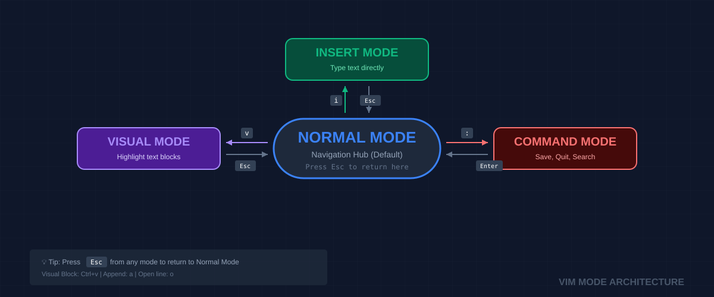

# 📝 Vim Crash Course (The DevOps Survival Editor)
> **"Vim is not just an editor; it's a language. Once you learn the grammar, you can edit text as fast as you can think."**


## 📚 Overview
Vim (Vi IMproved) is the ubiquitous text editor of the Linux world. For a DevOps engineer, it is a **survival tool**. When you SSH into a remote server, a minimal container, or an air-gapped environment, VS Code and Notepad++ aren't there. Vim is. It is **modal**, meaning keys behave differently based on your current "Mode."
## 🎓 Learning Objectives
By the end of this module, you will:
- ✅ Master the **4 Core Modes**: Normal, Insert, Visual, and Command.
- ✅ Navigate files without using a mouse or arrow keys.
- ✅ Perform surgical **Search-and-Replace** operations globally.
- ✅ Manipulate blocks of text (Indenting, Deleting, Commenting).
- ✅ Safely exit Vim in any situation (even the "emergency" ones).
---
## 🏗️ The Modal Mindset
Unlike modern editors, Vim is optimized for *editing* rather than just *typing*.
### 1. The Mode Hierarchy
| Mode | How to Enter | Purpose |
|------|--------------|---------|
| **Normal** | `Esc` (Default) | Navigation, Deleting, Yanking (Copying). |
| **Insert** | `i`, `a`, `o` | Typing text like a standard editor. |
| **Visual** | `v`, `Ctrl-v` | Highlighting, block-editing. |
| **Command**| `:` | Saving, Quoting, Global commands. |

---
## 🛠️ Performance Navigation & Editing
### 1. The Home Row (h, j, k, l)
Efficiency comes from keeping your hands on the home row.
- `h`: Left | `j`: Down | `k`: Up | `l`: Right
### 2. Surgical Edits
- `x`: Delete a single character.
- `dd`: Delete an entire line.
- `yy`: Yank (Copy) an entire line.
- `p`: Put (Paste) after the cursor.
- `u`: Undo the last change.
### 3. Rapid Movement
- `gg`: Top of the file.
- `G`: Bottom of the file.
- `/keyword`: Search forward for a keyword.
---
## 🚀 Practical Examples for Automation
### Example A: Global Config Update
Replacing an old IP address in a 500-line config file.
```vim
# Enter Command Mode with ':'
:%s/192.168.1.10/10.0.0.5/g
# Result: s (substitute) / target / replacement / g (global)
```
### Example B: Mass-Comment lines
1. Enter `Visual Block` mode with `Ctrl-v`.
2. Use `j` to highlight the first character of multiple lines.
3. Press `I` (Shift-i) for Insert-at-Start.
4. Type `# ` and then hit `Esc`.
---
## 📑 The Vim Survival Cheat Sheet
| Action | Key Sequence |
|--------|--------------|
| **Insert** at cursor | `i` |
| **Append** after cursor | `a` |
| **Open** new line below | `o` |
| **Save** file | `:w` |
| **Save and Exit** | `:wq` (or `ZZ`) |
| **Force Quit** (Abort) | `:q!` |
| **Delete** to end of word | `dw` |
| **Jump** to line number | `:42` |

---
## 🏆 Real-World DevOps Story
### 💡 **The Config-Edit Deadlock**
**The Scenario**: A junior SRE was editing the `nginx.conf` on a production server. They spent 15 minutes making complex changes but realized they opened the file without `sudo`. When they tried to save (`:w`), the system denied them.
**The Pro Trick**: Instead of quitting and losing the work, they used a "sudo write" command from within Vim:
` :w !sudo tee % `
**Explanation**: This tells Vim to pipe the current buffer (`%`) into the command `sudo tee`, effectively saving the file with elevated privileges without leaving the editor.

---
## 📝 Knowledge Check
1. **Which mode are you in when you first open Vim?**
   - [x] a) Normal Mode
   - [ ] b) Insert Mode
   - [ ] c) Command Mode
2. **How do you undo a change in Vim?**
   - [ ] a) `Ctrl-Z`
   - [ ] b) `Backspace`
   - [x] c) `u`
3. **What does the command `:wq` do?**
   - [ ] a) Quits without saving
   - [x] b) Writes (saves) and quits
   - [ ] c) Waits for an answer
**Answers**: 1-a, 2-c, 3-b
## 🔗 Next Steps
Continue to: **[File Permissions](../11-File-Permissions/README.md)** →
