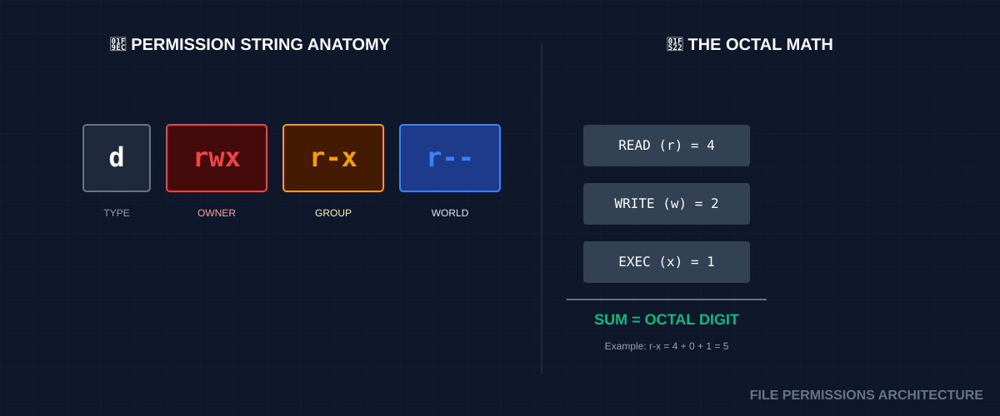

# 🔒 File Permissions (The Gatekeeper Architecture)
>
> **"With great power comes great responsibility. Don't `chmod 777` your problems away; you're just inviting new ones."**


## 📚 Overview

Linux is a multi-user environment where security is enforced through an elegant ownership model. Every file and directory is a gated resource with strict access rules for three layers of society: the **Owner**, the **Group**, and the **World**. As a DevOps engineer, you will spend half your life fixing "Permission Denied" errors and the other half securing sensitive keys (`.pem`, `.ssh`).

## 🎓 Learning Objectives

By the end of this module, you will:

- ✅ Decode the **10-character permission string** with ease.
- ✅ Master **Octal Binary Math** for precise permission setting.
- ✅ Understand the **Directory Execute Bit** (`x`) mystery.
- ✅ Manipulate ownership with `chown` and `chgrp`.
- ✅ Configure **Special Permissions** (SUID, SGID, Sticky Bit).
- ✅ Calculate default file creation rules using **Umask**.

---

## 🏗️ Permission Architecture: Octal vs. Symbolic

### 1. The Core Trio (rwx)

| Permission | Symbol | Octal | Meaning for Files | Meaning for Directories |
|------------|--------|-------|-------------------|-------------------------|
| **Read** | `r` | **4** | View content | List files (`ls`) |
| **Write** | `w` | **2** | Edit/Save | Add/Delete files |
| **Execute** | `x` | **1** | Run program | Enter/Pass through (`cd`) |

### 2. Standard DevOps Patterns

- **`755` (rwxr-xr-x)**: Standard for Scripts and Public Directories.
- **`644` (rw-r--r--)**: Standard for Config files and Web content.
- **`600` (rw-------)**: Private. Used for SSH keys (`id_rsa`).
- **`400` (r--------)**: Secret. Read-only for owner (SSH `.pem` files).

---

## 🚀 Practical Examples for Automation

### Example A: Locking Down SSH Keys

SSH will refuse to use a key if it is too "open."

```bash
# Set owner to current user and lock all other access
chown $USER:$USER ~/.ssh/id_rsa
chmod 600 ~/.ssh/id_rsa
```

### Example B: The "Web Server" Group

Ensuring the web server (`www-data`) can read files created by the `deploy` user.

```bash
# Add group read access to the HTML folder
chmod -R g+r /var/www/html
```

---

## 🔐 Advanced: Special Bits

| Bit | Name | Purpose |
|-----|------|---------|
| **SUID** | Set User ID | Run file as the **Owner** (e.g., `passwd`). |
| **SGID** | Set Group ID | Files created in a dir inherit the **Dir's Group**. |
| **Sticky**| Sticky Bit | Only the **Owner** can delete their file in a shared dir. |

---

## 📑 The Permissions Cheat Sheet

| Task | Symbolic | Octal |
|------|----------|-------|
| Add Execute | `chmod +x file` | `chmod 755 file` |
| Make Private | `chmod go-rwx file` | `chmod 600 file` |
| Read Only | `chmod a-w file` | `chmod 444 file` |
| Recursive Own| `chown -R u:g dir` | - |
| Show Perms | `ls -l` | `stat -c %a file` |

---

## 🏆 Real-World DevOps Story

### 💡 **The Cron Ghost Error**

**The Scenario**: An engineer scheduled a script in `crontab` to back up a database. Manually, the script worked perfectly. In cron, it failed every night with `Permission Denied`.
**The Discovery**:
When run manually, the script used the user's permissions. When run by cron, it used the `root` or `system` user. The script was trying to write to a log file owned by the user with `644` permissions.
**The Fix**:
They changed the log file group to `admins` and added group-write access (`chmod 664`). This allowed both the user and the cron system to write logs without granting "World" access.

---

## 📝 Knowledge Check

1. **What is the octal value for `r-x`?**
   - [ ] a) 4
   - [ ] b) 6
   - [x] c) 5 (4+1)
2. **Which command changes the group of a file?**
   - [ ] a) `chmod`
   - [x] b) `chgrp`
   - [ ] c) `umask`
3. **What happens if you `chmod +x` a directory?**
   - [ ] a) You can list its files
   - [x] b) You can `cd` into it
   - [ ] c) You can edit its name
**Answers**: 1-c, 2-b, 3-b

## 🔗 Next Steps

Continue to: **[Finally Scripting](../12-Finally-Scripting/README.md)** →
