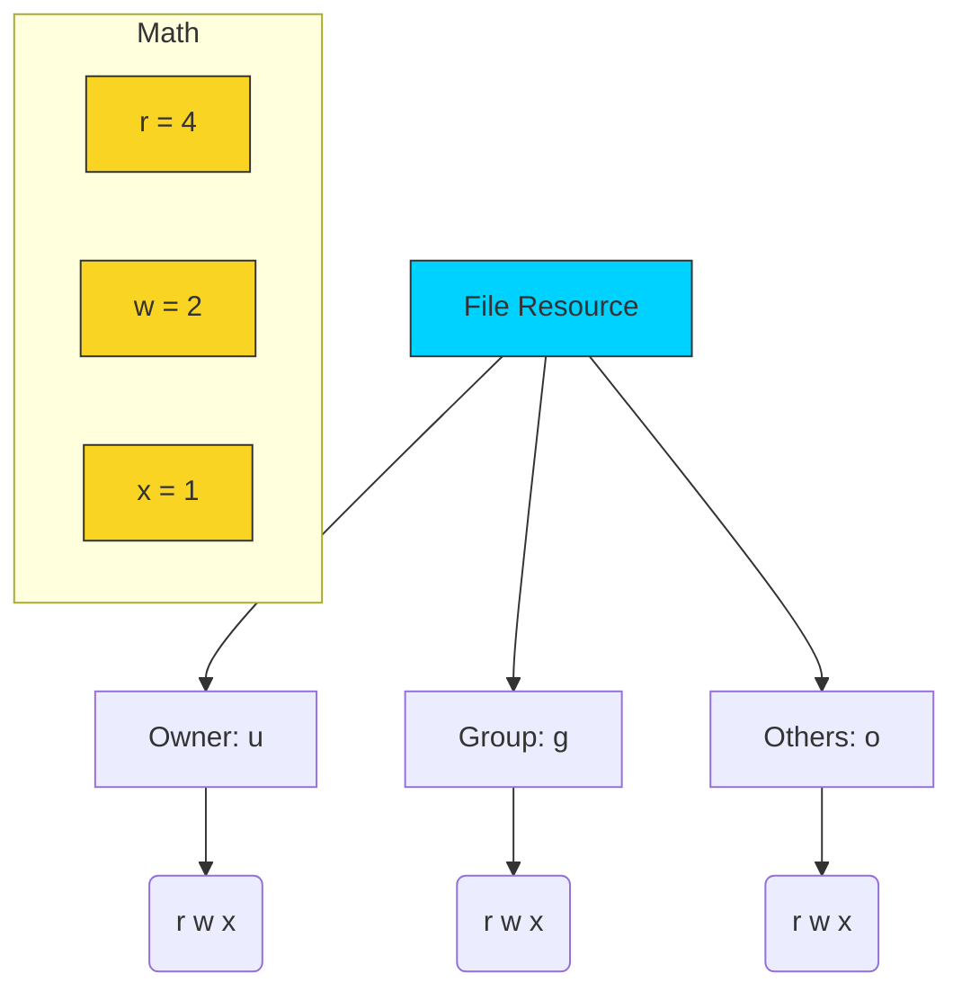

# 🔒 File Permissions: The Gatekeeper Architecture

> **"With great power comes great responsibility. Don't `chmod 777` your problems away; you're just inviting new ones."**



## 📚 Overview
Linux is a multi-user environment where security is enforced through an elegant ownership model. Every file and directory is a gated resource with strict access rules for three distinct layers of society: the **Owner**, the **Group**, and the **World (Others)**. 

As a DevOps engineer, you will spend your career fixing "Permission Denied" errors and securing sensitive keys (`.pem`, `.ssh`). Understanding the binary logic behind these bits is essential for building secure, production-grade infrastructure and CI/CD pipelines.

## 🎓 Learning Objectives
By the end of this module, you will:
- ✅ **Decode the Permission String**: Translate `drwxr-xr-x` into human logic.
- ✅ Master **Octal Binary Math**: Why 4, 2, and 1 control your access.
- ✅ Solve the **Directory 'x' Mystery**: Why execute bits are required to `cd`.
- ✅ Implement **Permission Hardening** for SSH keys and Secrets.
- ✅ Manipulate **Recursive Ownership** with `chown`.
- ✅ Understand **Umask**: How Linux decides default permissions for new files.

---

## 🏗️ Permission Architecture: Octal Binary Math
Linux uses a 3-bit system for each of the three user categories.

| Permission | Symbol | Binary | Octal Value | Meaning for Directories |
| :--- | :--- | :--- | :--- | :--- |
| **Read** | `r` | `100` | **4** | List contents (`ls`). |
| **Write** | `w` | `010` | **2** | Create/Delete files within. |
| **Execute** | `x` | `001` | **1** | Enter/Pass through (`cd`). |

### The Math Calculation
To get the final permission digit, you add the values together:
- `r + w + x` = 4 + 2 + 1 = **7** (Full Access)
- `r + x` = 4 + 0 + 1 = **5** (Read & Search)
- `r + w` = 4 + 2 + 0 = **6** (Read & Write)

---

## 🚀 Professional Patterns for Automation

### Pattern A: Secret Hardening (The 400 Rule)

Cloud providers (AWS/GCP) will literally **block** you from using SSH keys that are too "open."

```bash
# Set owner to you, and strip ALL permissions from everyone else
chmod 600 ~/.ssh/id_rsa

# For AWS .pem files, even you should only have Read access
chmod 400 my-cloud-key.pem
```

### Pattern B: The "Web Guard" Principle

For web applications, the files should be owned by the developer but readable by the web server process (e.g., `www-data`).

```bash
# Change group to web server
sudo chown -R $USER:www-data /var/www/html

# Files: Owner(rw) Group(r) Others(None)
find /var/www/html -type f -exec chmod 640 {} \;

# Dirs: Owner(rwx) Group(rx) Others(None)
find /var/www/html -type d -exec chmod 750 {} \;
```

### Pattern C: The Recursive Reset

Sometimes a directory is in a "messy" state. Use `-R` with caution, but it is the fastest way to reset a staging environment.

```bash
# Reset entire project ownership to the current user
sudo chown -R $(whoami):$(whoami) ./my-project
```

---

## 🏆 Real-World DevOps Story: The Cron Ghost Error

**The Scenario**: An engineer scheduled a script in `crontab` to back up a database. Manually, the script worked perfectly. In cron, it failed every night with `Permission Denied`.
**The Discovery**: When run manually, the script used the user's permissions. When run by cron, it used the `root` or `system` user context. The script was trying to write to a log file owned by the user with `644` (`rw-r--r--`) permissions. The System user wasn't the owner and wasn't in the group, so it couldn't write.
**The Fix**: They changed the log file group to `syslog` and added group-write access (`chmod 664`). This allowed both the user and the system automation to write logs without granting dangerous "World" access.

---

## ❓ Interview Preparation (Permissions)

1. **Q: What do the permissions `755` mean in plain English?**
   *A: Owner has full access (read, write, execute). Group and Others have read and execute (search) access, but cannot modify the file.*

2. **Q: Why do you need 'execute' (x) permission on a directory?**
   *A: On a directory, the 'x' bit is the "search" bit. You need it to change into the directory (`cd`) or to access any files inside it, even if you have read permission on the files themselves.*

3. **Q: What is the difference between `chown` and `chmod`?**
   *A: `chown` (Change Owner) changes **who** owns the file or which group it belongs to. `chmod` (Change Mode) changes **what** those owners and groups are allowed to do with the file.*

4. **Q: What is 'umask'?**
   *A: Umask (User Mask) is a system setting that determines the default permissions for new files. It "masks" (subtracts) permissions from the maximum possible (usually 666 for files and 777 for directories).*

5. **Q: What does the first character in an `ls -l` output represent (e.g., the 'd' in `drwxr-xr-x`)?**
   *A: It represents the file type. 'd' is for directory, '-' is for a regular file, and 'l' is for a symbolic link.*

---

## 📝 Knowledge Check

1. **Which octal number represents "Read Only" access?**
   - [ ] a) 1
   - [ ] b) 2
   - [x] c) 4

2. **What command is used to change the owner of a file?**
   - [x] a) `chown`
   - [ ] b) `chmod`
   - [ ] c) `chgrp`

3. **In the string `rw-r--r--`, what permissions does the GROUP have?**
   - [ ] a) Read & Write
   - [x] b) Read Only
   - [ ] c) No access

4. **What is the numerical equivalent of `rwx------`?**
   - [ ] a) 755
   - [x] b) 700
   - [ ] c) 600

5. **True or False: Using `chmod 777` is a recommended way to fix permission errors in production.**
   - [ ] a) True
   - [x] b) False (It is a major security risk and should be avoided)

---

## 🔗 Next Steps

Now that you've secured your files, it's time to put everything together and start building real automation!

Proceed to: **[Finally Scripting](../13-Finally-Scripting/README.md)** →
