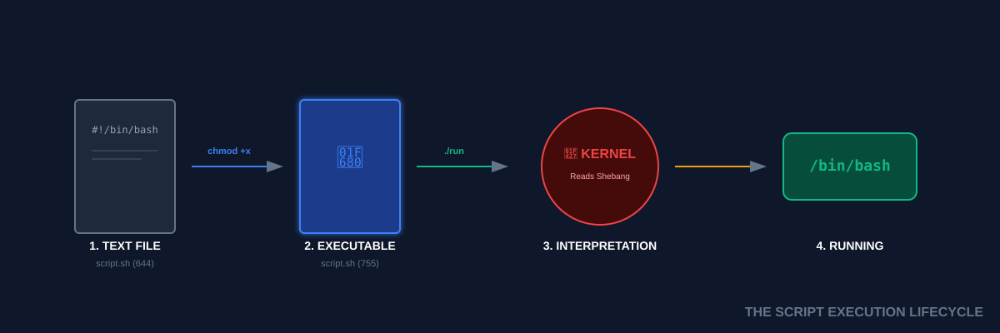

# 📜 Finally Scripting (The Automation Handshake)

> **"If you have to type it twice, script it once. If you have to script it twice, automate it for life."**

## 📚 Overview
You have mastered the terminal's individual notes. Shell Scripting is the art of composing those notes into a **Symphony of Automation**. A script is simply a text file containing the exact same commands you type manually, but executed by the system with speed and reliability. This module transitions you from a manual operator to an **Automation Engineer**.
## 🎓 Learning Objectives
By the end of this module, you will:
- ✅ Understand the **Shebang** (`#!`) and the Kernel-Interpreter handshake.
- ✅ Master the **Script Lifecycle**: Write → Chmod → Run.
- ✅ Implement **Bash Strict Mode** (`set -e`) for fail-fast reliability.
- ✅ Utilize **Trace Debugging** (`set -x`) to watch data flow.
- ✅ Effectively use **Exit Codes** to communicate success/failure.
---
## 🏗️ Script Architecture: The Foundation
### 1. The Shebang (`#!`)
The first two bytes of the file tell the Kernel "This is not a binary, use this program to read me."
- **Standard**: `#!/bin/bash`
- **Portable**: `#!/usr/bin/env bash` (Recommended: Searches `$PATH` for the bash binary).
### 2. The "Strict Mode" (Safety First)
Bash is notoriously "forgiving," which is dangerous in production. Add these flags to the top of every script:
- `set -e`: Exit immediately if any command fails.
- `set -u`: Exit if you use an undeclared variable.
- `set -o pipefail`: Ensure failures in a pipeline ARE NOT hidden.
---
## 🚀 Practical Examples for Automation
### Example A: The "Standard Boilerplate"
Every professional DevOps script should start with this structure.
```bash
#!/usr/bin/env bash
# Header: Description and Safety
set -euo pipefail
# 1. Variables
LOG_DIR="/var/log/my-app"
# 2. Execution Logic
echo "Starting cleanup in $LOG_DIR..."
# 3. Completion
echo "Done! ✅"
exit 0
```
### Example B: Exit Codes in Action
Automation tools (Jenkins, GitHub Actions) use the **Exit Code** to know if the job succeeded.
- `exit 0`: Success
- `exit 1-255`: Failure
---
## 🛠️ The Debugging Arsenal
| Technique       | Command             | Purpose                                   |      |                                                 |
| --------------- | ------------------- | ----------------------------------------- | ---- | ----------------------------------------------- |
| **Trace Mode**  | `set -x`            | Prints every command before executing it. |      |                                                 |
| **Silent Fail** | `command`           |                                           | true | Prevent script from exiting on a specific fail. |
| **Manual Run**  | `bash -x script.sh` | Debug a script without editing it.        |      |                                                 |

---
## 📑 The Scripting Cheat Sheet
| Task | Action | Command |
|------|--------|---------|
| **Create** | Make new file | `touch deploy.sh` |
| **Enable** | Make executable | `chmod +x deploy.sh` |
| **Run** | Execute local | `./deploy.sh` |
| **Check Error**| Last Exit Code | `echo $?` |
| **Comment** | Ignore line | `# This is hidden` |
| **Variables** | Define data | `ENV="prod"` |

---
## 🏆 Real-World DevOps Story
### 💡 **The Ghost Failure Pipeline**
**The Scenario**: A deployment script was running a database migration. The migration failed, but the script kept going and deleted the old backups. 
**The Investigation**:
The engineer didn't use `set -e`. The script saw the migration fail, ignored the non-zero exit code, and proceeded to the next line (`rm -rf backups/*`).
**The Fix**:
Always use `set -e`. Now, the moment the migration fails, the script dies instantly, saving the backups and alerting the SRE team.

---
## 📝 Knowledge Check
1. **Which Shebang is considered most portable across Linux and macOS?**
   - [ ] a) `#!/bin/bash`
   - [x] b) `#!/usr/bin/env bash`
   - [ ] c) `#!/root/bash`
2. **What does `set -e` do?**
   - [ ] a) Enables experimental mode
   - [x] b) Exits script if any command fails
   - [ ] c) Echoes everything to the screen
3. **What exit code represents "Success"?**
   - [x] a) 0
   - [ ] b) 1
   - [ ] c) 255
**Answers**: 1-b, 2-b, 3-a
## 🔗 Next Steps
Continue to: **[User Input](../13-User-Input/README.md)** →
