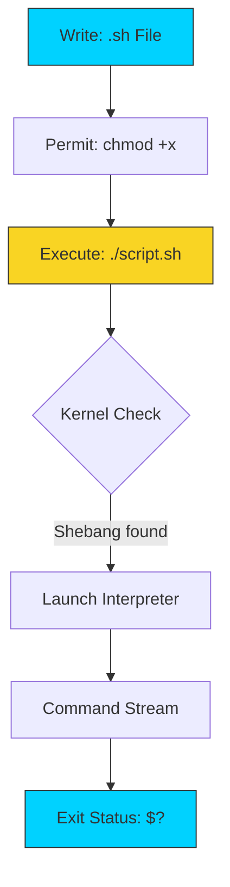

# 📜 Finally Scripting: The Automation Handshake

> **"If you have to type it twice, script it once. If you have to script it twice, automate it for life."**



## 📚 Overview
You have mastered the individual notes of the terminal. Shell Scripting is the art of composing those notes into a **Symphony of Automation**. 

A script is a text file containing the exact sequences you type manually, but executed by the system with absolute speed and machine precision. This module transitions you from a manual operator to an **Automation Engineer** capable of building reliable, self-healing infrastructure.

## 🎓 Learning Objectives
By the end of this module, you will:
- ✅ Master the **Kernel-Interpreter Handshake** (The Shebang logic).
- ✅ Implement **Bash Strict Mode** (`set -euo pipefail`) for production reliability.
- ✅ Utilize **Cleanup Traps** to prevent "Disk Leakage" on script failure.
- ✅ Decode the **Sourcing vs. Execution** paradox.
- ✅ Master **Exit Code Propagation** to inform CI/CD pipelines of success/failure.

---

## 🏗️ Script Architecture: The Foundation

### 1. The Shebang (`#!`)
The first two bytes of your file are the **Magic Numbers**. When you run `./script.sh`, the Linux kernel reads the first line. If it sees `#!`, it stops trying to run the file as a binary and instead passes the filename as an argument to the path specified (e.g., `/bin/bash`).
- **Professional Standard**: `#!/usr/bin/env bash` (Best for portability across different Linux distros and macOS).

### 2. Execution vs. Sourcing
- **`./script.sh` (Execution)**: Launches a **Subshell**. The script gets its own memory. Changes to variables or directories **do not** affect your main terminal.
- **`source ./script.sh` (Sourcing)**: Runs the code *inside* your current shell. Changes to variables **will** persist in your session.

### 3. The "Uno-Reverse" (Bash Strict Mode)
Bash is "forgiving" by default, which is lethal in production. Professional scripts always start with:
- `set -e`: Exit immediately if any command returns a non-zero exit code.
- `set -u`: Exit if you attempt to use an undefined variable (prevents null-variable deletions).
- `set -o pipefail`: Ensures errors inside pipes (`a | b | c`) aren't swallowed by successful trailing commands.

---

## 🚀 Professional Patterns for Automation

### Pattern A: The Self-Cleaning Script (`trap`)

Automation often creates temporary files. If your script crashes, these files stay on the disk forever. Use a `trap` to ensure cleanup on exit (success or fail).

```bash
#!/usr/bin/env bash
set -euo pipefail

# Create a temporary directory
TMP_DIR=$(mktemp -d)

# Ensure this folder is deleted even if the script crashes!
trap 'rm -rf "$TMP_DIR"' EXIT

# ... your script logic here ...
```

### Pattern B: The Success/Failure Signal

External tools (Jenkins, GitHub Actions) only know if your script failed by looking at the **Exit Status**.
- `exit 0`: Success (Green light).
- `exit 1-255`: Failure (Red light/Alert).

### Pattern C: Trace Debugging

When a script behaves unpredictably, don't guess. Watch it work.

```bash
# Run script in Trace Mode to see every variable expansion
bash -x ./my-script.sh
```

---

## 🏆 Real-World DevOps Story: The Ghost Failure Pipeline

**The Scenario**: A deployment script was running a critical database migration followed by a cleanup command. The migration failed, but because the script was written without "Strict Mode," it ignored the error and proceeded to delete the old backups.
**The Discovery**: The engineer realized that in a standard shell, if line 1 fails, line 2 runs anyway. The script saw the failure, moved to the next line (`rm -rf backups/*`), and the backups were lost forever.
**The Fix**: By adding `set -e`, the script now dies the **instant** the migration fails, preserving the backups and alerting the team.

---

## ❓ Interview Preparation (Scripting)

1. **Q: What is the benefit of `set -o pipefail`?**
   *A: By default, in a pipe like `false | true`, the overall exit status is 0 (Success) because the last command succeeded. `pipefail` ensures that if ANY command in the pipe fails, the whole pipe returns a non-zero exit status.*

2. **Q: Why is `#!/usr/bin/env bash` generally preferred over `#!/bin/bash`?**
   *A: Different operating systems (Ubuntu vs. Alpine vs. macOS) store the bash binary in different locations. Using `/usr/bin/env` asks the system to find the first bash in the user's `$PATH`, making the script more portable.*

3. **Q: What is the difference between `source script.sh` and `./script.sh`?**
   *A: `./script.sh` runs the script in a separate child process (subshell). `source` (or the `.` command) runs the script's contents within the current shell process, allowing it to modify current environment variables.*

4. **Q: How can you safely handle temporary files in a bash script?**
   *A: Use the `mktemp` command to create unique files/dirs and the `trap` command to ensure they are cleaned up automatically when the script exits or is interrupted.*

5. **Q: What does `$0` represent in a shell script?**
   *A: It represents the name of the script itself, exactly as it was called on the command line.*

---

## 📝 Knowledge Check

1. **What are the first two characters of a Shebang?**
   - [ ] a) `//`
   - [x] b) `#!`
   - [ ] c) `$`

2. **Which command grants a script execution permission?**
   - [ ] a) `chmod 600`
   - [x] b) `chmod 755` (or `+x`)
   - [ ] c) `chown 777`

3. **Which flag exits the script if an undefined variable is accessed?**
   - [ ] a) `-e`
   - [x] b) `-u`
   - [ ] c) `-x`

4. **What variable stores the exit status of the previous command?**
   - [ ] a) `$!`
   - [ ] b) `$*`
   - [x] c) `$?`

5. **True or False: A script can execute even if its name doesn't end in `.sh`.**
   - [x] a) True
   - [ ] b) False

---

## 🔗 Next Steps

Now that you can write the code, let's learn how to make it interactive!

Proceed to: **[User Input](../14-User-Input/README.md)** →
