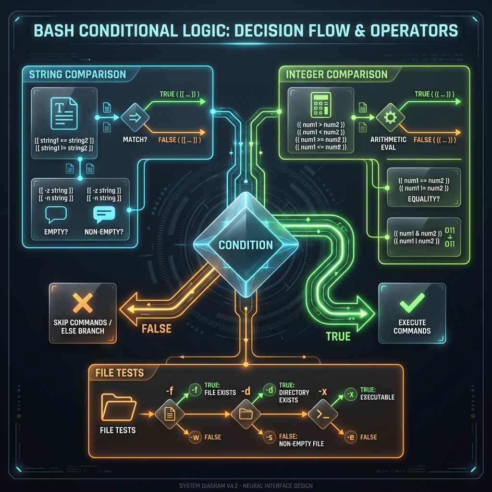

# 🔀 Conditionals: The Logic of Automation

> **"A script without conditionals is just a list. A script with conditionals is a decision-maker capable of autonomous action."**



## 📚 Overview
Conditionals are the "Brain" of your automation. They allow your script to perceive its environment and adapt its behavior in real-time. Instead of running a deployment blindly, a professional script asks: "Is the database reachable?", "Is this file already backed up?", or "Does the current user have root privileges?". 

In Bash, we move beyond simple `if` statements to explore structured decision-making using double brackets, arithmetic evaluation, and pattern-matching case switches.

## 🎓 Learning Objectives
By the end of this module, you will:
- ✅ Master the **Triple-Option** `if`/`elif`/`else` anatomy.
- ✅ Understand the **Comparison Partition**: Strings (`==`) vs Integers (`-eq`).
- ✅ Leverage **File Test Operators** (`-f`, `-d`, `-x`, `-s`) for system auditing.
- ✅ Adopt the **Superior `[[ ]]` Syntax** for safer, modern Bash code.
- ✅ Implement **Arithmetic `(( ))` Evaluation** for mathematical logic.
- ✅ Master **Case Switch Patterns** for complex flags and menu handling.

---

## 🏗️ Logic Architecture: Choosing Your Brackets
One of the most common points of failure in Shell scripting is using the wrong comparison tool.

### 1. The Modern Standart: `[[ ... ]]` (Strings & Files)
Always use double brackets for string comparisons and file tests. They are a "Bashism" that provides built-in protection against empty variables and word-splitting.
- **String**: `[[ $status == "active" ]]`
- **Regex**: `[[ $version =~ ^[0-9]+$ ]]`

### 2. The Math Specialist: `(( ... ))` (Integers)
When working purely with numbers, use double parentheses. This allows you to use standard mathematical operators (`>`, `<`, `>=`) instead of the older `-gt`, `-lt` flags.
- **Example**: `(( count > 10 ))`

### 3. Comparison Reference Table
| Feature | String Context `[[ ]]` | Integer Context `(( ))` | Description |
| :--- | :--- | :--- | :--- |
| **Equality** | `==` | `==` | Match values exactly. |
| **Inequality** | `!=` | `!=` | Ensure values differ. |
| **Greater Than** | `>` (Lexical) | `>` | Comparative size/order. |
| **Numeric Flags**| `-gt`, `-lt`, `-eq` | N/A | Older POSIX-style flags. |

---

## 🚀 Professional Patterns for Automation

### Pattern A: The Guard Clause (Fail Fast)
Senior engineers don't nest their code deep inside `if` statements. They use "Guard Clauses" to exit early if requirements aren't met.

```bash
# Ensure script is running as root
[[ $EUID -eq 0 ]] || { echo "❌ Error: Must run as root"; exit 1; }

# Check for required dependency
command -v docker &> /dev/null || { echo "❌ Error: Docker not installed"; exit 1; }
```

### Pattern B: Short-Circuit Logic (`&&` and `||`)
You can write concise one-liners for simple decisions.
- **Success Link**: `mkdir backup && cp data.txt backup/` (Only copy if mkdir succeeds).
- **Failure Link**: `[[ -f config.env ]] || touch config.env` (Create file only if it's missing).

### Pattern C: The Production Case Switch
Case statements are cleaner than long `if/elif` chains when handling multiple static options.

```bash
case "${1,,}" in # Convert input to lowercase
    start | up)
        docker-compose up -d ;;
    stop | down)
        docker-compose down ;;
    restart)
        docker-compose restart ;;
    *)
        echo "Usage: $0 {start|stop|restart}" 
        exit 1 ;;
esac
```

---

## 🏆 Real-World DevOps Story: The Empty String Disaster

**The Scenario**: A script had an optional variable `CLEANUP_DIR`. The engineer wrote `if [ $CLEANUP_DIR == "/tmp" ]`.
**The Discovery**: One day, the variable was empty due to a failed upstream API call. The single bracket `[` evaluated this as `if [ == "/tmp" ]`, which is a syntax error that crashed the entire deployment pipeline.
**The Fix**: They switched to `[[ "$CLEANUP_DIR" == "/tmp" ]]`. Double brackets handle the empty variable gracefully, treating it as `"" == "/tmp"` (Result: False), which allowed the script to continue running safely.

---

## ❓ Interview Preparation (Conditionals)

1. **Q: What is the difference between `[` and `[[`?**
   *A: `[` is an external command (frequently a symlink to `test`), while `[[` is a Bash keyword. `[[` is more powerful as it handles empty variables without crashing, supports regex matching (`=~`), and doesn't require quoting variables to prevent word-splitting.*

2. **Q: How do you check if a string is NOT empty?**
   *A: Use the `-n` operator: `[[ -n "$MY_VAR" ]]`. Conversely, `-z` checks if a string is zero-length (empty).*

3. **Q: How do you perform a "regex" match in a condition?**
   *A: Use the `=~` operator inside double brackets. Example: `[[ $IP =~ ^[0-9]{1,3}\. ]]`.*

4. **Q: What does the `-f` operator check?**
   *A: It checks if a path exists AND if it is a regular file (not a directory or a device file).*

5. **Q: How can you check the exit status of the previous command?**
   *A: Using the `$?` variable. A value of `0` means success, while anything else (1-255) indicates an error.*

---

## 📝 Knowledge Check

1. **Which operator is used inside `(( ))` to check for equality?**
   - [ ] a) `-eq`
   - [x] b) `==`
   - [ ] c) `=`

2. **What does `[[ -s "/var/log/app.log" ]]` check?**
   - [ ] a) If the file belongs to the 'system' user
   - [ ] b) If the file exists
   - [x] c) If the file exists AND has a size greater than zero (not empty)

3. **How do you write an OR condition inside `[[ ]]`?**
   - [ ] a) `-o`
   - [x] b) `||`
   - [ ] c) `|`

4. **Which file test operator checks if a directory exists?**
   - [x] a) `-d`
   - [ ] b) `-dir`
   - [ ] c) `-f`

5. **True or False: A case statement must end with `esac`.**
   - [x] a) True
   - [ ] b) False

---

## 🔗 Next Steps

Now that your script can think, give it a task to repeat!

Proceed to: **[Loops](../16-For-Loops/README.md)** →
