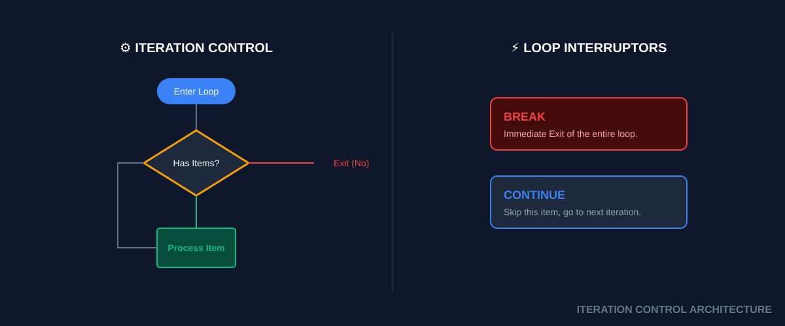

# 🔁 Loops (Repetitive Automation)
> **"If you do it more than 3 times, write a loop. If you do it more than 10 times, rewrite the loop to be parallel."**


## 📚 Overview
Automation is the art of repeating a task perfectly a thousand times. **Loops** are the engine of bulk processing in the shell. Whether you are checking the health of 500 microservices, renaming 10,000 log files, or waiting for a database to come online, loops give you the power of scale. Mastering loops turns a "one-off" script into a scalable infrastructure tool.
## 🎓 Learning Objectives
By the end of this module, you will:
- ✅ Master **For-In Loops** for known lists and file globs.
- ✅ Understand the **"Parse LS" Trap** and how to avoid it.
- ✅ Build robust **While-Read** loops for high-performance file processing.
- ✅ Use **Until Loops** for service readiness probes (Health checks).
- ✅ Control flow using **Break** and **Continue** keywords.
- ✅ Implement basic **Parallelism** inside loops.
---
## 🏗️ Iteration Architecture: For vs. While
#### 1. The `for` Loop (The Collector)
Best for when you have a specific list of items or use file globbing (`*`).
- **Use Case**: Iterating over files, server names, or fixed arrays.
#### 2. The `while` Loop (The Poller)
Runs as long as a condition is **TRUE**.
- **Use Case**: Waiting for a service to start, reading lines from a large text file.
#### 3. The `until` Loop (The Negative Poller)
Runs as long as a condition is **FALSE** (The opposite of while).

---
## 🚀 Practical Examples for Automation
#### Example A: The Batch Rename (Globbing)
Safely renaming all `.txt` files to `.bak` in the current folder.
```bash
for log in *.log; do
    echo "Backing up $log..."
    cp "$log" "${log}.bak"
done
```
#### Example B: The Health Check (Polling)
Waiting for a web service to return a 200 OK status before starting the next deployment step.
```bash
while ! curl -s localhost:8080/health | grep "UP" > /dev/null; do
    echo "Waiting for service to start..."
    sleep 2
done
echo "Ready to deploy! 🚀"
```
---
## 📑 The Looping Cheat Sheet
| Syntax           | Purpose           | Example                          |
| ---------------- | ----------------- | -------------------------------- |
| `for x in a b c` | Iterating lists   | `for i in 1 2 3`                 |
| `for x in *.txt` | Iterating files   | `for f in *.jpg`                 |
| `while [ cond ]` | Loop while true   | `while true` (infinity)          |
| `until [ cond ]` | Loop while false  | `until ping -c 1 ip`             |
| `break`          | Exit loop NOW     | `if [ $fail ]; then break; fi`   |
| `continue`       | Skip to next item | `if [ $dir ]; then continue; fi` |

---
## 🏆 Real-World DevOps Story
#### 💡 **The Space-in-Filename Nightmare**
**The Scenario**: An engineer used `for f in $(ls *.txt)` to process a folder. Some files had spaces like `Config File.txt`.
**The Discovery**:
The subshell `$(ls)` returned a string. The `for` loop split that string on every space. It tried to process the file `Config` and then the file `File.txt`, both of which didn't exist!
**The Fix**:
Senior engineers use **Globbing**. `for f in *.txt; do ...`. Because globbing happens at the shell level, it preserves the integrity of filenames even if they contain spaces.

---
## 📝 Knowledge Check
1. **Which command causes the loop to skip the current item and move to the next?**
   - [ ] a) `break`
   - [x] b) `continue`
   - [ ] c) `exit`
2. **What happens if you use `for f in $(ls)`?**
   - [ ] a) It captures hidden files
   - [x] b) It fails if filenames have spaces
   - [ ] c) It is the fastest method
3. **When should you use a `while` loop?**
   - [ ] a) To iterate over 5 specific files
   - [x] b) To poll a health endpoint until it succeeds
   - [ ] c) To count from 1 to 10
**Answers**: 1-b, 2-b, 3-b
## 🔗 Next Steps
Continue to: **[Input/Output](../17-Input-Output/README.md)** →
