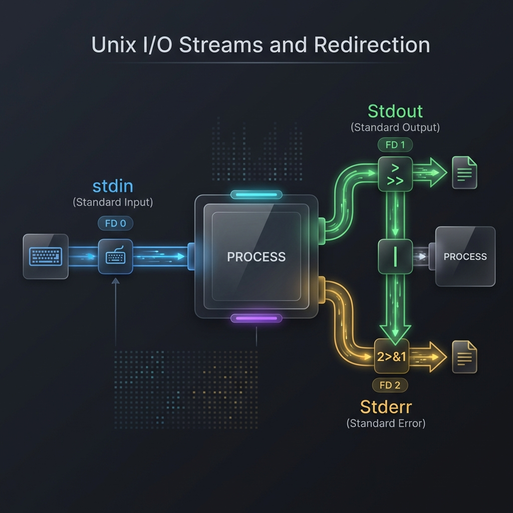

# 🔀 Input/Output: The Unix Plumbing System

> **"In Unix, everything is a file. If it isn't a file, it's a stream. If it isn't a stream, it's a pipe."**



## 📚 Overview

Every command in Linux is a "data processor" that operates through standardized channels called **Streams**. Mastering I/O (Input/Output) is the hallmark of a professional DevOps engineer. It allows you to "plumb" independent tools together—chaining dozens of specialized utilities into a high-performance automation pipeline.

Professional automation is roughly 50% logic and 50% plumbing. If you can't control where your data goes, you can't automate your infrastructure.

## 🎓 Learning Objectives

By the end of this module, you will:

- ✅ Master the **Standard File Descriptors**: 0 (Stdin), 1 (Stdout), and 2 (Stderr).
- ✅ Orchestrate **Stream Redirection** for logging and error suppression.
- ✅ Implement **Process Substitution** for advanced tool integration.
- ✅ Construct resilient **Multi-stage Pipelines** using `set -o pipefail`.
- ✅ Utilize **Here-Docs** and **Here-Strings** for dynamic configuration generation.

---

## 🏗️ Plumbing Architecture: The Trio of Streams

When a process starts, the kernel automatically opens three data channels (File Descriptors) for it:

| ID | Name | Short | Purpose | Default Target |
| :-- | :--- | :---- | :------ | :------------- |
| **0** | Stdin | `<` | Input data (Requests/Commands) | Keyboard |
| **1** | Stdout | `>` | Success data (Results/Logs) | Terminal |
| **2** | Stderr | `2>` | Error data (Warnings/Crashes) | Terminal |

### Redirection Mechanics

- **`>` (Overwrite)**: Wipes a file and writes new data. **Danger**: Irreversible.
- **`>>` (Append)**: Adds data to the end of a file. Best for logs.
- **`2>&1` (Merge)**: Merges Stream 2 into Stream 1. Used to capture errors in a log file.
- **`&>` (Bash Shortcut)**: Redirects both Stdout and Stderr to a single location.

---

## 🚀 Professional Patterns for Automation

### Pattern A: The "Silent Execution" Wrapper

In CI/CD (GitHub Actions/Jenkins), too much noise can hide real issues. Engineers use redirection to log everything to a "debug file" but keep the terminal clean.

```bash
# Silence everything except for critical alerts
./heavy_deployment.sh &> deployment_debug.log

if [ $? -ne 0 ]; then
    echo "Deployment failed! check deployment_debug.log"
    exit 1
fi
```

### Pattern B: The Here-Doc Config Generator

Instead of manually editing files, use **Here-Docs** to generate complex configuration files dynamically during provisioning.

```bash
# Generate a Nginx config on the fly
cat <<EOF > /etc/nginx/sites-available/app.conf
server {
    listen 80;
    server_name $DOMAIN_NAME;
    location / {
        proxy_pass http://localhost:8080;
    }
}
EOF
```

### Pattern C: The "T-Junction" (`tee`)

When debugging live, you often need to see the output while simultaneously saving it to a long-term audit log.

```bash
# Sudo is used with tee to write to protected files
echo "127.0.0.1 database.internal" | sudo tee -a /etc/hosts
```

---

## ⚠️ High-Level Concept: The Pipeline Failure Trap

By default, the exit code of a pipeline is the exit code of the **last command**.

**The Trap**:

```bash
# This script reports SUCCESS (0) even if 'ls' fails!
ls non_existent_folder | grep "express"
```

Because `grep` runs even if `ls` fails, and `grep` simply finds nothing (exiting with 0), the script mistakenly thinks the operation succeeded.

**The Pro Fix**:

Add `set -o pipefail` at the top of your scripts. This ensures that if **any** command in a pipeline fails, the whole pipeline is considered a failure.

---

## 🏆 Real-World DevOps Story: The Subshell Ghost

**The Scenario**: An engineer was counting errors in a log file using a pipe: `cat server.log | while read line; do ((error_count++)); done`.

**The Discovery**: After the loop finished, `echo $error_count` returned `0` even though thousands of errors were processed!

**The Reason**: Piping to a `while` loop creates a **Subshell** (a separate child process). Variables modified inside that subshell (like `error_count`) vanish the moment the subshell terminates.

**The Senior Fix**: Use Redirection instead of Piping. `while read line; do ... done < server.log`. This runs the loop in the **current** shell process, preserving your variables.

---

## ❓ Interview Preparation (Input/Output)

1. **Q: How do you redirect only the errors of a command to a file?**
   *A: Use `2> filename.log`. The '2' identifies the Standard Error file descriptor.*

2. **Q: What is the difference between `>` and `>>`?**
   *A: `>` overwrites the destination file completely, while `>>` appends data to the end of the file without deleting existing content.*

3. **Q: Why should you use `set -o pipefail`?**
   *A: Without it, the exit status of a pipeline is determined only by the last command. `pipefail` ensures the script detects failures anywhere in the chain.*

4. **Q: What is `/dev/null`?**
   *A: It is a special device file known as the "null device" or "black hole." Anything sent to it is discarded by the system immediately.*

5. **Q: How do you send the output of a command to both a file and the screen?**
   *A: Use the `tee` command: `command | tee output.txt`.*

---

## 📝 Knowledge Check

1. **Which file descriptor ID represents Standard Input (Keyboard)?**
   - [x] a) 0
   - [ ] b) 1
   - [ ] c) 2

2. **How do you merge the error stream into the success stream?**
   - [ ] a) `1>&2`
   - [x] b) `2>&1`
   - [ ] c) `&>`

3. **What happens to variables modified inside a `cat file | while read` loop?**
   - [ ] a) They are saved to the persistent environment
   - [x] b) They are lost because they are in a subshell
   - [ ] c) They are written to /dev/null

4. **Which command is used for multi-line block redirection?**
   - [x] a) Here-Doc (`<<EOF`)
   - [ ] b) There-Doc (`>>EOF`)
   - [ ] c) Pipe (`|`)

5. **What is the outcome of `ls /fake 2> /dev/null`?**
   - [ ] a) You see an error on the screen
   - [x] b) The error is discarded and the screen remains clean
   - [ ] c) The directory `/fake` is created

---

## 🔗 Next Steps

**Beginner Phase Complete!** 🚀

You have mastered the core mechanics of the shell. You are now ready to graduate to more advanced programming logic.

Proceed to: **[Python for DevOps Automation](../../../../../README.md)** →
