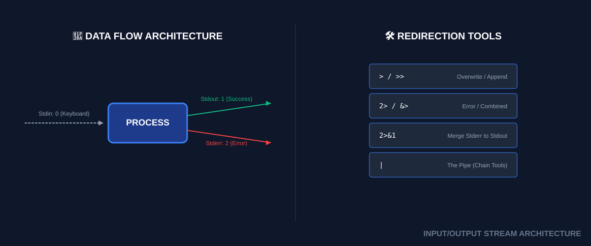

# 🔀 Input/Output (The Stream Plumbing)
> **"In Unix, everything is a file. If it isn't a file, it's a stream. If it isn't a stream, it's a pipe."**

## 📚 Overview
Every command in Linux is a "<font color="#ffc000">black box</font>" that processes data. To coordinate these boxes, Linux uses standardized data channels called **Streams**. Mastering I/O (Input/Output) allows you to "<font color="#ffc000">plumb</font>" these streams together—redirecting logs to files, silencing annoying warnings, and chaining dozens of tools into a single, complex pipeline. Professional automation is 50% logic and 50% plumbing.
## 🎓 Learning Objectives
By the end of this module, you will:
- ✅ Master the **Three Standard Streams**: 0 (<font color="#ffc000">Stdin</font>), 1 (<font color="#ffc000">Stdout</font>), and 2 (<font color="#ffc000">Stderr</font>).
- ✅ Perform **Stream Redirection** using `>`, `>>`, and `<`.
- ✅ Handle Errors professionally using **Merging** (`2>&1`) and **Silencing** (`/dev/null`).
- ✅ Construct complex **Multi-stage Pipelines** (`|`).
- ✅ Implement **HereDocs** (`<<EOF`) for multi-line file generation.
---
## 🏗️ Plumbing Architecture: The Trio of Streams
Every process is born with three files already open:
1. **Stdin (0)**: Where the command gets data (Default: Keyboard).
2. **Stdout (1)**: Where the command sends success data (Default: Terminal).
3. **Stderr (2)**: Where the command sends errors (Default: Terminal).
### Redirection Logic
- **`>`**: Overwrite (Wipes the file and starts fresh).
- **`>>`**: Append (Adds to the end of the file).
- **`2>`**: Redirect ONLY the errors.
- **`&>`**: Redirect EVERYTHING (stdout + stderr) to one place.
---
## 🚀 Practical Examples for Automation
### Example A: The "Black Hole" Silencer
Sometimes you run a command for its side effect (like checking if a folder exists) but you don't want the output or errors showing up in your CI/CD logs.
```bash
# Silence everything
command_name > /dev/null 2>&1
```
### Example B: The Config Injector (HereDoc)
Creating a multi-line file inside a script without ten `echo` commands.
```bash
cat <<EOF > Dockerfile
FROM ubuntu:22.04
RUN apt-get update
COPY . /app
EOF
```
### Example C: The T-Junction (`tee`)
Saving a log to a file WHILE watching it live in the terminal.
```bash
./deploy.sh | tee system.log
```
---
## 📑 The I/O Cheat Sheet
| Syntax      | Meaning                          |                               |
| ----------- | -------------------------------- | ----------------------------- |
| `>`         | Save Success to file.            |                               |
| `>>`        | Add Success to file.             |                               |
| `2>`        | Save Error only.                 |                               |
| `<`         | Read file as Input.              |                               |
| `2>&1`      | Merge Error into Success stream. |                               |
| `           | `                                | Pass Success to next command. |
| `/dev/null` | The Trash Bin (Black hole).      |                               |

---
## 🏆 Real-World DevOps Story
### 💡 **The Hidden Failure Pipeline**
**The Scenario**: A deployment pipeline was checking for a file: `ls node_modules | grep "express"`. The grep found the word, so the pipeline proceeded. However, the `ls` actually failed because the folder didn't exist!
**The Discovery**:
By default, the exit code of a pipeline is the exit code of only the **last** command (`grep`). Grep succeeded because it found nothing (correctly), but the initial failure of `ls` was invisible.
**The Fix**:
Senior engineers use `set -o pipefail`. This ensures that if any command in the chain fails, the whole line is considered a failure.

---
## 📝 Knowledge Check
1. **Which stream represents Standard Error?**
   - [ ] a) 0
   - [ ] b) 1
   - [x] c) 2
2. **How do you append the output of a script to a log without erasing it?**
   - [ ] a) `>`
   - [x] b) `>>`
   - [ ] c) `&>`
3. **What is the purpose of `2>&1`?**
   - [ ] a) It doubles the speed of the script
   - [x] b) It redirects errors to the same place as standard output
   - [ ] c) It deletes the file after 2 uses
**Answers**: 1-c, 2-b, 3-b
## 🔗 Next Steps
Beginner Phase Complete! Proceed to: **[Case Statements](../../../../../README.md)** →
