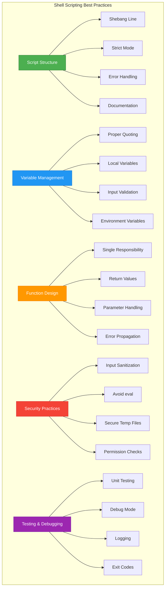

# Shell Scripting: Interview Questions, Quiz & Scenarios

Master the foundation of DevOps automation and prepare for technical interviews.

---

## ❓ Interview Questions (Shell Scripting Fundamentals)

1. **What is the difference between `#!/bin/bash` and `#!/usr/bin/env bash`?**
   - *Answer*: `#!/bin/bash` uses a fixed path to bash, which may not exist on all systems. `#!/usr/bin/env bash` searches for bash in the PATH, making scripts more portable across different Unix systems.

2. **Explain the difference between `$*` and `$@` in shell scripts.**
   - *Answer*: `$*` treats all arguments as a single word, while `$@` treats each argument as a separate word. When quoted, `"$*"` becomes one string, but `"$@"` preserves individual arguments.

3. **What does `set -euo pipefail` do and why is it important?**
   - *Answer*: `set -e` exits on any command failure, `set -u` treats unset variables as errors, `set -o pipefail` makes pipelines fail if any command fails. This creates "strict mode" for safer scripts.

4. **How do you handle command-line arguments in a shell script?**
   - *Answer*: Use positional parameters `$1, $2, ...` for individual arguments, `$#` for count, `$@` for all arguments, and `shift` to process arguments sequentially.

5. **What is the difference between `source script.sh` and `./script.sh`?**
   - *Answer*: `source` (or `.`) executes the script in the current shell environment, allowing it to modify variables and functions. `./script.sh` runs in a sub-shell, isolating changes.

6. **How do you redirect both stdout and stderr to the same file?**
   - *Answer*: Use `command > file 2>&1` or `command &> file`. The first redirects stdout to file, then stderr to stdout. The second is a shorthand for both.

7. **Explain the difference between `[` and `[[` in conditional statements.**
   - *Answer*: `[` is the traditional POSIX test command, while `[[` is a Bash keyword with enhanced features like pattern matching, regex support, and safer variable handling.

8. **What is a here document and how is it used?**
   - *Answer*: A here document (`<<EOF`) allows multi-line input to commands. It's useful for creating files, sending multi-line input to commands, or embedding documentation in scripts.

9. **How do you make a variable available to child processes?**
   - *Answer*: Use the `export` command: `export VARIABLE=value` or `VARIABLE=value; export VARIABLE`. This makes the variable an environment variable.

10. **What is the purpose of the `trap` command?**
    - *Answer*: `trap` allows you to specify commands to run when the script receives signals or exits. It's commonly used for cleanup operations when scripts are interrupted.

11. **How do you check if a command exists in a shell script?**
    - *Answer*: Use `command -v commandname` or `which commandname` in a conditional: `if command -v git >/dev/null 2>&1; then echo "Git is installed"; fi`

12. **What is the difference between `$()` and backticks for command substitution?**
    - *Answer*: `$()` is the modern, preferred syntax that supports nesting and is more readable. Backticks are legacy syntax that doesn't nest well and can be confusing.

13. **How do you create and use arrays in Bash?**
    - *Answer*: Create with `arr=(item1 item2 item3)`, access with `${arr[0]}`, get all elements with `${arr[@]}`, and get length with `${#arr[@]}`.

14. **What is the significance of exit codes in shell scripts?**
    - *Answer*: Exit codes indicate success (0) or failure (non-zero). They allow calling scripts or systems to determine if operations succeeded and take appropriate action.

15. **How do you perform arithmetic operations in shell scripts?**
    - *Answer*: Use `$((expression))` for integer arithmetic: `result=$((5 + 3))`, or `expr` command for POSIX compatibility: `result=$(expr 5 + 3)`.

16. **What is the difference between `local` and global variables in functions?**
    - *Answer*: `local` variables are scoped to the function and don't affect global variables with the same name. Global variables are accessible throughout the script.

17. **How do you handle errors gracefully in shell scripts?**
    - *Answer*: Use conditional checks, `set -e` for automatic exit on errors, `trap` for cleanup, and proper error messages to stderr with `echo "error" >&2`.

18. **What is the purpose of `/dev/null` and how is it used?**
    - *Answer*: `/dev/null` is a special file that discards all data written to it. It's used to suppress output: `command > /dev/null 2>&1` silences both stdout and stderr.

19. **How do you read user input in a shell script?**
    - *Answer*: Use the `read` command: `read -p "Enter name: " name` for prompting, or `read -s password` for silent input (passwords).

20. **What are the best practices for writing maintainable shell scripts?**
    - *Answer*: Use strict mode (`set -euo pipefail`), proper quoting, meaningful variable names, functions for reusability, comments for documentation, and consistent indentation.

---

## 🧠 Shell Scripting Knowledge Quiz (25+ Questions)

<b>1. What is the correct shebang for a portable Bash script?</b>
<details>
<summary>Show Answer</summary>
Answer: #!/usr/bin/env bash
</details>

<b>2. Which command makes a script executable?</b>
<details>
<summary>Show Answer</summary>
Answer: chmod +x script.sh
</details>

<b>3. What does the $? variable contain?</b>
<details>
<summary>Show Answer</summary>
Answer: The exit status of the last executed command
</details>

<b>4. How do you redirect stderr to a file?</b>
<details>
<summary>Show Answer</summary>
Answer: command 2> error.log
</details>

<b>5. What is the difference between > and >> redirection?</b>
<details>
<summary>Show Answer</summary>
Answer: > overwrites the file, >> appends to the file
</details>

<b>6. Which variable contains the script name?</b>
<details>
<summary>Show Answer</summary>
Answer: $0
</details>

<b>7. How do you get the number of arguments passed to a script?</b>
<details>
<summary>Show Answer</summary>
Answer: $#
</details>

<b>8. What does the 'set -e' command do?</b>
<details>
<summary>Show Answer</summary>
Answer: Exits the script immediately if any command returns non-zero status
</details>

<b>9. How do you create a here document?</b>
<details>
<summary>Show Answer</summary>
Answer: command <<EOF (content) EOF
</details>

<b>10. What is the purpose of the 'local' keyword in functions?</b>
<details>
<summary>Show Answer</summary>
Answer: Limits variable scope to the function only
</details>

<b>11. How do you check if a file exists?</b>
<details>
<summary>Show Answer</summary>
Answer: [ -f filename ] or [[ -f filename ]]
</details>

<b>12. What does the 'shift' command do?</b>
<details>
<summary>Show Answer</summary>
Answer: Moves positional parameters left ($2 becomes $1, $3 becomes $2, etc.)
</details>

<b>13. How do you create an array in Bash?</b>
<details>
<summary>Show Answer</summary>
Answer: arr=(element1 element2 element3)
</details>

<b>14. What is the modern syntax for command substitution?</b>
<details>
<summary>Show Answer</summary>
Answer: $(command)
</details>

<b>15. How do you export a variable to child processes?</b>
<details>
<summary>Show Answer</summary>
Answer: export VARIABLE=value
</details>

<b>16. What does /dev/null represent?</b>
<details>
<summary>Show Answer</summary>
Answer: A special file that discards all data written to it (null device)
</details>

<b>17. How do you read user input silently (for passwords)?</b>
<details>
<summary>Show Answer</summary>
Answer: read -s variable
</details>

<b>18. What is the exit code for successful command execution?</b>
<details>
<summary>Show Answer</summary>
Answer: 0 (zero)
</details>

<b>19. How do you check if a directory exists?</b>
<details>
<summary>Show Answer</summary>
Answer: [ -d directory ] or [[ -d directory ]]
</details>

<b>20. What does the 'trap' command do?</b>
<details>
<summary>Show Answer</summary>
Answer: Executes commands when the script receives signals or exits
</details>

<b>21. How do you perform arithmetic in Bash?</b>
<details>
<summary>Show Answer</summary>
Answer: $((expression)) for integer arithmetic
</details>

<b>22. What is the difference between $* and $@?</b>
<details>
<summary>Show Answer</summary>
Answer: $* treats all arguments as one word, $@ treats each as separate words
</details>

<b>23. How do you check if a variable is empty?</b>
<details>
<summary>Show Answer</summary>
Answer: [ -z "$variable" ] or [[ -z "$variable" ]]
</details>

<b>24. What does 'set -u' do?</b>
<details>
<summary>Show Answer</summary>
Answer: Treats unset variables as errors and exits
</details>

<b>25. How do you get all elements of an array?</b>
<details>
<summary>Show Answer</summary>
Answer: ${array[@]} or ${array[*]}
</details>

---

## 🏗️ Real-Life DevOps Scenarios

### Scenario 1: The Deployment Script Disaster
**Problem**: A deployment script was supposed to clean up old application files before deploying new ones. The script used `rm -rf $APP_DIR/*` but the `APP_DIR` variable was empty due to a configuration error.
**Investigation**: The script deleted everything in the root directory because `$APP_DIR` expanded to nothing, making the command `rm -rf /*`.
**Solution**: Added `set -u` to catch unset variables and implemented validation: `if [[ -z "$APP_DIR" || "$APP_DIR" == "/" ]]; then echo "Invalid APP_DIR"; exit 1; fi`

### Scenario 2: The Silent Log Rotation Failure
**Problem**: A log rotation script was failing silently, causing disk space issues when logs weren't being compressed and archived.
**Investigation**: The script used `gzip logfile.txt` but didn't check the exit status. When gzip failed due to permissions, the script continued and reported success.
**Solution**: Implemented proper error checking: `if ! gzip "$logfile"; then echo "Failed to compress $logfile" >&2; exit 1; fi`

### Scenario 3: The Race Condition in Service Startup
**Problem**: A startup script was starting multiple services simultaneously, but some services depended on others being fully ready.
**Investigation**: Services were starting in parallel with `service start app1 & service start app2 &`, causing dependency failures.
**Solution**: Implemented proper sequencing with health checks:
```bash
start_service() {
    local service=$1
    systemctl start "$service"
    while ! systemctl is-active --quiet "$service"; do
        sleep 1
    done
    echo "$service is ready"
}
```

### Scenario 4: The Configuration Template Injection
**Problem**: A configuration generation script was vulnerable to injection when user input contained special characters.
**Investigation**: Using `eval` with user input: `eval "echo \"$template\"" > config.conf` allowed command injection.
**Solution**: Used proper variable substitution with `envsubst` or careful escaping, avoiding `eval` entirely.

### Scenario 5: The Backup Verification Gap
**Problem**: Backup scripts were creating archives but never verifying they could be restored, leading to corrupted backups going unnoticed.
**Investigation**: Scripts only checked if the backup file was created, not if it was valid.
**Solution**: Added verification step: `tar -tzf backup.tar.gz >/dev/null && echo "Backup verified" || { echo "Backup corrupted"; exit 1; }`

---

## 📊 Shell Scripting Best Practices Diagram



---

## ✅ Knowledge Check
- [ ] Understand shell environment and execution context
- [ ] Master variable scoping and data stream manipulation
- [ ] Implement complex conditional logic and loops
- [ ] Design modular functions with proper error handling
- [ ] Write production-ready scripts with comprehensive error handling
- [ ] Apply security best practices in shell scripting
- [ ] Debug and troubleshoot shell script issues effectively