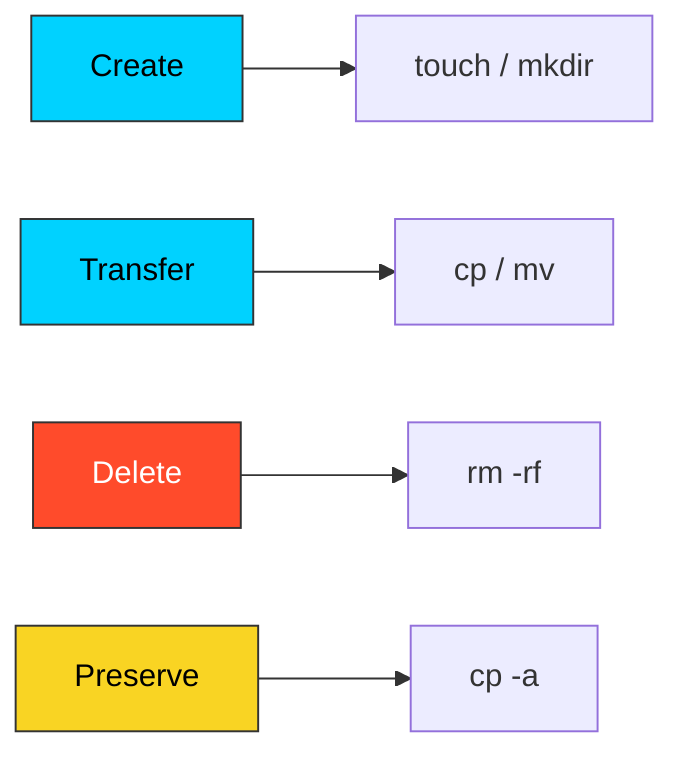

# 📁 Basic File Manipulation: The DevOps Foundation

> **"Files are the atomic unit of infrastructure. Master them, or they will master you."**



## 📚 Overview
Every automation script, CI/CD pipeline, and server configuration revolves around file lifecycle management. Whether you are creating a log directory, cloning an SSH key, or rotating backups, you are performing **File Manipulation**. In DevOps, we don't just "move files"—we orchestrate data state.

This module covers the core CRUD (Create, Read, Update, Delete) operations of the filesystem, focusing on performance, safety, and atomicity.

## 🎓 Learning Objectives
By the end of this module, you will:
- ✅ **Architect Directories** using nested parental flags (`mkdir -p`).
- ✅ Master the **Inode Logic** of moving vs. copying files.
- ✅ Utilize **Archive Mode** (`cp -a`) to preserve system metadata.
- ✅ Implement **Atomic Renaming** for zero-downtime configuration swaps.
- ✅ Apply **Defensive File Guards** to prevent accidental data loss.

---

## 🏗️ Command Architecture: Data State Management

In a Unix environment, managing files is essentially managing **Metadata** and **Data Blocks**. Professional automation requires understanding how commands manipulate these two layers to ensure system state remains consistent.

### 1. Creation & Time-Stamping (`touch` & `mkdir`)

Creation is the first step in establishing state.
- **`touch` (The Timestamp Signal)**: Frequently misunderstood as just a "file creator." Its primary DevOps role is updating the **Modification (mtime)** and **Access (atime)** timestamps.
  - **DevOps Use Case**: Many automation tools (like `make`, `rsync`, or custom backup scripts) use the `mtime` to determine if a file has changed since the last run. `touch` can manually trigger these automation pipelines.
- **`mkdir -p` (The Idempotent Creator)**: The "Safe Create." The `-p` (Parents) flag makes this command **Idempotent**—it will not error if the directory already exists, and it will dynamically create any missing folders in the hierarchy.
  - **Rule**: Never use a bare `mkdir` in a script; always use `-p` to prevent "File Exists" crashes.

### 2. The Inode Logic: `mv` vs. `cp -a`

To understand file movement, you must understand the **Inode** (Index Node). An Inode stores all metadata about a file (permissions, owner, size, data block locations) *except* its filename.

- **`mv` (Atomic Pointer Swap)**:
  - Within the same partition, `mv` does not move any data blocks. It simply changes the filename entry in the "directory file" to point to the existing Inode.
  - **DevOps Advantage**: This is **Atomic**. Whether the file is 1KB or 100GB, the rename is instantaneous and cannot be "half-finished." This is the gold standard for swapping config files.
- **`cp` (Physical Duplication)**:
  - Creates a brand new Inode and physically duplicates every bit of data to new blocks on the disk. This is resource-intensive.
- **`cp -a` (The Archive Protocol)**:
  - Standard `cp -r` often loses the "Owner," "Group," and "Original Timestamp" of files (resetting them to the user running the command).
  - **Rule**: Use the **Archive** flag (`-a`). It is a combination of `-dR --preserve=all`. It ensures the copy is an exact twin of the original, preserving the security context (UID/GID) which is vital for system backups.

### 3. Bulk Orchestration with Brace Expansion

Professional engineers use **Brace Expansion** to create complex directory structures in a single shell operation.

```bash
# Create a skeleton for a multi-environment project
mkdir -p devops-project/{prod,staging,dev}/{config,logs,certs}

# Result: 9 specialized directories created in ~0.01 seconds.
```

---

## 🚀 Professional Patterns for Automation

Production automation must be **Atomic** (all-or-nothing) and **Defensive** (protecting against system-wide errors).

### Pattern A: The Atomic Deployment Swap

When updating a live configuration or a static website folder, **never** overwrite the existing directory. If the process is interrupted, you leave the system in a corrupted, "half-updated" state.

- **The Strategy**: Copy the new data to a "next" directory, then atomically update a symbolic link to point to the new version.

```bash
# 1. Prepare the 'Next' version
cp -a ./new_build ./build_v2

# 2. Atomic Swap (The -snf flag is key)
# -s: Symbolic, -n: treat link as file, -f: force overwrite
ln -snf ./build_v2 ./current_live
# Result: Zero-downtime transition.
```

### Pattern B: The Idempotent Guard Clause

Scripts often fail because they try to create something that already exists or modify something that doesn't. Use specific shell tests (`[[ ... ]]`) to ensure your script is "Run-Once" or "Run-Many" safe.

```bash
# Directory Guard
[[ -d "/var/log/app" ]] || mkdir -p "/var/log/app"

# File Presence Guard (Shortcut for creating default env files)
[[ -f ".env" ]] || cp .env.example .env

# Executable Guard (Ensure a tool is installed before using it)
command -v jq >/dev/null 2>&1 || { echo >&2 "Error: jq is required."; exit 1; }
```

### Pattern C: The Recursive Shield (`${VAR:?}`)

Variable-based deletion is the most dangerous operation in DevOps. If a variable is empty due to a bug, a command like `rm -rf $DIR/` becomes `rm -rf /` (the System Root).

- **The Solution**: Use **Parameter Expansion** to force the shell to exit if the variable is unset or null.

```bash
# ❌ Dangerous: If DATA_DIR is empty, this deletes root!
rm -rf "$DATA_DIR/"

# ✅ Production Standard:
# ${VAR:?msg} will print 'msg' and EXIT the script if VAR is empty.
rm -rf "${DATA_DIR:?Error: DATA_DIR is unset}/"
```

### Pattern D: Safe Temporary Scaffolding (`mktemp`)

Creating temporary files with hardcoded names (like `tmp.txt`) allows for **Race Conditions** and permission conflicts in multi-user environments.

```bash
# Generate a unique, secure temporary file
SCRATCH_FILE=$(mktemp /tmp/deploy_script.XXXXXX)

# Perform operations
cat ./config_template > "$SCRATCH_FILE"

# Logic to handle cleanup via trap (covered in Part-16/17)
```

---

## 🏆 Real-World DevOps Story: The Space-Separated Disaster

**The Scenario**: An engineer was cleaning up an old project and meant to run `rm -rf tmp/`. In a rush, they accidentally typed `rm -rf / tmp/`.
**The Discovery**: Note the space after the first slash. The shell interpreted this as two separate targets: the first being the **System Root (/)**. The system immediately began deleting everything from the kernel to the user's home folder.
**The Fix**: Use the `${VAR:?}` syntax in scripts. This tells the shell: "Error out if this variable is null or unset," preventing a null variable from becoming a "delete root" command.

---

## ❓ Interview Preparation (File Manipulation)

1. **Q: Why is `mv` faster than `cp` for large files on the same disk?**
   *A: Because `mv` only changes the directory entry to point to the existing data on the disk (Inode), whereas `cp` must read and write every bit of data to a new location.*

2. **Q: What is the difference between `cp -r` and `cp -a`?**
   *A: `-r` is for recursive copying. `-a` (Archive) includes recursive copying but also preserves symbols, permissions, ownership, and timestamps, which is critical for configuration management.*

3. **Q: How do you create 100 files named `test_1.txt` to `test_100.txt` in one command?**
   *A: Using brace expansion: `touch test_{1..100}.txt`.*

4. **Q: What does the `-p` flag do for `mkdir`?**
   *A: It prevents an error if the directory already exists and creates any missing parent directories in the specified path.*

5. **Q: How can you move all files ending in `.log` to a folder named `backup`?**
   *A: `mv *.log backup/`. This uses shell globbing to expand all matching files.*

---

## 📝 Knowledge Check

1. **Which command is used to update the timestamp of an existing file?**
   - [ ] a) `mkdir`
   - [x] b) `touch`
   - [ ] c) `mv`

2. **What is the safest way to delete a directory and all of its contents?**
   - [ ] a) `rm -p`
   - [ ] b) `rm -f`
   - [x] c) `rm -rf`

3. **In the command `mv old.txt new.txt`, what happens to `old.txt`?**
   - [ ] a) It is copied and kept
   - [x] b) It is renamed/repointed, and the original name disappears
   - [ ] c) It is moved to /tmp

4. **Which flag preserves file permissions during a copy?**
   - [x] a) `-p` (as part of `-a`)
   - [ ] b) `-r`
   - [ ] c) `-v`

5. **Is it possible to create nested folders `app/logs/auth` if `app` doesn't exist?**
   - [ ] a) No, you must create `app` first
   - [x] b) Yes, using `mkdir -p app/logs/auth`
   - [ ] c) Yes, using `touch -p`

---

## 🔗 Next Steps

Now that you can build the structure, let's learn how some files hide in plain sight!

Proceed to: **[Hidden Files](../04-Hidden-Files/README.md)** →
