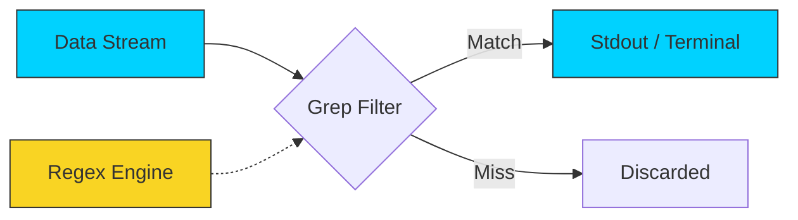

# 🔍 Searching in Files: Grep Mastery

> **"Finding a needle in a haystack is easy... if you have a magnet. Grep is that magnet."**



## 📚 Overview
In DevOps, you spend 80% of your time reading logs, debugging errors, and searching configuration files. **`grep` (Global Regular Expression Print)** is the industry-standard tool for this. It allows you to find specific text patterns across thousands of files instantly. 

Mastering `grep` is the difference between an engineer who spends 2 hours searching for an error and one who finds it in 2 seconds. In this module, we move beyond basic string matching into high-performance pattern recognition.

## 🎓 Learning Objectives
By the end of this module, you will:
- ✅ Master the **Triple-Context Flags**: `-A`, `-B`, and `-C`.
- ✅ Understand the **Regex Partition**: BRE vs. ERE (`-E`) vs. PCRE (`-P`).
- ✅ Construct complex **Exclusion Filters** using `-v` and `--exclude-dir`.
- ✅ Perform **Forensic Audits** to identify security leaks (Keys, IPs).
- ✅ Differentiate between the performance of **`grep`**, **`ack`**, and **`ripgrep` (`rg`)**.

---

## 🏗️ Search Architecture: The Grep Engine

Grep is more than a search command; it is a **Line-Oriented Stream Filter**. It operates by reading a data stream (from a file or `stdin`), applying a regex pattern, and pumping matches into the output stream.

### 1. The Regex Hierarchy

Understanding which "engine" to engage is critical for performance and syntax.

- **BRE (Basic) & ERE (Extended) `-E`**:
  - **BRE**: Legacy. Requires backslashes for special characters (`\+`, `\?`).
  - **ERE**: The modern automation standard. Handles `|` (OR), `+`, and `?` natively.
  - **Rule**: Use `-E` for almost all scripts to ensure readability.
- **Fixed Strings `-F` (Fast Search)**:
  - If you aren't using regex (e.g., searching for a specific IP address), use `-F`. It disables the regex engine entirely and uses a highly optimized string matching algorithm.
  - **DevOps Advantage**: Significantly faster for large log files.
- **PCRE (Perl-Compatible) `-P`**:
  - Unlocks advanced logic like **Lookaheads** (match X only if followed by Y) and **Non-greedy** matching.

### 2. The Contextual Auditor (The `-ABC` Protocol)

In a distributed system, a single error line is often useless without the "Temporal Context"—what happened just before or after.

- **`-B` (Before)**: Audit the lead-up. Shows the request parameters that *caused* the crash.
- **`-A` (After)**: Audit the aftermath. Shows the stack trace or database cleanup attempt.
- **`-C` (Context)**: The "Story Mode." Useful for manual debugging.

### 3. Tool Performance Benchmark

| Tool | Speed | Use Case |
| :--- | :--- | :--- |
| **`grep`** | ⚡ Fast | The universal benchmark. Guaranteed to be in every BusyBox, Alpine, and Ubuntu container. |
| **`ripgrep` (`rg`)** | 🚀 Insane | The Rust-powered modern standard. Respects `.gitignore` by default and outperforms grep by 10x+ on large disk scans. |
| **`sed / awk`** | 🛠️ Complex | Use when you need to *transform* the found data, not just find it. |

---

## 🚀 Professional Patterns for Automation

Production search logic focuses on **Signal-to-Noise Ratio (SNR)**.

### Pattern A: The "Noise Silencer" (Inclusion vs. Exclusion)

When debugging high-volume traffic (Nginx/Apache), use `grep -v` to progressively subtract known "healthy" noise until only the anomaly remains.

```bash
# Workflow: Find 500 errors, but hide the 'favicon' and 'bot' noise
tail -f access.log | grep "500" | grep -v "favicon" | grep -v "Googlebot"
```

### Pattern B: The Recursive Secret Audit

Before pushing to a public registry, scan your local environment for hardcoded credentials. 

```bash
# Flags: 
# -r: Recursive, -i: Case-insensitive, -l: File names only, -I: Ignore binary files
grep -ril "AWS_SECRET_ACCESS_KEY" . --exclude-dir={.git,node_modules,vendor}
```

### Pattern C: Data Harvesting (`-o`)

Often you don't want the whole line; you only want the specific data point (e.g., extracting IP addresses for a firewall blocklist).

```bash
# -o: Only matching, -E: Extended Regex
# Purpose: Extract all IPv4 addresses from a messy log file
grep -oE "([0-9]{1,3}\.){3}[0-9]{1,3}" connection_audit.log | sort -u
```

### Pattern D: Count-Based Monitoring (`-c`)

Instead of processing log text, scripts often use `grep -c` to generate numbers for monitoring dashboards (e.g., "Number of failed logins in the last hour").

```bash
FAILED_COUNT=$(grep -c "Failed password" /var/log/auth.log)
if (( FAILED_COUNT > 50 )); then
    echo "🚨 Security Alert: High frequency of login failures detected!"
fi
```

---

## 🏆 Real-World DevOps Story: The $50,000 Typo

**The Scenario**: A company was billed $50,000 for AWS usage overnight. A junior engineer had committed a testing `.env` file containing an Access Key to a public repository. 
**The Discovery**: They needed to find *every* mention of that key and any others in their 10GB monorepo. Standard `grep` was taking minutes to run across the massive file tree.
**The Fix**: Using `rg` (RipGrep), they scanned the entire 10GB codebase in **3.8 seconds**. They found three other forgotten keys hidden in `.backup` files that had been missed by manual checks.
**The Lesson**: For scripts, `grep` is the universal tool. For emergency forensic investigations, know and use your high-performance alternatives like `ripgrep`.

---

## ❓ Interview Preparation (Searching)

1. **Q: How do you perform a case-insensitive search with `grep`?**
   *A: Use the `-i` flag. For example: `grep -i "error" logfile.log` will match "Error", "ERROR", and "error".*

2. **Q: What is the difference between `grep` and `egrep`?**
   *A: `egrep` is equivalent to `grep -E`. It enables Extended Regular Expressions, allowing you to use control characters like `|`, `+`, and `?` without backslash escapes.*

3. **Q: How do you show 3 lines of context around a match?**
   *A: Use the `-C 3` flag. This will display 3 lines before and 3 lines after each match.*

4. **Q: How do you search for a specific string in all files in the current directory and subdirectories?**
   *A: Use the recursive flag `-r`. Example: `grep -r "pattern" .`.*

5. **Q: How do you find only the count of lines that match a pattern rather than the lines themselves?**
   *A: Use the `-c` flag. Example: `grep -c "error" server.log`.*

---

## 📝 Knowledge Check

1. **Which flag is used to invert the match (show lines that DON'T match)?**
   - [ ] a) `-i`
   - [x] b) `-v`
   - [ ] c) `-n`

2. **What does the command `grep -l` do?**
   - [x] a) Lists only the names of files that contain a match
   - [ ] b) Shows the line numbers
   - [ ] c) Lowercases all output

3. **Which operator in Extended Regex (`-E`) represents 'OR'?**
   - [ ] a) `&`
   - [x] b) `|`
   - [ ] c) `+`

4. **True or False: `grep` can search inside binary files by default.**
   - [ ] a) True
   - [x] b) False (It identifies them as binary and usually skips text output unless `-a` is used)

5. **Which command is used to see the context BEFORE a match?**
   - [ ] a) `-A`
   - [x] b) `-B`
   - [ ] c) `-X`

---

## 🔗 Next Steps

Now that you can find the data, let's learn how to read through massive files without crashing your terminal!

Proceed to: **[Paging Files](../06-Paging-Files/README.md)** →
