# 🐚 Shell Scripting & Automation Mastery

Welcome to the definitive guide to Shell Scripting for DevOps. This curriculum is designed as a continuous 3-tier progression, moving from basic command execution to professional automation engineering.

---

## 🗺️ Curriculum Map

```mermaid
graph LR
    subgraph Phase 1: Foundations
        P1[Part-01: Intro] --> P2[Part-02: Navigate]
        P2 --> P3[Part-03: Manipulate]
        P3 --> P4[Part-04: Hidden]
        P4 --> P5[Part-05: Search]
        P5 --> P6[Part-06: Paging]
        P6 --> P7[Part-07: Help]
        P7 --> P8[Part-08: Binary]
        P8 --> P9[Part-09: Vim]
        P9 --> P10[Part-10: Auth]
        P10 --> P11[Part-11: Vars]
        P11 --> P12[Part-12: Math]
    end

    subgraph Phase 2: Logic
        P12 --> P13[Part-13: Input]
        P13 --> P14[Part-14: Logic]
        P14 --> P15[Part-15: Loops]
        P15 --> P16[Part-16: Basics]
    end

    subgraph Phase 3: Engineering
        P16 --> P17[Part-17: Strict]
        P17 --> P18[Part-18: Functions]
        P18 --> P19[Part-19: Streams]
    end

    style Phase 1 fill:#e1f5fe,stroke:#01579b
    style Phase 2 fill:#fff3e0,stroke:#e65100
    style Phase 3 fill:#e8f5e9,stroke:#1b5e20
```

---

## 📈 The 3-Tier Progression

### 🛡️ Phase 1: Foundations (The Operator)

*Focus: Mastering the environment and basic syntax.*

1. **[Part-01: Introduction](./Part-01-Introduction/README.md)** - The Layered Architecture.
2. **[Part-02: Terminal & Finder](./Part-02-Terminal-and-Finder/README.md)** - Navigation and the FHS.
3. **[Part-03: Basic File Manipulation](./Part-03-Basic-File-Manipulation/README.md)** - Raw file operations.
4. **[Part-04: Hidden Files](./Part-04-Hidden-Files/README.md)** - Configuration files and dotfiles.
5. **[Part-05: Searching in Files](./Part-05-Searching-in-Files/README.md)** - Grep and text extraction.
6. **[Part-06: Paging Files](./Part-06-Paging-Files/README.md)** - Inspecting large datasets.
7. **[Part-07: Man Pages](./Part-07-Man-Pages/README.md)** - Self-documentation and technical help.
8. **[Part-08: Programs and Commands](./Part-08-Programs-and-Commands/README.md)** - Binaries, aliases, and built-ins.
9. **[Part-09: Vim Crash Course](./Part-09-Vim-Crash-Course/README.md)** - Modal editing for extreme speed.
10. **[Part-10: File Permissions](./Part-10-File-Permissions/README.md)** - Security and ownership.
11. **[Part-11: Basic Variables](./Part-11-Basic-Variables/README.md)** - Scope and parameter expansion.
12. **[Part-12: Arithmetic and Metrics](./Part-12-Arithmetic-and-Metrics/README.md)** - Capacity calculation and `bc`.

### 🧠 Phase 2: Logic & Control (The Scripter)

*Focus: Moving from static commands to dynamic logic.*

1. **[Part-13: User Input](./Part-13-User-Input/README.md)** - Positional parameters and `read`.
2. **[Part-14: Conditionals](./Part-14-Conditionals/README.md)** - Decision making and tests.
3. **[Part-15: Loops and Processing](./Part-15-Loops-and-Processing/README.md)** - Advanced iteration and lists.
4. **[Part-16: Finally Scripting](./Part-16-Finally-Scripting/README.md)** - Building your first end-to-end automation.

### 🚀 Phase 3: Engineering (The Architect)

*Focus: Robust, enterprise-grade automation.*

1. **[Part-17: Strict Mode & Error Handling](./Part-17-Strict-Mode-and-Error-Handling/README.md)** - Fail-fast and defensive coding.
2. **[Part-18: Functions and Scope](./Part-18-Functions-and-Scope/README.md)** - Modular logic and recursion.
3. **[Part-19: Advanced I/O & Redirection](./Part-19-Advanced-IO-and-Redirection/README.md)** - Streams, signals, and process substitution.

---

## 🛠️ Usage
Each directory contains:
- **README.md**: Conceptual deep dive and DevOps context.
- **Boilerplates/**: Proven code snippets for production.
- **CHALLENGES.md**: Hands-on exercises to build muscle memory.

---
> "The shell is the glue that holds the cloud together."
