# Shell Scripting Learning Architecture

```mermaid
graph TD
    A[Shell Scripting Mastery] --> B[Module 1: Environment & Execution]
    A --> C[Module 2: Variables & Data Streams]
    A --> D[Module 3: Logic & Flow Control]
    A --> E[Module 4: Functions & Modules]
    A --> F[Module 5: Robust Scripting & Error Handling]
    
    B --> G[Shell Types & Configuration]
    B --> H[Script Execution Methods]
    B --> I[Environment Variables]
    
    C --> J[Variable Scoping]
    C --> K[Data Processing]
    C --> L[Stream Redirection]
    
    D --> M[Conditional Logic]
    D --> N[Loop Constructs]
    D --> O[Case Statements]
    
    E --> P[Function Libraries]
    E --> Q[Modular Design]
    E --> R[Code Reusability]
    
    F --> S[Error Handling]
    F --> T[Logging & Monitoring]
    F --> U[Production Patterns]
    
    style A fill:#e1f5fe,stroke:#1e88e5,stroke-width:3px
    style B fill:#f3e5f5,stroke:#8e24aa,stroke-width:2px
    style C fill:#fff3e0,stroke:#f57c00,stroke-width:2px
    style D fill:#e8f5e8,stroke:#2e7d32,stroke-width:2px
    style E fill:#fce4ec,stroke:#c2185b,stroke-width:2px
    style F fill:#fff8e1,stroke:#f9a825,stroke-width:2px
```

This diagram represents the comprehensive Shell Scripting learning architecture with 5 core modules progressing from basic environment setup to production-ready automation patterns.