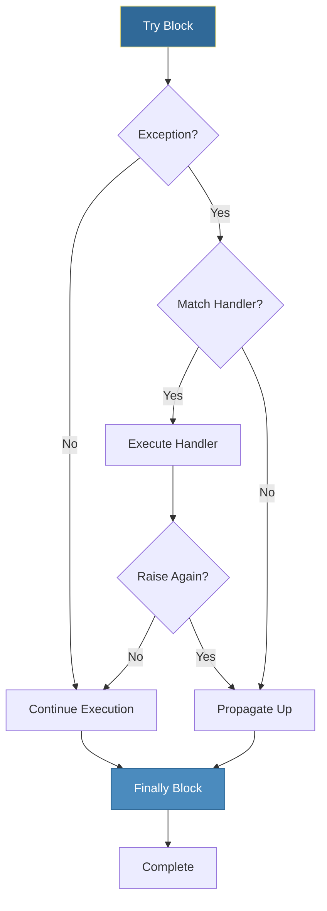
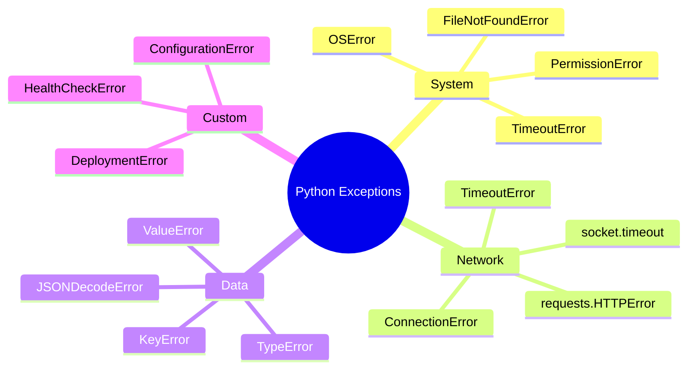

# Error Handling
*Building Robust, Fault-Tolerant Automation Scripts*

In DevOps, scripts handle unreliable networks, flaky APIs, and unexpected system states. Proper error handling is the difference between a script that crashes at 3 AM and one that recovers gracefully.

---

## 🎯 Learning Objectives

- Implement try/except/finally patterns
- Create and raise custom exceptions
- Build retry mechanisms with exponential backoff
- Design fail-safe automation scripts

---

## 📊 Exception Handling Flow



---

## 📚 Core Concepts

### 1. Basic Exception Handling

```python
# Basic try/except
try:
    response = requests.get("https://api.example.com/health")
    response.raise_for_status()
except requests.exceptions.RequestException as e:
    print(f"API call failed: {e}")

# Multiple exception types
try:
    config = load_config("/etc/app/config.json")
    connection = connect_database(config["db_url"])
except FileNotFoundError:
    print("Config file missing, using defaults")
    config = DEFAULT_CONFIG
except KeyError as e:
    print(f"Missing config key: {e}")
except Exception as e:
    print(f"Unexpected error: {e}")
    raise  # Re-raise after logging
```

### 2. Try/Except/Finally/Else

```python
def process_file(filepath):
    file_handle = None
    try:
        file_handle = open(filepath, 'r')
        data = file_handle.read()
    except FileNotFoundError:
        print(f"File not found: {filepath}")
        return None
    except PermissionError:
        print(f"Permission denied: {filepath}")
        return None
    else:
        # Only runs if no exception
        print(f"Successfully read {len(data)} bytes")
        return data
    finally:
        # Always runs (cleanup)
        if file_handle:
            file_handle.close()
            print("File handle closed")
```

### 3. Common DevOps Exceptions



| Exception | When It Occurs | DevOps Context |
|-----------|---------------|----------------|
| `FileNotFoundError` | File doesn't exist | Missing config/cert |
| `PermissionError` | Insufficient permissions | SSH key, sudo |
| `ConnectionError` | Network unreachable | API, database |
| `TimeoutError` | Operation timed out | Slow services |
| `KeyError` | Dict key missing | Bad API response |
| `JSONDecodeError` | Invalid JSON | Corrupted response |

### 4. Custom Exceptions

```python
class DeploymentError(Exception):
    """Base exception for deployment failures."""
    pass

class PreCheckError(DeploymentError):
    """Pre-deployment validation failed."""
    def __init__(self, check_name, reason):
        self.check_name = check_name
        self.reason = reason
        super().__init__(f"Pre-check '{check_name}' failed: {reason}")

class RollbackError(DeploymentError):
    """Rollback operation failed."""
    pass

# Usage
def deploy(version):
    if not disk_space_available():
        raise PreCheckError("disk_space", "Less than 10GB available")
    
    try:
        perform_deployment(version)
    except DeploymentError:
        try:
            rollback()
        except Exception as e:
            raise RollbackError(f"Rollback failed: {e}") from e
```

---

## 🔄 Retry Patterns

### Exponential Backoff

```python
import time
import random

def exponential_backoff_retry(
    func, 
    max_attempts=5, 
    base_delay=1, 
    max_delay=60,
    exceptions=(Exception,)
):
    """Retry with exponential backoff and jitter."""
    for attempt in range(1, max_attempts + 1):
        try:
            return func()
        except exceptions as e:
            if attempt == max_attempts:
                raise
            
            # Calculate delay with jitter
            delay = min(base_delay * (2 ** (attempt - 1)), max_delay)
            jitter = random.uniform(0, delay * 0.1)
            wait_time = delay + jitter
            
            print(f"Attempt {attempt} failed: {e}")
            print(f"Retrying in {wait_time:.2f}s...")
            time.sleep(wait_time)

# Usage
def fetch_api_data():
    response = requests.get("https://api.example.com/data", timeout=5)
    response.raise_for_status()
    return response.json()

data = exponential_backoff_retry(
    fetch_api_data,
    max_attempts=3,
    exceptions=(requests.RequestException,)
)
```

### Retry Decorator

```python
import functools
import time

def retry(max_attempts=3, delay=1, backoff=2, exceptions=(Exception,)):
    """Decorator for retry logic with backoff."""
    def decorator(func):
        @functools.wraps(func)
        def wrapper(*args, **kwargs):
            current_delay = delay
            for attempt in range(1, max_attempts + 1):
                try:
                    return func(*args, **kwargs)
                except exceptions as e:
                    if attempt == max_attempts:
                        raise
                    print(f"[{func.__name__}] Attempt {attempt} failed: {e}")
                    time.sleep(current_delay)
                    current_delay *= backoff
        return wrapper
    return decorator

# Usage
@retry(max_attempts=5, delay=1, backoff=2, exceptions=(ConnectionError,))
def connect_to_database(host):
    """Connect to database with automatic retry."""
    return database.connect(host)
```

---

## 🛠️ Hands-On Exercises

### Exercise 1: Robust Config Loader
```python
# Create a config loader that handles multiple error scenarios
# TODO: Implement load_config function
# - Return config dict on success
# - Use default if file not found
# - Raise custom error if JSON invalid
# - Validate required keys exist

DEFAULT_CONFIG = {"debug": False, "port": 8080}
REQUIRED_KEYS = ["database_url", "api_key"]

class ConfigError(Exception):
    pass

def load_config(filepath):
    pass
```

<details>
<summary>💡 Solution</summary>

```python
import json

DEFAULT_CONFIG = {"debug": False, "port": 8080}
REQUIRED_KEYS = ["database_url", "api_key"]

class ConfigError(Exception):
    """Configuration error."""
    pass

class ConfigNotFoundError(ConfigError):
    """Config file not found."""
    pass

class ConfigValidationError(ConfigError):
    """Config validation failed."""
    def __init__(self, missing_keys):
        self.missing_keys = missing_keys
        super().__init__(f"Missing required keys: {missing_keys}")

def load_config(filepath):
    """Load and validate configuration file."""
    try:
        with open(filepath, 'r') as f:
            config = json.load(f)
    except FileNotFoundError:
        print(f"Config not found at {filepath}, using defaults")
        return DEFAULT_CONFIG.copy()
    except json.JSONDecodeError as e:
        raise ConfigError(f"Invalid JSON in {filepath}: {e}")
    
    # Merge with defaults
    final_config = {**DEFAULT_CONFIG, **config}
    
    # Validate required keys
    missing = [k for k in REQUIRED_KEYS if k not in final_config]
    if missing:
        raise ConfigValidationError(missing)
    
    return final_config

# Test
try:
    config = load_config("app.json")
    print(f"Loaded config: {config}")
except ConfigError as e:
    print(f"Config error: {e}")
```
</details>

### Exercise 2: Health Check with Retries
```python
# Create a health check function with retry logic
# TODO: Implement check_service_health function
# - Check HTTP endpoint
# - Retry up to 3 times with 2s delay
# - Return health status dict
# - Include response time

import requests
import time

def check_service_health(url, timeout=5):
    pass
```

<details>
<summary>💡 Solution</summary>

```python
import requests
import time

def check_service_health(url, timeout=5, max_retries=3, retry_delay=2):
    """Check service health with retries."""
    result = {
        "url": url,
        "healthy": False,
        "status_code": None,
        "response_time_ms": None,
        "error": None,
        "attempts": 0
    }
    
    for attempt in range(1, max_retries + 1):
        result["attempts"] = attempt
        
        try:
            start_time = time.time()
            response = requests.get(url, timeout=timeout)
            elapsed_ms = (time.time() - start_time) * 1000
            
            result["status_code"] = response.status_code
            result["response_time_ms"] = round(elapsed_ms, 2)
            
            if response.status_code == 200:
                result["healthy"] = True
                return result
            else:
                result["error"] = f"Non-200 status: {response.status_code}"
                
        except requests.exceptions.Timeout:
            result["error"] = f"Timeout after {timeout}s"
        except requests.exceptions.ConnectionError as e:
            result["error"] = f"Connection error: {e}"
        except Exception as e:
            result["error"] = f"Unexpected error: {e}"
        
        if attempt < max_retries:
            print(f"Attempt {attempt} failed, retrying in {retry_delay}s...")
            time.sleep(retry_delay)
    
    return result

# Test
health = check_service_health("https://httpbin.org/status/200")
print(f"Health check result: {health}")
```
</details>

### Exercise 3: Graceful Shutdown Handler
```python
# Create error handling for a long-running script
# TODO: Implement graceful shutdown
# - Catch keyboard interrupt
# - Cleanup resources
# - Log shutdown reason

import signal

class AutomationRunner:
    def __init__(self):
        self.running = True
        self.resources = []
    
    def acquire_resource(self, name):
        pass
    
    def cleanup(self):
        pass
    
    def run(self):
        pass
```

<details>
<summary>💡 Solution</summary>

```python
import signal
import time

class AutomationRunner:
    def __init__(self):
        self.running = True
        self.resources = []
        self._setup_signals()
    
    def _setup_signals(self):
        """Register signal handlers for graceful shutdown."""
        signal.signal(signal.SIGINT, self._handle_shutdown)
        signal.signal(signal.SIGTERM, self._handle_shutdown)
    
    def _handle_shutdown(self, signum, frame):
        """Handle shutdown signals."""
        signal_name = signal.Signals(signum).name
        print(f"\nReceived {signal_name}, initiating graceful shutdown...")
        self.running = False
    
    def acquire_resource(self, name):
        """Acquire a resource that needs cleanup."""
        print(f"Acquiring resource: {name}")
        self.resources.append(name)
    
    def cleanup(self):
        """Clean up all acquired resources."""
        print("Cleaning up resources...")
        for resource in reversed(self.resources):
            print(f"  Releasing: {resource}")
        self.resources.clear()
        print("Cleanup complete")
    
    def run(self):
        """Main execution loop."""
        try:
            self.acquire_resource("database_connection")
            self.acquire_resource("file_handle")
            self.acquire_resource("api_session")
            
            print("Starting main loop (Ctrl+C to stop)...")
            while self.running:
                print("  Working...")
                time.sleep(1)
                
        except Exception as e:
            print(f"Error during execution: {e}")
            raise
        finally:
            self.cleanup()

# Test
runner = AutomationRunner()
runner.run()
```
</details>

---

## 📖 Real-World Story: The Silent Failure

**Scenario**: A backup script ran nightly but silently failed for 3 weeks. The team only discovered this when they needed to restore.

**Problem**: Bare `except: pass` was swallowing all errors.

**Solution**: Implemented proper exception handling with:
- Specific exception types
- Logging on failure
- Alert on repeated failures
- Non-zero exit codes

**Outcome**: Failures now trigger PagerDuty alerts within 5 minutes.

---

## ❓ Interview Questions

1. **What's the difference between `except Exception` and bare `except`?**
   > Bare `except` catches everything including `SystemExit` and `KeyboardInterrupt`. `except Exception` only catches regular exceptions.

2. **When should you use `finally`?**
   > For cleanup code that must run regardless of success/failure (closing files, connections, releasing locks).

3. **What's exception chaining (`raise ... from`)?**
   > Preserves the original exception as the `__cause__` of the new exception, maintaining the full error context.

4. **How do you implement retry with exponential backoff?**
   > Double the delay after each attempt, add jitter to prevent thundering herd, cap at maximum delay.

5. **Should you catch exceptions at every level?**
   > No. Catch where you can handle meaningfully. Let others propagate to appropriate handlers.

---

## 🧠 Quiz

1. What does `finally` block do?
   - a) Runs only on success
   - b) Runs only on failure
   - c) Always runs ✅

2. Which catches the most exception types?
   - a) `except Exception:`
   - b) `except BaseException:` ✅
   - c) `except:`  (equivalent to BaseException)

3. When does `else` block in try/except run?
   - a) On any exception
   - b) Only if no exception ✅
   - c) Always

4. How do you re-raise the current exception?
   - a) `throw`
   - b) `raise` ✅
   - c) `reraise()`

5. What's wrong with `except: pass`?
   - a) Syntax error
   - b) Silently ignores all errors ✅
   - c) Too verbose

---

**Next Step**: [Working with JSON →](../06-Working-with-JSON/README.md)
