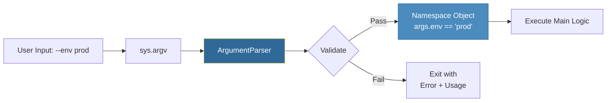

# Command Line Arguments
*Building Professional CLI Tools for DevOps*

CLI (Command Line Interface) tools are the backbone of DevOps automation. From `kubectl` to `terraform`, professional tools rely on structured argument parsing to provide clear help text, robust validation, and a predictable user experience. Python's `argparse` module is the standard for building these interfaces.

---

## 🎯 Learning Objectives

- Parse positional and optional arguments with `argparse`
- Implement complex CLI structures using subcommands (like `git push/pull`)
- Use mutually exclusive groups to prevent conflicting flags
- Apply custom types and validation to user input
- Build user-friendly CLI tools with professional help documentation

---

## 📊 CLI Argument Parsing Flow



---

## 📚 Core Concepts

### 1. Basic Argparse Setup

```python
import argparse

parser = argparse.ArgumentParser(
    prog="deploy-bot",
    description="Automated deployment script for cloud resources."
)

# Positional (Required by default)
parser.add_argument("app", help="Application name to deploy")

# Optional (Flags)
parser.add_argument("-e", "--env", choices=["dev", "prod"], default="dev")
parser.add_argument("-v", "--verbose", action="store_true", help="Enable debug logs")

args = parser.parse_args()
print(f"Deploying {args.app} to {args.env}...")
```

### 2. Advanced Argument Types

| Feature | Code Example | Use Case |
|---------|--------------|----------|
| **Multi-Value** | `nargs="+"` | `deploy --servers s1 s2 s3` |
| **Integer** | `type=int` | `deploy --replicas 3` |
| **Const/Flag** | `action="store_true"` | `deploy --dry-run` |
| **Hidden Dest**| `dest="api_key"` | Map `--key` to `args.api_key` |

### 3. Mutually Exclusive Groups

Prevents users from providing conflicting options (e.g., you can't be both "Silent" and "Verbose").

```python
group = parser.add_mutually_exclusive_group()
group.add_argument("--quiet", action="store_true")
group.add_argument("--verbose", action="store_true")
```

### 4. Subcommands (The "Git" Style)

Essential for complex tools like `aws s3 cp` or `kubectl get pods`.

```python
subparsers = parser.add_subparsers(dest="action")

# 'backup' subcommand
backup = subparsers.add_parser("backup", help="Run database backup")
backup.add_argument("--db", required=True)

# 'restore' subcommand
restore = subparsers.add_parser("restore", help="Restore from backup")
restore.add_argument("--file", required=True)
```

---

## 🔧 Advanced Patterns

### Custom Validation
You can pass any function to `type=` to validate input on the fly.

```python
def validate_ip(value):
    import ipaddress
    try:
        return str(ipaddress.ip_address(value))
    except ValueError:
        raise argparse.ArgumentTypeError(f"'{value}' is not a valid IP address")

parser.add_argument("--target-ip", type=validate_ip)
```

---

## 🛠️ Hands-On Exercises

### Exercise 1: Port Scanner CLI
Build a tool that takes a required `host` and an optional `--ports` list (defaulting to 80, 443).

<details>
<summary>💡 Solution</summary>

```python
import argparse

parser = argparse.ArgumentParser()
parser.add_argument("host", help="Hostname to scan")
parser.add_argument("--ports", type=int, nargs="+", default=[80, 443])

args = parser.parse_args()
print(f"Scanning {args.host} on ports {args.ports}...")
```
</details>

### Exercise 2: File-Based Argument Passing
Use `fromfile_prefix_chars='@'` to allow users to put long argument lists in a text file.

<details>
<summary>💡 Solution</summary>

```python
import argparse

# Usage: python script.py @args.txt
parser = argparse.ArgumentParser(fromfile_prefix_chars='@')
parser.add_argument("--server", action="append")

args = parser.parse_args()
print(f"Targeting servers: {args.server}")
```
</details>

### Exercise 3: Automated Cleaner with Safety
Create a CLI with a `--force` and `--dry-run` mutually exclusive group.

<details>
<summary>💡 Solution</summary>

```python
import argparse

parser = argparse.ArgumentParser()
group = parser.add_mutually_exclusive_group()
group.add_argument("-f", "--force", action="store_true")
group.add_argument("-d", "--dry-run", action="store_true")

args = parser.parse_args()
if args.dry_run:
    print("Pretending to delete files...")
else:
    print("Actually deleting files...")
```
</details>

### Exercise 4: Subcommand Router
Build a calculator CLI with `add` and `multiply` subcommands, each taking two numbers.

<details>
<summary>💡 Solution</summary>

```python
import argparse

parser = argparse.ArgumentParser()
sub = parser.add_subparsers(dest="op")

add = sub.add_parser("add")
add.add_argument("nums", type=int, nargs=2)

mult = sub.add_parser("multiply")
mult.add_argument("nums", type=int, nargs=2)

args = parser.parse_args()
if args.op == "add":
    print(sum(args.nums))
elif args.op == "multiply":
    print(args.nums[0] * args.nums[1])
```
</details>

### Exercise 5: Environment Override CLI
Create a CLI that reads an `API_KEY` positional argument, but if it's missing, looks for an `API_KEY` environment variable.

<details>
<summary>💡 Solution</summary>

```python
import argparse
import os

parser = argparse.ArgumentParser()
parser.add_argument("key", nargs="?", default=os.environ.get("API_KEY"))

args = parser.parse_args()
if not args.key:
    parser.error("API_KEY must be provided via argument or environment variable.")
print(f"Using Key: {args.key}")
```
</details>

---

## 📖 Real-World Story: The Fat-Finger Failure

**Scenario**: A junior admin ran a cleanup script intended for `staging` but accidentally pointed it at `production` because the script used simple positional arguments (e.g., `python clear.py prod`).

**Problem**: The script had no confirmation and used positional arguments which are easy to mix up.

**Solution**: The team refactored the tool with `argparse`:
1. Changed `environment` to a required `--env` flag with `choices=["dev", "staging"]`.
2. Added a `--production` flag that requires a second `--confirm` flag to work.
3. Implemented a "Dry Run" by default.

**Outcome**: The specialized validation and clear help text prevented future accidents and made the tool safer for everyone.

---

## ❓ Interview Questions

1. **How does `argparse` handle incorrect user input?**
   > It automatically detects the error, prints a relevant error message, shows the "usage" documentation, and exits the script with a non-zero exit code.

2. **Why is `argparse` preferred over manual parsing of `sys.argv`?**
   > Manual parsing is brittle. `argparse` handles type conversion, generates help text automatically, supports short/long flags, and handles subcommands with minimal code.

3. **What is the difference between `nargs="+"` and `nargs="*"`?**
   > `+` requires at least one argument to be provided (throws error if empty), while `*` allows zero or more (returns an empty list if none provided).

4. **How do you make an optional argument (e.g., `--key`) mandatory?**
   > Add `required=True` in the `add_argument()` call. While it's called an "optional argument" because of the dashes, this forces the user to provide it.

5. **Where does `argparse` get the arguments from by default?**
   > From `sys.argv[1:]`. However, you can pass a custom list of strings to `parse_args(['--test', 'val'])` which is very useful for unit testing your CLI logic.

---

## 🧠 Quiz

1. Which method initializes the argument parser?
   - a) `argparse.begin()`
   - b) `argparse.ArgumentParser()` ✅
   - c) `argparse.create()`

2. How do you define a flag that sets a value to `True` if present?
   - a) `action="store_true"` ✅
   - b) `type=bool`
   - c) `default=True`

3. What does `choices=["a", "b"]` do?
   - a) Automatically selects "a"
   - b) Restricts user input to only "a" or "b" ✅
   - c) Prints a list of options

4. Which object is returned by `parse_args()`?
   - a) A Dictionary
   - b) A Namespace object ✅
   - c) A List of strings

5. How do you display the auto-generated help message?
   - a) Run script with `-h` or `--help` ✅
   - b) Run script with `?`
   - c) `print(parser.help)`

6. What happens if a positional argument is missing?
   - a) It defaults to `None`
   - b) The script raises a `KeyError`
   - c) The script exits with a usage error ✅

7. How do you restrict a subcommand's flags to only that subcommand?
   - a) Use a global flag
   - b) Add the argument directly to the subparser object ✅
   - c) It's not possible

---

## 🔗 Related Topics

| Module | Relationship |
|--------|-------------|
| [Subprocess Module](../10-Subprocess-Module/README.md) | Pass CLI arguments to external shell commands |
| [Environment Variables](../08-Environment-Variables/README.md) | CLI args often override environment variables |
| [First Automation Script](../17-First-Automation-Script/README.md) | The entry point for any professional script |

---

**Next Step**: [Subprocess Module →](../10-Subprocess-Module/README.md)
