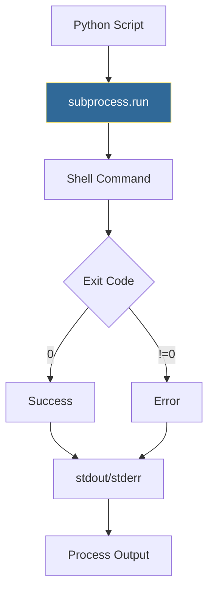

# Subprocess Module
*Running Shell Commands from Python*

The subprocess module bridges Python and the shell, enabling you to run commands, capture output, and build pipelines—essential for system automation.

---

## 🎯 Learning Objectives

- Execute shell commands safely
- Capture and process command output
- Handle command errors gracefully
- Build command pipelines

---

## 📊 Subprocess Execution Flow



---

## 📚 Core Concepts

### 1. Basic Command Execution

```python
import subprocess

# Simple command
result = subprocess.run(["ls", "-la"], capture_output=True, text=True)
print(result.stdout)

# Check for errors
result = subprocess.run(
    ["git", "status"],
    capture_output=True,
    text=True,
    check=True  # Raises on non-zero exit
)

# With shell=True (use carefully!)
result = subprocess.run(
    "echo $HOME",
    shell=True,
    capture_output=True,
    text=True
)
```

### 2. Capturing Output

```python
# Capture stdout and stderr separately
result = subprocess.run(
    ["docker", "ps"],
    capture_output=True,
    text=True
)
print(f"Output: {result.stdout}")
print(f"Errors: {result.stderr}")
print(f"Exit code: {result.returncode}")

# Timeout handling
try:
    result = subprocess.run(
        ["sleep", "60"],
        timeout=5,
        capture_output=True
    )
except subprocess.TimeoutExpired:
    print("Command timed out!")
```

### 3. Real-Time Output

```python
import subprocess

# Stream output as it happens
process = subprocess.Popen(
    ["tail", "-f", "/var/log/syslog"],
    stdout=subprocess.PIPE,
    text=True
)

for line in process.stdout:
    print(f"Log: {line.strip()}")
    if "ERROR" in line:
        process.terminate()
        break
```

---

## 🛠️ Hands-On Exercise

### Server Health Checker
```python
import subprocess

def check_server(hostname):
    """Ping server and return status."""
    try:
        result = subprocess.run(
            ["ping", "-c", "3", hostname],
            capture_output=True,
            text=True,
            timeout=10
        )
        return {
            "host": hostname,
            "reachable": result.returncode == 0,
            "output": result.stdout
        }
    except subprocess.TimeoutExpired:
        return {"host": hostname, "reachable": False, "error": "timeout"}

# Test
status = check_server("google.com")
print(f"Server reachable: {status['reachable']}")
```

---

## ❓ Interview Questions

1. **Why avoid `shell=True`?**
   > Security risk—shell injection attacks. Pass list of args instead.

2. **Difference between `run()` and `Popen()`?**
   > `run()` waits for completion; `Popen()` allows async and streaming.

---

## 🧠 Quiz

1. What does `check=True` do in subprocess.run()?
   - a) Validates command exists
   - b) Raises exception on non-zero exit ✅
   - c) Enables verbose mode

2. How do you capture command output?
   - a) `capture_output=True` ✅
   - b) `output=True`
   - c) `save_output=True`

---

**Next Step**: [Pathlib Basics →](../11-Pathlib-Basics/README.md)
