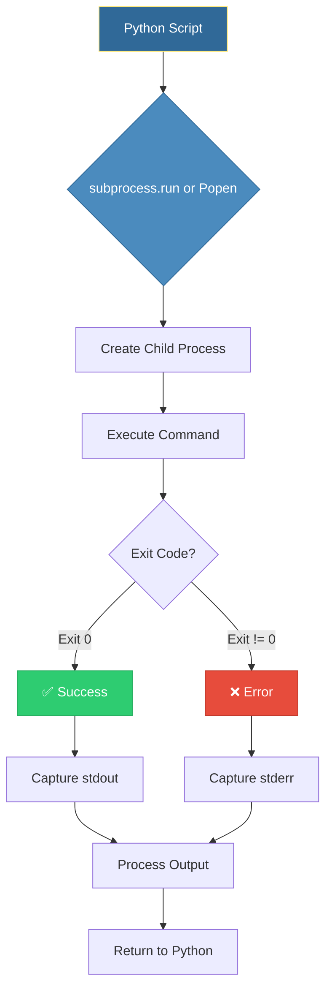
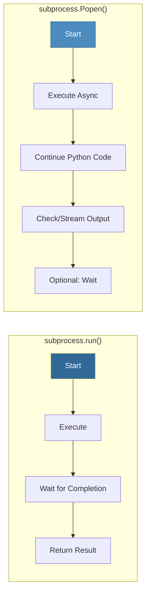
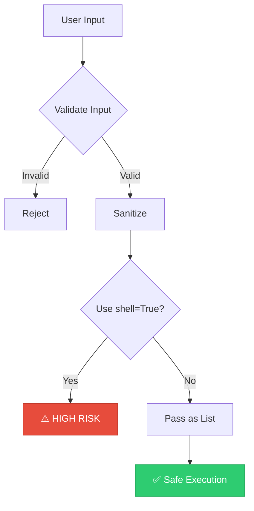

# Subprocess Module
*Running Shell Commands from Python*

The subprocess module bridges Python and the shell, enabling you to run commands, capture output, and build pipelines—essential for system automation. This is one of the most powerful tools in a DevOps engineer's Python toolkit.

---

## 🎯 Learning Objectives

- Execute shell commands safely from Python
- Capture and process command output (stdout/stderr)
- Handle command errors and timeouts gracefully
- Build command pipelines and process chains
- Understand the security implications of shell execution

---

## 📊 Subprocess Execution Architecture



---

## 🔄 Comparison: subprocess.run() vs Popen()



| Feature | `run()` | `Popen()` |
|---------|---------|-----------|
| Blocking | Yes | No |
| Simple commands | ✅ Best choice | Overkill |
| Streaming output | ❌ Limited | ✅ Full support |
| Pipelines | ❌ Complex | ✅ Native support |
| Use case | One-shot commands | Long-running/interactive |

---

## 📚 Core Concepts

### 1. Basic Command Execution

```python
import subprocess

# Simple command - pass as list (RECOMMENDED)
result = subprocess.run(
    ["ls", "-la"],
    capture_output=True,
    text=True
)
print(result.stdout)
print(f"Exit code: {result.returncode}")

# Check for errors automatically (raises CalledProcessError)
result = subprocess.run(
    ["git", "status"],
    capture_output=True,
    text=True,
    check=True  # Raises exception on non-zero exit
)

# With shell=True - USE WITH CAUTION!
# Only for shell features like pipes, redirects, env vars
result = subprocess.run(
    "echo $HOME",
    shell=True,
    capture_output=True,
    text=True
)
```

### 2. Understanding Return Object

```python
import subprocess

result = subprocess.run(
    ["docker", "ps"],
    capture_output=True,
    text=True
)

# CompletedProcess attributes
print(f"Command: {result.args}")          # ['docker', 'ps']
print(f"Exit code: {result.returncode}")   # 0 = success
print(f"Standard output: {result.stdout}")  # Command output
print(f"Standard error: {result.stderr}")   # Error messages
```

### 3. Timeout and Error Handling

```python
import subprocess

def run_command_safely(cmd, timeout_seconds=30):
    """Run command with comprehensive error handling."""
    try:
        result = subprocess.run(
            cmd,
            capture_output=True,
            text=True,
            timeout=timeout_seconds,
            check=True
        )
        return {"success": True, "output": result.stdout}
    
    except subprocess.TimeoutExpired:
        return {"success": False, "error": "Command timed out"}
    
    except subprocess.CalledProcessError as e:
        return {
            "success": False,
            "error": f"Command failed with exit code {e.returncode}",
            "stderr": e.stderr
        }
    
    except FileNotFoundError:
        return {"success": False, "error": "Command not found"}

# Usage
result = run_command_safely(["ping", "-c", "3", "google.com"], timeout_seconds=10)
```

### 4. Real-Time Output Streaming (Popen)

```python
import subprocess
import sys

def stream_command(cmd):
    """Execute command with real-time output streaming."""
    process = subprocess.Popen(
        cmd,
        stdout=subprocess.PIPE,
        stderr=subprocess.STDOUT,
        text=True,
        bufsize=1  # Line buffered
    )
    
    # Stream output line by line
    for line in process.stdout:
        print(line, end='')  # Real-time output
        sys.stdout.flush()
    
    process.wait()
    return process.returncode

# Stream a long-running command
exit_code = stream_command(["docker", "build", "-t", "myapp", "."])
```

### 5. Building Pipelines

```python
import subprocess

# Simulating: ls -la | grep ".py" | wc -l
# Chain commands using Popen

p1 = subprocess.Popen(
    ["ls", "-la"],
    stdout=subprocess.PIPE
)

p2 = subprocess.Popen(
    ["grep", ".py"],
    stdin=p1.stdout,
    stdout=subprocess.PIPE
)

p3 = subprocess.Popen(
    ["wc", "-l"],
    stdin=p2.stdout,
    stdout=subprocess.PIPE,
    text=True
)

# Allow p1 to receive SIGPIPE if p2 exits
p1.stdout.close()
p2.stdout.close()

output, _ = p3.communicate()
print(f"Python files count: {output.strip()}")
```

### 6. Environment Variables

```python
import subprocess
import os

# Pass custom environment
custom_env = os.environ.copy()
custom_env["MY_VAR"] = "custom_value"
custom_env["DEBUG"] = "true"

result = subprocess.run(
    ["printenv"],
    capture_output=True,
    text=True,
    env=custom_env
)
```

---

## ⚠️ Security Best Practices



### ⚠️ Shell Injection Vulnerability

```python
# ❌ DANGEROUS - Shell injection possible
user_input = "; rm -rf /"  # Malicious input
subprocess.run(f"echo {user_input}", shell=True)  # Executes the rm command!

# ✅ SAFE - Command as list, no shell interpretation
user_input = "; rm -rf /"
subprocess.run(["echo", user_input], capture_output=True)  # Prints literally
```

### Security Guidelines

| Practice | Recommendation |
|----------|----------------|
| Command format | Always use list `["cmd", "arg1"]` |
| shell=True | Avoid unless absolutely necessary |
| User input | Always validate and sanitize |
| Timeouts | Always set timeouts for external commands |
| Least privilege | Run with minimal required permissions |

---

## 🛠️ Hands-On Exercises

### Exercise 1: Server Health Checker

```python
import subprocess

def check_server(hostname):
    """Ping server and return status.
    
    TODO: Implement this function to:
    1. Ping the hostname 3 times
    2. Return reachable status and latency
    3. Handle timeout (10 seconds max)
    """
    pass

# Test
status = check_server("google.com")
print(f"Server reachable: {status['reachable']}")
```

<details>
<summary>💡 Solution</summary>

```python
import subprocess
import re

def check_server(hostname):
    """Ping server and return status."""
    try:
        # Windows uses -n, Linux/Mac uses -c
        result = subprocess.run(
            ["ping", "-c", "3", hostname],
            capture_output=True,
            text=True,
            timeout=10
        )
        
        # Parse average latency from output
        latency = None
        match = re.search(r'avg[^=]*=\s*[\d.]+/([\d.]+)', result.stdout)
        if match:
            latency = float(match.group(1))
        
        return {
            "host": hostname,
            "reachable": result.returncode == 0,
            "latency_ms": latency,
            "output": result.stdout
        }
    
    except subprocess.TimeoutExpired:
        return {"host": hostname, "reachable": False, "error": "timeout"}
    
    except FileNotFoundError:
        return {"host": hostname, "reachable": False, "error": "ping not found"}

# Test
status = check_server("google.com")
print(f"Server reachable: {status['reachable']}")
if status.get('latency_ms'):
    print(f"Latency: {status['latency_ms']}ms")
```
</details>

### Exercise 2: Git Status Checker

```python
import subprocess

def check_git_status(repo_path):
    """Check if a git repository has uncommitted changes.
    
    TODO: Implement this function to:
    1. Check if the path is a git repository
    2. Return if there are uncommitted changes
    3. Count modified, added, and deleted files
    """
    pass
```

<details>
<summary>💡 Solution</summary>

```python
import subprocess
from pathlib import Path

def check_git_status(repo_path):
    """Check if a git repository has uncommitted changes."""
    
    # Verify it's a git repo
    git_dir = Path(repo_path) / ".git"
    if not git_dir.exists():
        return {"error": "Not a git repository"}
    
    try:
        # Get status
        result = subprocess.run(
            ["git", "status", "--porcelain"],
            capture_output=True,
            text=True,
            cwd=repo_path,
            check=True
        )
        
        lines = result.stdout.strip().split('\n') if result.stdout.strip() else []
        
        # Parse status
        modified = sum(1 for l in lines if l.startswith(' M') or l.startswith('M '))
        added = sum(1 for l in lines if l.startswith('A ') or l.startswith('??'))
        deleted = sum(1 for l in lines if l.startswith(' D') or l.startswith('D '))
        
        return {
            "clean": len(lines) == 0,
            "modified": modified,
            "added": added,
            "deleted": deleted,
            "total_changes": len(lines)
        }
    
    except subprocess.CalledProcessError as e:
        return {"error": f"Git command failed: {e.stderr}"}

# Test
status = check_git_status(".")
print(f"Repository clean: {status.get('clean', 'N/A')}")
```
</details>

### Exercise 3: Docker Container Manager

```python
import subprocess
import json

def list_running_containers():
    """List all running Docker containers.
    
    TODO: Implement this function to:
    1. Run docker ps command
    2. Parse output as JSON
    3. Return list of container info
    """
    pass
```

<details>
<summary>💡 Solution</summary>

```python
import subprocess
import json

def list_running_containers():
    """List all running Docker containers with details."""
    try:
        result = subprocess.run(
            ["docker", "ps", "--format", "{{json .}}"],
            capture_output=True,
            text=True,
            check=True
        )
        
        containers = []
        for line in result.stdout.strip().split('\n'):
            if line:
                container = json.loads(line)
                containers.append({
                    "id": container.get("ID"),
                    "name": container.get("Names"),
                    "image": container.get("Image"),
                    "status": container.get("Status"),
                    "ports": container.get("Ports")
                })
        
        return {"success": True, "containers": containers, "count": len(containers)}
    
    except subprocess.CalledProcessError as e:
        return {"success": False, "error": e.stderr}
    
    except FileNotFoundError:
        return {"success": False, "error": "Docker not installed"}

# Test
result = list_running_containers()
if result["success"]:
    print(f"Running containers: {result['count']}")
    for c in result["containers"]:
        print(f"  - {c['name']}: {c['image']}")
```
</details>

### Exercise 4: Log File Monitor

```python
import subprocess

def monitor_log_file(log_path, pattern, max_lines=100):
    """Monitor a log file for specific patterns.
    
    TODO: Implement real-time log monitoring that:
    1. Tails the last N lines
    2. Filters for a specific pattern
    3. Alerts when pattern is found
    """
    pass
```

<details>
<summary>💡 Solution</summary>

```python
import subprocess
import sys

def monitor_log_file(log_path, pattern, max_lines=100):
    """Monitor a log file for specific patterns in real-time."""
    
    # First, check existing content
    try:
        tail_result = subprocess.run(
            ["tail", "-n", str(max_lines), log_path],
            capture_output=True,
            text=True,
            check=True
        )
        
        matches = []
        for line in tail_result.stdout.split('\n'):
            if pattern in line:
                matches.append(line)
                print(f"🚨 MATCH: {line}")
        
        print(f"\nFound {len(matches)} matches in last {max_lines} lines")
        
        # Now monitor in real-time
        print(f"\n📡 Monitoring {log_path} for '{pattern}'...")
        
        process = subprocess.Popen(
            ["tail", "-f", log_path],
            stdout=subprocess.PIPE,
            text=True
        )
        
        try:
            for line in process.stdout:
                if pattern in line:
                    print(f"🚨 ALERT: {line.strip()}")
                    sys.stdout.flush()
        except KeyboardInterrupt:
            process.terminate()
            print("\n✅ Monitoring stopped")
            
    except FileNotFoundError as e:
        return {"error": f"File or command not found: {e}"}

# Usage (will run continuously until Ctrl+C)
# monitor_log_file("/var/log/syslog", "ERROR")
```
</details>

---

## 📖 Real-World Story: The Deployment Script

**Scenario**: A team manually ran 15 different commands to deploy their application:
1. Pull latest code
2. Run tests
3. Build Docker image
4. Push to registry
5. Update Kubernetes deployment
6. Check rollout status
7. Run smoke tests

**Problem**: Manual execution led to missed steps and inconsistent deployments.

**Solution**: A Python automation script using `subprocess`:

```python
import subprocess
import sys

def run_step(name, command):
    """Run a deployment step with logging."""
    print(f"\n{'='*50}")
    print(f"🚀 {name}")
    print(f"{'='*50}")
    
    result = subprocess.run(
        command,
        capture_output=True,
        text=True
    )
    
    if result.returncode != 0:
        print(f"❌ FAILED: {result.stderr}")
        sys.exit(1)
    
    print(f"✅ Success")
    return result.stdout

# Deployment pipeline
run_step("Pull Latest Code", ["git", "pull", "origin", "main"])
run_step("Run Tests", ["python", "-m", "pytest", "tests/"])
run_step("Build Image", ["docker", "build", "-t", "myapp:latest", "."])
run_step("Push Image", ["docker", "push", "myapp:latest"])
run_step("Deploy to K8s", ["kubectl", "apply", "-f", "k8s/"])
run_step("Check Rollout", ["kubectl", "rollout", "status", "deployment/myapp"])

print("\n🎉 Deployment Complete!")
```

**Outcome**: Deployment time reduced from 45 minutes to 5 minutes, with zero missed steps.

---

## ❓ Interview Questions

1. **Why should you avoid using `shell=True` with subprocess?**
   > Security risk—it enables shell injection attacks where malicious input can execute arbitrary commands. Always pass commands as a list of arguments instead.

2. **What's the difference between `subprocess.run()` and `subprocess.Popen()`?**
   > `run()` is synchronous—it waits for the command to complete before returning. `Popen()` is asynchronous—it starts the process and returns immediately, allowing you to stream output or run Python code in parallel.

3. **How do you capture both stdout and stderr from a subprocess?**
   > Use `capture_output=True` (Python 3.7+) or `stdout=subprocess.PIPE, stderr=subprocess.PIPE`. Add `text=True` to get strings instead of bytes.

4. **How would you handle a subprocess that might hang indefinitely?**
   > Use the `timeout` parameter: `subprocess.run(cmd, timeout=30)`. This raises `TimeoutExpired` if the command exceeds the timeout, allowing graceful handling.

5. **When would you use `check=True` in subprocess.run()?**
   > When you want the script to fail fast on command errors. It raises `CalledProcessError` for non-zero exit codes, making error handling explicit rather than silently continuing.

6. **How do you pass environment variables to a subprocess?**
   > Use the `env` parameter with a dictionary. Copy `os.environ` first to preserve existing variables: `env = os.environ.copy(); env["NEW_VAR"] = "value"`.

7. **Explain how to build a pipeline of commands (like `cmd1 | cmd2 | cmd3`).**
   > Use multiple `Popen` calls, connecting stdout of one to stdin of the next. Close intermediate pipes to handle SIGPIPE correctly. Use the final process's `communicate()` to get output.

---

## 🧠 Quiz

1. What does `check=True` do in subprocess.run()?
   - a) Validates command exists
   - b) Raises exception on non-zero exit ✅
   - c) Enables verbose mode
   - d) Checks syntax

2. How do you capture command output as strings (not bytes)?
   - a) `capture_output=True` only
   - b) `text=True` ✅
   - c) `string=True`
   - d) `decode=True`

3. Which is safer when running shell commands?
   - a) `subprocess.run("ls " + user_input, shell=True)`
   - b) `subprocess.run(["ls", user_input])` ✅
   - c) Both are equally safe
   - d) Neither is safe

4. What exception is raised when a command times out?
   - a) `TimeoutError`
   - b) `subprocess.TimeoutExpired` ✅
   - c) `CommandTimeout`
   - d) `ProcessTimeout`

5. How do you stream output in real-time?
   - a) Use `subprocess.run()` with `stream=True`
   - b) Use `subprocess.Popen()` with `stdout=PIPE` ✅
   - c) Use `subprocess.call()` with `live=True`
   - d) Real-time streaming is not possible

6. What does `returncode` of 0 typically mean?
   - a) Error occurred
   - b) Command not found
   - c) Success ✅
   - d) Warning

7. Which attribute contains error messages from a failed command?
   - a) `result.error`
   - b) `result.stderr` ✅
   - c) `result.errors`
   - d) `result.exception`

8. How do you run a command in a specific directory?
   - a) `subprocess.run(["cd", dir_path, "&&", "cmd"])`
   - b) `subprocess.run(["cmd"], cwd=dir_path)` ✅
   - c) `subprocess.run(["cmd"], directory=dir_path)`
   - d) `subprocess.run(["cmd"], path=dir_path)`

---

## 🔗 Related Topics

| Module | Relationship |
|--------|-------------|
| [Error Handling](../05-Error-Handling/README.md) | Exception handling for subprocess failures |
| [Logging Basics](../14-Logging-Basics/README.md) | Logging command execution for debugging |
| [Environment Variables](../08-Environment-Variables/README.md) | Passing env vars to subprocesses |

---

**Next Step**: [Pathlib Basics →](../11-Pathlib-Basics/README.md)
