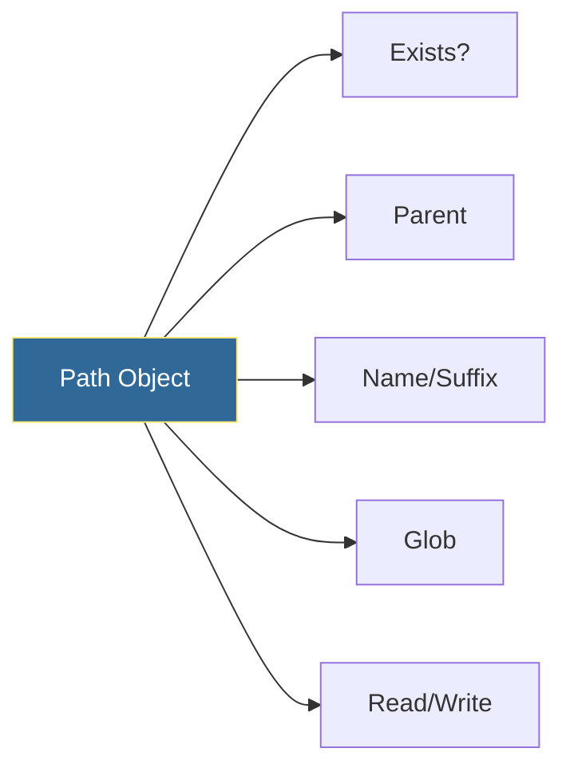

# Pathlib Basics
*Modern Cross-Platform Path Handling*

Pathlib provides an object-oriented approach to file system paths, making code more readable and cross-platform compatible than os.path.

---

## 🎯 Learning Objectives

- Use Path objects for file operations
- Navigate directories programmatically
- Write cross-platform automation scripts

---

## 📊 Path Operations



---

## 📚 Core Concepts

### 1. Creating Paths

```python
from pathlib import Path

# Current directory
current = Path.cwd()
home = Path.home()

# Build paths
config = Path("/etc") / "nginx" / "nginx.conf"
log_file = home / "logs" / "app.log"

# From string
path = Path("/var/log/syslog")
```

### 2. Path Properties

```python
path = Path("/var/log/nginx/access.log")

path.name        # "access.log"
path.stem        # "access"
path.suffix      # ".log"
path.parent      # Path("/var/log/nginx")
path.parts       # ("/", "var", "log", "nginx", "access.log")
path.exists()    # True/False
path.is_file()   # True/False
path.is_dir()    # True/False
```

### 3. File Operations

```python
from pathlib import Path

# Read file
content = Path("config.txt").read_text()

# Write file
Path("output.txt").write_text("Hello World")

# Create directories
Path("logs/app/debug").mkdir(parents=True, exist_ok=True)

# Find files
for py_file in Path(".").glob("**/*.py"):
    print(py_file)
```

---

## 🛠️ Hands-On Exercise

```python
from pathlib import Path

def cleanup_logs(log_dir, days_old=7):
    """Delete log files older than N days."""
    from datetime import datetime, timedelta
    
    cutoff = datetime.now() - timedelta(days=days_old)
    log_path = Path(log_dir)
    
    for log_file in log_path.glob("*.log"):
        if log_file.stat().st_mtime < cutoff.timestamp():
            log_file.unlink()
            print(f"Deleted: {log_file.name}")
```

---

## 🧠 Quiz

1. How do you join paths with Pathlib?
   - a) `path.join("sub")`
   - b) `path / "sub"` ✅
   - c) `path + "sub"`

2. What does `Path("file.txt").stem` return?
   - a) "file.txt"
   - b) "file" ✅
   - c) ".txt"

---

**Next Step**: [Datetime Operations →](../12-Datetime-Operations/README.md)
