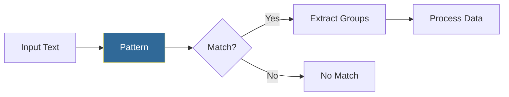

# Regular Expressions
*Pattern Matching for Log Parsing and Data Extraction*

Regular expressions are essential for parsing logs, validating input, and extracting data from text—core tasks in DevOps automation.

---

## 🎯 Learning Objectives

- Write regex patterns for common DevOps tasks
- Extract data from logs and configs
- Validate inputs like IP addresses and hostnames

---

## 📊 Regex Workflow



---

## 📚 Core Concepts

### 1. Basic Pattern Matching

```python
import re

log_line = "2026-01-11 10:30:45 ERROR Server connection failed"

# Search for pattern
if re.search(r"ERROR", log_line):
    print("Found error!")

# Match at beginning
if re.match(r"\d{4}-\d{2}-\d{2}", log_line):
    print("Starts with date")

# Find all occurrences
ips = re.findall(r"\d{1,3}\.\d{1,3}\.\d{1,3}\.\d{1,3}", text)
```

### 2. Capture Groups

```python
log_line = "2026-01-11 10:30:45 ERROR [web-01] Connection timeout"

pattern = r"(\d{4}-\d{2}-\d{2}) (\d{2}:\d{2}:\d{2}) (\w+) \[(\w+-\d+)\] (.+)"
match = re.match(pattern, log_line)

if match:
    date, time, level, server, message = match.groups()
    print(f"Server {server}: {level} - {message}")
```

### 3. Common DevOps Patterns

```python
# IP Address
IP_PATTERN = r"\b\d{1,3}\.\d{1,3}\.\d{1,3}\.\d{1,3}\b"

# Hostname
HOST_PATTERN = r"\b[a-zA-Z0-9][-a-zA-Z0-9]*\.[a-zA-Z]{2,}\b"

# Email
EMAIL_PATTERN = r"\b[\w.-]+@[\w.-]+\.\w+\b"

# Log timestamp
TIMESTAMP_PATTERN = r"\d{4}-\d{2}-\d{2}[T\s]\d{2}:\d{2}:\d{2}"
```

---

## 🛠️ Hands-On Exercise

```python
import re

def parse_nginx_log(log_line):
    """Parse NGINX access log line."""
    pattern = r'(\S+) - - \[(.+?)\] "(\w+) (\S+)" (\d+) (\d+)'
    match = re.match(pattern, log_line)
    
    if match:
        return {
            "ip": match.group(1),
            "timestamp": match.group(2),
            "method": match.group(3),
            "path": match.group(4),
            "status": int(match.group(5)),
            "size": int(match.group(6))
        }
    return None
```

---

## 🧠 Quiz

1. What does `re.findall()` return?
   - a) First match
   - b) List of all matches ✅
   - c) Boolean

2. What does `\d+` match?
   - a) Exactly one digit
   - b) One or more digits ✅
   - c) Optional digit

---

**Next Step**: [Logging Basics →](../14-Logging-Basics/README.md)
