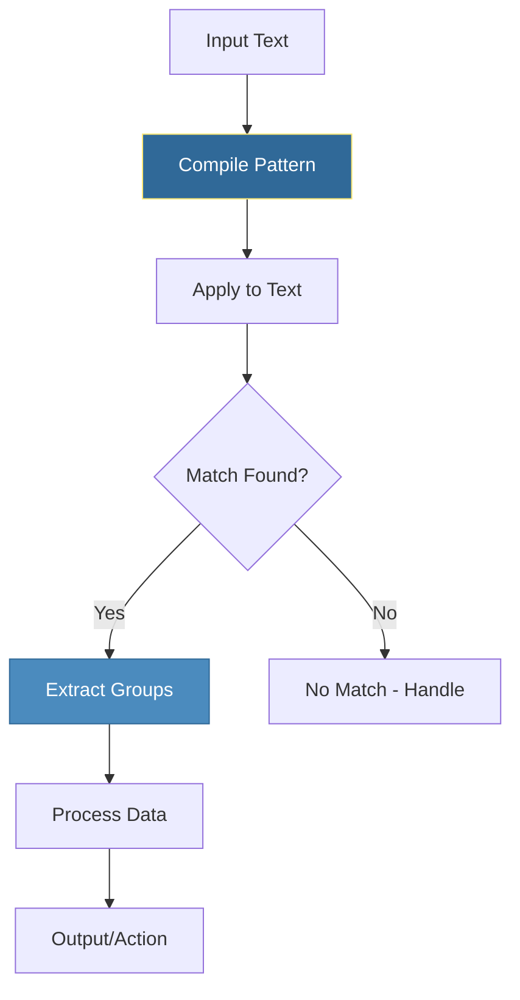

# Regular Expressions
*Pattern Matching for Log Parsing and Data Extraction*

Regular expressions (regex) are essential for parsing logs, validating input, and extracting data from text—core tasks in DevOps automation. Mastering regex transforms unstructured text into actionable data.

---

## 🎯 Learning Objectives

- Understand regex syntax and pattern construction
- Write regex patterns for common DevOps tasks
- Extract data from logs, configs, and command output
- Validate inputs like IP addresses, hostnames, and URLs
- Compile patterns for performance in production

---

## 📊 Regex Workflow



---

## 📊 Regex Components

```mermaid
flowchart LR
    subgraph "Regex Pattern Components"
        A[Literal Characters<br>abc, 123] --> B[Metacharacters<br>. * + ? ^  $]
        B --> C[Character Classes<br>\d \w \s]
        C --> D[Quantifiers<br>{n} {n,m} + *]
        D --> E[Groups<br>() (?:) (?P<name>)]
        E --> F[Anchors<br>^ $ \b]
    end
    
    style A fill:#306998,stroke:#ffe873,color:#fff
```

---

## 📚 Core Concepts

### 1. Basic Pattern Matching

```python
import re

log_line = "2026-01-11 10:30:45 ERROR Server connection failed"

# search() - Find pattern anywhere in string
if re.search(r"ERROR", log_line):
    print("Found error!")

# match() - Match at beginning of string
if re.match(r"\d{4}-\d{2}-\d{2}", log_line):
    print("Starts with date")

# fullmatch() - Match entire string (Python 3.4+)
if re.fullmatch(r"\d{4}-\d{2}-\d{2}", "2026-01-11"):
    print("Is a valid date format")

# findall() - Find all occurrences
text = "Connect from 10.0.0.1 and 192.168.1.100"
ips = re.findall(r"\d{1,3}\.\d{1,3}\.\d{1,3}\.\d{1,3}", text)
print(ips)  # ['10.0.0.1', '192.168.1.100']

# finditer() - Returns iterator of match objects
for match in re.finditer(r"\d+", "Server 1, Server 2, Server 3"):
    print(f"Found number: {match.group()} at position {match.start()}")
```

### 2. Pattern Syntax Reference

| Pattern | Meaning | Example |
|---------|---------|---------|
| `.` | Any character (except newline) | `a.c` → "abc", "a1c" |
| `*` | Zero or more | `lo*g` → "lg", "log", "looog" |
| `+` | One or more | `lo+g` → "log", "looog" |
| `?` | Zero or one | `colou?r` → "color", "colour" |
| `{n}` | Exactly n | `\d{4}` → "2026" |
| `{n,m}` | Between n and m | `\d{1,3}` → "1", "12", "123" |
| `^` | Start of string | `^Error` |
| `$` | End of string | `failed$` |
| `\b` | Word boundary | `\bweb\b` → "web" not "website" |
| `\d` | Digit [0-9] | `\d+` → "123" |
| `\w` | Word char [a-zA-Z0-9_] | `\w+` → "server_01" |
| `\s` | Whitespace | `\s+` → " ", "\t\n" |
| `\D`, `\W`, `\S` | Negations | `\D+` → non-digits |
| `[abc]` | Character set | `[aeiou]` → vowels |
| `[^abc]` | Negated set | `[^0-9]` → non-digits |
| `[a-z]` | Range | `[a-zA-Z]` → letters |
| `|` | Alternation (OR) | `ERROR|WARN` |

### 3. Capture Groups

```python
import re

log_line = "2026-01-11 10:30:45 ERROR [web-01] Connection timeout"

# Basic groups with ()
pattern = r"(\d{4}-\d{2}-\d{2}) (\d{2}:\d{2}:\d{2}) (\w+) \[(\w+-\d+)\] (.+)"
match = re.match(pattern, log_line)

if match:
    # Access by index
    date = match.group(1)      # "2026-01-11"
    time = match.group(2)      # "10:30:45"
    level = match.group(3)     # "ERROR"
    server = match.group(4)    # "web-01"
    message = match.group(5)   # "Connection timeout"
    
    # Unpack all groups
    date, time, level, server, message = match.groups()
    
    print(f"Server {server}: {level} - {message}")
```

### 4. Named Groups

```python
import re

log_line = "2026-01-11 10:30:45 ERROR [web-01] Connection timeout"

# Named groups with (?P<name>...)
pattern = r"(?P<date>\d{4}-\d{2}-\d{2}) (?P<time>\d{2}:\d{2}:\d{2}) (?P<level>\w+) \[(?P<server>\w+-\d+)\] (?P<message>.+)"

match = re.match(pattern, log_line)

if match:
    # Access by name (much clearer!)
    print(f"Date: {match.group('date')}")
    print(f"Server: {match.group('server')}")
    print(f"Level: {match.group('level')}")
    
    # Get as dictionary
    data = match.groupdict()
    print(data)
    # {'date': '2026-01-11', 'time': '10:30:45', 'level': 'ERROR', 
    #  'server': 'web-01', 'message': 'Connection timeout'}
```

### 5. Common DevOps Patterns

```python
import re

# ========== IP Address ==========
IP_PATTERN = r"\b(\d{1,3}\.){3}\d{1,3}\b"
# Better (validates octets 0-255):
IP_STRICT = r"\b(?:(?:25[0-5]|2[0-4]\d|1\d{2}|[1-9]?\d)\.){3}(?:25[0-5]|2[0-4]\d|1\d{2}|[1-9]?\d)\b"

# ========== Hostname ==========
HOSTNAME_PATTERN = r"\b[a-zA-Z0-9](?:[a-zA-Z0-9\-]{0,61}[a-zA-Z0-9])?(?:\.[a-zA-Z]{2,})+\b"

# ========== Email ==========
EMAIL_PATTERN = r"\b[A-Za-z0-9._%+-]+@[A-Za-z0-9.-]+\.[A-Z|a-z]{2,}\b"

# ========== URL ==========
URL_PATTERN = r"https?://[^\s]+"

# ========== Log Timestamp Formats ==========
ISO_TIMESTAMP = r"\d{4}-\d{2}-\d{2}T\d{2}:\d{2}:\d{2}(?:\.\d+)?(?:Z|[+-]\d{2}:?\d{2})?"
SYSLOG_TIMESTAMP = r"\w{3}\s+\d{1,2}\s+\d{2}:\d{2}:\d{2}"
APACHE_TIMESTAMP = r"\d{2}/\w{3}/\d{4}:\d{2}:\d{2}:\d{2}\s+[+-]\d{4}"

# ========== Docker/Container ==========
CONTAINER_ID = r"\b[a-f0-9]{12,64}\b"
IMAGE_TAG = r"[\w\-./]+:[\w\-.]+"

# ========== Kubernetes ==========
K8S_POD_NAME = r"[a-z0-9]+(?:-[a-z0-9]+)*-[a-z0-9]{5,10}"
K8S_NAMESPACE = r"[a-z0-9]+(?:-[a-z0-9]+)*"

# ========== AWS ==========
ARN_PATTERN = r"arn:aws:[a-z0-9-]+:[a-z0-9-]*:\d*:[\w\-\/]+"
INSTANCE_ID = r"i-[a-f0-9]{8,17}"
```

### 6. Substitution with re.sub()

```python
import re

# Simple replacement
text = "Contact admin@old-domain.com for support"
new_text = re.sub(r"old-domain\.com", "new-domain.com", text)

# Remove sensitive data
log = "User password=secret123 logged in"
sanitized = re.sub(r"password=\S+", "password=***", log)
print(sanitized)  # "User password=*** logged in"

# Use capture groups in replacement
hosts = "server1.example.com, server2.example.com"
updated = re.sub(r"example\.com", "newdomain.io", hosts)

# Use function for dynamic replacement
def mask_ip(match):
    ip = match.group()
    parts = ip.split('.')
    return f"{parts[0]}.{parts[1]}.xxx.xxx"

log = "Connection from 192.168.1.100 accepted"
masked = re.sub(r"\d{1,3}\.\d{1,3}\.\d{1,3}\.\d{1,3}", mask_ip, log)
print(masked)  # "Connection from 192.168.xxx.xxx accepted"
```

### 7. Compiling Patterns for Performance

```python
import re

# Compile for repeated use (more efficient)
log_pattern = re.compile(
    r"(?P<timestamp>\d{4}-\d{2}-\d{2} \d{2}:\d{2}:\d{2}) "
    r"(?P<level>\w+) "
    r"\[(?P<source>\w+)\] "
    r"(?P<message>.*)",
    re.IGNORECASE
)

# Use compiled pattern
for line in log_lines:
    match = log_pattern.match(line)
    if match:
        process(match.groupdict())
```

### 8. Flags

| Flag | Meaning |
|------|---------|
| `re.IGNORECASE` or `re.I` | Case-insensitive matching |
| `re.MULTILINE` or `re.M` | ^ and $ match line boundaries |
| `re.DOTALL` or `re.S` | . matches newlines too |
| `re.VERBOSE` or `re.X` | Allow comments in pattern |

```python
import re

# Verbose pattern with comments
log_pattern = re.compile(r"""
    (?P<date>\d{4}-\d{2}-\d{2})     # Date YYYY-MM-DD
    \s+                              # Whitespace
    (?P<time>\d{2}:\d{2}:\d{2})     # Time HH:MM:SS
    \s+                              # Whitespace
    (?P<level>\w+)                   # Log level
    \s+                              # Whitespace
    (?P<message>.*)                  # Rest of message
""", re.VERBOSE)
```

---

## 🛠️ Hands-On Exercises

### Exercise 1: Parse NGINX Access Log

```python
import re

def parse_nginx_log(log_line):
    """Parse NGINX access log line.
    
    Format: 10.0.0.1 - - [12/Jan/2026:10:30:45 +0000] "GET /api/health HTTP/1.1" 200 1234
    
    TODO: Extract: ip, timestamp, method, path, status, size
    """
    pass

# Test
log = '10.0.0.1 - - [12/Jan/2026:10:30:45 +0000] "GET /api/health HTTP/1.1" 200 1234'
result = parse_nginx_log(log)
```

<details>
<summary>💡 Solution</summary>

```python
import re

def parse_nginx_log(log_line):
    """Parse NGINX access log line."""
    
    pattern = r'''
        (?P<ip>\d{1,3}\.\d{1,3}\.\d{1,3}\.\d{1,3})\s+  # IP address
        -\s+-\s+                                        # Remote user/log name
        \[(?P<timestamp>[^\]]+)\]\s+                    # Timestamp in brackets
        "(?P<method>\w+)\s+                             # HTTP method
        (?P<path>\S+)\s+                                # Request path
        HTTP/[\d.]+"\s+                                 # HTTP version
        (?P<status>\d+)\s+                              # Status code
        (?P<size>\d+)                                   # Response size
    '''
    
    match = re.match(pattern, log_line, re.VERBOSE)
    
    if match:
        return {
            "ip": match.group("ip"),
            "timestamp": match.group("timestamp"),
            "method": match.group("method"),
            "path": match.group("path"),
            "status": int(match.group("status")),
            "size": int(match.group("size"))
        }
    return None

# Test
log = '10.0.0.1 - - [12/Jan/2026:10:30:45 +0000] "GET /api/health HTTP/1.1" 200 1234'
result = parse_nginx_log(log)
print(result)
# {'ip': '10.0.0.1', 'timestamp': '12/Jan/2026:10:30:45 +0000', 
#  'method': 'GET', 'path': '/api/health', 'status': 200, 'size': 1234}
```
</details>

### Exercise 2: Validate Input Data

```python
import re

def validate_infrastructure_input(input_type, value):
    """Validate various infrastructure inputs.
    
    TODO: Support validation for:
    - ip_address: Valid IPv4
    - hostname: Valid FQDN
    - email: Valid email
    - port: Valid port number (1-65535)
    - instance_id: AWS instance ID (i-xxxx)
    """
    pass
```

<details>
<summary>💡 Solution</summary>

```python
import re

def validate_infrastructure_input(input_type, value):
    """Validate various infrastructure inputs."""
    
    validators = {
        "ip_address": r"^(?:(?:25[0-5]|2[0-4]\d|1\d{2}|[1-9]?\d)\.){3}(?:25[0-5]|2[0-4]\d|1\d{2}|[1-9]?\d)$",
        "hostname": r"^(?!-)[a-zA-Z0-9-]{1,63}(?<!-)(?:\.[a-zA-Z]{2,})+$",
        "email": r"^[A-Za-z0-9._%+-]+@[A-Za-z0-9.-]+\.[A-Z|a-z]{2,}$",
        "instance_id": r"^i-[a-f0-9]{8,17}$",
        "container_id": r"^[a-f0-9]{12,64}$",
        "port": r"^\d+$",
    }
    
    if input_type not in validators:
        return {"valid": False, "error": f"Unknown type: {input_type}"}
    
    pattern = validators[input_type]
    
    # Special handling for port
    if input_type == "port":
        if re.match(pattern, value):
            port_num = int(value)
            if 1 <= port_num <= 65535:
                return {"valid": True, "value": port_num}
            return {"valid": False, "error": "Port must be 1-65535"}
    
    if re.match(pattern, value):
        return {"valid": True, "value": value}
    
    return {"valid": False, "error": f"Invalid {input_type} format"}

# Tests
print(validate_infrastructure_input("ip_address", "192.168.1.1"))    # Valid
print(validate_infrastructure_input("ip_address", "999.999.999.999")) # Invalid
print(validate_infrastructure_input("hostname", "api.example.com"))  # Valid
print(validate_infrastructure_input("port", "8080"))                 # Valid
print(validate_infrastructure_input("instance_id", "i-0123456789abcdef0")) # Valid
```
</details>

### Exercise 3: Log Error Aggregator

```python
import re
from collections import Counter

def aggregate_log_errors(log_lines):
    """Aggregate and categorize errors from logs.
    
    TODO: 
    1. Extract all ERROR and WARN lines
    2. Group by error type/message
    3. Count occurrences
    4. Extract associated IP addresses
    """
    pass
```

<details>
<summary>💡 Solution</summary>

```python
import re
from collections import Counter, defaultdict

def aggregate_log_errors(log_lines):
    """Aggregate and categorize errors from logs."""
    
    # Pattern for log lines
    log_pattern = re.compile(
        r"(?P<timestamp>\d{4}-\d{2}-\d{2} \d{2}:\d{2}:\d{2})\s+"
        r"(?P<level>ERROR|WARN|WARNING)\s+"
        r"(?:\[(?P<source>\S+)\]\s+)?"
        r"(?P<message>.*)",
        re.IGNORECASE
    )
    
    ip_pattern = re.compile(r"\b\d{1,3}\.\d{1,3}\.\d{1,3}\.\d{1,3}\b")
    
    results = {
        "errors": [],
        "warnings": [],
        "by_message": Counter(),
        "by_source": Counter(),
        "ips_involved": defaultdict(set)
    }
    
    for line in log_lines:
        match = log_pattern.match(line.strip())
        if not match:
            continue
        
        data = match.groupdict()
        level = data["level"].upper()
        message = data["message"]
        source = data.get("source", "unknown")
        
        # Categorize by level
        if level == "ERROR":
            results["errors"].append(data)
        else:
            results["warnings"].append(data)
        
        # Normalize message for counting (remove specifics)
        normalized_msg = re.sub(r"\d+", "N", message)[:50]
        results["by_message"][normalized_msg] += 1
        
        # Count by source
        results["by_source"][source] += 1
        
        # Extract IPs
        ips = ip_pattern.findall(line)
        for ip in ips:
            results["ips_involved"][ip].add(normalized_msg)
    
    # Convert sets to lists for JSON serialization
    results["ips_involved"] = {
        ip: list(msgs) for ip, msgs in results["ips_involved"].items()
    }
    
    return results

# Test
logs = [
    "2026-01-12 10:30:00 ERROR [web-01] Connection from 10.0.0.1 failed",
    "2026-01-12 10:30:01 ERROR [web-01] Connection from 10.0.0.2 failed",
    "2026-01-12 10:30:02 WARN [db-01] High memory usage: 85%",
    "2026-01-12 10:30:03 ERROR [api-01] Timeout after 30 seconds",
    "2026-01-12 10:30:04 ERROR [api-01] Timeout after 30 seconds",
]

result = aggregate_log_errors(logs)
print(f"Total errors: {len(result['errors'])}")
print(f"Total warnings: {len(result['warnings'])}")
print(f"Top error messages: {result['by_message'].most_common(3)}")
print(f"Errors by source: {dict(result['by_source'])}")
```
</details>

### Exercise 4: Configuration Extractor

```python
import re

def extract_config_values(config_text, format_type="env"):
    """Extract configuration values from various formats.
    
    TODO: Support:
    - env: KEY=value format
    - ini: [section] and key=value
    - nginx: directive value; format
    """
    pass
```

<details>
<summary>💡 Solution</summary>

```python
import re
from collections import defaultdict

def extract_config_values(config_text, format_type="env"):
    """Extract configuration values from various formats."""
    
    if format_type == "env":
        # KEY=value or export KEY=value
        pattern = r"^(?:export\s+)?([A-Z_][A-Z0-9_]*)\s*=\s*['\"]?([^'\"#\n]*)['\"]?"
        matches = re.findall(pattern, config_text, re.MULTILINE)
        return dict(matches)
    
    elif format_type == "ini":
        config = defaultdict(dict)
        current_section = "DEFAULT"
        
        section_pattern = r"^\[([^\]]+)\]"
        key_value_pattern = r"^([a-zA-Z_][a-zA-Z0-9_]*)\s*=\s*(.+)"
        
        for line in config_text.split('\n'):
            line = line.strip()
            if not line or line.startswith('#') or line.startswith(';'):
                continue
            
            section_match = re.match(section_pattern, line)
            if section_match:
                current_section = section_match.group(1)
                continue
            
            kv_match = re.match(key_value_pattern, line)
            if kv_match:
                config[current_section][kv_match.group(1)] = kv_match.group(2)
        
        return dict(config)
    
    elif format_type == "nginx":
        config = {}
        # Simple nginx directive: directive value;
        pattern = r"^\s*([a-z_]+)\s+([^;]+);"
        
        for match in re.finditer(pattern, config_text, re.MULTILINE):
            directive = match.group(1)
            value = match.group(2).strip()
            
            if directive in config:
                if isinstance(config[directive], list):
                    config[directive].append(value)
                else:
                    config[directive] = [config[directive], value]
            else:
                config[directive] = value
        
        return config
    
    else:
        raise ValueError(f"Unknown format: {format_type}")

# Test ENV
env_config = """
# Database settings
DB_HOST=localhost
export DB_PORT=5432
DB_NAME="myapp"
"""
print(extract_config_values(env_config, "env"))

# Test INI
ini_config = """
[database]
host = localhost
port = 5432

[logging]
level = INFO
file = /var/log/app.log
"""
print(extract_config_values(ini_config, "ini"))

# Test NGINX
nginx_config = """
server_name example.com;
listen 80;
listen 443 ssl;
root /var/www/html;
"""
print(extract_config_values(nginx_config, "nginx"))
```
</details>

---

## 📖 Real-World Story: The Log Parser

**Scenario**: A team spent hours manually searching through gigabytes of logs to find patterns during incidents.

**Problem**: No automated log analysis. Each incident meant:
- SSH into 10+ servers
- Manually grep through logs
- Copy-paste relevant entries
- Manually correlate data

**Solution**: Built a Python log analyzer with regex:

```python
import re
from collections import Counter

def analyze_incident_logs(log_file, time_window):
    """Analyze logs for incident patterns."""
    
    patterns = {
        "error": re.compile(r"(\d{4}-\d{2}-\d{2} \d{2}:\d{2}:\d{2}).*ERROR.*?(\d{1,3}\.\d{1,3}\.\d{1,3}\.\d{1,3})"),
        "timeout": re.compile(r"timeout|timed out|connection refused", re.I),
        "memory": re.compile(r"out of memory|oom|memory allocation", re.I)
    }
    
    findings = {"errors": [], "timeouts": 0, "memory_issues": 0, "ips": Counter()}
    
    with open(log_file) as f:
        for line in f:
            for name, pattern in patterns.items():
                if match := pattern.search(line):
                    # Process findings...
                    pass
    
    return findings
```

**Outcome**: Incident investigation time reduced from 2 hours to 15 minutes.

---

## ❓ Interview Questions

1. **What's the difference between `re.match()` and `re.search()`?**
   > `match()` only checks at the beginning of the string, while `search()` scans through the entire string for a match. Use `match()` for structured data like log lines, `search()` for finding patterns anywhere.

2. **How do you compile patterns for better performance?**
   > Use `pattern = re.compile(r"...")` once, then reuse with `pattern.match(text)`. Compiled patterns are cached internally by Python, but explicit compilation makes intent clear and is slightly faster for repeated use.

3. **Explain greedy vs. non-greedy quantifiers.**
   > Greedy (`*`, `+`) matches as much as possible. Non-greedy (`*?`, `+?`) matches as little as possible. Example: for `<div>text</div>`, `<.*>` matches the whole thing (greedy), while `<.*?>` matches just `<div>` (non-greedy).

4. **What are named groups and why use them?**
   > Named groups `(?P<name>...)` allow accessing matches by name instead of index. Makes code more readable and maintainable: `match.group('ip')` is clearer than `match.group(1)`.

5. **How do you handle multi-line text?**
   > Use re.MULTILINE (makes ^ and $ match line boundaries) and re.DOTALL (makes . match newlines). Example: `re.findall(r'^ERROR.*$', text, re.MULTILINE)`.

6. **What's the raw string prefix `r` for?**
   > Raw strings `r"..."` treat backslashes literally. Without it, `"\d"` is interpreted as escape sequence (invalid). `r"\d"` is the regex digit pattern. Always use raw strings for regex.

---

## 🧠 Quiz

1. What does `re.findall()` return?
   - a) First match
   - b) List of all matches ✅
   - c) Boolean
   - d) Iterator

2. What does `\d+` match?
   - a) Exactly one digit
   - b) One or more digits ✅
   - c) Optional digit
   - d) Zero or more digits

3. What does `\b` match?
   - a) Quote boundary
   - b) Word boundary ✅
   - c) Buffer boundary
   - d) Block boundary

4. How do you make a pattern case-insensitive?
   - a) `re.CASE`
   - b) `re.IGNORECASE` ✅
   - c) `re.NOCASE`
   - d) `re.LOWER`

5. What does `(?P<name>...)` create?
   - a) A comment
   - b) A non-capturing group
   - c) A named group ✅
   - d) A lookahead

6. What does `.*?` represent?
   - a) Greedy match
   - b) Non-greedy match ✅
   - c) Optional match
   - d) Invalid pattern

7. Which method returns a match object?
   - a) `re.findall()`
   - b) `re.match()` ✅
   - c) `re.split()`
   - d) `re.sub()`

8. What flag allows comments in patterns?
   - a) `re.COMMENTS`
   - b) `re.VERBOSE` ✅
   - c) `re.READABLE`
   - d) `re.DEBUG`

---

## 🔗 Related Topics

| Module | Relationship |
|--------|-------------|
| [Logging Basics](../14-Logging-Basics/README.md) | Parse log formats |
| [File Operations](../04-File-Operations/README.md) | Read/process log files |
| [Working with JSON](../06-Working-with-JSON/README.md) | Extract data from structured text |

---

**Next Step**: [Logging Basics →](../14-Logging-Basics/README.md)
