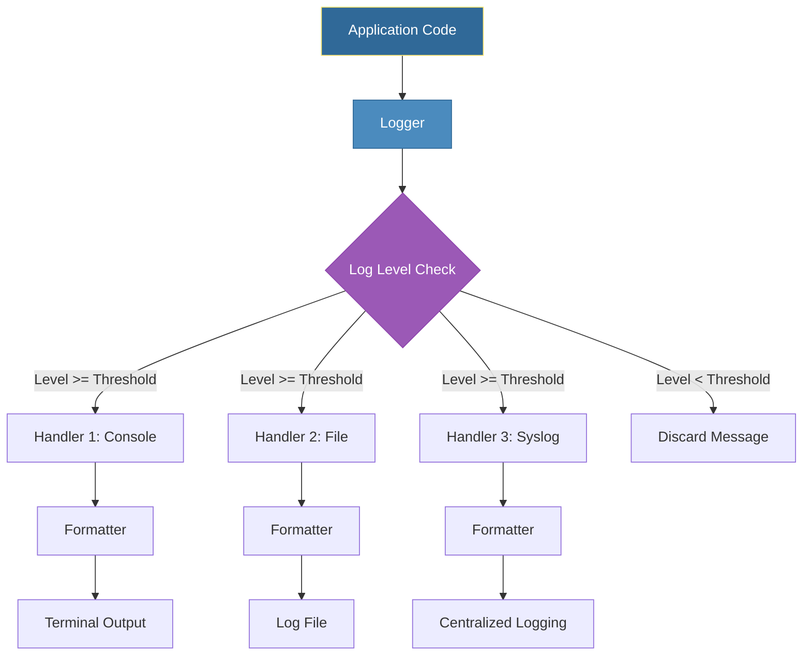
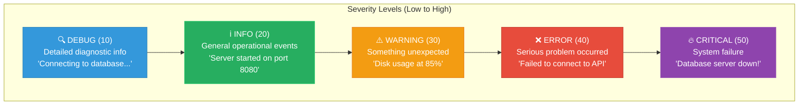
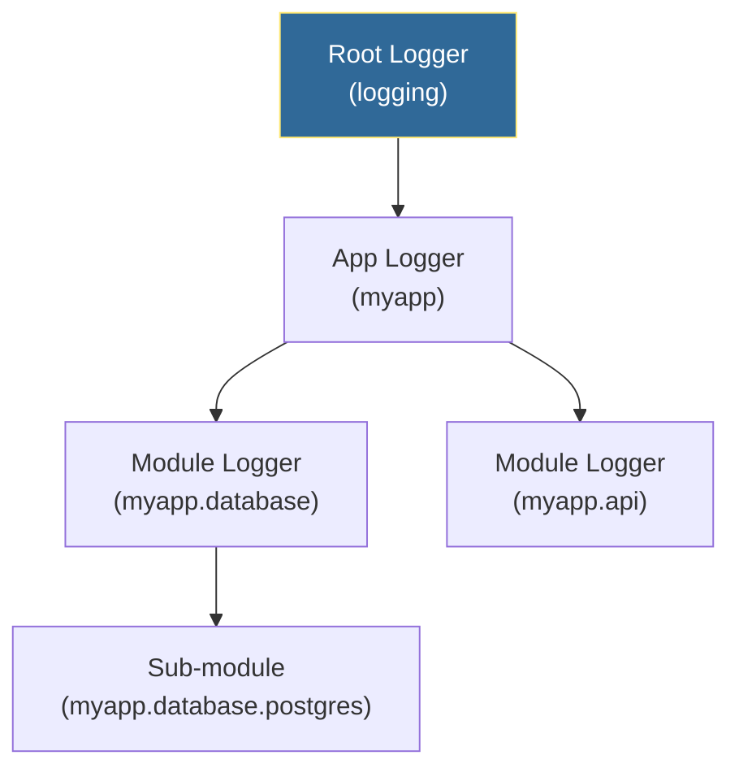

# Logging Basics
*Professional Logging for Production Scripts*

Proper logging separates amateur scripts from production-ready automation. The logging module provides flexible, configurable output for debugging, monitoring, and incident response. In DevOps, good logs are the difference between quick troubleshooting and hours of blind investigation.

---

## 🎯 Learning Objectives

- Configure logging with handlers and formatters
- Use appropriate log levels for different scenarios
- Implement structured logging for searchability
- Set up file rotation and multiple output destinations
- Apply logging best practices in automation scripts

---

## 📊 Logging Architecture



---

## 📈 Logging Levels Hierarchy



| Level | Value | When to Use | DevOps Example |
|-------|-------|-------------|----------------|
| **DEBUG** | 10 | Detailed diagnostic info | Variable values, loop iterations |
| **INFO** | 20 | General operational events | Server started, deployment complete |
| **WARNING** | 30 | Something unexpected but handled | Retry needed, deprecated feature used |
| **ERROR** | 40 | Serious problem occurred | API call failed, file not found |
| **CRITICAL** | 50 | System failure, needs immediate attention | Database down, out of memory |

---

## 📚 Core Concepts

### 1. Basic Logging Setup

```python
import logging

# Simple configuration - good for scripts
logging.basicConfig(
    level=logging.INFO,
    format="%(asctime)s - %(name)s - %(levelname)s - %(message)s",
    datefmt="%Y-%m-%d %H:%M:%S"
)

# Create a logger for your module
logger = logging.getLogger(__name__)

# Log at different levels
logger.debug("Detailed debugging info - variable x = 42")
logger.info("Starting server health check...")
logger.warning("Disk usage is at 85%, consider cleanup")
logger.error("Failed to connect to database: connection timeout")
logger.critical("System out of memory! Shutting down!")
```

### 2. Logger Hierarchy



```python
import logging

# Logger hierarchy - child inherits from parent
root_logger = logging.getLogger()           # Root logger
app_logger = logging.getLogger("myapp")     # App-level
db_logger = logging.getLogger("myapp.db")   # Module-level

# Setting level on parent affects children
app_logger.setLevel(logging.DEBUG)  # myapp.db also shows DEBUG
```

### 3. Multiple Handlers - Console and File

```python
import logging

def setup_logging(log_file="app.log", console_level=logging.INFO, 
                  file_level=logging.DEBUG):
    """Professional logging setup with multiple handlers."""
    
    # Create logger
    logger = logging.getLogger("automation")
    logger.setLevel(logging.DEBUG)  # Capture all, filter at handler level
    
    # Prevent duplicate handlers on re-run
    logger.handlers.clear()
    
    # Console handler - INFO and above
    console_handler = logging.StreamHandler()
    console_handler.setLevel(console_level)
    console_format = logging.Formatter(
        "%(levelname)-8s | %(message)s"
    )
    console_handler.setFormatter(console_format)
    
    # File handler - DEBUG and above (more detail)
    file_handler = logging.FileHandler(log_file)
    file_handler.setLevel(file_level)
    file_format = logging.Formatter(
        "%(asctime)s | %(name)s | %(levelname)-8s | %(filename)s:%(lineno)d | %(message)s"
    )
    file_handler.setFormatter(file_format)
    
    # Add handlers
    logger.addHandler(console_handler)
    logger.addHandler(file_handler)
    
    return logger

# Usage
logger = setup_logging()
logger.info("Starting deployment...")  # Shows in console AND file
logger.debug("Config loaded: {...}")   # Only in file (DEBUG < INFO)
```

### 4. Rotating Log Files

```python
import logging
from logging.handlers import RotatingFileHandler, TimedRotatingFileHandler

# Size-based rotation - rotate when file reaches 5MB, keep 3 backups
size_handler = RotatingFileHandler(
    "app.log",
    maxBytes=5*1024*1024,  # 5 MB
    backupCount=3          # Keep app.log.1, app.log.2, app.log.3
)

# Time-based rotation - new file every day at midnight
time_handler = TimedRotatingFileHandler(
    "app.log",
    when="midnight",       # Rotate at midnight
    interval=1,            # Every 1 day
    backupCount=7          # Keep 7 days of logs
)

# When options: 'S' (second), 'M' (minute), 'H' (hour), 
#               'D' (day), 'midnight', 'W0'-'W6' (weekday)
```

### 5. Structured Logging with JSON

```python
import logging
import json
from datetime import datetime

class JSONFormatter(logging.Formatter):
    """Output logs as JSON for log aggregation systems."""
    
    def format(self, record):
        log_data = {
            "timestamp": datetime.utcnow().isoformat(),
            "level": record.levelname,
            "logger": record.name,
            "message": record.getMessage(),
            "module": record.module,
            "function": record.funcName,
            "line": record.lineno
        }
        
        # Include exception info if present
        if record.exc_info:
            log_data["exception"] = self.formatException(record.exc_info)
        
        # Include extra fields
        if hasattr(record, "extra_data"):
            log_data["extra"] = record.extra_data
            
        return json.dumps(log_data)

# Usage
handler = logging.StreamHandler()
handler.setFormatter(JSONFormatter())
logger = logging.getLogger("structured")
logger.addHandler(handler)
logger.setLevel(logging.DEBUG)

logger.info("Deployment started", extra={"extra_data": {"env": "prod", "version": "1.2.3"}})
```

### 6. Contextual Logging with Extra Data

```python
import logging

logger = logging.getLogger("deploy")
logger.setLevel(logging.INFO)

# Create a custom formatter that includes extra fields
class ContextFormatter(logging.Formatter):
    def format(self, record):
        # Add default values for optional fields
        record.server = getattr(record, 'server', 'unknown')
        record.job_id = getattr(record, 'job_id', 'N/A')
        return super().format(record)

handler = logging.StreamHandler()
handler.setFormatter(ContextFormatter(
    "%(asctime)s | [%(job_id)s] %(server)s | %(levelname)s | %(message)s"
))
logger.addHandler(handler)

# Log with context
logger.info("Starting deployment", extra={"server": "web-01", "job_id": "deploy-123"})
logger.info("Checking health", extra={"server": "web-01", "job_id": "deploy-123"})
logger.error("Health check failed", extra={"server": "web-01", "job_id": "deploy-123"})
```

---

## 📋 Format String Reference

| Directive | Description | Example |
|-----------|-------------|---------|
| `%(asctime)s` | Human-readable timestamp | 2026-01-12 17:30:00 |
| `%(name)s` | Logger name | myapp.database |
| `%(levelname)s` | Log level | INFO, ERROR |
| `%(message)s` | The log message | Server started |
| `%(filename)s` | Source file name | deploy.py |
| `%(lineno)d` | Line number | 42 |
| `%(funcName)s` | Function name | check_health |
| `%(process)d` | Process ID | 12345 |
| `%(thread)d` | Thread ID | 67890 |

---

## 🛠️ Hands-On Exercises

### Exercise 1: Basic Logger Setup

```python
# TODO: Create a logger that:
# 1. Logs to both console and file
# 2. Console shows INFO and above
# 3. File captures DEBUG and above
# 4. Uses a professional format

def setup_deployment_logger():
    pass

logger = setup_deployment_logger()
logger.debug("Loading configuration...")
logger.info("Deployment started")
logger.warning("Deprecated API version detected")
logger.error("Failed to connect to server")
```

<details>
<summary>💡 Solution</summary>

```python
import logging

def setup_deployment_logger():
    """Create a production-ready deployment logger."""
    logger = logging.getLogger("deployment")
    logger.setLevel(logging.DEBUG)
    logger.handlers.clear()
    
    # Console handler - INFO+
    console = logging.StreamHandler()
    console.setLevel(logging.INFO)
    console.setFormatter(logging.Formatter(
        "%(asctime)s | %(levelname)-8s | %(message)s",
        datefmt="%H:%M:%S"
    ))
    
    # File handler - DEBUG+
    file_handler = logging.FileHandler("deployment.log")
    file_handler.setLevel(logging.DEBUG)
    file_handler.setFormatter(logging.Formatter(
        "%(asctime)s | %(name)s | %(levelname)-8s | %(filename)s:%(lineno)d | %(message)s"
    ))
    
    logger.addHandler(console)
    logger.addHandler(file_handler)
    
    return logger

logger = setup_deployment_logger()
logger.debug("Loading configuration...")  # Only in file
logger.info("Deployment started")          # Both
logger.warning("Deprecated API detected")  # Both
logger.error("Failed to connect")          # Both
```
</details>

### Exercise 2: Rotating Log Handler

```python
# TODO: Create a logger with rotating file handler that:
# 1. Rotates when file reaches 1MB
# 2. Keeps 5 backup files
# 3. Also logs to console

def setup_rotating_logger():
    pass
```

<details>
<summary>💡 Solution</summary>

```python
import logging
from logging.handlers import RotatingFileHandler

def setup_rotating_logger():
    """Create a logger with size-based log rotation."""
    logger = logging.getLogger("rotating")
    logger.setLevel(logging.DEBUG)
    logger.handlers.clear()
    
    # Rotating file handler
    file_handler = RotatingFileHandler(
        "app.log",
        maxBytes=1*1024*1024,  # 1 MB
        backupCount=5
    )
    file_handler.setFormatter(logging.Formatter(
        "%(asctime)s | %(levelname)s | %(message)s"
    ))
    
    # Console
    console = logging.StreamHandler()
    console.setFormatter(logging.Formatter("%(levelname)s: %(message)s"))
    
    logger.addHandler(file_handler)
    logger.addHandler(console)
    
    return logger

logger = setup_rotating_logger()

# Simulate many log entries
for i in range(1000):
    logger.info(f"Processing record {i}: " + "x" * 1000)
```
</details>

### Exercise 3: Function Execution Logger (Decorator)

```python
# TODO: Create a decorator that logs function entry, exit, and exceptions

def log_execution(func):
    """Decorator that logs function calls."""
    pass

@log_execution
def deploy_server(server_name, environment):
    if environment == "prod":
        raise ValueError("Production requires approval!")
    return f"Deployed to {server_name}"
```

<details>
<summary>💡 Solution</summary>

```python
import logging
import functools
import time

logging.basicConfig(level=logging.DEBUG)
logger = logging.getLogger("execution")

def log_execution(func):
    """Decorator that logs function calls, timing, and exceptions."""
    @functools.wraps(func)
    def wrapper(*args, **kwargs):
        func_name = func.__name__
        logger.info(f"➡️  ENTER: {func_name}(args={args}, kwargs={kwargs})")
        start_time = time.time()
        
        try:
            result = func(*args, **kwargs)
            duration = time.time() - start_time
            logger.info(f"✅ EXIT: {func_name} - returned in {duration:.3f}s")
            return result
        
        except Exception as e:
            duration = time.time() - start_time
            logger.error(f"❌ EXCEPTION in {func_name}: {type(e).__name__}: {e}")
            logger.debug(f"   Duration before error: {duration:.3f}s")
            raise
    
    return wrapper

@log_execution
def deploy_server(server_name, environment):
    if environment == "prod":
        raise ValueError("Production requires approval!")
    return f"Deployed to {server_name}"

# Test
deploy_server("web-01", "staging")  # Success
deploy_server("web-02", "prod")     # Exception logged
```
</details>

### Exercise 4: Multi-Server Log Aggregator

```python
# TODO: Create a logging system that:
# 1. Logs each server to its own file
# 2. Aggregates all logs to a central file
# 3. Shows summary on console

class ServerLogger:
    pass
```

<details>
<summary>💡 Solution</summary>

```python
import logging
from pathlib import Path

class ServerLogger:
    """Manages logging for multiple servers with aggregation."""
    
    def __init__(self, log_dir="logs"):
        self.log_dir = Path(log_dir)
        self.log_dir.mkdir(exist_ok=True)
        self.loggers = {}
        
        # Setup central aggregator
        self.central_logger = logging.getLogger("central")
        self.central_logger.setLevel(logging.INFO)
        self.central_logger.handlers.clear()
        
        central_file = logging.FileHandler(self.log_dir / "all_servers.log")
        central_file.setFormatter(logging.Formatter(
            "%(asctime)s | %(server)s | %(levelname)s | %(message)s"
        ))
        self.central_logger.addHandler(central_file)
        
        # Console summary
        console = logging.StreamHandler()
        console.setLevel(logging.WARNING)  # Only warnings+ to console
        console.setFormatter(logging.Formatter("⚠️ %(server)s: %(message)s"))
        self.central_logger.addHandler(console)
    
    def get_logger(self, server_name):
        """Get or create a logger for a specific server."""
        if server_name in self.loggers:
            return self.loggers[server_name]
        
        logger = logging.getLogger(f"server.{server_name}")
        logger.setLevel(logging.DEBUG)
        logger.handlers.clear()
        
        # Server-specific file
        handler = logging.FileHandler(self.log_dir / f"{server_name}.log")
        handler.setFormatter(logging.Formatter(
            "%(asctime)s | %(levelname)s | %(message)s"
        ))
        logger.addHandler(handler)
        
        self.loggers[server_name] = logger
        return logger
    
    def log(self, server_name, level, message):
        """Log to both server file and central aggregator."""
        server_logger = self.get_logger(server_name)
        getattr(server_logger, level.lower())(message)
        
        # Also log to central
        self.central_logger.log(
            getattr(logging, level.upper()),
            message,
            extra={"server": server_name}
        )

# Usage
log_manager = ServerLogger()
log_manager.log("web-01", "info", "Health check passed")
log_manager.log("web-02", "warning", "High memory usage: 85%")
log_manager.log("db-01", "error", "Connection pool exhausted")
```
</details>

---

## 📖 Real-World Story: The Silent Failure

**Scenario**: A nightly backup script ran for 3 months without issues. One day, backups stopped working—but nobody noticed for 2 weeks.

**Problem**: The script used `print()` statements that nobody monitored. When an error occurred, it printed to stdout which vanished when the cron job ran.

**Solution**: Implemented proper logging:

```python
import logging
from logging.handlers import SMTPHandler, RotatingFileHandler

# Setup logging
logger = logging.getLogger("backup")
logger.setLevel(logging.INFO)

# File handler with rotation
file_handler = RotatingFileHandler(
    "/var/log/backup.log",
    maxBytes=10*1024*1024,
    backupCount=10
)
file_handler.setFormatter(logging.Formatter(
    "%(asctime)s | %(levelname)s | %(message)s"
))

# Email handler for critical errors
mail_handler = SMTPHandler(
    mailhost="smtp.company.com",
    fromaddr="backup@company.com",
    toaddrs=["oncall@company.com"],
    subject="🚨 Backup Script CRITICAL Error"
)
mail_handler.setLevel(logging.CRITICAL)

logger.addHandler(file_handler)
logger.addHandler(mail_handler)

# Now errors are visible AND actionable
try:
    run_backup()
    logger.info("Backup completed successfully")
except Exception as e:
    logger.critical(f"Backup FAILED: {e}")
    raise
```

**Outcome**: The next failure triggered an immediate email alert, and the issue was fixed within 30 minutes instead of 2 weeks.

---

## ❓ Interview Questions

1. **Why is logging better than print() statements?**
   > Logging provides: configurable output levels, multiple destinations (file, console, network), timestamps, structured metadata, and can be enabled/disabled without code changes. Print statements can't be easily filtered or redirected in production.

2. **Explain the logging hierarchy and how it works.**
   > Loggers form a tree based on dot-separated names (e.g., "app.db.postgres"). Child loggers inherit settings from parents. This allows setting DEBUG on "app" to debug everything, or just on "app.db" to debug database code only.

3. **When would you use WARNING vs ERROR level?**
   > WARNING: Something unexpected happened but the operation can continue (disk at 85%, retry succeeded, deprecated feature used). ERROR: Operation failed and couldn't be completed (API call failed, file not found, database connection lost).

4. **How do you prevent log files from consuming all disk space?**
   > Use `RotatingFileHandler` (size-based rotation) or `TimedRotatingFileHandler` (time-based). Set `backupCount` to limit retained files. Consider log shipping to centralized storage.

5. **What is structured logging and when should you use it?**
   > Structured logging outputs logs in a parsed format like JSON. Use it when: logs are shipped to aggregation systems (ELK, Splunk), you need to search/filter by specific fields, or building dashboards. Human-readable format is better for local debugging.

6. **How do you add context (like request ID or user ID) to all log messages in a request?**
   > Use `logging.LoggerAdapter` or Python's `contextvars` module. Create a filter or formatter that automatically includes context fields. This is essential for tracing requests across microservices.

---

## 🧠 Quiz

1. Which log level is highest severity?
   - a) ERROR
   - b) CRITICAL ✅
   - c) WARNING
   - d) FATAL

2. What is the default logging level when not explicitly set?
   - a) DEBUG
   - b) INFO
   - c) WARNING ✅
   - d) ERROR

3. Which handler rotates logs based on file size?
   - a) FileHandler
   - b) RotatingFileHandler ✅
   - c) TimedRotatingFileHandler
   - d) SizedFileHandler

4. What does `%(lineno)d` show in a format string?
   - a) Logger name
   - b) Line number ✅
   - c) Log level
   - d) Timestamp

5. How do you set different levels for console vs file output?
   - a) Create two loggers
   - b) Use two handlers with different levels ✅
   - c) It's not possible
   - d) Use basicConfig twice

6. What happens if you log at DEBUG level but logger is set to INFO?
   - a) Message is logged anyway
   - b) Message is discarded ✅
   - c) Error is raised
   - d) Message is promoted to INFO

7. Which handler sends log messages via email?
   - a) EmailHandler
   - b) SMTPHandler ✅
   - c) MailHandler
   - d) NotifyHandler

8. What is the numeric value of logging.INFO?
   - a) 10
   - b) 20 ✅
   - c) 30
   - d) 40

---

## 🔗 Related Topics

| Module | Relationship |
|--------|-------------|
| [Error Handling](../05-Error-Handling/README.md) | Log exceptions with stack traces |
| [Subprocess Module](../10-Subprocess-Module/README.md) | Log command execution and output |
| [Datetime Operations](../12-Datetime-Operations/README.md) | Timestamp formatting in logs |

---

**Next Step**: [Virtual Environments →](../15-Virtual-Environments/README.md)
