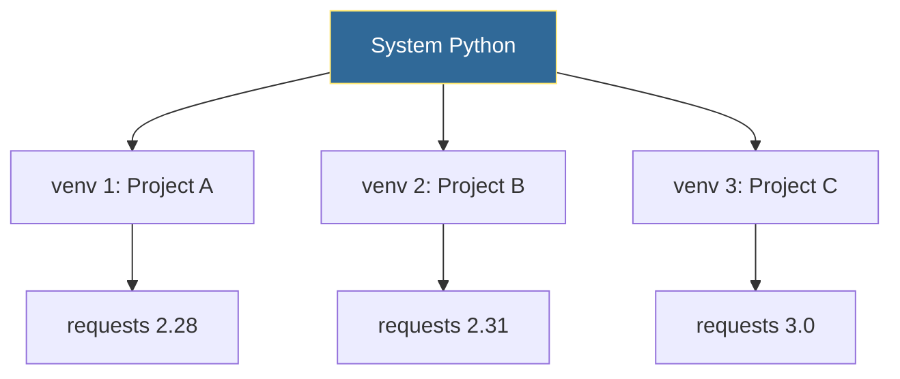

# Virtual Environments
*Isolating Python Dependencies*

Virtual environments prevent dependency conflicts between projects and ensure reproducible automation scripts.

---

## 🎯 Learning Objectives

- Create and manage virtual environments
- Understand dependency isolation
- Best practices for Python projects

---

## 📊 Virtual Environment Isolation



---

## 📚 Core Concepts

### 1. Creating Virtual Environments

```bash
# Create venv
python -m venv myenv

# Activate (Linux/Mac)
source myenv/bin/activate

# Activate (Windows)
myenv\Scripts\activate

# Deactivate
deactivate
```

### 2. Python Commands

```python
import venv
import subprocess

# Create programmatically
venv.create("automation-env", with_pip=True)

# Or via subprocess
subprocess.run(["python", "-m", "venv", "myenv"])
```

### 3. Best Practices

```ini
# .gitignore - Never commit venv!
venv/
env/
.venv/
```

```bash
# Requirements workflow
pip freeze > requirements.txt
pip install -r requirements.txt
```

---

## 🛠️ Hands-On Exercise

```bash
# Create project structure
mkdir my-automation
cd my-automation
python -m venv venv
source venv/bin/activate  # or venv\Scripts\activate on Windows
pip install requests pyyaml
pip freeze > requirements.txt
```

---

## 🧠 Quiz

1. Why use virtual environments?
   - a) Faster Python
   - b) Dependency isolation ✅
   - c) Security

2. Which folder should be gitignored?
   - a) `src/`
   - b) `venv/` ✅
   - c) `lib/`

---

**Next Step**: [Package Management →](../16-Package-Management/README.md)
