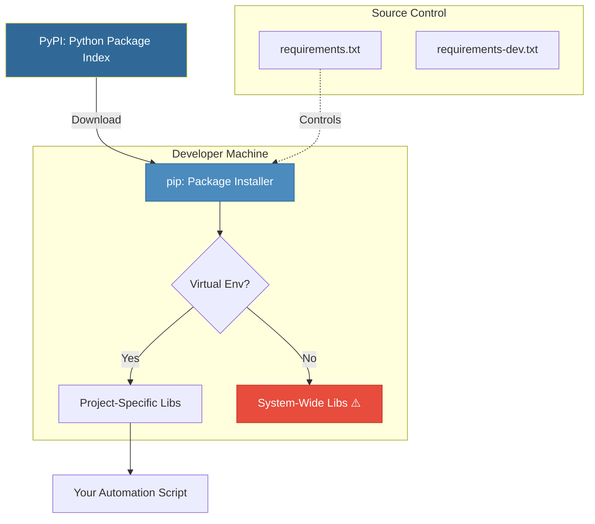
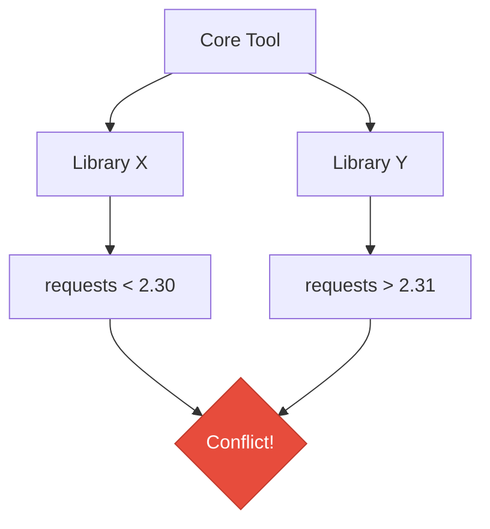

# Package Management
*Managing Dependencies with pip and PyPI*

Proper package management ensures reproducible environments and prevents "dependency hell"—where conflicting versions of libraries crash your automation. In DevOps, a script is only as reliable as its dependencies.

---

## 🎯 Learning Objectives

- Master `pip` for advanced dependency management
- Understand Semantic Versioning (SemVer)
- Create pinned and production-grade `requirements.txt` files
- Identify and resolve dependency conflicts
- Implement security best practices for packages

---

## 📊 Package Ecosystem Architecture



---

## 📚 Core Concepts

### 1. Essential Pip Commands

While `pip install` is common, DevOps engineers need more advanced flags for CI/CD pipelines.

```bash
# Basic operations
pip install requests            # Install latest compatible
pip install requests==2.31.0    # Pin exact version (Recommended)
pip uninstall requests          # Remove package

# Inspection
pip list                        # List all installed packages
pip show boto3                  # Detailed info (path, license, deps)
pip audit                       # Check for known vulnerabilities (requires pip-audit)

# Advanced Pipeline Commands
pip install --no-cache-dir -r requirements.txt  # Avoid cache in Docker/CI
pip install -e .                                # Install current project in "editable" mode
pip check                                       # Verify installed packages have compatible dependencies
```

### 2. Semantic Versioning (SemVer)

Most Python packages follow the `Major.Minor.Patch` format (e.g., `2.31.0`).

| Level | Change Type | Example |
|-------|-------------|---------|
| **Major** | Breaking changes | `2.x.x` → `3.x.x` |
| **Minor** | New features (backward compatible) | `2.31.x` → `2.32.x` |
| **Patch** | Bug fixes (backward compatible) | `2.31.0` → `2.31.1` |

### 3. Version Specifiers in `requirements.txt`

| Specifier | Name | DevOps Use Case |
|-----------|------|-----------------|
| `==2.28.0` | Exact | **Production**: Guarantees zero change between runs. |
| `>=2.28.0` | At least | **Library development**: Allow newer versions. |
| `~=2.28.0` | Compatible | **Safe Updates**: Allow patches (2.28.1) but not minor (2.29). |
| `!=2.27.0` | Exclude | **Bug avoidance**: Skip a known broken version. |

---

## 🔧 Advanced Dependency Patterns

### The "Dependency Hell" Problem

When Package A needs `requests<2.0` and Package B needs `requests>=2.0`, `pip` may fail or install a version that breaks one package.



**Solution**: Use dependency lockers like `pip-tools` (generates `requirements.txt` from `requirements.in`) or `Poetry`/`Pipenv` for complex projects.

---

## 🛠️ Hands-On Exercises

### Exercise 1: Multi-Environment Dependency Setup

Create a system for a project that has separate production and development requirements.

```bash
# 1. Create a requirements.txt with:
#    requests (exact version 2.31.0)
#    boto3 (any 1.26.x version)

# 2. Create a requirements-dev.txt that includes:
#    Everything in requirements.txt (use -r requirements.txt)
#    pytest
#    black
```

<details>
<summary>💡 Solution</summary>

```ini
# requirements.txt
requests==2.31.0
boto3~=1.26.0

# requirements-dev.txt
-r requirements.txt
pytest
black
```
</details>

### Exercise 2: Dependency Auditor

Write a script that reads a `requirements.txt` file and checks if any versions are older than a "minimum allowed" list.

```python
# TODO: Implement a checker
MIN_VERSIONS = {"requests": "2.28.0", "pyyaml": "6.0"}

def check_requirements(file_path):
    pass
```

<details>
<summary>💡 Solution</summary>

```python
import pkg_resources # part of setuptools

MIN_VERSIONS = {"requests": "2.28.0", "pyyaml": "6.0"}

def check_requirements(file_path):
    with open(file_path, 'r') as f:
        for line in f:
            if '==' not in line: continue
            pkg, ver = line.strip().split('==')
            
            if pkg in MIN_VERSIONS:
                min_v = MIN_VERSIONS[pkg]
                if pkg_resources.parse_version(ver) < pkg_resources.parse_version(min_v):
                    print(f"🚨 ALERT: {pkg} is version {ver}, but needs {min_v}")
                else:
                    print(f"✅ {pkg} version {ver} is safe.")

# check_requirements("requirements.txt")
```
</details>

### Exercise 3: Package Configurator (Editable Install)

Create a simple project structure and install it in "editable" mode so changes reflect immediately without reinstalling.

<details>
<summary>💡 Solution</summary>

```bash
# Folder structure
# my_tool/
#   setup.py
#   my_tool/
#     __init__.py
#     script.py

# setup.py snippet
from setuptools import setup, find_packages
setup(name="my_tool", packages=find_packages())

# Install
pip install -e .
```
</details>

---

## 📖 Real-World Story: The Unpinned Disaster

**Scenario**: A deployment script worked perfectly in Staging on Friday. On Monday, identical code failed in Production.

**Problem**: The script had `requests` (no version) in `requirements.txt`. Over the weekend, `requests` released a new major version with breaking changes. The Production build downloaded the new version, while Staging still had the old one cached.

**Solution**: The team immediately pinned all versions (`requests==2.31.0`) and implemented a "Lockfile" strategy.

**Outcome**: Consistent builds across all environments and a new policy: "Never deploy unpinned dependencies to production."

---

## ❓ Interview Questions

1. **What is the difference between `requirements.txt` and `setup.py`?**
   > `requirements.txt` is for *applications* to pin exact environments. `setup.py` is for *libraries* to define abstract dependencies (ranges) to allow flexibility for users.

2. **Why should you use the `--no-cache-dir` flag in Dockerfiles?**
   > It prevents `pip` from saving downloaded `.whl` files inside the Docker image, reducing the image size significantly.

3. **What does `pip freeze` do and why might it be problematic?**
   > It dumps every single package in the environment. It's problematic because it includes sub-dependencies that you didn't explicitly request, making the file hard to manage manually.

4. **Explain the difference between `pip install package` and `python -m pip install package`.**
   > `python -m pip` ensures you are using the `pip` associated with that specific Python interpreter, which is safer when multiple Python versions are installed.

5. **How do you handle private packages in a `requirements.txt`?**
   > You can use git URLs: `git+https://github.com/org/repo.git@v1.0.0` or point to a private PyPI mirror using `--extra-index-url`.

---

## 🧠 Quiz

1. Which version specifier allows compatible bug fixes only?
   - a) `==2.1.0`
   - b) `~=2.1.0` ✅
   - c) `>=2.1.0`

2. What is PyPI?
   - a) A Python compiler
   - b) The official public repository for Python packages ✅
   - c) A virtual environment manager

3. Which command checks for broken dependencies?
   - a) `pip verify`
   - b) `pip check` ✅
   - c) `pip validate`

4. In SemVer `1.2.3`, which number represents a breaking change?
   - a) 1 ✅
   - b) 2
   - c) 3

5. How do you install a package from a specific local directory?
   - a) `pip install ./path/to/pkg` ✅
   - b) `pip get ./path/to/pkg`
   - c) `python add ./path/to/pkg`

6. Which flag upgrades a package to the latest version?
   - a) `-u`
   - b) `--upgrade` ✅
   - c) `--latest`

---

## 🔗 Related Topics

| Module | Relationship |
|--------|-------------|
| [Virtual Environments](../15-Virtual-Environments/README.md) | Where packages are actually installed |
| [First Automation Script](../17-First-Automation-Script/README.md) | Setting up dependencies for a real tool |
| [Subprocess Module](../10-Subprocess-Module/README.md) | Automating pip commands |

---

**Next Step**: [First Automation Script →](../17-First-Automation-Script/README.md)
