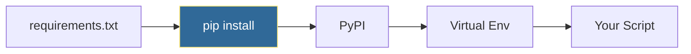

# Package Management
*Managing Dependencies with pip*

Proper package management ensures reproducible environments and prevents "works on my machine" issues.

---

## 🎯 Learning Objectives

- Install and manage packages with pip
- Create requirements files
- Handle version constraints

---

## 📊 Package Installation Flow



---

## 📚 Core Concepts

### 1. Pip Commands

```bash
# Install package
pip install requests

# Install specific version
pip install requests==2.28.0

# Install from requirements
pip install -r requirements.txt

# Show installed packages
pip list
pip show requests

# Upgrade package
pip install --upgrade requests

# Uninstall
pip uninstall requests
```

### 2. Requirements Files

```ini
# requirements.txt
requests==2.28.0
pyyaml>=6.0,<7.0
boto3~=1.26.0
python-dotenv

# With comments
# Core dependencies
flask>=2.0

# Development only (in requirements-dev.txt)
pytest>=7.0
black
```

### 3. Version Specifiers

| Specifier | Meaning |
|-----------|---------|
| `==2.28.0` | Exact version |
| `>=2.28.0` | Minimum version |
| `<3.0.0` | Below version |
| `~=2.28.0` | Compatible (2.28.x) |
| `>=2.28,<3.0` | Range |

---

## 🛠️ Hands-On Exercise

```bash
# Create reproducible environment
pip freeze > requirements.txt

# Different environment for dev
pip install pytest black
pip freeze > requirements-dev.txt

# Install in production
pip install --no-cache-dir -r requirements.txt
```

---

## 🧠 Quiz

1. What does `pip freeze` output?
   - a) Installed packages with versions ✅
   - b) Available updates
   - c) Package metadata

2. What does `~=2.28.0` allow?
   - a) Any 2.x version
   - b) Any 2.28.x version ✅
   - c) Exactly 2.28.0

---

**Next Step**: [First Automation Script →](../17-First-Automation-Script/README.md)
