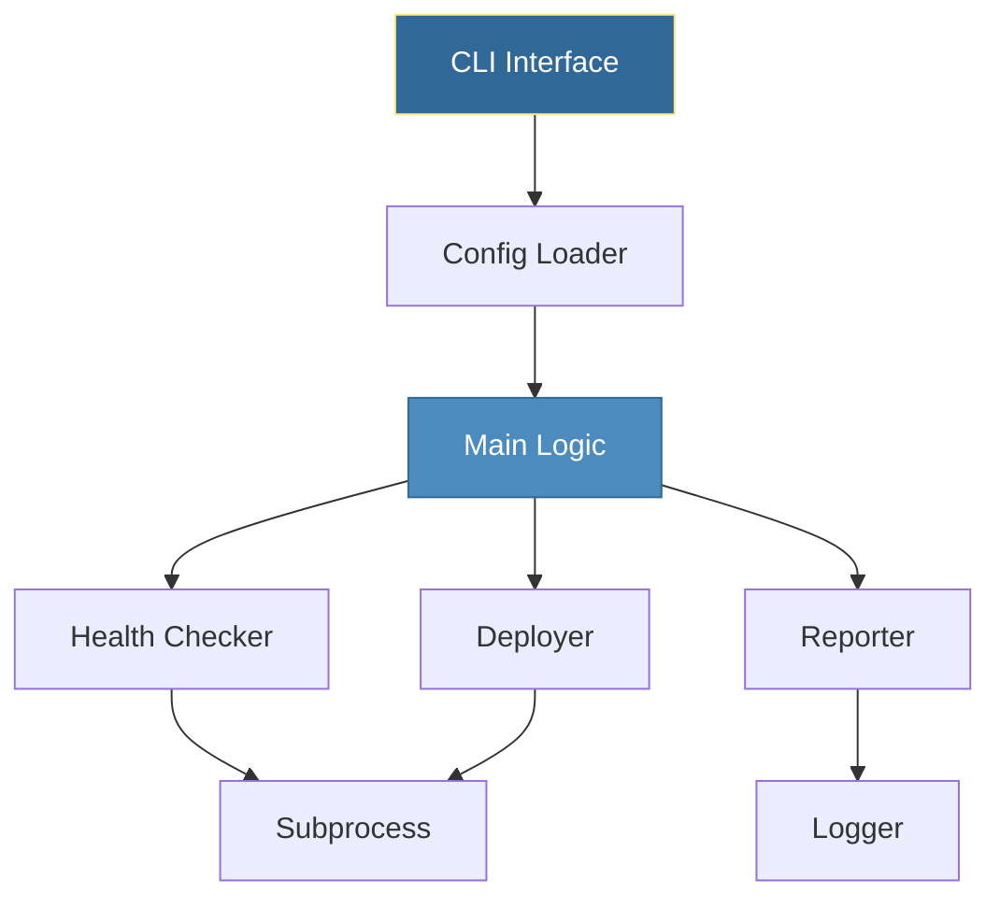

# First Automation Script
*Building a Complete DevOps Automation Tool*

This capstone module brings together everything you've learned to build a real-world automation script.

---

## 🎯 Learning Objectives

- Apply all Python basics in one project
- Build a production-ready automation tool
- Implement best practices

---

## 📊 Script Architecture



---

## 📚 Complete Example

### Server Health Monitor

```python
#!/usr/bin/env python3
"""Server Health Monitor - A complete automation example."""

import argparse
import json
import logging
import os
import subprocess
from datetime import datetime
from pathlib import Path

# Setup logging
logging.basicConfig(
    level=logging.INFO,
    format="%(asctime)s - %(levelname)s - %(message)s"
)
logger = logging.getLogger(__name__)


def load_config(config_path):
    """Load server configuration from JSON file."""
    path = Path(config_path)
    if not path.exists():
        logger.error(f"Config not found: {config_path}")
        return None
    
    with open(path) as f:
        return json.load(f)


def check_server(hostname, timeout=5):
    """Check if server is reachable via ping."""
    try:
        result = subprocess.run(
            ["ping", "-c", "1", "-W", str(timeout), hostname],
            capture_output=True,
            text=True,
            timeout=timeout + 2
        )
        return {
            "hostname": hostname,
            "status": "healthy" if result.returncode == 0 else "unreachable",
            "timestamp": datetime.now().isoformat()
        }
    except subprocess.TimeoutExpired:
        return {"hostname": hostname, "status": "timeout", "timestamp": datetime.now().isoformat()}
    except Exception as e:
        return {"hostname": hostname, "status": "error", "error": str(e)}


def main():
    parser = argparse.ArgumentParser(description="Server Health Monitor")
    parser.add_argument("-c", "--config", default="servers.json", help="Config file")
    parser.add_argument("-o", "--output", help="Output JSON file")
    parser.add_argument("-v", "--verbose", action="store_true")
    
    args = parser.parse_args()
    
    if args.verbose:
        logging.getLogger().setLevel(logging.DEBUG)
    
    # Load configuration
    config = load_config(args.config)
    if not config:
        return 1
    
    # Check all servers
    results = []
    for server in config.get("servers", []):
        logger.info(f"Checking {server}...")
        result = check_server(server)
        results.append(result)
        logger.info(f"  Status: {result['status']}")
    
    # Output results
    output = {
        "check_time": datetime.now().isoformat(),
        "total": len(results),
        "healthy": sum(1 for r in results if r["status"] == "healthy"),
        "results": results
    }
    
    if args.output:
        with open(args.output, "w") as f:
            json.dump(output, f, indent=2)
        logger.info(f"Results saved to {args.output}")
    else:
        print(json.dumps(output, indent=2))
    
    return 0


if __name__ == "__main__":
    exit(main())
```

### Configuration File

```json
{
    "servers": [
        "google.com",
        "github.com",
        "localhost"
    ]
}
```

### Usage

```bash
# Make executable
chmod +x health_monitor.py

# Run with default config
./health_monitor.py

# Specify config and output
./health_monitor.py -c servers.json -o results.json -v
```

---

## 🛠️ Exercise: Extend the Script

Add these features:
1. Email alerting for unhealthy servers
2. HTTP endpoint checks (not just ping)
3. Slack notification integration
4. Historical data storage

---

## 🎓 Skills Applied

| Module | Application |
|--------|-------------|
| CLI Arguments | argparse for options |
| JSON | Config and output |
| Logging | Professional logging |
| Subprocess | Server ping |
| Pathlib | File handling |
| Error Handling | Graceful failures |
| Datetime | Timestamps |

---

## 🧠 Quiz

1. Why use `if __name__ == "__main__":`?
   - a) Required syntax
   - b) Allows module import without running ✅
   - c) Speed optimization

2. What does `exit(main())` do?
   - a) Just exits
   - b) Returns exit code from main() ✅
   - c) Logs exit message

---

**🎉 Congratulations!** You've completed Python Basics for DevOps!

**Next Steps**: Explore the [Intermediate Python Topics](../../README.md) for AWS Boto3, Docker SDK, and more!
