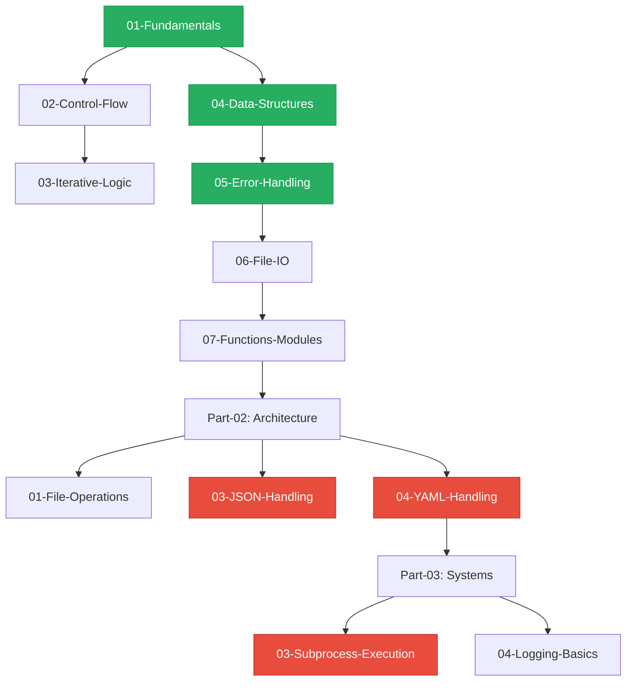

# 📋 Python Basics Directory: Full-Spectrum Audit & Enhancement Report

> **Generated**: 2026-01-31  
> **Scope**: `/home/gsmash/Documents/Devops/1-Beginner/02-Phase-2/01-Automation/02-Python-Basics`  
> **Objective**: Transform from "Python Tutorial" to "DevOps Automation Engineering Curriculum"

---

## 🎯 Executive Summary

### Current State
- ✅ **Strong Foundation**: Well-organized 3-part structure (Foundations → Architecture → Systems)
- ✅ **Comprehensive Coverage**: 24 modules covering beginner to intermediate topics
- ⚠️ **Inconsistent Depth**: Some modules are production-ready, others need DevOps context
- ⚠️ **Missing Visual Aids**: Limited diagrams and mental model illustrations
- ⚠️ **Variable Quality**: Interview prep and real-world scenarios not standardized

### Enhancement Strategy
Apply the **"DevOps-First"** framework to every module:
1. **Mental Models Over Syntax**: Infrastructure analogies for every concept
2. **Real-World Scenarios**: Replace toy examples with production use cases
3. **Visual Learning**: Diagrams, flowcharts, and memory models
4. **Interview Readiness**: 10 SRE-level questions per module
5. **Production Patterns**: Guard clauses, type hints, error handling

---

## 📊 Module-by-Module Audit

### Part 01: Python Foundations (8 modules)

| Module | Status | Priority | Enhancement Needed |
|:-------|:-------|:---------|:-------------------|
| **01-Fundamentals** | ✅ Good | Medium | Add system interaction examples (env vars, sys info) |
| **02-Control-Flow** | ✅ Enhanced | Low | Already updated with Guard Clauses focus |
| **03-Iterative-Logic** | ✅ Enhanced | Low | Already updated with Polling Pattern focus |
| **04-Data-Structures** | ✅ **COMPLETE** | ✅ Done | Just updated with "Engineering Blueprints" framework |
| **05-Error-Handling** | ✅ **COMPLETE** | ✅ Done | Just updated with "Resilience Shield" framework |
| **06-File-IO-DevOps** | ⚠️ Needs Review | High | Ensure focus on config files, logs, and context managers |
| **07-Functions-and-Modules** | ⚠️ Needs Enhancement | High | Focus on DRY automation, building reusable cloud libraries |
| **08-Cloud-Automation-Boto3** | ✅ **COMPLETE** | ✅ Done | Added Boto3 foundations, Waiters, and Security Audit patterns |
| **09-Time-and-Date** | ⚠️ Needs Enhancement | Medium | Add timezone handling, cron scheduling, log timestamp parsing |

### Part 02: Python Architecture (8 modules)

| Module | Status | Priority | Enhancement Needed |
|:-------|:-------|:---------|:-------------------|
| **01-File-Operations** | ⚠️ Needs Review | Medium | Ensure coverage of pathlib, atomic writes, file locking |
| **02-Pathlib-Modern-Files** | ⚠️ Needs Enhancement | Medium | Add cross-platform path handling, temp files |
| **03-JSON-Handling** | 🔥 **CRITICAL** | **HIGHEST** | Deep-dive on API responses, nested data, schema validation |
| **04-YAML-Handling** | 🔥 **CRITICAL** | **HIGHEST** | K8s manifests, Ansible playbooks, safe loading |
| **05-Error-Handling** | ⚠️ Duplicate? | Low | Check if this duplicates Part-01-05, possibly merge or differentiate |
| **06-Virtual-Environments** | ⚠️ Needs Enhancement | High | "Isolated Toolboxes" analogy, dependency isolation |
| **07-Package-Management** | ⚠️ Needs Enhancement | High | "Parts Warehouse" analogy, requirements.txt, pip best practices |
| **08-Regular-Expressions** | ⚠️ Needs Enhancement | Medium | Log parsing, IP extraction, validation patterns |

### Part 03: Python Systems Drafting (8 modules)

| Module | Status | Priority | Enhancement Needed |
|:-------|:-------|:---------|:-------------------|
| **01-Command-Line-Arguments** | ⚠️ Needs Enhancement | High | argparse for production scripts, click framework |
| **02-Environment-Variables** | ⚠️ Needs Enhancement | High | 12-factor app, secrets management, .env files |
| **03-Subprocess-Execution** | 🔥 **CRITICAL** | **HIGHEST** | Python-to-Bash bridge, shell=False security, output parsing |
| **04-Logging-Basics** | ⚠️ Needs Enhancement | High | Structured logging, log levels, syslog integration |
| **05-Working-with-the-Web** | ⚠️ Needs Review | Medium | requests library, API authentication, rate limiting |
| **06-Web-Automation** | ⚠️ Needs Review | Low | Selenium/Playwright for testing, web scraping ethics |
| **07-Micro-Frameworks** | ⚠️ Needs Review | Low | Flask/FastAPI for internal tools, health check endpoints |
| **08-Capstone-Script** | ⚠️ Needs Review | Medium | Ensure it integrates all concepts into a real automation tool |

---

## 🏗️ Recommended Enhancement Order

### Phase 1: Critical Infrastructure Patterns (Weeks 1-2)
**Goal**: Master the "Bread and Butter" of DevOps automation

1. **Part-02-03-JSON-Handling** 🔥
   - **Why**: 90% of cloud APIs return JSON
   - **Focus**: Nested data navigation, safe parsing, schema validation
   - **Analogy**: "The Universal Language of APIs"
   - **Lab**: Parse AWS EC2 describe-instances response

2. **Part-03-03-Subprocess-Execution** 🔥
   - **Why**: Python must talk to the OS and run shell commands
   - **Focus**: `subprocess.run()`, security (`shell=False`), output parsing
   - **Analogy**: "The Python-to-Bash Bridge"
   - **Lab**: Build a system health checker that runs `df`, `free`, `uptime`

3. **Part-02-04-YAML-Handling** 🔥
   - **Why**: K8s, Ansible, Docker Compose all use YAML
   - **Focus**: Safe loading, multi-document files, anchors & aliases
   - **Analogy**: "The Configuration Blueprint Language"
   - **Lab**: Parse and validate a Kubernetes deployment manifest

### Phase 2: Production Readiness (Weeks 3-4)
**Goal**: Build scripts that survive production chaos

4. **Part-01-07-Functions-and-Modules**
   - **Why**: DRY (Don't Repeat Yourself) is critical for maintainability
   - **Focus**: Building reusable cloud libraries, module imports, `__name__ == "__main__"`
   - **Analogy**: "The Automation Toolbox"
   - **Lab**: Build an `aws_helper.py` module with reusable functions

5. **Part-02-06-Virtual-Environments**
   - **Why**: Dependency isolation prevents "works on my machine" issues
   - **Focus**: venv, requirements.txt, dependency pinning
   - **Analogy**: "Isolated Toolboxes"
   - **Lab**: Create a project with isolated dependencies

6. **Part-03-02-Environment-Variables**
   - **Why**: 12-factor app methodology, secrets management
   - **Focus**: `os.environ`, `.env` files, python-dotenv
   - **Analogy**: "The Secret Vault"
   - **Lab**: Build a script that reads DB credentials from env vars

### Phase 3: Advanced Patterns (Weeks 5-6)
**Goal**: Write code that scales and performs

7. **Part-03-04-Logging-Basics**
   - **Why**: Production debugging requires structured logs
   - **Focus**: Log levels, formatters, handlers, syslog
   - **Analogy**: "The Black Box Recorder"
   - **Lab**: Add comprehensive logging to a deployment script

8. **Part-02-08-Regular-Expressions**
   - **Why**: Log parsing, validation, data extraction
   - **Focus**: Common patterns (IP, email, timestamp), named groups
   - **Analogy**: "The Pattern Detective"
   - **Lab**: Parse Nginx access logs to extract IPs and status codes

9. **Part-01-06-File-IO-DevOps**
   - **Why**: Config files, logs, and data persistence
   - **Focus**: Context managers, atomic writes, file locking
   - **Analogy**: "The Data Persistence Layer"
   - **Lab**: Build a config file manager with atomic updates

10. **Part-03-01-Command-Line-Arguments**
    - **Why**: Production scripts need flexible interfaces
    - **Focus**: argparse, click, help text, validation
    - **Analogy**: "The User Interface"
    - **Lab**: Build a CLI tool with subcommands

---

## 📐 The "DevOps-First" Enhancement Template

For each module, apply this standardized structure:

### 1. **Mental Model Section** (New)
```markdown
## 🧠 The Mental Model: [Concept as Infrastructure]

**The Junior Struggle**: "[Common confusion]"

**The Engineer Solution**: "[Infrastructure analogy]"

### 🏗️ The Infrastructure Analogy

| Python Concept | Real-World Analogy | When to Use |
|:---------------|:-------------------|:------------|
| [Concept] | [Physical infrastructure] | [Use case] |
```

### 2. **Why This Matters for Juniors** (New)
```markdown
## 📚 Why This Module Matters for Juniors

**Before this module**, you [old way].

**After this module**, you [new way].

**The Difference**: [Impact on production readiness]
```

### 3. **Visual Learning Aids** (Enhanced)
- Add Mermaid diagrams for flows and architectures
- Add ASCII art for memory models
- Add placeholder images with descriptive alt text
- Add decision trees for "when to use X vs Y"

### 4. **Real-World Scenarios** (Enhanced)
Replace toy examples:
- ❌ "Calculate the area of a circle"
- ✅ "Parse AWS CloudWatch logs to detect anomalies"

### 5. **Production Patterns** (New)
```markdown
## 🚀 Professional Pattern: [Pattern Name]

**The Junior Way** (Problematic):
```python
# ❌ Code with issues
```

**The Engineer Way** (Production-ready):
```python
# ✅ Code with best practices
```

**💡 Pro Tip**: [Why this matters in production]
```

### 6. **Interview Preparation** (Standardized)
- 10 questions per module (5 core + 5 advanced)
- Focus on SRE-level understanding
- Include "why" not just "how"

### 7. **Knowledge Check** (Standardized)
- 10 multiple-choice questions
- 3 difficulty levels: Beginner, Intermediate, Advanced
- Answers with explanations

---

## 🎨 Visual Learning Anchor Points

### Required Diagrams per Module Type

#### **Data Structures**
- Memory layout diagrams (how lists/dicts are stored)
- Big-O complexity charts
- Decision trees (when to use which structure)

#### **Control Flow**
- Execution flow diagrams
- Guard clause patterns
- Loop lifecycle visualizations

#### **I/O Operations**
- File handle lifecycle
- Context manager flow
- Atomic write process

#### **Networking**
- API request/response cycle
- Retry logic timeline
- Rate limiting visualization

#### **System Integration**
- Python-to-OS interaction
- Subprocess execution flow
- Environment variable resolution

---

## 🔧 Technical Layering Standards

### Code Example Requirements

1. **Type Hints**: All function signatures must include type hints
   ```python
   def deploy_app(config_path: str, dry_run: bool = False) -> bool:
   ```

2. **Docstrings**: All functions must have docstrings
   ```python
   """
   Deploy application to production.
   
   Args:
       config_path: Path to deployment configuration file
       dry_run: If True, simulate deployment without making changes
   
   Returns:
       True if deployment succeeded, False otherwise
   
   Raises:
       ConfigurationError: If config file is invalid
       DeploymentError: If deployment fails
   ```

3. **Guard Clauses**: Prefer early returns over deep nesting
   ```python
   if not config_path.exists():
       raise FileNotFoundError(f"Config not found: {config_path}")
   ```

4. **Error Handling**: All risky operations must have try/except
   ```python
   try:
       with open(config_path) as f:
           config = json.load(f)
   except (FileNotFoundError, json.JSONDecodeError) as e:
       raise ConfigurationError(f"Invalid config: {e}") from e
   ```

5. **Context Managers**: Use `with` for all resource management
   ```python
   with open("log.txt", "a") as f:
       f.write(f"{timestamp}: Deployment started\n")
   ```

---

## 📊 Success Metrics

### Module Quality Checklist

Each module should have:
- ✅ Infrastructure analogy in introduction
- ✅ "Why This Matters for Juniors" section
- ✅ At least 3 visual diagrams/charts
- ✅ 5+ real-world DevOps code examples
- ✅ 10 interview questions (5 core + 5 advanced)
- ✅ 10 knowledge check questions (3 difficulty levels)
- ✅ "Before/After" comparison showing newbie vs engineer approach
- ✅ At least 1 "Real-World DevOps Story"
- ✅ Performance/Big-O analysis where relevant
- ✅ Links to official documentation and further reading

### Code Quality Standards

All code examples must:
- ✅ Include type hints
- ✅ Include docstrings
- ✅ Follow PEP 8 style guide
- ✅ Use guard clauses instead of deep nesting
- ✅ Include error handling
- ✅ Use context managers for resources
- ✅ Have descriptive variable names (no `x`, `y`, `temp`)

---

## 🚀 Next Steps

### Immediate Actions (This Week)

1. ✅ **COMPLETED**: Data Structures module (Engineering Blueprints framework)
2. ✅ **COMPLETED**: Error Handling module (Resilience Shield framework)
3. **TODO**: JSON Handling module (The Universal API Language)
4. **TODO**: Subprocess Execution module (The Python-to-Bash Bridge)

### Short-Term (Next 2 Weeks)

5. YAML Handling (The Configuration Blueprint Language)
6. Functions and Modules (The Automation Toolbox)
7. Virtual Environments (Isolated Toolboxes)
8. Environment Variables (The Secret Vault)

### Medium-Term (Next Month)

9. Logging Basics (The Black Box Recorder)
10. Regular Expressions (The Pattern Detective)
11. File I/O (The Data Persistence Layer)
12. Command-Line Arguments (The User Interface)

### Long-Term (Next Quarter)

13. Create `09-Advanced-Patterns-and-Efficiency` module
    - Decorators for logging and timing
    - Generators for memory-efficient iteration
    - Context managers for resource management
    - Asyncio for concurrent API calls

14. Standardize all CHALLENGES.md files
15. Create comprehensive lab_demo.py for each module
16. Build capstone project integrating all concepts

---

## 📋 Appendix: Module Dependency Map



**Legend**:
- 🟢 Green: Completed with "DevOps-First" framework
- 🔴 Red: Critical priority for next phase
- ⚪ White: Standard priority

---

## 🎯 Conclusion

The `/02-Python-Basics` directory has a strong foundation, but needs systematic enhancement to transform from a "Python tutorial" into a "DevOps Automation Engineering Curriculum."

**Key Priorities**:
1. **JSON/YAML Handling**: The bread and butter of cloud automation
2. **Subprocess Execution**: The Python-to-OS bridge
3. **Functions & Modules**: Building reusable automation libraries

By applying the "DevOps-First" framework consistently across all modules, we'll create a curriculum that produces engineers who can build production-grade automation tools from day one.

---

**Next Module to Enhance**: `Part-02-03-JSON-Handling` (The Universal API Language)
