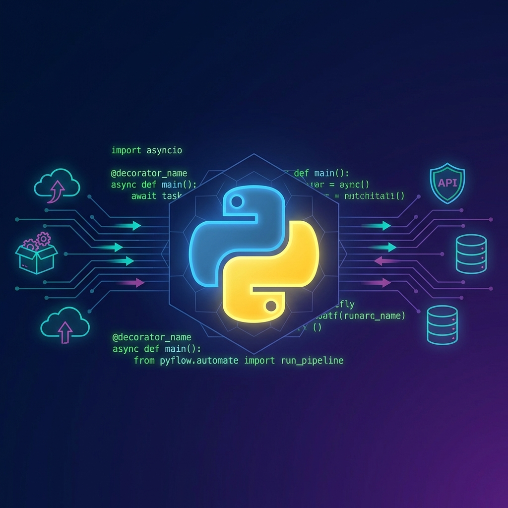
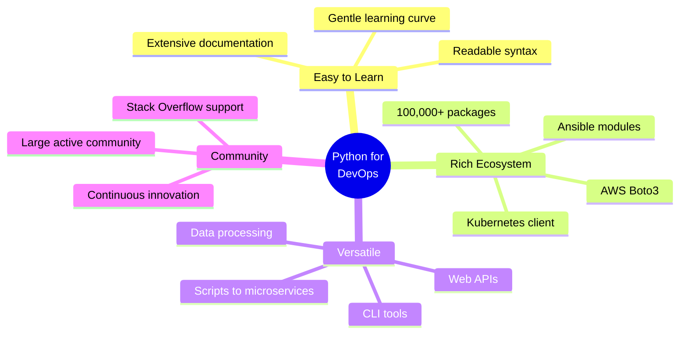
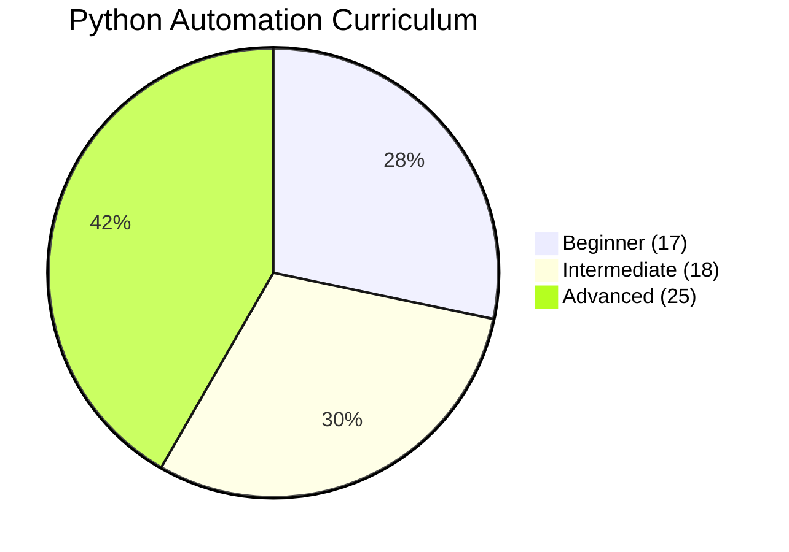

# 🐍 Python Automation - Complete Master Index

> **"Python: The Swiss Army knife of DevOps automation"**



## 📚 Overview

Welcome to the comprehensive **Python Automation** curriculum! This module contains **60 meticulously crafted topics** designed to transform you from Python beginner to automation expert. Python is the most popular language in DevOps, used by companies like Google, Netflix, Spotify, and Instagram for infrastructure automation.

## 🎯 Why Python for DevOps?



## 🗺️ Curriculum Structure

### 🟢 Level 1: Beginner (17 Topics) - **55-70 hours**

Master Python fundamentals and basic automation scripts.

| #   | Topic                                                                                               | Description                      | Key Learning                     | Hours |
| --- | --------------------------------------------------------------------------------------------------- | -------------------------------- | -------------------------------- | ----- |
| 00  | **[Prerequisites](../../../../README.md)**                               | Setup, Pip, Venv                 | Installation, Path, Environments | 2-3h  |
| 01  | **[Python Fundamentals](./Part-1-Fundamentals/01-Python-Fundamentals/README.md)**                   | Syntax, data types, control flow | First Python script, PEP 8       | 4-5h  |
| 02  | **[Data Structures](./Part-1-Fundamentals/02-Data-Structures/README.md)**                           | Lists, dicts, sets, tuples       | Choosing right data structure    | 4-5h  |
| 03  | **[Functions and Modules](./Part-1-Fundamentals/03-Functions-and-Modules/README.md)**               | Functions, imports, packages     | Code organization                | 4-5h  |
| 04  | **[File Operations](./Part-1-Fundamentals/04-File-Operations/README.md)**                           | Reading/writing files            | Config file handling             | 3-4h  |
| 05  | **[Error Handling](./Part-1-Fundamentals/05-Error-Handling/README.md)**                             | try/except, custom exceptions    | Robust error handling            | 3-4h  |
| 06  | **[Working with JSON](./Part-3-Data-Structures/06-Working-with-JSON/README.md)**                    | JSON parsing, serialization      | API data handling                | 2-3h  |
| 07  | **[Working with YAML](./Part-3-Data-Structures/07-Working-with-YAML/README.md)**                    | YAML config files                | K8s manifests, configs           | 2-3h  |
| 08  | **[Environment Variables](./Part-2-System-Operations/08-Environment-Variables/README.md)**          | os.environ, python-dotenv        | 12-factor apps                   | 2-3h  |
| 09  | **[Command Line Arguments](./Part-2-System-Operations/09-Command-Line-Arguments/README.md)**        | argparse, sys.argv               | CLI tool creation                | 3-4h  |
| 10  | **[Subprocess Module](./Part-2-System-Operations/10-Subprocess-Module/README.md)**                  | Running shell commands           | Shell integration                | 4-5h  |
| 11  | **[Pathlib Basics](./Part-2-System-Operations/11-Pathlib-Basics/README.md)**                        | Modern path handling             | Cross-platform paths             | 3h    |
| 12  | **[Datetime Operations](./Part-3-Data-Structures/12-Datetime-Operations/README.md)**                | Date/time manipulation           | Log timestamps                   | 3h    |
| 13  | **[Regular Expressions](./Part-3-Data-Structures/13-Regular-Expressions/README.md)**                | Pattern matching                 | Log parsing                      | 4-5h  |
| 14  | **[Logging Basics](./Part-4-Professional-Standards/14-Logging-Basics/README.md)**                   | Logging module                   | Professional logging             | 3-4h  |
| 15  | **[Virtual Environments](./Part-4-Professional-Standards/15-Virtual-Environments/README.md)**       | venv, virtualenv                 | Dependency isolation             | 2-3h  |
| 16  | **[Package Management](./Part-4-Professional-Standards/16-Package-Management/README.md)**           | pip, requirements.txt            | Reproducible environments        | 3h    |
| 17  | **[First Automation Script](./Part-4-Professional-Standards/17-First-Automation-Script/README.md)** | Complete deployment script       | Real-world automation            | 5-6h  |

---

### 🟡 Level 2: Intermediate (18 Topics) - **80-95 hours**

Integrate with DevOps tools and cloud services.

| # | Topic | Description | Key Learning | Hours |
|---|-------|-------------|--------------|-------|
| 01 | **API Interactions** | REST APIs, authentication | OAuth, JWT, API tokens | 4-5h |
| 02 | **Requests Library** | HTTP operations | Session management, retries | 4h |
| 03 | **Database Operations** | SQL, ORMs | Data persistence | 5-6h |
| 04 | **SSH and Paramiko** | Remote execution | Multi-server automation | 4-5h |
| 05 | **Fabric for Deployment** | SSH framework | Deployment automation | 4-5h |
| 06 | **Configuration Management** | Config patterns | Environment-specific configs | 3-4h |
| 07 | **Template Engines** | Jinja2 templates | Dynamic config generation | 4h |
| 08 | **Scheduling Tasks** | APScheduler, Celery | Background job processing | 5h |
| 09 | **Monitoring Scripts** | System metrics | Health check automation | 4-5h |
| 10 | **Log Parsing** | Analyzing logs | Pattern extraction | 4h |
| 11 | **AWS Boto3 Basics** | EC2, S3, CloudWatch | Cloud automation | 6-8h |
| 12 | **Docker Python SDK** | Container management | Docker automation | 5h |
| 13 | **Kubernetes Client** | Pod/deployment automation | K8s orchestration | 6h |
| 14 | **Slack Integration** | Notifications, webhooks | Alert systems | 3h |
| 15 | **Email Automation** | SMTP, templates | Report automation | 3h |
| 16 | **Web Scraping** | BeautifulSoup, Selenium | Data collection | 5-6h |
| 17 | **Data Processing** | Pandas for logs | Data analysis | 5-6h |
| 18 | **Testing Automation Scripts** | pytest, mocking | Test-driven development | 5-6h |

---

### 🔴 Level 3: Advanced (25 Topics) - **145-175 hours**

Build enterprise-scale automation frameworks.

| # | Topic | Description | Key Learning | Hours |
|---|-------|-------------|--------------|-------|
| 01 | **Async Programming** | asyncio, aiohttp | Concurrent automation | 6-8h |
| 02 | **Concurrent Futures** | Thread/Process pools | Parallel execution | 5h |
| 03 | **Multiprocessing** | Multi-core utilization | CPU-bound tasks | 5h |
| 04 | **Generic Automation Framework** | Reusable framework | Framework design | 8-10h |
| 05 | **CLI Tools - Click** | Professional CLIs | Complex CLI apps | 5h |
| 06 | **CLI Tools - Typer** | Modern type-hint CLIs | Modern Python patterns | 5h |
| 07 | **Infrastructure as Code** | Python for IaC | Terraform alternatives | 6h |
| 08 | **Terraform CDK** | CDK for Terraform | Type-safe IaC | 6-8h |
| 09 | **Pulumi Automation** | Modern IaC with Python | Cloud-native IaC | 6-8h |
| 10 | **Custom Ansible Modules** | Extending Ansible | Custom automation | 6h |
| 11 | **GitOps Automation** | Git-based deployments | CI/CD integration | 5-6h |
| 12 | **CI/CD Orchestration** | Pipeline automation | Jenkins/GitLab integration | 6-8h |
| 13 | **Security Scanning** | Vulnerability detection | Security automation | 5h |
| 14 | **Compliance Automation** | Policy enforcement | Compliance checking | 5-6h |
| 15 | **Cost Optimization** | Cloud cost analysis | FinOps automation | 5h |
| 16 | **Chaos Engineering** | Resilience testing | Failure injection | 5-6h |
| 17 | **Observability Tools** | Metrics, traces, logs | APM integration | 6h |
| 18 | **Custom Operators** | Kubernetes operators | K8s extension | 8-10h |
| 19 | **Performance Optimization** | Profiling, optimization | Production performance | 5-6h |
| 20 | **Design Patterns** | Automation patterns | Software architecture | 5h |
| 21 | **Best Practices** | Production-ready code | Code quality | 4-5h |
| 22 | **Security Hardening** | Secure automation | Security best practices | 5h |
| 23 | **Production Deployment** | Deployment strategies | Blue-green, canary | 5-6h |
| 24 | **Debugging Advanced** | Advanced debugging | pdb, remote debugging | 5h |
| 25 | **Enterprise Scale Automation** | Large-scale systems | Scalability patterns | 8-10h |

---

## 🎓 Learning Paths

### 1. DevOps Engineer Path (8-10 weeks)

**Focus**: Infrastructure automation, CI/CD, cloud orchestration

**Prerequisites**: Basic programming knowledge

**Curriculum**:
- ✅ All Beginner topics (Weeks 1-2)
- ✅ Intermediate: API Interactions, Boto3, Docker SDK, K8s Client, Fabric (Weeks 3-5)
- ✅ Advanced: Pulumi, CI/CD, GitOps, Observability, Best Practices (Weeks 6-10)

**Outcome**: Build and deploy production automation tools

---

### 2. SRE/Platform Engineer Path (9-11 weeks)

**Focus**: Monitoring, reliability, scalability

**Prerequisites**: Basic Python, understanding of Linux

**Curriculum**:
- ✅ All Beginner topics (Weeks 1-2)
- ✅ Intermediate: Monitoring, Log Parsing, Scheduling, Testing, Boto3 (Weeks 3-6)
- ✅ Advanced: Observability, Chaos Engineering, Performance, Enterprise Scale (Weeks 7-11)

**Outcome**: Create robust, scalable automation systems

---

### 3. Cloud Automation Specialist Path (10-12 weeks)

**Focus**: Multi-cloud automation, IaC

**Prerequisites**: Cloud basics (AWS/Azure/GCP)

**Curriculum**:
- ✅ All Beginner topics (Weeks 1-2)
- ✅ Intermediate: Boto3, K8s Client, API Interactions, Config Management (Weeks 3-6)
- ✅ Advanced: Pulumi, Terraform CDK, Cost Optimization, Security (Weeks 7-12)

**Outcome**: Multi-cloud automation expertise

---

## 📊 Progress Dashboard



### Statistics

| Metric | Value |
|--------|-------|
| **Total Topics** | 60 |
| **Beginner Topics** | 17 |
| **Intermediate Topics** | 18 |
| **Advanced Topics** | 25 |
| **Total Hours** | 280-340 |
| **Full-time Weeks** | 7-9 |
| **Part-time Weeks** | 14-18 |

---

## 🔥 Popular Python DevOps Tools

### Infrastructure & Cloud
- **Boto3**: AWS SDK (45M downloads/month)
- **Pulumi**: Modern IaC
- **Terraform CDK**: Python bindings for Terraform
- **Apache Libcloud**: Multi-cloud abstraction

### Container & Orchestration
- **docker-py**: Docker SDK
- **kubernetes**: Official K8s SDK client
- **Helm**: Chart management

### Configuration & Deployment
- **Ansible**: Automation platform (Python-based)
- **Fabric**: SSH automation
- **SaltStack**: Configuration management

### Monitoring & Observability
- **Prometheus Client**: Metrics
- **OpenTelemetry**: Tracing
- **Grafana**: Dashboards (Python SDK)

### CLI Tools
- **Click**: CLI framework
- **Typer**: Modern CLI with type hints
- **Rich**: Terminal formatting

---

## 💼 Real-World Use Cases

### 1. **Netflix**: Chaos Engineering
Python powers Netflix's Chaos Monkey and Simian Army for resilience testing.

**Implementation**:
```python
# Simplified chaos engineering example
import random
from aws_chaos import EC2Terminator

def chaos_monkey():
    """Randomly terminate instances to test resilience"""
    instances = get_production_instances()
    target = random.choice(instances)
    EC2Terminator().terminate(target)
    alert_team(f"Terminated {target} for chaos testing")
```

---

### 2. **Spotify**: Infrastructure Automation
10,000+ microservices managed with Python automation.

**Key Tools**:
- Custom deployment scripts
- Infrastructure provisioning
- Service mesh configuration
- Monitoring aggregation

---

### 3. **Instagram**: Database Migration
Migrated 100+ TB of data using Python scripts with zero downtime.

**Challenges Solved**:
- Parallel data migration
- Consistency checking
- Rollback mechanisms
- Real-time monitoring

---

## 🎯 Interview Preparation

### Common Python DevOps Interview Topics

1. **AWS Automation with Boto3**
   - EC2 instance management
   - S3 bucket operations
   - CloudWatch metrics
   - IAM role automation

2. **Container Orchestration**
   - Docker SDK usage
   - Kubernetes client operations
   - Multi-container deployments
   - Health check implementation

3. **Error Handling & Logging**
   - Exception handling patterns
   - Structured logging
   - Error monitoring integration
   - Retry mechanisms

4. **Configuration Management**
   - Environment-specific configs
   - Secret management
   - Template rendering
   - Configuration validation

5. **Testing & Quality**
   - Unit testing automation scripts
   - Integration testing
   - Mocking external services
   - CI/CD pipeline testing

---

## 📚 Recommended Resources

### Official Documentation
- [Python.org](https://docs.python.org/3/)
- [Real Python](https://realpython.com/)
- [Python DevOps Tutorials](https://www.fullstackpython.com/devops.html)

### Books
- "Python for DevOps" - O'Reilly
- "Effective Python" - Brett Slatkin
- "Fluent Python" - Luciano Ramalho

### Online Courses
- AWS Training: Python on AWS
- Linux Academy: Python for System Administrators
- Udemy: Complete Python DevOps Course

### Tools & Libraries
- [Awesome Python](https://awesome-python.com/)
- [PyPI](https://pypi.org/) - Python Package Index
- [Python Weekly](https://www.pythonweekly.com/)

---

## 🚀 Quick Start

```bash
# 1. Set up Python environment
python3 --version  # Ensure Python 3.8+

# 2. Create virtual environment
python3 -m venv devops-automation
source devops-automation/bin/activate  # Linux/Mac
# devops-automation\Scripts\activate  # Windows

# 3. Install essential packages
pip install boto3 requests pyyaml python-dotenv

# 4. Start with Beginner-01
cd ~/Devops/1-Beginner/02-Phase-2/02-Automation/02-Python-Basics
cd 01-Python-Fundamentals
```

---

## 🎓 Certification Preparation

This curriculum prepares you for:

- ✅ **AWS Certified DevOps Engineer** - Boto3 expertise
- ✅ **Certified Kubernetes Administrator (CKA)** - K8s automation
- ✅ **Python Institute Certifications** - PCAP, PCPP
- ✅ **HashiCorp Terraform Associate** - Terraform CDK

---

## 📈 Career Impact

### Salary Ranges (DevOps Engineers with Python)

| Level | Experience | US Salary Range |
|-------|------------|-----------------|
| Junior | 0-2 years | $70k - $95k |
| Mid-level | 2-5 years | $95k - $130k |
| Senior | 5-8 years | $130k - $170k |
| Lead/Principal | 8+ years | $170k - $250k+ |

*Source: Glassdoor, Indeed, 2026 data*

### Job Market Demand

- **25,000+** DevOps engineer jobs requiring Python (LinkedIn, 2026)
- **Top hiring companies**: AWS, Google, Microsoft, Netflix, Spotify
- **Growth rate**: 21% annually (Bureau of Labor Statistics)

---

## 🤝 Contributing

This curriculum is continuously evolving. Found a better example? Have a real-world case study? Contributions welcome!

---

## 📞 Support

- 📧 Email: python-devops-learning@example.com
- 💬 Discord: [Python DevOps Community](#)
- 🐛 Issues: [GitHub Issues](#)

---

**Last Updated**: 2026-01-10  
**Version**: 1.0.0  
**Status**: Active Development 🚧  
**Maintained by**: DevOps Learning Team

**🐍 Ready to automate everything with Python!** 🚀
