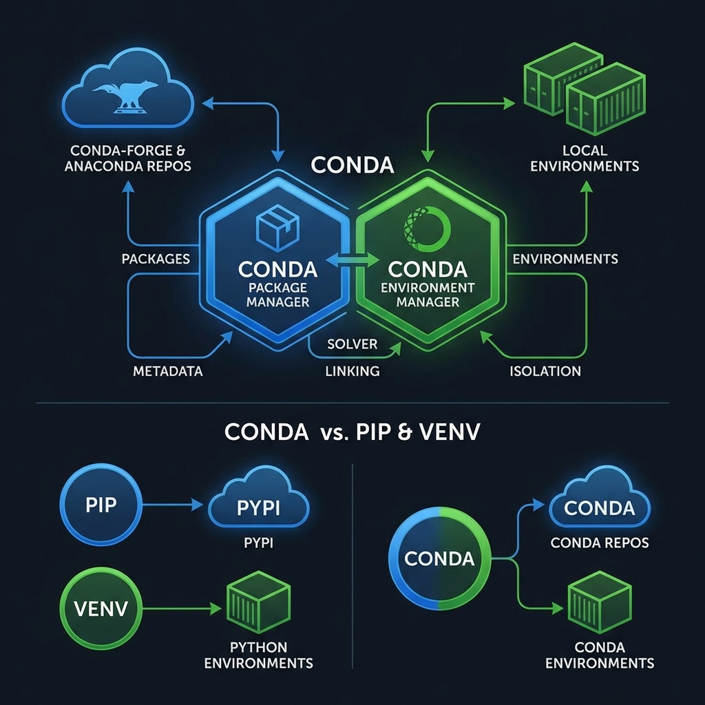
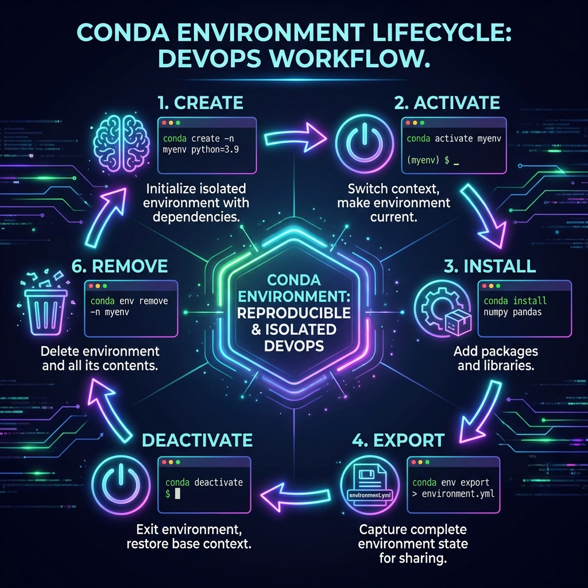

# Anaconda & Conda Environment Management
*The Professional Standard for Data-Heavy DevOps*

Anaconda is more than just a Python distribution; it is a powerful package and environment management system. In DevOps, while `venv` is excellent for lightweight scripts, **Conda** shines when handling complex C-dependencies, GPU-accelerated tasks, and cross-platform binary consistency.

---

## 🏗️ Conda Architecture
Conda is a **language-agnostic** binary package manager. Unlike `pip`, which only manages Python packages and relies on the system for C-libraries, Conda bundles everything you need into the environment.



### Conda vs. Pip + Venv
| Feature | Pip + Venv | Anaconda (Conda) |
| :--- | :--- | :--- |
| **Language Support** | Python Only | Multi-language (C++, R, Python, Go) |
| **Dependency Depth** | Python Packages only | Handles Binary/System dependencies |
| **Environment Handling** | Lightweight/Manual | Robust/Integrated |
| **DevOps Use Case** | Microservices / AWS Lambda | Data Pipelines / MLOps / AI Automation |

---

## 🚀 Installation & Configuration

### 1. Windows Setup
1.  **Download**: [Anaconda Individual Edition](https://www.anaconda.com/download/) or [Miniconda](https://docs.conda.io/en/latest/miniconda.html) (Lightweight version).
2.  **Installation**: 
    *   **⚠️ The PATH Decision**: It is generally recommended **NOT** to add Anaconda to the system PATH during installation to avoid conflicts with other Python versions.
    *   **Instead**: Use the **Anaconda Prompt** or **Anaconda PowerShell Prompt** found in your Start Menu.
3.  **Initialization**: 
    If you want to use it in your regular PowerShell/CMD, run:
    ```powershell
    conda init powershell
    ```

### 2. Linux/macOS Setup
```bash
# Download the installer script
curl -O https://repo.anaconda.com/miniconda/Miniconda3-latest-Linux-x86_64.sh

# Run the installer
bash Miniconda3-latest-Linux-x86_64.sh

# Initialize
source ~/.bashrc
conda init
```

---

## 💡 DevOps Use Case: Why Anaconda?

In professional DevOps environments, Anaconda (and its lightweight sibling, Miniconda) is a strategic choice for specific engineering workflows that go beyond simple script execution.

### 1. Handling Complex Binary Dependencies
Many Python libraries used in automation (like `cryptography`, `pandas`, or `lxml`) rely on underlying C or C++ libraries. While `pip` attempts to install these via "wheels," it often fails if the local system lacks specific compilers or headers.
*   **DevOps Value**: Conda installs pre-compiled binaries for the entire stack (Python + C-libraries). This removes the "compilation hell" often seen in CI/CD pipelines (e.g., Jenkins or GitHub Actions runners).

### 2. MLOps & AI Infrastructure
Modern DevOps is increasingly pivoting toward **MLOps**—the practice of deploying and maintaining machine learning models.
*   **The Problem**: AI models require specific versions of NVIDIA CUDA drivers, CUDNN libraries, and complex math kernels (MKL/BLAS).
*   **The Conda Solution**: Conda can manage non-Python dependencies. You can install a specific version of the CUDA toolkit *inside* your environment without touching the host OS. This is critical for scaling GPU-bound workloads in Kubernetes or AWS SageMaker.

### 3. Cross-Platform Environment Parity
DevOps engineers often develop on macOS or Windows but deploy to Linux (Ubuntu/Amazon Linux). 
*   **The Consistency**: Since Conda controls the binary environment, it ensures that the mathematical precision and library behavior are identical across different operating systems. This reduces "Environment Drifts" where a script behaves differently in Production than in Testing.

### 4. Language-Agnostic Tooling
A single automation project might require Python for logic, R for data analysis, and Node.js for a dashboard.
*   **Integrated Workflow**: Conda can manage all three in a single environment. This simplifies the "System Drafting" phase of DevOps, where you are gluing multiple heterogenous technologies together.

> **The DevOps Bottom Line**: Conda transforms environment management into **Infrastructure as Code**. By using `environment.yml` files, you ensure that **"It works on my machine"** always translates to **"It works in the pipeline."**

---

## � Essential DevOps Python Libraries

While you can install thousands of packages, these are the heavy hitters found in almost every professional DevOps toolkit. You can install any of these using `conda install <package_name>`.

### 1. Cloud & Infrastructure (IaC)
*   **[boto3](https://boto3.amazonaws.com/v1/documentation/api/latest/index.html)**: The official AWS SDK for Python. Used for managing S3, EC2, Lambda, etc.
*   **[pulumi](https://www.pulumi.com/docs/languages-sdk/python/)**: Modern Infrastructure as Code for all major clouds.
*   **[azure-mgmt-compute](https://pypi.org/project/azure-mgmt-compute/)**: Managing Microsoft Azure resources.
*   **[google-cloud-sdk](https://pypi.org/project/google-cloud-sdk/)**: Interacting with Google Cloud Platform services.

### 2. Automation & CLI Development
*   **[Click](https://click.palletsprojects.com/) / [Typer](https://typer.tiangolo.com/)**: The gold standards for creating beautiful, production-grade Command Line Interfaces (CLIs).
*   **[Fabric](https://www.fabfile.org/)**: A library for executing shell commands remotely over SSH.
*   **[Ansible-Runner](https://ansible-runner.readthedocs.io/)**: Programmatic interface to Ansible for complex orchestration.

### 3. Connectivity & APIs
*   **[Requests](https://requests.readthedocs.io/) / [HTTPX](https://www.python-httpx.org/)**: Essential for interacting with REST APIs, webhooks, and monitoring endpoints.
*   **[Paramiko](https://www.paramiko.org/)**: The low-level SSHv2 protocol implementation for deep server automation.

### 4. Data Handling & Documentation
*   **[PyYAML](https://pyyaml.org/)**: Critical for parsing CI/CD pipelines, Kubernetes manifests, and Docker Compose files.
*   **[Jinja2](https://jinja.palletsprojects.com/)**: The powerful templating engine used to generate dynamic configurations (Nginx, Terraform, etc.).
*   **[Pandas](https://pandas.pydata.org/)**: Essential for log analysis and cost optimization reports (often installed via Conda).

### 5. Testing & Observability
*   **[Pytest](https://docs.pytest.org/)**: The modern testing framework for validating automation scripts and infrastructure state.
*   **[Psutil](https://github.com/giampaolo/psutil)**: Retrieving system information (CPU, memory, disks, network) for local monitoring agents.
*   **[Selenium](https://www.selenium.dev/) / [Playwright](https://playwright.dev/python/)**: Used for "Synthetic Monitoring" (testing if your web frontend is actually working).

---

## �🛠️ The "Golden Commands" (Cheat Sheet)



### 1. Environment Lifecycle (Management)

These commands are the "bread and butter" of environment isolation.

| Command | Purpose | DevOps Context |
| :--- | :--- | :--- |
| `conda create -n toolkit python=3.10` | Create a new environment | Always pin your Python version for reproducibility. |
| `conda create --name clone --clone toolkit` | **Clone** an existing environment | Use this to test a package upgrade without breaking your stable environment. |
| `conda env list` | List all local environments | Verify where your environments are stored and which is active (marked with `*`). |
| `conda activate toolkit` | Enter the environment | Changes your shell's `$PATH` to prioritize the environment's binaries. |
| `conda deactivate` | Return to base environment | Always deactivate before switching projects to avoid library bleeding. |
| `conda remove -n toolkit --all` | Delete environment | Vital for cleaning up temporary CI/CD runners or local test setups. |

### 2. Package Management & Discovery

Unlike `pip`, Conda handles both Python packages and system-level binaries.

| Command | Purpose | DevOps Context |
| :--- | :--- | :--- |
| `conda search "aws*"` | Search for available packages | Use wildcards to find specific versions of SDKs or tools. |
| `conda install pandas=2.1` | Install with version pinning | Explicitly pinning versions prevents "Breaking Changes" during automated builds. |
| `conda install -c conda-forge boto3` | Install from community channel | **Conda-Forge** is often more up-to-date than the default Anaconda channel. |
| `conda update --all` | Sync all packages to latest | Do this locally first; verify tests pass before updating the `environment.yml`. |
| `conda list` | List installed packages | Useful for generating build logs or auditing security versions. |

### 3. Portability & Infrastructure as Code (IaC)

This is where Conda integrates into the DevOps pipeline.

| Command | Purpose | DevOps Context |
| :--- | :--- | :--- |
| `conda env export --no-builds > env.yml` | Export definition file | `--no-builds` makes the file cross-platform compatible (removes OS-specific hashes). |
| `conda env create -f env.yml` | Deploy from file | The primary way to initialize a development environment in a new repository. |
| `conda env update -f env.yml` | Sync environment to file | Use this to add new dependencies to an existing active environment. |

### 4. System Maintenance & Cleanup

Conda caches index files and package tarballs, which can quickly consume GBs of space on a server.

*   `conda clean --all`: Removes unused packages and caches. **Run this at the end of every Docker build** to keep image sizes small.
*   `conda info`: Displays system information, paths, and channel configurations.

---

## 🎨 VS Code Integration
To make Anaconda seamless in your IDE:
1.  Open **VS Code**.
2.  Install the **Python Extension** (by Microsoft).
3.  Open the **Command Palette** (`Ctrl+Shift+P`).
4.  Search for **"Python: Select Interpreter"**.
5.  Choose your Conda environment from the list (it will usually be labeled like `Python 3.10.x ('myenv': conda)`).

---

## 🎯 Next Steps
*   **[Hands-on Challenges](./CHALLENGES.md)**: Practice creating and exporting environments.
*   **[Package Management Basics](../02-Pip-Basics/README.md)**: Understand how pip works inside Conda.
