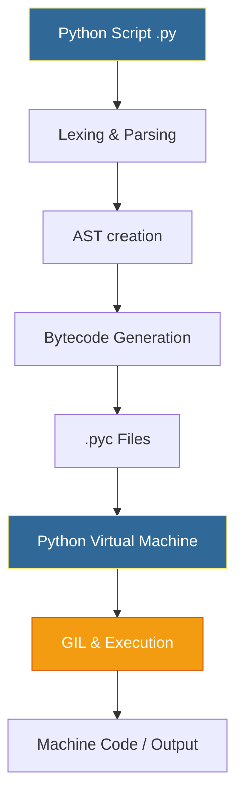
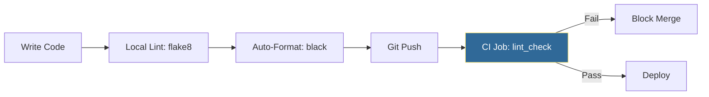

# 🐍 Python Fundamentals: The Foundation of DevOps Automation

> **"Bash is the glue for the OS, but Python is the glue for the Cloud. It turns complex infrastructure into manageable, readable code."**


## 📚 Overview

Python is the "lingua franca" of modern DevOps. Its readability, vast ecosystem, and strict adherence to clear structure make it the primary choice for automation that exceeds the range or complexity of Shell scripting. From managing Kubernetes clusters to orchestrating AWS deployments, Python provides the robustness and scalability required for enterprise infrastructure.

This module transitions you from a literal command-executor to an **Automation Architect**, capable of building reliable, data-driven systems.

## 🎓 Learning Objectives

By the end of this module, you will:

- ✅ Master **Pythonic Syntax** and the interpreter lifecycle.
- ✅ Implement **Dynamic Typing** and leverage **Type Hints** for production safety.
- ✅ Orchestrate **Control Flow** logic (Conditionals and Advanced Loops).
- ✅ Perform high-performance **String Manipulation** for log/config parsing.
- ✅ Adhere to **PEP 8 Standards** and CI/CD linting workflows.

---

## 🏗️ Python Execution Architecture: The Interpreter Lifecycle

Unlike compiled languages like C++ or Go, Python is an **Interpreted** language. However, "interpretation" is actually a sophisticated three-stage process. Understanding this lifecycle is crucial for debugging performance bottlenecks and understanding why Python scripts behave differently than Shell scripts.



### Detailed Breakdown

1. **Lexing & Parsing**: The interpreter reads your `.py` source code and breaks it into "tokens." If you forgot a colon (`:`) or have bad indentation, the script fails here with a `SyntaxError`.
2. **AST (Abstract Syntax Tree)**: Python builds a logical map of your code's hierarchy. This tree is what advanced linters and security scanners (like `Bandit`) analyze.
3. **Bytecode Compilation**: The code is converted into **CPython Bytecode**. This is a platform-independent intermediate language. You might see `__pycache__` folders containing `.pyc` files—these are cached bytecodes to speed up the next run.
4. **PVM (Python Virtual Machine)**: The engine that actually runs the code. It iterates through the bytecode and executes it.
5. **The GIL (Global Interpreter Lock)**: A critical concept for DevOps! The GIL ensures only one thread executes Python bytecode at a time. This is why Python is "Slow" for CPU-bound tasks but excellent for I/O-bound tasks (like calling Cloud APIs).

---

## 🚀 Core Concepts for Engineers

### 1. Variables & Data Types

- **Core Concept**: In Python, every variable is an object. Type Hints (PEP 484) allow for static typing in a dynamic language.
- **Why for DevOps**: Infrastructure code requires precision. Passing a string `"5"` instead of an integer `5` to a scaling function can crash a pipeline.
- **Real-World Scenario**: Defining resource quotas for a Kubernetes namespace where CPU limits must be floats and replica counts must be integers.

#### 🛠️ Production-Ready Type Hints (PEP 484)

In DevOps, we prioritize **clarity over brevity**. Type hints ensure your teammates know exactly what kind of data your function expects.

```python
# Resource Sizing (Integers & Floats)
instance_count: int = 5
cpu_limit: float = 0.75  # 75% vCPU

# Infrastructure metadata (Strings)
region: str = "us-east-1"
status_msg: str = "PROVISIONING_COMPLETE"

# Operational Flags (Booleans)
is_active: bool = True
dry_run: bool = False

# List of strings (Sever Names)
server_pool: list[str] = ["web-01", "web-02", "web-03"]
```

#### The DevOps Trio of Collections

| Structure | Syntax | Type | Best Use Case | Big-O Lookup |
| :--- | :--- | :--- | :--- | :--- |
| **List** | `[]` | Mutable | Ordered server lists, command steps. | O(n) |
| **Dict** | `{}` | Mutable | Config maps, JSON responses, metadata. | O(1) ✅ |
| **Tuple** | `()` | **Immutable**| Credentials, fixed API endpoints. | O(1) |

---

### 2. String Manipulation

- **Core Concept**: Slicing, f-strings, and splitting.

- **Why for DevOps**: We spend 80% of our time parsing text (logs, YAML, JSON, CLI output). Python is a powerhouse for this.
- **Real-World Scenario**: Extracting the timestamp and error code from a raw Nginx access log line to trigger an automated alert.

```python
# Modern Formatting: f-strings (The Gold Standard)
env = "staging"
port = 8080
health_url = f"http://{env}.internal:{port}/health"

# log cleanup - Removing noise
raw_log = "  [2026-01-20] [ERROR] DB Timeout #42  \n"
clean_msg = raw_log.strip().lower()  # "[2026-01-20] [error] db timeout #42"

# Fragmentation (Splitting logs)
log_parts = clean_msg.split(" ")
timestamp = log_parts[0]  # "[2026-01-20]"

# Batch Processing
lines = raw_log.splitlines() # Better than .split('\n') as it handles all OS types
```

---

### 3. Control Flow & Logic

- **Core Concept**: Conditionals, Loops, and the Guard Clause Pattern.

- **Why for DevOps**: Scripts must make decisions (e.g., "If the server is down, restart it") and handle lists of resources.
- **Real-World Scenario**: Iterating through a list of servers to apply patches, skipping those that are offline.

#### 🛡️ The Guard Clause Pattern

Avoid deep nesting (the "Arrowhead Antipattern"). Use guard clauses to exit early if conditions aren't met.

```python
# ❌ Deeply Nested (Hard to read)
def process_server(server):
    if server.is_active:
        if server.has_credentials:
            if server.ping():
                # Actual logic here...
                pass

# ✅ Guard Clauses (Professional)
def process_server(server):
    if not server.is_active: return
    if not server.has_credentials: return
    if not server.ping(): return
    
    # Actual logic here...
    print(f"Deploying to {server.name}")
```

#### Resilient Loops with `enumerate` and `zip`

```python
servers = ["web-01", "web-02"]
ips = ["10.0.0.1", "10.0.0.2"]

# Iterate over two lists simultaneously
for name, ip in zip(servers, ips):
    print(f"Assigning {ip} to {name}")

# The While-Retry Pattern (Essential for API calls)
import time
retries = 3
while retries > 0:
    if check_status("api.cloud.com"):
        print("API Online!")
        break
    retries -= 1
    time.sleep(2) # Exponential backoff should go here in real scripts!
```

---

## 🎨 PEP 8 Style Guide: The Professional Bar

In DevOps, "Code is Infrastructure." Your code must be as clean as your Terraform or K8s manifests. PEP 8 is the official style guide.

### The CI/CD Enforcement Loop

Professional teams don't just "hope" for clean code; they enforce it in the pipeline using tools:

- **Flake8**: Checks for PEP 8 violations.
- **Black**: The "uncompromising" code formatter. It reformats your code automatically.
- **Mypy**: Validates your Type Hints.



### ❌ "Dirty" Script vs ✅ "Pythonic" (PEP 8)

```python
# ❌ The "Hacker" Script
import os,sys
def Calc(x,y):
 return x*y
MYVAR="prod"
if x==True: print(MYVAR)

# ✅ The "Engineer" Script
import os
import sys

# Constants use UPPER_CASE
DEFAULT_ENV = "production"

def calculate_uptime(days: int, rate: float) -> float:
    """Calculates total uptime percentage."""
    return days * rate

if is_ready:
    print(f"Environment: {DEFAULT_ENV}")
```

---

## 🏆 Real-World DevOps Story: The Migration Normalizer

**The Scenario**: A major financial firm had 1,000+ server configurations stored in various text formats. Some used `SERVER_NAME`, others `HostName`, and some had inconsistent capitalization. This made it impossible to migrate to Terraform.

**The Discovery**: Shell scripting was too slow to handle the complex text processing. The attempt to use `sed` and `awk` became a "regex nightmare" that nobody could maintain.

**The Solution**: A Python script was written to parse every file line-by-line using the **Interpreter Lifecycle** knowledge (using `sys.argv` for inputs and `os.walk` for files), normalize keys to `snake_case`, validate data types using type hints to prevent errors, and output a single, unified JSON inventory.

**The Outcome**: The migration that was estimated to take 3 months was completed in 1 week, with 0% configuration drift.

---

## ❓ Interview Preparation (Python Basics)

1. **Q: What is the Python Global Interpreter Lock (GIL)?**
   - *A: It's a mutex that allows only one thread to hold control of the Python interpreter. This prevents race conditions but limits multi-threaded performance for CPU-intensive tasks. In DevOps, we usually overcome this by using `multiprocessing` or `asyncio` for I/O tasks.*

2. **Q: Why should you avoid `global` keywords in your scripts?**
   - *A: Global variables create hidden dependencies. If a variable changes unexpectedly, it’s hard to trace which function did it. Use function arguments and return values instead.*

3. **Q: Explain the difference between `list.append()` and `list.extend()`.**
   - *A: `append` adds the object as a single item (even if it's a list). `extend` iterates through the object and adds each element individually. If you're merging two server lists, use `extend`.*

4. **Q: What is "EAFP" vs "LBYL"?**
   - *A: Python prefers **EAFP** (Easier to Ask Forgiveness than Permission) using `try/except`. **LBYL** (Look Before You Leap) uses `if` statements. In things like file operations, EAFP is safer because the file could be deleted between the `if check` and the `open`.*

---

## 📝 Knowledge Check

1. **Which part of the interpreter handles colon syntax and Indentation?**
   - [ ] a) PVM
   - [x] b) Lexer/Parser
   - [ ] c) Bytecode cached file

2. **What is the Big-O complexity of searching for a key in a Dictionary?**
   - [x] a) O(1)
   - [ ] b) O(n)
   - [ ] c) O(log n)

3. **Which tool is used to automatically format Python code to PEP 8 standards?**
   - [ ] a) Flake8
   - [x] b) Black
   - [ ] c) Bandit

4. **True or False: The Global Interpreter Lock (GIL) makes Python bad at calling multiple APIs simultaneously.**
   - [ ] a) True
   - [x] b) False (API calls are I/O. The thread releases the GIL while waiting for the network, making multi-threading or async perfect for this).

5. **What is the result of `f"{5 + 5}"`?**
   - [ ] a) "5+5"
   - [x] b) "10"
   - [ ] c) Error

---

## 🔗 Next Steps

Ready to organize complex datasets?

Proceed to: **[Data Structures →](../Part-02-Data-Structures/README.md)**
