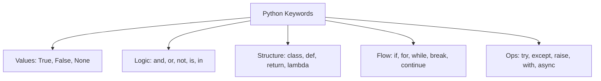

# Python Keywords Reference
*The Foundation of Automation Logic*

Keywords are reserved words in Python that have special meaning to the interpreter. You cannot use them as variable names, function names, or any other identifier.

---

## 📋 Table of Contents
1. [Value Keywords](#value-keywords)
2. [Operator Keywords](#operator-keywords)
3. [Control Flow](#control-flow)
4. [Structure & Scoping](#structure--scoping)
5. [Exception Handling](#exception-handling)
6. [Asynchronous Programming](#asynchronous-programming)
7. [Import & Context](#import--context)
8. [Deletion](#deletion)
9. [Syntax Hierarchy Visualization](#syntax-hierarchy-visualization)
10. [Pro-Tip: Keywords vs Built-ins](#pro-tip-keywords-vs-built-ins)

---

## 💎 Value Keywords
Represent constant values in Python.

### `True`
*   **Definition**: The Boolean "true" value.
*   **Context**: `is_server_up = True`
*   **Snippet**:
    ```python
    is_active = True
    if is_active:
        print("Monitoring service is running.")
    ```

### `False`
*   **Definition**: The Boolean "false" value.
*   **Context**: `maintenance_mode = False`
*   **Snippet**:
    ```python
    debug_mode = False
    if not debug_mode:
        print("Production logging level enabled.")
    ```

### `None`
*   **Definition**: A special constant representing the absence of a value or a null value.
*   **Context**: `result = None`
*   **Snippet**:
    ```python
    api_response = None
    if api_response is None:
        print("Pending response from Nexus registry...")
    ```

---

## 🧮 Operator Keywords
Used for logical operations and membership testing.

### `and`
*   **Definition**: Logical AND; true if both statements are true.
*   **Context**: `if x and y:`
*   **Snippet**:
    ```python
    if cpu_usage > 80 and ram_usage > 90:
        trigger_alert("Critical Resource Depletion")
    ```

### `or`
*   **Definition**: Logical OR; true if one of the statements is true.
*   **Context**: `if error or warning:`
*   **Snippet**:
    ```python
    if status == 500 or status == 503:
        initiate_retry_logic()
    ```

### `not`
*   **Definition**: Logical NOT; reverses the Boolean result.
*   **Context**: `if not found:`
*   **Snippet**:
    ```python
    if not os.path.exists("/var/log/nginx/error.log"):
        create_log_directory()
    ```

### `in`
*   **Definition**: Checks if a value is present in a sequence (list, string, etc.).
*   **Context**: `if user in admin_list:`
*   **Snippet**:
    ```python
    active_services = ["nginx", "docker", "ssh"]
    if "docker" in active_services:
        print("Docker daemon is in the active list.")
    ```

### `is`
*   **Definition**: Tests object identity (checks if two variables point to the same object).
*   **Context**: `if obj is None:`
*   **Snippet**:
    ```python
    def check_health(server=None):
        if server is None:
            server = "localhost"
    ```

---

## 🛣️ Control Flow
Direct the path your script takes based on logic or loops.

### `if`, `elif`, `else`
*   **Definition**: Conditional statements for branching logic.
*   **Context**: `if X: elif Y: else: Z`
*   **Snippet**:
    ```python
    if disk_free < 5:
        clean_tmp()
    elif disk_free < 15:
        compress_old_logs()
    else:
        print("Storage healthy.")
    ```

### `for`
*   **Definition**: Used to create a loop that iterates over a sequence.
*   **Context**: `for item in list:`
*   **Snippet**:
    ```python
    hosts = ["10.0.0.1", "10.0.0.2", "10.0.0.3"]
    for ip in hosts:
        ping_status = os.system(f"ping -c 1 {ip}")
    ```

### `while`
*   **Definition**: Used to create a loop that continues as long as a condition is true.
*   **Context**: `while status == 'pending':`
*   **Snippet**:
    ```python
    while retry_count < 3:
        if attempt_deploy(): break
        retry_count += 1
    ```

### `break`
*   **Definition**: Terminates the loop prematurely.
*   **Context**: `if error: break`
*   **Snippet**:
    ```python
    for log in logs:
        if "CRITICAL" in log:
            send_emergency_page(log)
            break
    ```

### `continue`
*   **Definition**: Jumps to the next iteration of the loop.
*   **Context**: `if skip: continue`
*   **Snippet**:
    ```python
    for file in os.listdir("."):
        if file.endswith(".tmp"): continue
        process_file(file)
    ```

### `pass`
*   **Definition**: A null statement; a placeholder that does nothing.
*   **Context**: `def future_function(): pass`
*   **Snippet**:
    ```python
    try:
        optional_cleanup()
    except OSError:
        pass # Ignore errors if cleanup fails
    ```

---

## 🏗️ Structure & Scoping
Defining the architecture and scope of your data and logic.

### `def`
*   **Definition**: Used to define a function.
*   **Context**: `def check_status():`
*   **Snippet**:
    ```python
    def rotate_logs(path):
        os.rename(path, path + ".old")
    ```

### `class`
*   **Definition**: Used to define a user-defined object (class).
*   **Context**: `class ServerAgent:`
*   **Snippet**:
    ```python
    class DeploymentPipeline:
        def __init__(self, env):
            self.env = env
    ```

### `lambda`
*   **Definition**: Used to create small, anonymous functions.
*   **Context**: `func = lambda x: x + 1`
*   **Snippet**:
    ```python
    # Filter only unhealthy nodes
    unhealthy = list(filter(lambda n: n.status == 'DOWN', cluster_nodes))
    ```

### `return`
*   **Definition**: Exits a function and returns a value.
*   **Context**: `return total_errors`
*   **Snippet**:
    ```python
    def get_version():
        return open("VERSION").read().strip()
    ```

### `yield`
*   **Definition**: Pauses a function and returns a generator value.
*   **Context**: `yield log_line`
*   **Snippet**:
    ```python
    def stream_logs(logfile):
        with open(logfile) as f:
            for line in f: yield line
    ```

### `global`
*   **Definition**: Declares that a variable inside a function is global.
*   **Context**: `global config`
*   **Snippet**:
    ```python
    def update_config(val):
        global SETTINGS
        SETTINGS = val
    ```

### `nonlocal`
*   **Definition**: Declares that a variable belongs to an outer (nesting) function.
*   **Context**: `nonlocal status`
*   **Snippet**:
    ```python
    def outer():
        count = 0
        def inner():
            nonlocal count
            count += 1
    ```

---

## 🛡️ Exception Handling
Managing errors and system failures gracefully.

### `try`, `except`, `finally`
*   **Definition**: Catch and handle exceptions or run cleanup code.
*   **Context**: `try: except: finally:`
*   **Snippet**:
    ```python
    try:
        connect_to_database()
    except ConnectionError:
        log_failure()
    finally:
        close_socket()
    ```

### `raise`
*   **Definition**: Manually triggers an exception.
*   **Context**: `raise ValueError("Invalid Port")`
*   **Snippet**:
    ```python
    if port < 1024:
        raise PermissionError("Privileged port access requires root.")
    ```

### `assert`
*   **Definition**: For debugging; checks if a condition is true, else raises AssertionError.
*   **Context**: `assert len(config) > 0`
*   **Snippet**:
    ```python
    # Verify artifact exists before deploying
    assert os.path.exists("app.tar.gz"), "Deployment artifact missing!"
    ```

---

## ⚡ Asynchronous Programming
Concurrency for non-blocking I/O operations.

### `async`
*   **Definition**: Designates a function as a coroutine.
*   **Context**: `async def gather_metrics():`
*   **Snippet**:
    ```python
    async def fetch_api(url):
        return await client.get(url)
    ```

### `await`
*   **Definition**: Suspends execution of a coroutine until a value is ready.
*   **Context**: `data = await fetch_api()`
*   **Snippet**:
    ```python
    async def main():
        result = await fetch_api("https://api.monitoring.io")
    ```

---

## 📦 Import & Context
Handling external modules and resource management.

### `import`, `from`, `as`
*   **Definition**: Bring code from other modules into current script.
*   **Context**: `from sys import path as syspath`
*   **Snippet**:
    ```python
    import json
    from datetime import datetime as dt
    print(f"Sync started at: {dt.now()}")
    ```

### `with`
*   **Definition**: Simplifies exception handling by encapsulating common cleanup tasks (context managers).
*   **Context**: `with open('file.txt') as f:`
*   **Snippet**:
    ```python
    with open("/etc/hosts", "r") as hosts:
        content = hosts.readlines()
    # File closes automatically here
    ```

---

## 🗑️ Deletion
Removing objects or references.

### `del`
*   **Definition**: Deletes a reference to an object or element.
*   **Context**: `del list_item`
*   **Snippet**:
    ```python
    env_vars = {"TOKEN": "xyz", "TMP": "/tmp"}
    del env_vars["TOKEN"] # Remove sensitive data from memory
    ```

---

## 📊 Syntax Hierarchy Visualization



---

## 💡 Pro-Tip: Keywords vs Built-ins
New developers often confuse **Keywords** with **Built-in Functions**.

*   **Keywords** (e.g., `if`, `def`, `with`) are part of the core language syntax. You cannot shadow them or delete them. They have no parentheses.
*   **Built-in Functions** (e.g., `print()`, `len()`, `dir()`) are functions that are always available in the `__builtins__` module. Technically, you *can* overwrite them (like `print = 5`), though it's a terrible practice!

**Rule of Thumb**: If you can't use it as a variable name, it's a **Keyword**.

---
**Next Step**: [Variables and Data Types →](../02-Variables-Data-Types/README.md)
