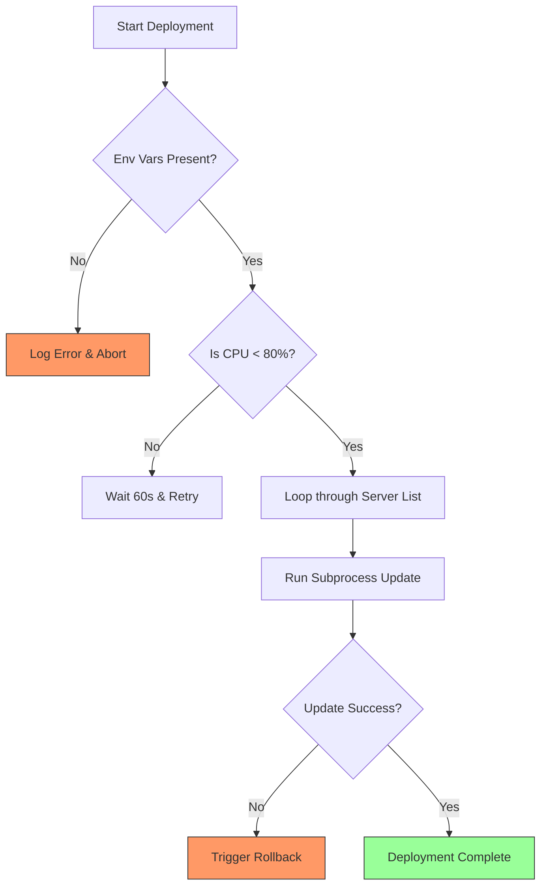

# 🚦 Control Flow: The Decision-Making Brain & Iteration Loop

> **"A script without control flow is a static list. A script with professional control flow is an intelligent agent capable of remediating infrastructure, validating global states, and managing massive server inventories."**


## 🏗️ Visual Architecture: The Deployment Guard

In DevOps, control flow isn't just about `if/else`; it's about building "Gating Logic" that protects production from invalid states.



---

## 📚 Curriculum Breakdown

### 1. The `if` Statement: Truth Testing
At its core, an `if` statement evaluates whether an expression is `True` or `False`.

#### 💡 Truthy vs. Falsy
In Python, every object has an inherent boolean value.
*   **Falsy Values**: `None`, `False`, `0`, `0.0`, `""` (empty string), `[]` (empty list), `{}` (empty dict).
*   **Truthy Values**: Almost everything else.

**DevOps Example: Checking for Empty Lists**
```python
active_servers = get_inventory()

if active_servers:
    print(f"Deploying to {len(active_servers)} nodes.")
else:
    print("Warning: No active servers found in inventory.")
```

### 2. The "Guard Clause" Pattern
In senior engineering, we avoid "Nested If Hell." We use **Guard Clauses** to exit early when conditions aren't met.

**🔴 Amateur Pattern:**
```python
if authenticated:
    if server_alive:
        if disk_space > 100:
            perform_task()
```

**🟢 Professional Pattern (Guard Clauses):**
```python
def run_backup(disk_space: int, is_authenticated: bool) -> None:
    if not is_authenticated:
        return print("Error: Unauthenticated")  # EXIT EARLY
    
    if disk_space < 100:
        return print("Error: Low Disk Space")    # EXIT EARLY

    # Success logic is kept flat and readable
    print("Initiating production backup...")
```

### 3. Multi-Condition Branching: `elif` and `else`
When one condition isn't enough, we use `elif` (else if) to chain multiple checks. Keep your logic flat by using `elif` instead of nesting.

**DevOps Pattern: Resource Thresholds**
```python
cpu_percent = 85.5

if cpu_percent > 90:
    status = "🚨 CRITICAL"
elif cpu_percent > 75:
    status = "⚠️ WARNING"
elif cpu_percent > 50:
    status = "ℹ️ MODERATE"
else:
    status = "✅ HEALTHY"
```

### 4. Logical Operators: `and`, `or`, `not`
Combine multiple conditions into a single evaluation.
*   **`and`**: Both must be True.
*   **`or`**: At least one must be True.
*   **`not`**: Reverses the boolean value.

**Example: Multi-Factor Validation**
```python
if is_admin and not is_read_only:
    delete_database("prod_vault")
```

### 5. Conditional Expressions (Ternary Operator)
Write simple `if/else` logic in a single line: `result = <ValueIfTrue> if <Condition> else <ValueIfFalse>`

```python
mode = "DEBUG" if os.getenv("DEBUG") == "True" else "PRODUCTION"
```

### 6. Structural Pattern Matching (`match-case`)
The modern (3.10+) way to handle complex deployment actions or HTTP status codes without `if/elif` spaghetti.

```python
def handle_http_status(status_code: int):
    match status_code:
        case 200 | 201:
            return "Success"
        case 404:
            return "Not Found"
        case 500 | 502 | 503:
            return "Server Error (Retry recommended)"
        case _:
            return "Unknown Status"
```

### 7. Multi-Target Iteration (The Loop)
Processing 1,000 servers one by one is slow; processing them with a **For Loop** is orchestration. We combine `for` loops with `if` statements to filter inventories.

---

## 🚀 DevOps Practical Applications

### 🛠️ Example A: OS Detection (Cross-Platform)
Automate differently based on the underlying kernel.
```python
import platform

current_os = platform.system()

if current_os == "Linux":
    cmd = "ls -la"
elif current_os == "Windows":
    cmd = "dir"
else:
    cmd = "echo Unsupported OS"
```

### 🔐 Example B: Access Control
Validate permissions before executing dangerous tasks.
```python
allowed_users = ["alice", "bob", "charlie"]
current_user = get_current_user()

if current_user in allowed_users:
    print("Permission Granted. Running update...")
else:
    print("Permission Denied. Incident will be reported.")
```

---

## 🏆 DevOps Story: "The Infinite Loop that Melted a Sandbox API"
**The Scenario:** A junior engineer wrote a `while True` loop to poll a cloud provider for a status change.
**The Problem:** They forgot to add a `time.sleep()`. The script sent 50,000 requests in 30 seconds, inadvertently DDoS-ing the internal development API and triggering a security lockout.
**The Lesson:** Professional control flow always includes **Exit Conditions** and **Backoff Timing**.

---

## 🚀 Real-World Scenario: The Migration Normalizer
You are given a list of legacy server hostnames. Some are `UP`, some are `DOWN`, and some are `MAINTENANCE`. You must iterate through them and only trigger a migration for those that are `UP`.

```python
from typing import List, Dict

inventory: List[Dict[str, str]] = [
    {"name": "web-01", "status": "UP"},
    {"name": "db-01", "status": "DOWN"},
    {"name": "cache-01", "status": "UP"}
]

def migrate_active_nodes(nodes: List[Dict[str, str]]) -> None:
    for node in nodes:
        # Business Logic: Filter out inactive nodes
        if node["status"] != "UP":
            print(f"Skipping {node['name']} - Status is {node['status']}")
            continue
            
        print(f"🚀 Triggering migration for: {node['name']}")

migrate_active_nodes(inventory)
```

---

## ❓ Interview Preparation (Control Flow)

1. **Q: Why are Guard Clauses preferred over nested `if` statements in production code?**
   - *A: Guard Clauses reduce "Cognitive Load." By handling errors at the top and exiting early, the functional logic stays at a single indentation level, making it easier to read and test.*

2. **Q: How does `continue` differ from `break` in a log-parsing loop?**
   - *A: `continue` skips the current log line and moves to the next one (useful for ignoring noise). `break` exits the loop entirely (useful if you found a critical error and need to stop processing immediately).*

3. **Q: When would you use `match-case` instead of an `if/elif` chain?**
   - *A: Use `match-case` when you have more than 3-4 conditions or when you are "Destructuring" complex data like API responses or JSON headers.*

4. **Q: Explain the potential danger of a `while` loop in a cloud automation script.**
   - *A: `while` loops can become "Infinite" if the exit condition is never met (e.g., waiting for a server that crashed). Always implement a maximum retry or timeout counter.*

---

## 📝 Knowledge Check

1. **Which value is considered "Falsy" in a Python if-statement?**
   - [ ] a) `"False"` (String)
   - [x] b) `[]` (Empty List)
   - [ ] c) `[0]` (List with Zero)
   - [ ] d) `1`

2. **What happens in the "For-Else" construct?**
   - [ ] a) The `else` block runs if the loop is broken by a `break`.
   - [x] b) The `else` block runs only if the loop finishes naturally (no `break`).
   - [ ] c) It is a syntax error.

3. **What is the numeric value of `status` if `cpu = 60` after `status = "ALARM" if cpu > 80 else "OK"`?**
   - [ ] a) ALARM
   - [x] b) OK
   - [ ] c) 60

4. **How do you make a loop skip the rest of its code and go to the next item?**
   - [ ] a) `return`
   - [x] b) `continue`
   - [ ] c) `break`
   - [ ] d) `pass`

5. **Why use Type Hints (e.g., `cpu: int`) in a control flow script?**
   - [x] a) To prevent logic errors where a string is accidentally compared to a number.
   - [ ] b) To make the code run faster.
   - [ ] c) Because Python requires them for `if` statements.

---

## 🧪 Deep-Dive & Labs
- **[Lab: The Multi-Server Validator](./CHALLENGES.md)**
