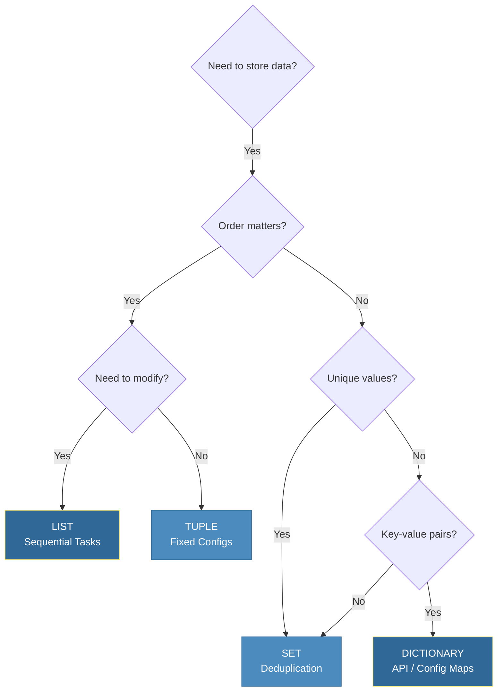

# 📊 Python Data Structures: The Engine of Data-Driven Automation

> **"Algorithms + Data Structures = Programs. In DevOps, the right data structure is the difference between a high-performance automation suite and a script that crashes your production monitoring."**


## 📚 Overview

Raw strings and numbers are just the building blocks; **Data Structures** are the blueprints. Whether you are parsing a multi-gigabyte log file, state-tracking 1,000+ EC2 instances, or managing complex Kubernetes configurations, Python's built-in data structures provide the performance and flexibility needed for enterprise-scale automation.

This module moves you beyond "storing values" to **orchestrating data flows** efficiently. We will analyze why a `set` can be 1,000x faster than a `list` for security audits and how `dictionaries` enable the seamless JSON/YAML transformations at the heart of modern CI/CD.

## 🎓 Learning Objectives

By the end of this module, you will:

- ✅ Master the **DevOps Trio**: Lists, Dictionaries, and Sets.
- ✅ Implement **Complex Data Nesting** for API response handling.
- ✅ Leverage **List & Dict Comprehensions** for high-performance data filtering.
- ✅ Understand **Hashed Lookups** and Big-O efficiency for automation.
- ✅ Perform **Set Operations** for infrastructure "Drift Detection."

---

## 🏗️ The Architectural Decision Tree

Choosing the wrong structure is the #1 cause of performance degradation in automation.



---

## 🚀 Core Data Structures for Engineers

### 1. Lists (`list`): The Workflow Sequentializer

Lists are ordered, mutable sequences. Think of them as a "Deployment pipeline" where the order of operations is critical.

#### Professional Pattern: List Comprehension

List comprehensions are the "Swiss Army Knife" of Python. They are faster than `for` loops and much more readable for data filtering.

```python
# The Traditional Way (Slow & Verbose)
all_nodes = ["web-01", "db-01", "web-02", "cache-01"]
web_nodes = []
for node in all_nodes:
    if node.startswith("web"):
        web_nodes.append(node)

# The DevOps Way (Fast & Elegant)
web_nodes = [node for node in all_nodes if node.startswith("web")]
```

#### Performance Analysis: The Shift Penalty

- **Append**: O(1) - Adding to the end is instant.
- **Insert/Pop(0)**: **O(n)** - Adding/Removing from the front requires shifting every other item in memory. Avoid this for large datasets!

---

### 2. Dictionaries (`dict`): The Configuration Powerhouse

Dictionaries are key-value mappings. They are the native Python equivalent of JSON objects.

#### Deep Nesting & Safe Access

In DevOps, API responses are often deeply nested. Accessing them with `d['key']` can lead to crashes if a key is missing.

```python
# The Professional Pattern: Recursive .get() or DefaultDict
server_manifest = {
    "specs": {"cpu": 4, "ram": 16},
    "tags": ["prod", "us-east-1"]
}

# ❌ Risky: crashes if 'metadata' key is missing
# region = server_manifest["metadata"]["region"]

# ✅ Safe: Returns None or a default value
region = server_manifest.get("metadata", {}).get("region", "unknown")
```

#### The Hashing Magic (O(1) Lookup)

Dictionaries use **Hash Tables**. When you search for a key, Python doesn't look through the whole list; it goes directly to the "address" of that key. This makes Dictionaries the best choice for storing state IDs.

---

### 3. Sets (`set`): The "Drift Detection" Tool

Sets are unordered collections of **unique** items. In DevOps, sets are used to perform high-speed membership testing and mathematical comparisons.

#### Real-World Use Case: Infrastructure Drift

```python
current_infrastructure = {"web-01", "web-02", "db-01"}
desired_state = {"web-01", "web-02", "web-03", "db-01"}

# Find what's missing (The Drift)
to_be_provisioned = desired_state - current_infrastructure  # {"web-03"}

# Find extra resources (Manual Taint)
to_be_terminated = current_infrastructure - desired_state   # Set()
```

---

### 4. Tuples (`tuple`): The Immutable Contract

Tuples are fixed sequences. Once created, they cannot be changed. This makes them safer for credentials or configuration settings that should remain constant during script execution.

```python
# Protecting Constants
DB_CREDENTIALS = ("admin", "super-secret-pass", 5432)

# Unpacking pattern (Powerful for return values)
user, password, port = DB_CREDENTIALS
```

---

## 📈 Performance Comparison Matrix

| Operation         | List                     | Dict / Set                | Best Use Case                      |
| :---------------- | :----------------------- | :------------------------ | :--------------------------------- |
| Search (`x in c`) | O(n) (Slows as it grows) | **O(1)** (Always instant) | Permission checks, IP allow-lists. |
| **Insert/Delete** | O(n) (Requires shifting) | **O(1)**                  | Dynamic configuration maps.        |
| **Memory Usage**  | Small                    | Large (Hashing overhead)  | Choose based on data scale.        |
| **Persistence**   | Ordered                  | Unordered (conceptual)    | Step-based scripts (Lists).        |

---

## 🏆 Real-World DevOps Story: The 10x Speedup

**The Scenario**: A log analysis script at a global CDN took 45 minutes to find duplicate error patterns across 10GB of daily logs.

**The Discovery**: The script used a `list` to store "seen" patterns. For every new line in the log, it checked: `if current_error in seen_list`. As the list grew to thousands of patterns, Python had to scan the *entire list* for every single log line.

**The Solution**: The engineer changed just one line: `seen_list = []` became `seen_set = set()`.

**The Outcome**: Because sets use O(1) hashing, checking for existence was instant regardless of size. The runtime dropped from **45 minutes to 4 minutes**. This simple change saved the company thousands in compute costs and improved incident response time.

---

## ❓ Interview Preparation (Data Structures)

1. **Q: Why is a dictionary key required to be "hashable" (immutable)?**
   - *A: If a key's value changed, its hash would change, and the dictionary would lose track of where the value is stored in memory. Integers, strings, and tuples are hashable; lists and dicts are NOT.*

2. **Q: How do you efficiently merge two configuration dictionaries in Python 3.9+?**
   - *A: Use the union operator: `merged_config = dict_a | dict_b`. This is faster and more readable than the older `.update()` method.*

3. **Q: When is a List better than a Set?**
   - *A: 1. When insertion order matters (e.g., a history of commands). 2. When you need to store duplicate values. 3. When memory is extremely limited and O(n) search time is acceptable for small datasets.*

4. **Q: What is a "Dictionary Comprehension"?**
   - *A: A concise way to transform one dictionary into another. Example: `{k: v.lower() for k, v in env_vars.items()}`. It’s highly efficient for normalizing environment variables.*

5. **Q: Explain the difference between `list.pop()` and `list.pop(0)`.**
   - *A: `pop()` removes the last element and is O(1). `pop(0)` removes the first element and is O(n) because it has to shift every other item in memory to fill the gap.*

---

## 📝 Knowledge Check

1. **Which structure is best for checking if an IP is in a "Blacklist" of 100,000 entries?**
   - [ ] a) List
   - [x] b) Set
   - [ ] c) Tuple

2. **True or False: A dictionary key can be a List.**
   - [ ] a) True
   - [x] b) False (Lists are mutable and not hashable).

3. **What is the result of `["web", "db"] * 2`?**
   - [ ] a) `["webweb", "dbdb"]`
   - [x] b) `["web", "db", "web", "db"]`
   - [ ] c) Error

4. **Which set operation finds common elements in both sets?**
   - [ ] a) Difference (`-`)
   - [x] b) Intersection (`&`)
   - [ ] c) Union (`|`)

5. **Why use List Comprehensions instead of map/filter?**
   - [x] a) Better readability and usually faster in Python.
   - [ ] b) They use less memory.
   - [ ] c) They allow for multi-threading.

---

## 🔗 Next Steps

Now that you can manage complex data, let's learn how to process it with modular logic.

Proceed to: **[Functions and Modules →](../Part-03-Functions-and-Modules/README.md)**
