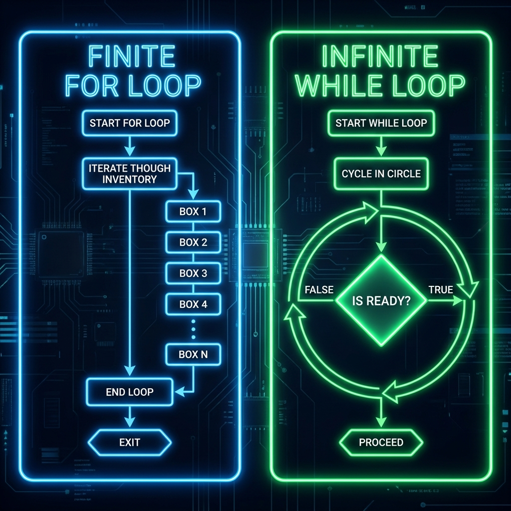
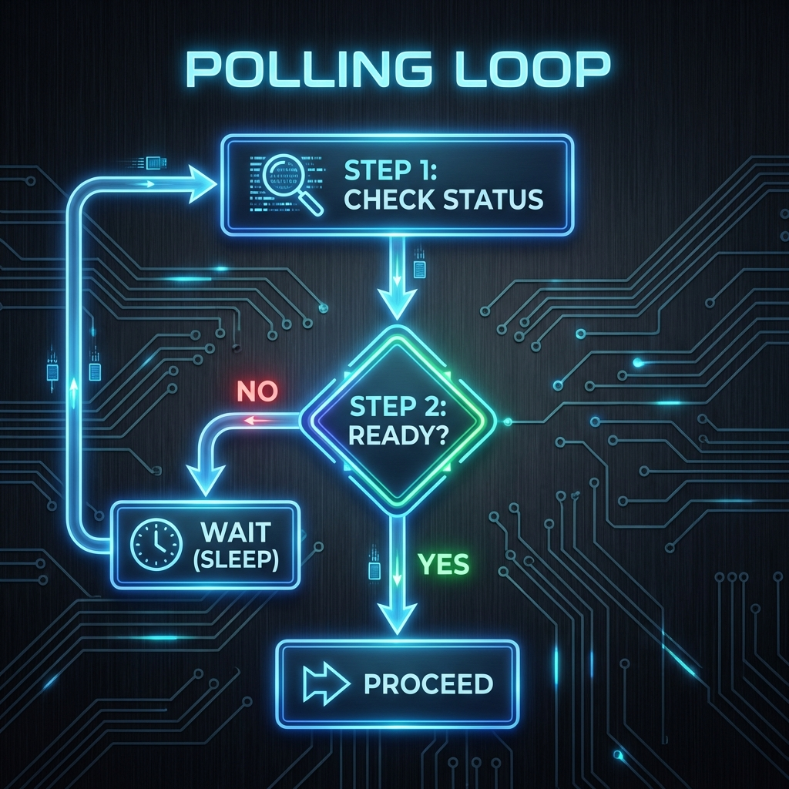

# 🔄 Iterative Logic: The Engine of Automation

> **"If you do it once, it's a task. If you do it 1,000 times, it's automation. Loops are the gears that turn a single line of code into a fleet-wide operation."**



## 📚 Overview

In DevOps, we never manage "a server"—we manage "groups of servers." Whether you are patching 500 EC2 instances, parsing 10,000 lines of logs, or waiting for a Kubernetes Pod to become `Ready`, you are using **Iterative Logic**.

This module moves beyond "math loops" (counting to 10) and introduces **Automation Patterns**: The **Inventory Loop**, the **Polling Loop**, and the **High-Performance Filter**.

## 🎓 Learning Objectives

By the end of this module, you will:

- ✅ Master the **Inventory Loop** (`for`) for mass-management.
- ✅ Implement **Polling/Retry Logic** (`while`) for cloud delays.
- ✅ Transform data instantly with **List Comprehensions**.
- ✅ Use **Enumerate & Zip** for context-aware iteration.
- ✅ Control flow with `break`, `continue`, and `else`.

---

## 🏗️ The Three DevOps Loop Patterns

### 1. The Inventory Loop (`for`)
**Use Case**: You have a defined list of assets (IPs, Users, Files) and you need to apply an action to each one.

```python
servers = ["web-01", "db-01", "cache-01"]

# The "For-Each" Pattern
for server in servers:
    print(f"Connecting to {server}...")
    # ssh.connect(server)
    print(f"✅ Patching complete for {server}")
```

### 2. The Retry/Polling Loop (`while`)
**Use Case**: You are waiting for an external state to change (e.g., waiting for an AWS Instance to boot). You don't know *when* it will happen, just that you must wait until it does.



```python
import time
import random

status = "PENDING"
retries = 0
max_retries = 5

while status != "RUNNING":
    if retries >= max_retries:
        print("❌ Timeout: Server failed to start.")
        break
    
    print(f"Current status: {status}. Waiting...")
    time.sleep(2) # Wait before polling again
    
    # Simulate a status change
    if random.random() > 0.7:
        status = "RUNNING"
    
    retries += 1
else:
    # Runs ONLY if the loop exits purely (no break)
    print("✅ Server is RUNNING! Proceeding with deployment.")
```

### 3. The High-Performance Filter (List Comprehensions)
**Use Case**: You need to filter a raw list of data into a clean list, instantly. This is more "Pythonic" and faster than a standard loop.
```python
raw_inventory = ["web-prod", "db-prod", "web-dev", "test-01"]

# OLD WAY (3 lines)
prod_servers = []
for s in raw_inventory:
    if "prod" in s:
        prod_servers.append(s)

# ✅ DEVOPS WAY (1 line)
# [expression for item in list if condition]
prod_servers = [s for s in raw_inventory if "prod" in s]

print(f"Production Targets: {prod_servers}")
```

---
## 🛠️ Professional Coding Tools

### 1. The `enumerate()` Pattern
**Problem**: You are looping through a file, but you need the **Line Number** for logging.
**Solution**: `enumerate()` gives you both the index and the value.
```python
logs = ["INFO: Started", "ERROR: DB Crash", "INFO: Recovered"]

for line_num, log in enumerate(logs, start=1):
    if "ERROR" in log:
        print(f"🚨 Found issue on Line {line_num}: {log}")
```
### 2. The `zip()` Pattern
**Problem**: You have two separate lists (e.g., Hostnames and IP Addresses) and you need to join them.
**Solution**: `zip()` stitches them together in lock-step.
```python
hosts = ["web-01", "db-01"]
ips = ["10.0.0.5", "192.168.1.50"]

for host, ip in zip(hosts, ips):
    print(f"Host: {host} -> IP: {ip}")
```
### 3. Loop Control: The "Eject" Buttons

| Keyword    | Action               | DevOps Example                                                                    |
| :--------- | :------------------- | :-------------------------------------------------------------------------------- |
| `break`    | **Exit Immediately** | If a critical failure occurs, stop the entire deployment to prevent damage.       |
| `continue` | **Skip to Next**     | If a server is "Offline", skip it and try the next one. Don't crash.              |
| `else`     | **Completion Check** | Run code *only* if the loop finished checking ALL items without finding an error. |

---
## 🏆 Real-World Scenario: The Log Scraper
**Task**: Loop through a multi-line log string. Skip any "INFO" lines (noise). Catch and collect "ERROR" lines. Stop processing if a "CRITICAL" security breach is found.
```python
log_data = """
INFO: System Boot
WARN: CPU High
INFO: Job Started
ERROR: Connection Timeout
ERROR: Database Locked
INFO: Job Finished
"""

error_report = []

# Split string into a list of lines
for line in log_data.strip().split("\n"):
    
    # 1. Skip Noise
    if "INFO" in line:
        continue 
        
    # 2. Critical Stop
    if "CRITICAL" in line:
        print("🚨 SECURITY BREACH! HALTING PARSE!")
        break
        
    # 3. Collect Errors
    if "ERROR" in line:
        error_report.append(line)

print(f"Run Complete. Found {len(error_report)} errors: {error_report}")
```

---
## ❓ Interview Preparation (Loops)
1.  **Q: Why is it generally safer to use a `for` loop over a `while` loop when iterating through fixed infrastructure inventories?**
    *   *A: A `for` loop is "Finite" by design—it runs exactly once for each item in the collection and then stops. A `while` loop runs based on a condition, which creates the risk of an "Infinite Loop" if the exit condition is never met (e.g., a server that never responds).*

2.  **Q: What is the purpose of the `for-else` block?**
    *   *A: The `else` block executes **only if the loop completes successfully** without hitting a `break` statement. It is useful for search algorithms: "Check all items; if you didn't find the target (break), then run the `else` block to say 'Not Found'."*

3.  **Q: How do you modify a list while iterating over it?**
    *   *A: **Trick Question!** You should NEVER modify a list while iterating over it, as it causes skip/index errors. Instead, iterate over a copy (`for item in list[:]`) or creation of a new list using a List Comprehension.*

---

## 📝 Knowledge Check

1.  **Which keyword is used to skip the rest of the current loop iteration and move to the next one?**
    - [ ] a) `break`
    - [ ] b) `pass`
    - [x] c) `continue`

2.  **What does `range(5)` generate?**
    - [ ] a) `[1, 2, 3, 4, 5]`
    - [x] b) `[0, 1, 2, 3, 4]`
    - [ ] c) `[1, 2, 3, 4, 5, 6]`

3.  **If you need to loop until a server returns "Status: OK", which loop structure is best?**
    - [ ] a) `for`
    - [x] b) `while`
    - [ ] c) `enumerate`

4.  **What is the output of `[x*2 for x in [1, 2]]`?**
    - [ ] a) `[1, 2]`
    - [x] b) `[2, 4]`
    - [ ] c) `[1, 2, 1, 2]`

---
## 🔗 Next Steps
Now that you can iterate through data, let's learn how to store and organize it efficiently.

Proceed to: **[04. Data Structures](../04-Data-Structures/README.md)**
