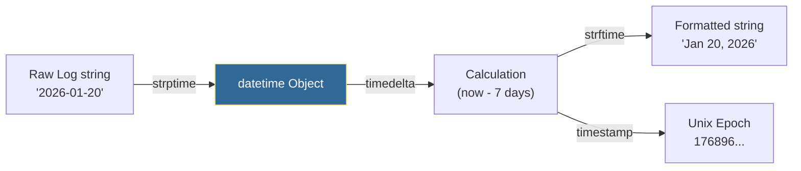

# 🕒 Datetime Operations: The Chronograph of Automation

> **"In the DevOps world, 'when' is just as important as 'what'. If your automation can't handle timezones, offsets, and durations, your production schedule will eventually drift into chaos."**

> **⚠️ Missing Image**: *Python Data Flow* ('../assets/python_data_flow.png')

## 📚 Overview

Time is the most difficult variable to manage in distributed systems. Between Unix Epochs, ISO strings, and the dreaded "Daylight Savings" shift, a single mistake in datetime logic can lead to missed backups, incorrect billing cycles, or "phantom" outages where deployments happen 5 hours too early.

Python's `datetime` module is a robust engine for managing this complexity. This module moves you past simple "now" calls to building **Global-Aware Automation** that can calculate SLA compliance, parse massive log timestamps, and schedule maintenance windows across multiple continents without missing a beat.

## 🎓 Learning Objectives

By the end of this module, you will:

- ✅ Master the **Serialization Flow** (From String to Object to Timestamp).
- ✅ Implement **Timezone-Aware Automation** to prevent "Local Time Drift."
- ✅ Orchestrate **Duration Logic** using `timedelta` (e.g., Log Retention).
- ✅ Parse **Complex Log Timestamps** using `strptime` pattern matching.
- ✅ Understand the **Unix Epoch** and its role in modern cloud storage.

---

## 🏗️ The Datetime Workflow

DevOps engineers spend most of their "time" work in three states: Parsing, Calculation, and Formatting.



### 🧠 The Mnemonic: S-T-R-P vs S-T-R-F
*   **`strptime`**: (P)arsing. String → Object. "String **P**arse Time."
*   **`strftime`**: (F)ormatting. Object → String. "String **F**ormat Time."

---

## 🚀 Professional Patterns for Engineers

### 1. The Production Rule: Always Use Aware UTC
Never use `datetime.now()` in a server script. It uses the server's local time, which varies by data center. Always use **Timezone-Aware UTC**.

```python
from datetime import datetime, timezone

# ❌ BAD: 'Naive' time (No timezone info)
# local_fail = datetime.now()

# ✅ GOOD: 'Aware' time (UTC)
production_time = datetime.now(timezone.utc)
print(production_time.isoformat()) # 2026-01-20T20:55:00+00:00
```

### 2. Time-Based Logic (Log Retention)
Calculating if a file is "Too Old" is a common cleanup task.

```python
from datetime import datetime, timedelta, timezone

def is_stale(file_date_str, days_threshold=30):
    # 1. Parse string to object
    file_dt = datetime.fromisoformat(file_date_str).replace(tzinfo=timezone.utc)
    
    # 2. Subtract time
    threshold_dt = datetime.now(timezone.utc) - timedelta(days=days_threshold)
    
    # 3. Compare directly
    return file_dt < threshold_dt

# Usage in a cleanup loop
if is_stale("2020-01-01T12:00:00"):
    print("Deleting old backup...")
```

### 3. High-Precision Log Parsing
Many APIs return timestamps in different formats. You must build a robust parser.

| Format Code | Meaning | Outcome |
| :--- | :--- | :--- |
| `%Y-%m-%d` | ISO Date | 2026-01-20 |
| `%H:%M:%S` | 24h Time | 23:59:59 |
| `%f` | Microseconds | .123456 |
| `%b` / `%B` | Month Name | Jan / January |
| `%z` | TZ Offset | +0000 |

---

## 🛡️ Timezone Safe-Zone: The "Aware" Checklist

| Rule | Action |
| :--- | :--- |
| **Storage** | Always store timestamps in **UTC** in databases/logs. |
| **Display** | Only convert to "Local Time" at the last possible second (UI/Email). |
| **Parsing** | Ensure incoming strings are converted to aware objects immediately. |
| **Calculations**| Never compare an 'aware' object to a 'naive' one (Python will crash). |

---

## 🏆 Real-World DevOps Story: The Backup Ghost

**The Scenario**: A global SaaS company scheduled their "Database Cleanup" for every Sunday at 3:00 AM. In the UK, it worked perfectly. In the US, it happened on Saturday night. In Japan, it happened Monday afternoon.

**The Discovery**: The script used `datetime.now().hour == 3`. Because the servers were spread across different cloud regions, each server thought "3:00 AM" was its own local time. This caused rolling outages as the cleanup hit each region at different times.

**The Solution**: The team refactored the scheduler to use `datetime.now(timezone.utc)`. They set the maintenance window to a single shared UTC time for the whole fleet.

**The Outcome**: Maintenance became a single, predictable event globally. The "Ghost Outages" stopped, and the SRE team could finally sleep without being paged at random "3:00 AMs."

---

## ❓ Interview Preparation (Datetime)

1. **Q: Why is `datetime.utcnow()` deprecated in Python 3.12+?**
   - *A: Because it returns a 'naive' object that looks like UTC but doesn't actually have the timezone info attached. This leads to accidental comparisons with local time. The new standard is `datetime.now(timezone.utc)`.*

2. **Q: How do you handle timestamps in milliseconds (JavaScript standard)?**
   - *A: Python's `fromtimestamp()` expects seconds. You must divide the MS value by 1000: `dt = datetime.fromtimestamp(ms_val / 1000)`.*

3. **Q: What is a 'Timedelta' and how is it used?**
   - *A: A `timedelta` represents a duration (e.g., 5 minutes, 3 days). It is used to perform arithmetic on dates—adding or subtracting time from a specific point.*

4. **Q: How do you convert a datetime object into a Unix Epoch?**
   - *A: By calling the `.timestamp()` method on the object. This returns the float number of seconds since January 1, 1970.*

5. **Q: How can you parse a string like "20/Jan/2026:12:00:00"?**
   - *A: Use `strptime(val, "%d/%b/%Y:%H:%M:%S")`. The `%b` handles the abbreviated month name.*

---

## 📝 Knowledge Check

1. **Which method converts a datetime OBJECT into a STRING?**
   - [ ] a) `strptime`
   - [x] b) `strftime`
   - [ ] c) `toString`

2. **True or False: You can subtract two datetime objects to get a timedelta.**
   - [x] a) True
   - [ ] b) False

3. **What does the 'Z' in an ISO string (e.g., 2026-01-20T12:00Z) stand for?**
   - [ ] a) Zone
   - [x] b) Zulu (UTC)
   - [ ] c) Zero Offset

4. **How many seconds are in a day according to a timedelta?**
   - [ ] a) 3600
   - [ ] b) 60000
   - [x] c) 86400

5. **Why should you specify 'timezone.utc' in your now() call?**
   - [x] a) To create a 'timezone-aware' object that is globally consistent.
   - [ ] b) To make the script run faster.
   - [ ] c) To change the server's system clock.

---

## 🔗 Next Steps

Time logic is often used to find patterns in data. Let's learn to extract that data precisely.

Proceed to: **[Regular Expressions →](../Part-13-Regular-Expressions/README.md)**
