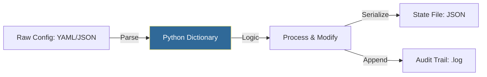

# 📂 File I/O for DevOps: Logs, Configs, and State

> **"Infrastructure is code, and code is data. Mastering File I/O is how you bridge the gap between static YAML configs, dynamic JSON API responses, and the persistent audit logs that keep your systems accountable."**

## 🏗️ Visual Architecture: The Data Lifecycle

In a typical automation workflow, data flows from files to memory and back to persistent storage.



---

## 📚 Curriculum Breakdown

### 1. The Context Manager Pattern (`with`)
Never open a file manually without a context manager. This ensures the file is closed—even if your script crashes—preventing memory leaks and file locks.

**🔴 Amateur Pattern:**
```python
f = open("config.yaml", "r")
data = f.read()
f.close() # Might never run if an error occurs above
```

**🟢 Professional Pattern:**
```python
with open("config.yaml", "r") as f:
    data = f.read()
# Automatically closed here
```

### 2. Reading and Writing Logs
For DevOps, we rarely read "the whole file" into memory. For massive logs, we **stream** line-by-line to avoid out-of-memory errors.

```python
# Streaming for memory efficiency
with open("access.log", "r") as log_file:
    for line in log_file:
        if "ERROR" in line:
            print(f"Detected Fault: {line.strip()}")
```

### 3. YAML & JSON: The Configuration Duo
Managing infrastructure requires moving between formats. Python makes this trivial.

```python
import json
import yaml

# Reading YAML (Infrastructure Config)
with open("fleet.yaml", "r") as y:
    config = yaml.safe_load(y)

# Writing JSON (API compatibility)
with open("state.json", "w") as j:
    json.dump(config, j, indent=4)
```

---

## 🏆 DevOps Story: "The Migration that Overwhelmed the RAM"
**The Scenario:** A migration script was supposed to read a 12GB CSV of server metrics and calculate the average uptime.
**The Problem:** The engineer used `.readlines()`, which attempted to load the entire 12GB file into the server's 8GB RAM. The OOM Killer instantly terminated the script, corrupting the partial state file.
**The Lesson:** Always use **Lazy Evaluation** (streaming) when dealing with files of unknown size.

---

## 🚀 Real-World Scenario: The Automated Config Normalizer
Every night, you receive a raw JSON from a cloud-discovery tool. You must parse it, filter for production servers, and save them as a clean YAML file for the next automation step.

```python
import json
import yaml
from typing import List, Dict

def normalize_inventory(input_file: str, output_file: str) -> None:
    try:
        with open(input_file, "r") as f:
            raw_data: List[Dict] = json.load(f)
            
        # Filter logic: Guard clause pattern
        prod_nodes = [node for node in raw_data if node.get("env") == "prod"]
        
        with open(output_file, "w") as f:
            yaml.dump(prod_nodes, f)
            
        print(f"✅ Successfully normalized {len(prod_nodes)} production nodes.")
        
    except (FileNotFoundError, json.JSONDecodeError) as e:
        print(f"❌ Aborting: {e}")

normalize_inventory("cloud_output.json", "inventory.yaml")
```

---

## ❓ Interview Preparation (File I/O)

1. **Q: Why should you use `yaml.safe_load()` instead of `yaml.load()`?**
   - *A: `yaml.load()` can execute arbitrary Python code if the YAML file is malicious. `safe_load()` restricts the parser to standard data types, making it the security standard for untrusted configs.*

2. **Q: How do you handle a "File Not Found" error without crashing?**
   - *A: Wrap the operation in a `try/except FileNotFoundError:` block. This is the **EAFP** (Easier to Ask Forgiveness) approach preferred in Python.*

3. **Q: Explain the difference between `w` and `a` modes in `open()`.**
   - *A: `w` (Write) overwrites the file entirely. `a` (Append) adds data to the end of the existing content. Use `a` for logging and `w` for state files.*

4. **Q: Why use `json.dump(indent=4)`?**
   - *A: While machines don't care about whitespace, human engineers do. Indentation makes your state files "Audit-friendly" and readable in the terminal.*

---

## 📝 Knowledge Check

1. **What happens if you open a file in 'w' mode that already exists?**
   - [ ] a) It appends to the end.
   - [x] b) It deletes the old content and starts fresh.
   - [ ] c) It raises a `FileExistsError`.

2. **Which method is safest for reading a 20GB log file?**
   - [ ] a) `file.read()`
   - [ ] b) `file.readlines()`
   - [x] c) `for line in file:` (Streaming)

3. **In the with-statement `with open(...) as f:`, what is `f`?**
   - [ ] a) The content of the file.
   - [x] b) A file object (stream handler).
   - [ ] c) The file path.

4. **True or False: Python can natively parse JSON without installing external libraries.**
   - [x] a) True (using `import json`).
   - [ ] b) False.

5. **Which library is the industry standard for parsing infrastructure YAML in Python?**
   - [ ] a) py-yaml
   - [x] b) PyYAML
   - [ ] c) yaml-parser

---

## 🧪 Deep-Dive & Labs
- **[Lab: The Log Scraper](./CHALLENGES.md)**
- **[Pattern: The Safe YAML Loader](../Part-02-Architecture-and-Data/04-YAML-Handling/README.md)**
