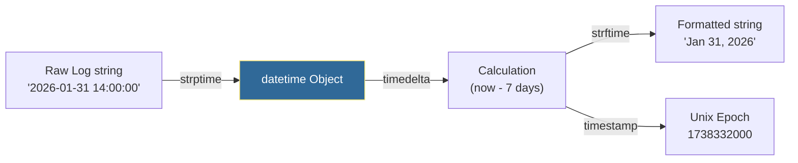

# 🕒 Time and Date: The Temporal Coordinator

> **"In the DevOps world, 'when' is just as important as 'what'. If your automation can't handle timezones, offsets, and durations, your production schedule will eventually drift into chaos."**


---

## 🧠 The Mental Model: Time as the Universal Clock

**The Junior Struggle**: "Why not just use `datetime.now()`?"

**The Engineer Solution**: Time is **relative**. A server in Tokyo and a server in New York have different "now". Use **UTC** as the universal reference point.

### 🏗️ The Infrastructure Analogy

Think of time handling like **coordinating a global meeting**:

| Concept | Meeting Analogy | Datetime Equivalent |
|:--------|:----------------|:--------------------|
| **UTC** | Universal reference time | `datetime.now(timezone.utc)` |
| **Local Time** | Each person's local clock | `datetime.now()` (avoid!) |
| **Timezone** | Time zone offset | `timezone(timedelta(hours=-5))` |
| **Duration** | Meeting length | `timedelta(hours=1)` |
| **Timestamp** | Meeting start time | `datetime(2026, 1, 31, 14, 0)` |
| **Parsing** | Reading calendar invite | `strptime()` |
| **Formatting** | Writing calendar invite | `strftime()` |

**The Key Insight**: Just like you schedule global meetings in UTC to avoid confusion, you store all timestamps in UTC and convert to local time only for display.

---

**The Difference**: Your automation will handle time correctly across regions, timezones, and daylight saving changes.

---

## 🆚 Junior Way vs. Engineer Way

| Feature | The Junior Way (Problematic) | The Engineer Way (Production-ready) |
|:---|:---|:---|
| **Storage** | Storing time as strings ("Aug 5, 2023") | Storing as Unix Epoch or ISO-8601 UTC |
| **Reference** | Using `datetime.now()` (Local time) | Using `datetime.now(timezone.utc)` |
| **Calculation** | Adding/Subscribing strings/ints | Using `timedelta` for precision arithmetic |
| **Timezones** | Ignoring them (Naive objects) | Using `zoneinfo` or `timezone` (Aware objects) |
| **Logic** | Overly complex "if hour > X" | `if current_time >= scheduled_time:` |
| **Formatting** | Hardcoded logic | `strftime` with standard patterns |

---

---

## 🎯 Learning Objectives

By the end of this module, you will:

- ✅ **Use UTC Everywhere**: Always use timezone-aware UTC
- ✅ **Parse Timestamps**: Convert strings to datetime objects
- ✅ **Format Timestamps**: Convert datetime objects to strings
- ✅ **Calculate Durations**: Use timedelta for time arithmetic
- ✅ **Handle Timezones**: Work with timezone-aware objects
- ✅ **Work with Unix Epoch**: Convert to/from timestamps
- ✅ **Parse Log Timestamps**: Handle various timestamp formats

---

## 🏗️ Part 1: The Datetime Workflow

### 🧠 The Mental Model: The Conversion Pipeline

**The Concept**: Time flows through three states: String → Object → String (or Unix Epoch).

### 🎨 Visual: Datetime Pipeline



### 📝 The Mnemonic: strptime vs strftime

- **`strptime`**: String **P**arse Time (String → Object)
- **`strftime`**: String **F**ormat Time (Object → String)

**💡 Pro Tip**: Remember "P for Parse, F for Format".

---

## ⏰ Part 2: Getting Current Time (The Right Way)

### 🧠 The Mental Model: The Global Clock

**The Problem**: `datetime.now()` uses the server's local time, which varies by region.

**The Solution**: Always use UTC for consistency.

### 🔧 Current Time Patterns

```python
from datetime import datetime, timezone

# ━━━━━━━━━━━━━━━━━━━━━━━━━━━━━━━━━━━━━━━━━━━━━━━━━━━━━━
# ❌ WRONG: Naive datetime (no timezone info)
# ━━━━━━━━━━━━━━━━━━━━━━━━━━━━━━━━━━━━━━━━━━━━━━━━━━━━━━

local_time = datetime.now()  # ❌ Depends on server location
print(local_time)  # 2026-01-31 14:00:00 (no timezone!)

# Problems:
# 1. Different result on servers in different regions
# 2. No timezone information
# 3. Daylight saving time issues

# ━━━━━━━━━━━━━━━━━━━━━━━━━━━━━━━━━━━━━━━━━━━━━━━━━━━━━━
# ✅ RIGHT: Timezone-aware UTC
# ━━━━━━━━━━━━━━━━━━━━━━━━━━━━━━━━━━━━━━━━━━━━━━━━━━━━━━

utc_time = datetime.now(timezone.utc)  # ✅ Always consistent
print(utc_time)  # 2026-01-31 19:00:00+00:00

# Benefits:
# 1. Same result on all servers globally
# 2. Includes timezone information (+00:00)
# 3. No daylight saving time issues

# ━━━━━━━━━━━━━━━━━━━━━━━━━━━━━━━━━━━━━━━━━━━━━━━━━━━━━━
# ISO 8601 format (standard for APIs)
# ━━━━━━━━━━━━━━━━━━━━━━━━━━━━━━━━━━━━━━━━━━━━━━━━━━━━━━

iso_string = utc_time.isoformat()
print(iso_string)  # 2026-01-31T19:00:00+00:00
```

**💡 Pro Tip**: **ALWAYS** use `datetime.now(timezone.utc)` in production code.

---

## 📅 Part 3: Creating Specific Dates

### 🧠 The Mental Model: The Date Constructor

**The Use Case**: Create specific dates for testing, scheduling, or comparisons.

### 🔧 Creating Datetime Objects

```python
from datetime import datetime, timezone, timedelta

# ━━━━━━━━━━━━━━━━━━━━━━━━━━━━━━━━━━━━━━━━━━━━━━━━━━━━━━
# Creating specific dates
# ━━━━━━━━━━━━━━━━━━━━━━━━━━━━━━━━━━━━━━━━━━━━━━━━━━━━━━

# Basic date (naive - no timezone)
deployment_date = datetime(2026, 1, 31, 14, 30, 0)

# Timezone-aware date (UTC)
deployment_date_utc = datetime(2026, 1, 31, 14, 30, 0, tzinfo=timezone.utc)

# Timezone-aware date (specific timezone)
eastern = timezone(timedelta(hours=-5))
deployment_date_eastern = datetime(2026, 1, 31, 14, 30, 0, tzinfo=eastern)

# ━━━━━━━━━━━━━━━━━━━━━━━━━━━━━━━━━━━━━━━━━━━━━━━━━━━━━━
# Creating dates from components
# ━━━━━━━━━━━━━━━━━━━━━━━━━━━━━━━━━━━━━━━━━━━━━━━━━━━━━━

year = 2026
month = 1
day = 31
hour = 14
minute = 30

scheduled_time = datetime(year, month, day, hour, minute, tzinfo=timezone.utc)
```

**💡 Pro Tip**: Always include `tzinfo=timezone.utc` when creating datetime objects.

---

## 🔄 Part 4: Parsing Timestamps (strptime)

### 🧠 The Mental Model: The String Parser

**The Use Case**: Convert timestamp strings from logs or APIs into datetime objects.

### 🔧 Common Timestamp Formats

```python
from datetime import datetime, timezone

# ━━━━━━━━━━━━━━━━━━━━━━━━━━━━━━━━━━━━━━━━━━━━━━━━━━━━━━
# ISO 8601 format (most common)
# ━━━━━━━━━━━━━━━━━━━━━━━━━━━━━━━━━━━━━━━━━━━━━━━━━━━━━━

iso_string = "2026-01-31T14:30:00+00:00"
dt = datetime.fromisoformat(iso_string)
print(dt)  # 2026-01-31 14:30:00+00:00

# ━━━━━━━━━━━━━━━━━━━━━━━━━━━━━━━━━━━━━━━━━━━━━━━━━━━━━━
# Custom formats using strptime
# ━━━━━━━━━━━━━━━━━━━━━━━━━━━━━━━━━━━━━━━━━━━━━━━━━━━━━━

# Nginx log format: "31/Jan/2026:14:30:00 +0000"
nginx_timestamp = "31/Jan/2026:14:30:00 +0000"
dt = datetime.strptime(nginx_timestamp, "%d/%b/%Y:%H:%M:%S %z")

# AWS CloudWatch format: "2026-01-31 14:30:00"
cloudwatch_timestamp = "2026-01-31 14:30:00"
dt = datetime.strptime(cloudwatch_timestamp, "%Y-%m-%d %H:%M:%S")
# Add timezone info
dt = dt.replace(tzinfo=timezone.utc)

# Syslog format: "Jan 31 14:30:00"
syslog_timestamp = "Jan 31 14:30:00"
dt = datetime.strptime(syslog_timestamp, "%b %d %H:%M:%S")
# Add year and timezone
dt = dt.replace(year=2026, tzinfo=timezone.utc)
```

### 📊 Format Code Reference

| Code | Meaning | Example |
|:-----|:--------|:--------|
| `%Y` | 4-digit year | 2026 |
| `%m` | 2-digit month | 01 |
| `%d` | 2-digit day | 31 |
| `%H` | 24-hour hour | 14 |
| `%M` | Minute | 30 |
| `%S` | Second | 00 |
| `%f` | Microsecond | 123456 |
| `%b` | Abbreviated month | Jan |
| `%B` | Full month | January |
| `%z` | Timezone offset | +0000 |
| `%Z` | Timezone name | UTC |

### 🚀 Professional Pattern: Flexible Log Parser

```python
from datetime import datetime, timezone
from typing import Optional

def parse_timestamp(timestamp_str: str) -> Optional[datetime]:
    """
    Parse timestamp from various formats.
    
    Args:
        timestamp_str: Timestamp string in various formats
    
    Returns:
        Timezone-aware datetime object or None if parsing fails
    
    Example:
        >>> dt = parse_timestamp("2026-01-31T14:30:00Z")
        >>> dt = parse_timestamp("31/Jan/2026:14:30:00 +0000")
    """
    # List of formats to try
    formats = [
        "%Y-%m-%dT%H:%M:%S%z",           # ISO 8601 with timezone
        "%Y-%m-%dT%H:%M:%SZ",            # ISO 8601 with Z (Zulu/UTC)
        "%Y-%m-%d %H:%M:%S",             # Simple datetime
        "%d/%b/%Y:%H:%M:%S %z",          # Nginx format
        "%b %d %H:%M:%S",                # Syslog format
    ]
    
    for fmt in formats:
        try:
            dt = datetime.strptime(timestamp_str, fmt)
            
            # Add UTC timezone if none present
            if dt.tzinfo is None:
                dt = dt.replace(tzinfo=timezone.utc)
            
            return dt
        
        except ValueError:
            continue
    
    # Try fromisoformat as last resort
    try:
        return datetime.fromisoformat(timestamp_str)
    except ValueError:
        print(f"❌ Could not parse timestamp: {timestamp_str}")
        return None


# 🎯 Usage
timestamps = [
    "2026-01-31T14:30:00+00:00",
    "31/Jan/2026:14:30:00 +0000",
    "2026-01-31 14:30:00",
]

for ts in timestamps:
    dt = parse_timestamp(ts)
    if dt:
        print(f"Parsed: {dt.isoformat()}")
```

**💡 Pro Tip**: Try multiple formats when parsing timestamps from different sources.

---

## 📝 Part 5: Formatting Timestamps (strftime)

### 🧠 The Mental Model: The String Formatter

**The Use Case**: Convert datetime objects to human-readable strings.

### 🔧 Formatting Examples

```python
from datetime import datetime, timezone

now = datetime.now(timezone.utc)

# ━━━━━━━━━━━━━━━━━━━━━━━━━━━━━━━━━━━━━━━━━━━━━━━━━━━━━━
# Common formats
# ━━━━━━━━━━━━━━━━━━━━━━━━━━━━━━━━━━━━━━━━━━━━━━━━━━━━━━

# ISO 8601 (API standard)
iso = now.isoformat()
print(iso)  # 2026-01-31T19:00:00+00:00

# Human-readable
readable = now.strftime("%B %d, %Y at %I:%M %p")
print(readable)  # January 31, 2026 at 07:00 PM

# Log format
log_format = now.strftime("%Y-%m-%d %H:%M:%S")
print(log_format)  # 2026-01-31 19:00:00

# Filename-safe
filename = now.strftime("%Y%m%d_%H%M%S")
print(filename)  # 20260131_190000

# Date only
date_only = now.strftime("%Y-%m-%d")
print(date_only)  # 2026-01-31

# Time only
time_only = now.strftime("%H:%M:%S")
print(time_only)  # 19:00:00
```

**💡 Pro Tip**: Use `isoformat()` for APIs, `strftime()` for custom formats.

---

## ⏱️ Part 6: Time Arithmetic with timedelta

### 🧠 The Mental Model: The Duration Calculator

**The Use Case**: Calculate time differences, add/subtract time, check if files are old.

### 🔧 timedelta Operations

```python
from datetime import datetime, timedelta, timezone

now = datetime.now(timezone.utc)

# ━━━━━━━━━━━━━━━━━━━━━━━━━━━━━━━━━━━━━━━━━━━━━━━━━━━━━━
# Creating timedeltas
# ━━━━━━━━━━━━━━━━━━━━━━━━━━━━━━━━━━━━━━━━━━━━━━━━━━━━━━

one_hour = timedelta(hours=1)
one_day = timedelta(days=1)
one_week = timedelta(weeks=1)
thirty_days = timedelta(days=30)

# Combining units
duration = timedelta(days=1, hours=2, minutes=30)

# ━━━━━━━━━━━━━━━━━━━━━━━━━━━━━━━━━━━━━━━━━━━━━━━━━━━━━━
# Adding/subtracting time
# ━━━━━━━━━━━━━━━━━━━━━━━━━━━━━━━━━━━━━━━━━━━━━━━━━━━━━━

yesterday = now - timedelta(days=1)
tomorrow = now + timedelta(days=1)
next_week = now + timedelta(weeks=1)
seven_days_ago = now - timedelta(days=7)

# ━━━━━━━━━━━━━━━━━━━━━━━━━━━━━━━━━━━━━━━━━━━━━━━━━━━━━━
# Calculating differences
# ━━━━━━━━━━━━━━━━━━━━━━━━━━━━━━━━━━━━━━━━━━━━━━━━━━━━━━

deployment_start = datetime(2026, 1, 31, 14, 0, 0, tzinfo=timezone.utc)
deployment_end = datetime(2026, 1, 31, 14, 45, 0, tzinfo=timezone.utc)

duration = deployment_end - deployment_start
print(f"Deployment took {duration.total_seconds()} seconds")  # 2700.0
print(f"Deployment took {duration.total_seconds() / 60} minutes")  # 45.0
```

### 🚀 Professional Pattern: Log Retention Checker

```python
from datetime import datetime, timedelta, timezone
from typing import List
import os

def cleanup_old_logs(
    log_dir: str,
    retention_days: int = 30,
    dry_run: bool = True
) -> List[str]:
    """
    Delete log files older than retention period.
    
    Args:
        log_dir: Directory containing log files
        retention_days: Number of days to retain logs
        dry_run: If True, only print what would be deleted
    
    Returns:
        List of deleted (or would-be-deleted) files
    
    Example:
        >>> deleted = cleanup_old_logs("/var/log/app", retention_days=30)
    """
    now = datetime.now(timezone.utc)
    cutoff_date = now - timedelta(days=retention_days)
    deleted_files = []
    
    print(f"Cutoff date: {cutoff_date.strftime('%Y-%m-%d %H:%M:%S')}")
    
    for filename in os.listdir(log_dir):
        filepath = os.path.join(log_dir, filename)
        
        # Skip directories
        if not os.path.isfile(filepath):
            continue
        
        # Get file modification time
        mtime = os.path.getmtime(filepath)
        file_date = datetime.fromtimestamp(mtime, tz=timezone.utc)
        
        # Check if file is older than cutoff
        if file_date < cutoff_date:
            age_days = (now - file_date).days
            
            if dry_run:
                print(f"Would delete: {filename} (age: {age_days} days)")
            else:
                os.remove(filepath)
                print(f"Deleted: {filename} (age: {age_days} days)")
            
            deleted_files.append(filename)
    
    return deleted_files


# 🎯 Usage
deleted = cleanup_old_logs("/var/log/myapp", retention_days=30, dry_run=True)
print(f"Total files to delete: {len(deleted)}")
```

**💡 Pro Tip**: Use timedelta for all time arithmetic. It handles edge cases automatically.

---

## 🌍 Part 7: Working with Unix Epoch

### 🧠 The Mental Model: The Universal Timestamp

**The Concept**: Unix epoch is seconds since January 1, 1970 00:00:00 UTC.

**The Use Case**: APIs often use epoch timestamps for efficiency.

### 🔧 Epoch Conversions

```python
from datetime import datetime, timezone

# ━━━━━━━━━━━━━━━━━━━━━━━━━━━━━━━━━━━━━━━━━━━━━━━━━━━━━━
# Datetime to epoch
# ━━━━━━━━━━━━━━━━━━━━━━━━━━━━━━━━━━━━━━━━━━━━━━━━━━━━━━

now = datetime.now(timezone.utc)
epoch = now.timestamp()
print(f"Epoch: {epoch}")  # 1738348800.0

# ━━━━━━━━━━━━━━━━━━━━━━━━━━━━━━━━━━━━━━━━━━━━━━━━━━━━━━
# Epoch to datetime
# ━━━━━━━━━━━━━━━━━━━━━━━━━━━━━━━━━━━━━━━━━━━━━━━━━━━━━━

epoch_timestamp = 1738348800
dt = datetime.fromtimestamp(epoch_timestamp, tz=timezone.utc)
print(dt)  # 2026-01-31 19:00:00+00:00

# ━━━━━━━━━━━━━━━━━━━━━━━━━━━━━━━━━━━━━━━━━━━━━━━━━━━━━━
# Milliseconds (JavaScript standard)
# ━━━━━━━━━━━━━━━━━━━━━━━━━━━━━━━━━━━━━━━━━━━━━━━━━━━━━━

# JavaScript uses milliseconds
ms_timestamp = 1738348800000

# Convert to seconds for Python
dt = datetime.fromtimestamp(ms_timestamp / 1000, tz=timezone.utc)
print(dt)

# Convert Python datetime to milliseconds
ms = int(now.timestamp() * 1000)
print(f"Milliseconds: {ms}")
```

**💡 Pro Tip**: JavaScript uses milliseconds, Python uses seconds. Always divide by 1000 when converting from JS.

---

## 🏆 Part 8: Real-World DevOps Story

### 📖 The Backup Ghost

**The Scenario**: A global SaaS company scheduled database cleanup for every Sunday at 3:00 AM. In the UK, it worked perfectly. In the US, it happened on Saturday night. In Japan, it happened Monday afternoon.

**The Code**:
```python
# ❌ The problem
from datetime import datetime

if datetime.now().hour == 3:
    run_cleanup()
```

**The Problem**: The script used `datetime.now().hour == 3`. Because servers were in different regions, each server thought "3:00 AM" was its own local time. This caused rolling outages as cleanup hit each region at different times.

**The Solution**:
```python
# ✅ The fix
from datetime import datetime, timezone

# Schedule for 3:00 AM UTC globally
target_hour_utc = 3

if datetime.now(timezone.utc).hour == target_hour_utc:
    run_cleanup()
```

**The Outcome**: Maintenance became a single, predictable event globally. The "Ghost Outages" stopped, and the SRE team could finally sleep without being paged at random "3:00 AMs."

**The Lesson**: **Always use UTC** for scheduling in distributed systems.

---

## ❓ Interview Preparation

### 🎯 Core Concepts

1. **Q: Why should you always use UTC in production?**
   - **A**: UTC is the universal reference point. It doesn't change with daylight saving time and is consistent across all servers globally. Local time varies by region and can cause bugs in distributed systems.

2. **Q: What's the difference between naive and aware datetime objects?**
   - **A**: Naive objects have no timezone information. Aware objects include timezone info. You can't compare naive and aware objects (Python raises an error). Always use aware objects in production.

3. **Q: How do you handle timestamps in milliseconds (JavaScript)?**
   - **A**: Python's `fromtimestamp()` expects seconds. Divide milliseconds by 1000: `datetime.fromtimestamp(ms / 1000, tz=timezone.utc)`.

4. **Q: What is a timedelta and how is it used?**
   - **A**: A timedelta represents a duration (e.g., 5 minutes, 3 days). It's used for time arithmetic—adding or subtracting time from a datetime object.

5. **Q: How do you convert a datetime object to Unix epoch?**
   - **A**: Call the `.timestamp()` method. It returns seconds since January 1, 1970 00:00:00 UTC.

### 🚀 Advanced Questions

6. **Q: Why is `datetime.utcnow()` deprecated in Python 3.12+?**
   - **A**: It returns a naive object that looks like UTC but doesn't have timezone info. This leads to accidental comparisons with local time. Use `datetime.now(timezone.utc)` instead.

7. **Q: How do you parse a timestamp like "31/Jan/2026:14:30:00"?**
   - **A**: Use `strptime(val, "%d/%b/%Y:%H:%M:%S")`. The `%b` handles abbreviated month names.

8. **Q: How do you handle daylight saving time?**
   - **A**: Use UTC for storage and calculations. Only convert to local time for display. This avoids DST issues entirely.

9. **Q: What's the difference between `strptime` and `strftime`?**
   - **A**: `strptime` parses strings into datetime objects (String → Object). `strftime` formats datetime objects into strings (Object → String).

10. **Q: How do you check if a file is older than 30 days?**
    - **A**: Get file mtime, convert to datetime, subtract from now, compare: `if (now - file_date).days > 30:`.

---

## 📝 Knowledge Check

### 🧠 Beginner Level

1. **Which method converts a datetime object into a string?**
   - [ ] a) `strptime`
   - [x] b) `strftime`
   - [ ] c) `toString`
   - [ ] d) `format`

2. **True or False: You can subtract two datetime objects to get a timedelta.**
   - [x] a) True
   - [ ] b) False

3. **What does the 'Z' in an ISO string (e.g., 2026-01-31T12:00Z) stand for?**
   - [ ] a) Zone
   - [x] b) Zulu (UTC)
   - [ ] c) Zero Offset
   - [ ] d) Timezone

4. **How many seconds are in a day according to timedelta?**
   - [ ] a) 3600
   - [ ] b) 60000
   - [x] c) 86400
   - [ ] d) 100000

### 🚀 Intermediate Level

5. **Why should you specify timezone.utc in your now() call?**
   - [x] a) To create a timezone-aware object that is globally consistent
   - [ ] b) To make the script run faster
   - [ ] c) To change the server's system clock
   - [ ] d) It's optional

6. **What format code represents a 4-digit year?**
   - [ ] a) `%y`
   - [x] b) `%Y`
   - [ ] c) `%year`
   - [ ] d) `%YYYY`

7. **How do you add 7 days to a datetime object?**
   - [ ] a) `dt + 7`
   - [x] b) `dt + timedelta(days=7)`
   - [ ] c) `dt.add_days(7)`
   - [ ] d) `dt + days(7)`

8. **What does `datetime.timestamp()` return?**
   - [ ] a) A datetime object
   - [x] b) Seconds since Unix epoch (Jan 1, 1970)
   - [ ] c) Milliseconds since Unix epoch
   - [ ] d) A string

### 🏆 Advanced Level

9. **What's the problem with using `datetime.now()` without timezone?**
   - [ ] a) It's slower
   - [x] b) It returns a naive object that varies by server location
   - [ ] c) It doesn't work
   - [ ] d) It's deprecated

10. **How do you convert JavaScript milliseconds to Python datetime?**
    - [ ] a) `datetime.fromtimestamp(ms)`
    - [x] b) `datetime.fromtimestamp(ms / 1000, tz=timezone.utc)`
    - [ ] c) `datetime.frommilliseconds(ms)`
    - [ ] d) `datetime.fromtimestamp(ms * 1000)`

---

## 🎯 Key Takeaways for Juniors

### 🧠 Mental Models Over Syntax

1. **UTC = Universal Clock**: Always use for storage and calculations
2. **strptime = Parse**: String → Object
3. **strftime = Format**: Object → String
4. **timedelta = Duration**: Time arithmetic

### 🛡️ Safety Patterns

1. **Always use `datetime.now(timezone.utc)`** not `datetime.now()`
2. **Always use timezone-aware objects** in production
3. **Store timestamps in UTC** in databases
4. **Convert to local time** only for display
5. **Use timedelta** for all time arithmetic

### 🚀 Production Rules

1. **Use UTC everywhere** for consistency
2. **Use `isoformat()`** for APIs
3. **Use `strftime()`** for custom formats
4. **Divide by 1000** for JavaScript milliseconds
5. **Use timedelta** for retention policies

---

## 🔗 Next Steps

Now that you can handle time correctly, you've completed Part 01: Python Foundations! 🎊

**Proceed to**: [Part 02: Python Architecture →](../../Part-02-Python-Architecture/README.md)

---

## 📚 Additional Resources

- [Python datetime Documentation](https://docs.python.org/3/library/datetime.html)
- [ISO 8601 Standard](https://en.wikipedia.org/wiki/ISO_8601)
- [Unix Epoch](https://en.wikipedia.org/wiki/Unix_time)
- [Timezone Database](https://www.iana.org/time-zones)
- [strftime Format Codes](https://strftime.org/)

---

**🎓 Remember**: A newbie uses `datetime.now()` and hopes for the best. An engineer uses `datetime.now(timezone.utc)` and handles timezones correctly. A senior engineer designs systems that are timezone-agnostic. Master datetime, and you master temporal coordination in distributed systems.
