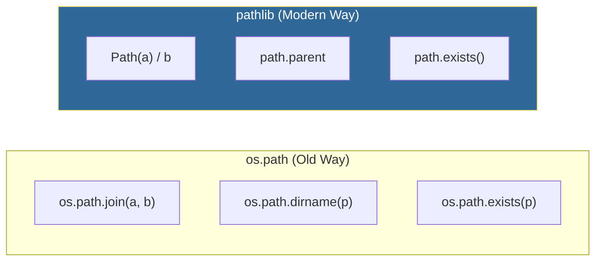

# 📂 Pathlib Basics: Modern Cross-Platform Navigation

> **"If os.path is the 'Old Manual Gearbox' of file systems, Pathlib is the 'Automatic Transmission.' It turns complex path logic into readable, object-oriented code that works seamlessly on every OS."**


## 📚 Overview

In the past, DevOps engineers had to juggle `os.path.join`, `os.path.exists`, and multiple string manipulations to manage server files. On Windows, this meant backslashes; on Linux, forward slashes. A single mistake could break a global deployment script.

**Pathlib** (introduced in Python 3.4) solves this by treating paths as **Objects**, not strings. It provides a consistent, intuitive syntax for navigating directories, checking file metadata, and performing high-speed globbing. This module teaches you how to write "Universal Automation" that behaves identical on a developer's Windows laptop and a Production Linux container.

## 🎓 Learning Objectives

By the end of this module, you will:

- ✅ Master the **Path Object** syntax and navigation.
- ✅ Implement **Cross-Platform Compatibility** without manual slashes.
- ✅ Perform **High-Speed Globbing** for recursive file discovery.
- ✅ Manipulate **File Metadata** (Stems, Suffixes, and Parents).
- ✅ Orchestrate **Safe File Operations** (mkdir, rename, rglob).

---

## 🏗️ Pathlib vs. os.path: The Evolution

Why did the industry move away from `os.path`? Readability and safety.



### The "Universal Operator" (`/`)
Pathlib overloads the division operator to join paths. It handles the slashes for you automatically based on the OS.

```python
from pathlib import Path

# ✅ Works on Windows (C:\Users\...) and Linux (/home/user/...)
log_dir = Path.home() / "logs" / "nginx"
log_file = log_dir / "access.log"
```

---

## 🚀 Professional Patterns for Engineers

### 1. Path Anatomy (The Breakdown)
When parsing logs or managing backups, you often need specific parts of a filename.

```python
path = Path("/var/log/nginx/access.tar.gz")

print(path.name)    # "access.tar.gz" (Full filename)
print(path.stem)    # "access.tar" (Filename minus last extension)
print(path.suffix)  # ".gz" (Final extension)
print(path.parent)  # "/var/log/nginx" (Parent directory)
print(path.parts)   # ('/', 'var', 'log', 'nginx', 'access.tar.gz')
```

### 2. Recursive Globbing (Recursive Search)
Finding all files matching a pattern inside a massive directory tree is a core DevOps task.

```python
# 💡 Finding every Python file in a project, including subfolders
project = Path.cwd()

# 'rglob' stands for 'Recursive Glob'
for py_file in project.rglob("*.py"):
    print(f"Auditing script: {py_file.name}")

# 💡 Finding all logs larger than 10MB
for log in project.glob("**/*.log"):
    if log.stat().st_size > 10 * 1024 * 1024:
        print(f"🚨 LARGE LOG: {log}")
```

### 3. Safe Directory Creation
Stop using `if not os.path.exists(): os.makedirs()`. Pathlib handles this in one line.

```python
# 💡 'parents=True' creates all missing folders in the path
# 💡 'exist_ok=True' prevents an error if the folder already exists
Path("backups/2026/01/daily").mkdir(parents=True, exist_ok=True)
```

---

## 🛡️ Best Practices for Cross-Platform Automation

| Practice | Pathlib Method | Benefit |
| :--- | :--- | :--- |
| **Absolute Paths** | `path.resolve()` | Eliminates `../` noise and simplifies debugging. |
| **Home Directory** | `Path.home()` | Reliable way to find user space across Mac/Win/Linux. |
| **File Reading** | `path.read_text()` | Built-in context manager (no `with open()` needed for small files). |
| **System Safe** | `path.as_posix()` | Forces forward slashes—useful when generating URLs or K8s path mappings. |

---

## 🏆 Real-World DevOps Story: The Migration Nightmare

**The Scenario**: A major retail company was migrating their automation from a legacy Windows environment to a new Kubernetes-based (Linux) platform. Their 200+ scripts were riddled with `os.path.join` and hardcoded `\\` separators.

**The Discovery**: 40% of the migration time was being "wasted" just fixing path errors. A script would pass local tests but fail in the container because it couldn't find its own config file.

**The Solution**: The team spent one sprint replacing all `os` path logic with **Pathlib**.

**The Outcome**: The scripts became 30% shorter and significantly more readable. Once refactored, the entire suite worked on both platforms without a single change to the path logic, allowing the team to beat their migration deadline by two weeks.

---

## ❓ Interview Preparation (Pathlib)

1. **Q: Why is `path.resolve()` preferred over `path.absolute()`?**
   - *A: `resolve()` is more robust—it removes redundant components (like `..`), resolves symbolic links, and returns a truly normalized absolute path. It's the standard for production auditing.*

2. **Q: How do you check if a path is a file versus a directory?**
   - *A: Use `path.is_file()` or `path.is_dir()`. Note that these only return `True` if the path actually exists on the disk.*

3. **Q: What is the difference between `glob('*')` and `iterdir()`?**
   - *A: `iterdir()` yields EVERYTHING in the directory (files, folders, links). `glob('*')` allows for pattern matching and filtering from the start.*

4. **Q: How can you change a file's extension elegantly?**
   - *A: Using `path.with_suffix('.bak')`. This returns a new Path object with the extension swapped, which is perfect for creating backup names.*

5. **Q: Is Pathlib slower than the 'os' module?**
   - *A: Technically, Pathlib is a high-level wrapper, so it has a tiny bit more overhead. However, in 99.9% of DevOps automation, the bottleneck is the Disk I/O, not the Python logic. The gains in readability and cross-platform safety far outweigh the micro-performance cost.*

---

## 📝 Knowledge Check

1. **Which operator is used to join paths in Pathlib?**
   - [ ] a) `+`
   - [ ] b) `&`
   - [x] c) `/`

2. **True or False: `Path('data.txt').read_text()` automatically closes the file handle.**
   - [x] a) True
   - [ ] b) False

3. **What is the result of `Path('app.py').stem`?**
   - [ ] a) ".py"
   - [x] b) "app"
   - [ ] c) "app.py"

4. **How do you find all .yaml files in ALL subdirectories?**
   - [ ] a) `path.glob("*.yaml")`
   - [x] b) `path.rglob("*.yaml")`
   - [ ] c) `path.iterdir("*.yaml")`

5. **Which mkdir argument prevents a 'FileExistsError'?**
   - [ ] a) `parents=True`
   - [x] b) `exist_ok=True`
   - [ ] c) `force=True`

---

## 🔗 Next Steps

Paths define where data lives, but **Time** defines when it happens. Let's learn to manage schedule-based automation.

Proceed to: **[Datetime Operations →](../Part-12-Datetime-Operations/README.md)**
