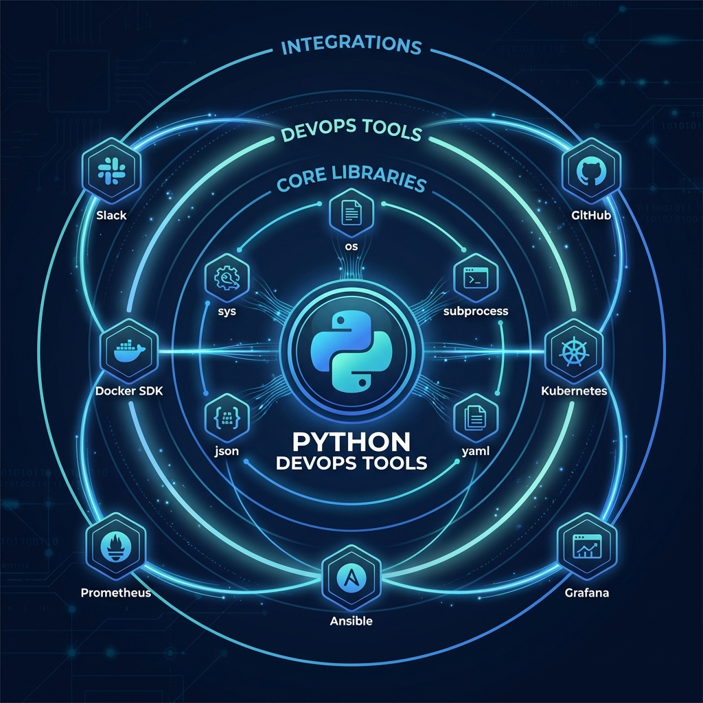
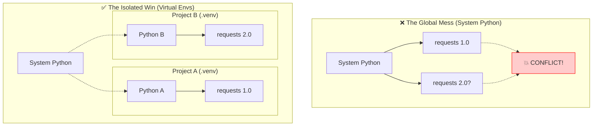

# 📦 Virtual Environments: The Isolated Workshop

> **"A script that runs on your laptop but fails in production isn't automated—it's broken. Virtual environments are the 'Shipping Containers' of Python, ensuring your code carries its own dependencies wherever it goes."**



---

## 🧠 The Mental Model: Factory Floor vs. Isolated Workshops

**The Junior Struggle**: "I installed a library for Project A, and now Project B is broken!"

**The Engineer Solution**: Never install libraries globally. Treat your System Python like a **sacred factory floor**—clean and untouched. Create an **isolated workshop** (virtual environment) for every single project.

### 🏗️ The Infrastructure Analogy

Think of Python environments like **shipping containers**:

| Concept | Shipping Container Analogy | Python Equivalent |
|:--------|:---------------------------|:------------------|
| **System Python** | The Ship's Engine Room | `/usr/bin/python3` (Shared, Critical) |
| **Virtual Environment** | A Locked Shipping Container | `.venv/` folder (Isolated) |
| **Libraries** | Cargo inside the container | `requests`, `boto3` |
| **requirements.txt** | Manifest/Packing List | Dependency file |
| **Activating** | Stepping inside the container | `source .venv/bin/activate` |
| **Deactivating** | Stepping back onto the deck | `deactivate` |

**The Key Insight**: If Container A explodes (bad library version), the Ship (System Python) and Container B are completely safe.

---

## 📚 Why This Module Matters for Juniors

**Before this module**, you might think:
- "I'll just `sudo pip install` everything"
- "One environment is enough for all my scripts"
- "Why does my code work here but not there?"

**After this module**, you'll understand:
- **Global installs break operating systems** (yum/apt rely on Python)
- **Projects need specific versions** of libraries (Version 1.0 vs 2.0)
- **`requirements.txt` ensures reproducibility**
- **.venv folders must be gitignored** (they are not portable)

**The Difference**: Your projects become portable, reproducible, and non-destructive.

---

## 🎯 Learning Objectives

By the end of this module, you will:

- ✅ **Create Environments**: Use `python -m venv` standard
- ✅ **Activate/Deactivate**: Navigate between workshops
- ✅ **Manage Dependencies**: Freeze and install with `pip`
- ✅ **Protect System Python**: Avoid `sudo pip` at all costs
- ✅ **Ensure Portability**: Use `.gitignore` correctly
- ✅ **Understand Resolution**: How Python finds packages

---

## 🏗️ Part 1: The Dependency Hell (Visualized)

### 🧠 The Mental Model: The Clashing Versions

**The Problem**: Project A needs `requests==1.0` (old). Project B needs `requests==2.0` (new). You can't have both installed globally.

### 🎨 Visual: The Isolation Architecture



---

## 🛠️ Part 2: Verified Mechanics (How-To)

### 🧠 The Mental Model: Create → Activate → Install

**The Process**: You must "enter" the workshop (activate) before you start building (installing).

### 🔧 1. Creating the Environment
Standard practice is to name the folder `.venv` (hidden) or `venv`.

```bash
# ✅ Create a virtual environment named '.venv' in current directory
python3 -m venv .venv
```

### 🔧 2. Activating the Environment
This changes your shell's path to point to the virtual environment's binary.

**Linux / macOS:**
```bash
source .venv/bin/activate
# Prompt changes to: (.venv) user@host $
```

**Windows (PowerShell):**
```powershell
.\.venv\Scripts\Activate.ps1
```

**Windows (CMD):**
```cmd
.\.venv\Scripts\activate.bat
```

### 🔧 3. Verifying Activation
Always check *which* python you are using.

```bash
which python
# ✅ Correct: /home/user/project/.venv/bin/python
# ❌ Wrong: /usr/bin/python
```

### 🔧 4. Deactivating
When finished, step out of the container.
```bash
deactivate
```

---

## 📦 Part 3: Dependency Management

### 🧠 The Mental Model: The Packing List

**The Use Case**: You want to share your script with a colleague. They need the exact same "cargo" (libraries) to run it.

### 🔧 Freezing and Installing

**1. Create the Manifest (`requirements.txt`)**
After installing libraries (`pip install boto3 requests`), save the state:
```bash
# Snapshot current libraries to file
pip freeze > requirements.txt
```

**Content of `requirements.txt`:**
```text
boto3==1.28.57
botocore==1.31.57
requests==2.31.0
urllib3==2.0.5
```

**2. Install from Manifest**
When setting up on a new server:
```bash
# Install exactly what is listed
pip install -r requirements.txt
```

### 🚀 Professional Pattern: Production Constraints

Don't just freeze everything. Separate development tools (testing, linting) from production requirements.

**requirements.txt (Production)**:
```text
flask==2.3.0
gunicorn==20.1.0
```

**dev-requirements.txt (Dev Only)**:
```text
pytest==7.4.0
black==23.7.0
flake8==6.1.0
```

**Usage**:
`pip install -r requirements.txt -r dev-requirements.txt`

---

## 🛡️ Part 4: The Golden Rules (.gitignore)

### 🧠 The Mental Model: The Blueprint, Not the Building

**The Concept**: You ship the **blueprint** (`requirements.txt`), not the **building** (`.venv`).

**Why?**
1. **Binaries are OS-specific**: A Linux python binary won't run on Windows.
2. **Paths are absolute**: The venv stores `/home/yourname/...` which doesn't exist on your colleague's machine.
3. **Size**: Venvs can be hundreds of MBs.

### 🔧 The .gitignore Rule

**ALWAYS** add this to your `.gitignore` file immediately:

```text
# Environments
.env
.venv
env/
venv/
ENV/
env.bak/
venv.bak/

# Python cache
__pycache__/
*.py[cod]
```

---

## 🏆 Real-World DevOps Story

### 📖 The Server Snapshot Disaster

**The Scenario**: An SRE team managed a critical "Build Server" (Jenkins). Because setting up venvs felt "slow," they installed all Python libraries globally (`sudo pip install time`).

**The Trigger**: 
- **Project A** (Data Science) needed `numpy` version 1.21 (new).
- **Project B** (Legacy Billing) relied on `numpy` version 1.16 (old).

**The Incident**: A junior engineer ran `sudo pip install numpy --upgrade` for Project A.
Ten minutes later, the **Billing System crashed**. It used a function that was removed in the new numpy version.

**The Fallout**: 
- 6 hours of downtime for billing.
- The team had to re-image the entire server because they didn't know which other libraries were upgraded during the dependency resolution.

**The Fix**: 
They implemented a strict **"No Sudo Pip"** policy. Every Jenkins job now creates a fresh ephemeral `.venv` based on its own `requirements.txt`, runs the job, and deletes the environment. 

**The Lesson**: **Isolation is not optional.** It is the only way to guarantee stability in a multi-project environment.

---

## ❓ Interview Preparation

### 🎯 Core Concepts

1. **Q: Why shouldn't you commit the `.venv` folder to Git?**
   - **A**: It contains OS-specific binaries and absolute file paths that won't work on other machines. It's also large and redundant since `requirements.txt` allows it to be rebuilt.

2. **Q: How do you check if you are currently inside a virtual environment?**
   - **A**: Check the terminal prompt (usually prefixed with `(.venv)`) or run `which python` (Linux) / `where python` (Windows) to see if it points to the local folder or the system path.

3. **Q: What happens if you run `pip install` without an active virtual environment?**
   - **A**: It attempts to install the package globally into the System Python. On Linux/Mac, this often requires `sudo` (which is bad practice) or fails with permission errors.

4. **Q: What is the purpose of `requirements.txt`?**
   - **A**: It is a manifest file listing all dependencies and their exact versions (`package==version`). It ensures that the environment can be reproduced exactly on another machine ("Deterministic Build").

5. **Q: How does a virtual environment "isolate" Python?**
   - **A**: It modifies the shell's `PATH` variable to prioritize the venv's `bin` directory. When you type `python`, the shell finds the venv's local binary first, which is configured to look only in the venv's local `site-packages` for libraries.

### 🚀 Advanced Questions

6. **Q: What is the difference between `pip freeze` and `pip list`?**
   - **A**: `pip freeze` outputs in a format suitable for `requirements.txt` (`pkg==ver`). `pip list` outputs a human-readable table.

7. **Q: Explain the risk of "System Python Pollution".**
   - **A**: System tools (like `yum`, `dnf`, `apt`) often rely on Python. Upgrading system libraries globally via pip can break these OS tools, potentially requiring an OS reinstall to fix.

8. **Q: Can you move a `.venv` folder to a different directory?**
   - **A**: generally No. Virtual environments hardcode absolute paths in their scripts (like `pip`). If you move it, you break it. It's better to delete and recreate it.

9. **Q: What is `site-packages`?**
   - **A**: The directory where user-installed packages are stored. In a venv, this is located inside standard lib paths within the venv (e.g., `.venv/lib/python3.x/site-packages`).

10. **Q: How do you handle different Python versions (e.g., 3.9 vs 3.11)?**
    - **A**: `venv` creates an environment using the python binary that executed it. To create a 3.9 environment, run `python3.9 -m venv .venv`.

---

## 📝 Knowledge Check

### 🧠 Beginner Level

1. **Which command creates a new virtual environment?**
   - [ ] a) `pip install venv`
   - [x] b) `python -m venv .venv`
   - [ ] c) `mkdir .venv`
   - [ ] d) `venv create`

2. **True or False: You should commit `.venv` to GitHub.**
   - [ ] a) True
   - [x] b) False

3. **How do you activate a venv on Linux/Mac?**
   - [x] a) `source .venv/bin/activate`
   - [ ] b) `.venv/activate.bat`
   - [ ] c) `python activate`
   - [ ] d) `run venv`

4. **What file is used to list dependencies?**
   - [ ] a) `package.json`
   - [x] b) `requirements.txt`
   - [ ] c) `config.yaml`
   - [ ] d) `modules.list`

### 🚀 Intermediate Level

5. **Where are libraries installed when a venv is active?**
   - [ ] a) `/usr/local/lib`
   - [x] b) `.venv/lib/pythonX.X/site-packages`
   - [ ] c) `/var/lib/python`
   - [ ] d) `User/Documents`

6. **What command saves your current dependencies to a file?**
   - [ ] a) `pip save`
   - [ ] b) `pip list`
   - [x] c) `pip freeze > requirements.txt`
   - [ ] d) `python save_deps.py`

7. **Why is `sudo pip install` considered bad practice?**
   - [ ] a) It's too slow
   - [x] b) It can break system tools that rely on Python
   - [ ] c) It requires internet access
   - [ ] d) It creates too many files

8. **If you see `(.venv)` in your prompt, what does it mean?**
   - [ ] a) You are offline
   - [ ] b) You are root
   - [x] c) The virtual environment is active
   - [ ] d) Python is broken

### 🏆 Advanced Level

9. **How does the shell know to use the venv's python?**
   - [ ] a) Magic
   - [x] b) The `PATH` environment variable is modified
   - [ ] c) It deletes the system python
   - [ ] d) It uses an alias

10. **Can you share a venv folder between Linux and Windows users?**
    - [ ] a) Yes
    - [x] b) No, binaries are OS-specific
    - [ ] c) Only if they use the same IDE
    - [ ] d) Yes, if using Docker

---

## 🎯 Key Takeaways for Juniors

### 🧠 Mental Models Over Syntax

1. **System Python = Factory Floor**: Do not touch!
2. **Venv = Shipping Container**: Isolated, safe, disposable.
3. **requirements.txt = Packing List**: The recipe to rebuild the container.

### 🛡️ Safety Patterns

1. **Always use a venv** for every project.
2. **Never use `sudo pip install`**.
3. **Gitignore your venv** folder.
4. **Pin versions** in requirements.txt (e.g., `pandas==2.0.1`).

### 🚀 Production Rules

1. **One venv per project**.
2. **Rebuild environments** frequently to test paths.
3. **Automate venv creation** in CI/CD pipelines.

---

## 🔗 Next Steps

Now that your environment is isolated and safe, let's learn how to effectively manage the packages that live inside it.

**Proceed to**: [Package Management →](../07-Package-Management/README.md)

---

## 📚 Additional Resources

- [Python venv Documentation](https://docs.python.org/3/library/venv.html)
- [Real Python: Virtual Environments](https://realpython.com/python-virtual-environments-a-primer/)
- [The 12-Factor App: Dependencies](https://12factor.net/dependencies)

---

**🎓 Remember**: A newbie breaks the system python. An engineer uses virtual environments. A senior engineer automates the creation of perfectly reproducible environments. Master isolation, and you master stability.
