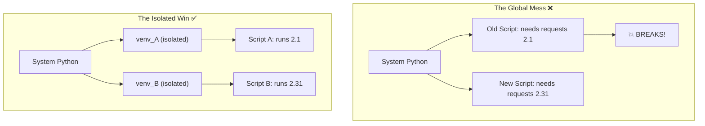

# 📦 Virtual Environments: Protecting your Production Ecosystem

> **"A script that runs on your laptop but fails in production isn't automated—it's broken. Virtual environments are the 'Shipping Containers' of Python, ensuring your code carries its own dependencies wherever it goes."**

> **⚠️ Missing Image**: *Python Subprocess Ecosystem* ('../assets/python_ecosystem.png')

## 📚 Overview

One of the biggest causes of "3 AM Incidents" in DevOps is the **Dependency Conflict**. Imagine Project A needs Version 1.0 of a library, but Project B needs Version 2.0. If you install them globally on your server, one project will inevitably break.

**Virtual Environments** (venvs) solve this by creating isolated, lightweight folders that contain their own Python binary and a private set of libraries. This module teaches you how to wall off your projects, manage reproducible `requirements.txt` files, and ensure that your automation is "100% Portable" across Mac, Windows, Linux, and Docker.

## 🎓 Learning Objectives

By the end of this module, you will:

- ✅ Master the **Environment Lifecycle** (Create → Activate → Deactivate).
- ✅ Implement **Reproducible Dependencies** using pinned `requirements.txt`.
- ✅ Orchestrate **Isolation Architecture** to prevent System Python corruption.
- ✅ Understand **Cross-Platform Activation** (Bash vs. PowerShell vs. CMD).
- ✅ Apply **Security Hygiene** by correctly `.gitignoring` environment folders.

---

## 🏗️ The Problem: Dependency Chaos

Without isolation, every Python project on your machine competes for the same "Global" space.



---

## 🚀 Professional Patterns for Engineers

### 1. The "Hidden Venv" Convention
Most professional DevOps teams name their environment `.venv` (starting with a dot). This keeps the folder hidden in many file explorers and identifies it as "Infrastructure Metadata."

```bash
# 💡 Create a hidden environment
python -m venv .venv

# 💡 Activate (Linux/macOS)
source .venv/bin/activate

# 💡 Activate (Windows PowerShell)
.\.venv\Scripts\Activate.ps1
```

### 2. Pinned Requirements (Production-Ready)
Never just run `pip install requests`. In production, you must "pin" the version to ensure your script doesn't break when a library update is released.

```bash
# 💡 Export current exact versions
pip freeze > requirements.txt

# 💡 Re-install exact versions on a new server
pip install -r requirements.txt
```

**What a Pro `requirements.txt` looks like:**

```text
# Fixed versions prevent "Silent Breakage"
requests==2.31.0
boto3==1.28.1
pyyaml==6.0.1
```

### 3. The .gitignore Golden Rule
**NEVER** commit your virtual environment folder to Git. It is specific to your OS and machine. Instead, commit your `requirements.txt` and let the server build its own venv.

```text
# .gitignore
.venv/
__pycache__/
*.pyc
```

---

## 🛡️ Security Checkpoint: The "System Python" Warning

| Risk | Consequence | Prevention |
| :--- | :--- | :--- |
| **Global Install** | Breaking the Linux OS (Yum/Apt rely on Python). | Never use `sudo pip install`. |
| **Package Drift** | Script fails in CI/CD but works locally. | Always use a fresh `.venv` in CI. |
| **Shadowing** | Local file named `requests.py` blocking the library. | Use unique module names. |

---

## 🏆 Real-World DevOps Story: The Server Snapshot Disaster

**The Scenario**: An SRE team had 50 different Python scripts running on a single Jenkins build server. They installed all libraries globally because it was "easier."

**The Discovery**: One day, a new project required an update to the `cryptography` library. When they updated it globally, 12 other scripts—responsible for production backups—instantly stopped working because they used an older SSL pattern that was removed in the new version. The team didn't notice for 3 days.

**The Solution**: The team implemented a mandatory rule: **Every script must run in its own `.venv`.**

**The Outcome**: Total isolation. Now, Project A can use the latest security features while the legacy Backup scripts continue to run on their stable dependencies. No more "Cross-Project Contamination."

---

## ❓ Interview Preparation (Virtual Environments)

1. **Q: Why should you never commit the 'venv' folder to Git?**
   - *A: Because a virtual environment contains compiled binaries and absolute paths that are specific to your machine's OS and folder structure. It will almost certainly fail if you try to run a Windows venv on a Linux server.*

2. **Q: How do you identify which environment is currently active?**
   - *A: On your terminal prompt, you will see the name of the environment in parentheses, e.g., `(.venv) user@host`. You can also run `which python` (Linux) or `where python` (Windows) to see the path to the binary.*

3. **Q: What is the purpose of `pip freeze`?**
   - *A: It outputs every installed package and its exact version in a format that `pip install -r` can understand. This is the foundation of "Reproducible Infrastructure."*

4. **Q: How do you deactivate an environment?**
   - *A: Simply type `deactivate` in your terminal. This restores your original shell's PATH variable.*

5. **Q: Can a virtual environment have a different Python version than the system?**
   - *A: A standard `venv` uses the Python version that created it. However, if you have multiple Pythons installed, you can specify one: `python3.10 -m venv .venv_10` vs `python3.11 -m venv .venv_11`.*

---

## 📝 Knowledge Check

1. **Which command creates a virtual environment?**
   - [ ] a) `python install venv`
   - [x] b) `python -m venv .venv`
   - [ ] c) `pip create venv`

2. **True or False: 'source .venv/bin/activate' works on Windows Command Prompt.**
   - [ ] a) True
   - [x] b) False (Use `.\.venv\Scripts\activate.bat`).

3. **What is the name of the file used to track dependencies?**
   - [ ] a) `config.yaml`
   - [x] b) `requirements.txt`
   - [ ] c) `packages.json`

4. **Why is isolation important for DevOps?**
   - [x] a) To prevent version conflicts between different automation tools.
   - [ ] b) To make the code run twice as fast.
   - [ ] c) To encrypt the source code.

5. **Where are the installed libraries stored inside a venv?**
   - [ ] a) In `venv/bin`
   - [x] b) In `venv/lib/pythonX.X/site-packages`
   - [ ] c) In your user home directory.

---

## 🔗 Next Steps

Isolating your environment is the first step. Now let's learn how to effectively manage the packages that live inside it.

Proceed to: **[Package Management →](../Part-16-Package-Management/README.md)**
