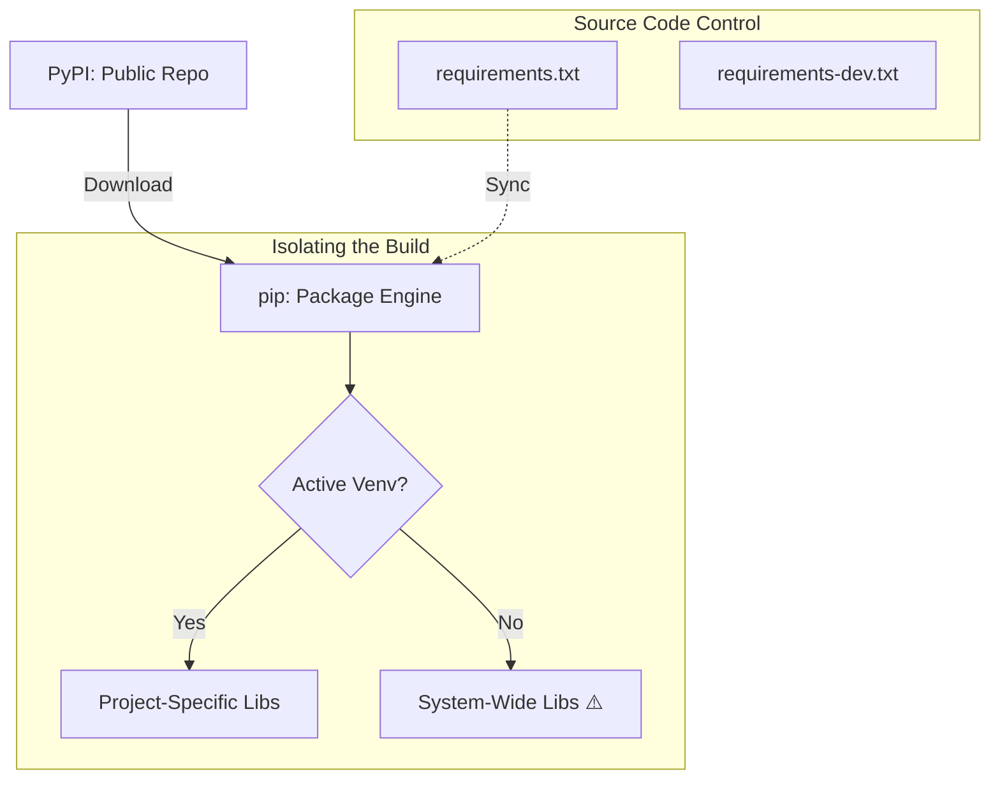

# 📦 Package Management: Orchestrating the Supply Chain

> **"A script is only as reliable as its weakest dependency. In DevOps, package management isn't just about 'installing stuff'—it's about ensuring your automation supply chain is secure, reproducible, and conflict-free."**


## 📚 Overview

The true power of Python lies in its vast ecosystem of over 400,000 packages. However, with great power comes the risk of "Dependency Hell"—a situation where competing libraries require different versions of the same core package, causing your scripts to fail in production.

This module focuses on **pip** (the industry-standard package installer) and the professional strategies required to manage complex dependency trees. You will learn to navigate **Semantic Versioning (SemVer)**, audit your packages for **Security Vulnerabilities**, and implement **Lockfile** strategies to ensure your 3:00 AM production builds are identical to your development tests.

## 🎓 Learning Objectives

By the end of this module, you will:

- ✅ Master **Advanced Pip Flags** for CI/CD pipelines (e.g., `--no-cache-dir`).
- ✅ Implement **Strict Version Pinning** to prevent "Breaking Change" drift.
- ✅ Understand **Semantic Versioning** (Major.Minor.Patch) logic.
- ✅ Orchestrate **Dependency Conflict Resolution** (avoiding Dependency Hell).
- ✅ Secure your scripts using **Package Auditing** and vulnerability scanning.

---

## 🏗️ The Package Lifecycle: From PyPI to Production

The Python Package Index (PyPI) is the central source of truth, but `pip` is the engine that pulls it into your local environments.



### The "System" Trap
**NEVER** run `pip install` as `root` or `sudo`. This can modify the Python libraries your operating system (Linux/macOS) needs to survive. Always use a Virtual Environment.

---

## 🚀 Professional Patterns for Engineers

### 1. Semantic Versioning (SemVer)
Understanding the `X.Y.Z` format is critical for deciding when to upgrade.

| Level | Range | Rule of Thumb |
| :--- | :--- | :--- |
| **Major (X)** | `2.x.x` → `3.x.x` | **Breaking Changes**. Your code WILL break. |
| **Minor (Y)** | `2.1.x` → `2.2.x` | New Features. Usually safe to upgrade. |
| **Patch (Z)** | `2.2.0` → `2.2.1` | Bug/Security Fixes. **Always** upgrade. |

### 2. Intelligent Specifiers
You can define how 'brave' your script is when installing updates.

```text
# 💡 Exact: Zero change possible. The safest for Production.
requests == 2.31.0

# 💡 Compatible: Allows bug fixes only (2.31.1), but not new features (2.32).
requests ~= 2.31.0

# 💡 Flexible: Anything newer than this version. Good for early dev.
requests >= 2.31.0
```

### 3. Pipeline-Specific Flags
When building Docker images or running in a CI/CD runner (like GitHub Actions), every second and every MB counts.

```bash
# 💡 Avoid bloating Docker images with downloaded cache files
pip install --no-cache-dir -r requirements.txt

# 💡 Check for broken dependencies across ALL installed packages
pip check
```

---

## 🛡️ Security Checkpoint: The Vulnerability Scan

**The Risk**: Hackers often upload "Typosquatted" packages—e.g., `reqeusts` instead of `requests`. If you install the wrong one, they can steal your environment variables and AWS keys.

**The Pro Solution**: Use `pip-audit` to scan your `requirements.txt` before every deployment.

```bash
# 💡 Automated vulnerability check
pip install pip-audit
pip-audit -r requirements.txt
```

---

## 🏆 Real-World DevOps Story: The Black Friday Breakage

**The Scenario**: A major e-commerce company had a deployment script that ran `pip install boto3` (no version specified) every time a new server was scaled up.

**The Discovery**: On the morning of Black Friday, AWS released a new major version of `boto3`. Suddenly, every new server being added to the cluster failed to start because the script's code wasn't compatible with the new version. The site crashed under the holiday load because it couldn't scale.

**The Solution**: The team quickly patched the script to use `boto3==1.26.151` and re-deployed.

**The Outcome**: The company lost $500,000 in sales during the 20-minute outage. The post-mortem resulted in a "Zero-Unpinned" policy: nothing goes to Production without an exact version number.

---

## ❓ Interview Preparation (Package Management)

1. **Q: What is the difference between `pip freeze` and `pip list`?**
   - *A: `pip list` is for humans—it shows a nice table of what's installed. `pip freeze` is for machines—it outputs exactly what `requirements.txt` needs to recreate the environment.*

2. **Q: Why would you use a `requirements-dev.txt` file?**
   - *A: To separate libraries needed for **running** the app (e.g., `requests`) from libraries needed for **testing/linting** it (e.g., `pytest`, `black`). This keeps production images small and secure.*

3. **Q: How does `pip resolve` conflicts?**
   - *A: Modern `pip` (20.3+) uses a specialized dependency resolver that looks at all packages simultaneously. If it finds two libraries that need conflicting versions of the same dependency, it will halt and throw an error rather than installing a "best guess."*

4. **Q: What is a "Wheel" (`.whl`) file?**
   - *A: It is a pre-compiled binary distribution of a Python package. It's much faster to install than a "Source Distribution" because your computer doesn't have to compile it locally.*

5. **Q: How do you install a package from a private GitHub repository?**
   - *A: By using the Git URL in your requirements file: `git+https://github.com/org/repo.git@v1.0.0`.*

---

## 📝 Knowledge Check

1. **In SemVer `3.1.5`, which number represents a Patch (Bug Fix)?**
   - [ ] a) 3
   - [ ] b) 1
   - [x] c) 5

2. **True or False: Using 'pip install' without a version number is a best practice for Production.**
   - [ ] a) True
   - [x] b) False

3. **Which flag prevents pip from saving temporary files during a Docker build?**
   - [ ] a) `--no-save`
   - [x] b) `--no-cache-dir`
   - [ ] c) `--fast`

4. **What does 'pip check' do?**
   - [x] a) Verifies that all installed packages have compatible dependencies.
   - [ ] b) Checks if your Python version is up to date.
   - [ ] c) Scans your code for syntax errors.

5. **Why should you use 'python -m pip' instead of just 'pip'?**
   - [ ] a) It is faster.
   - [x] b) It ensures you are using the pip associated with the specific Python version you intend to use.
   - [ ] c) It is more secure.

---

## 🔗 Next Steps

You've mastered the environment and the packages. Now, let's put it all together and build your first full-scale automation engine.

Proceed to: **[Your First Automation Script →](../Part-17-First-Automation-Script/README.md)**
