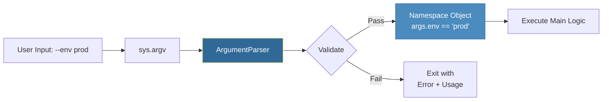

# ⌨️ Command Line Arguments: Building Professional CLI Tools

> **"Bash scripts are for quick fixes, but Python CLIs are for enterprise automation. If you want your tools to be used by fellow engineers, you must build them with a professional interface."**

> **⚠️ Missing Image**: *Python CLI Automation* ('../assets/python_automation_banner.png')

## 📚 Overview

Command Line Interface (CLI) tools are the primary way engineers interact with the cloud. From `kubectl` to `terraform`, professional tools rely on structured argument parsing to provide clear help text, input validation, and a predictable user experience.

Python's `argparse` module is the industry standard for building these interfaces. It transforms your script from a simple file into a powerful command like `deploy --env prod --replicas 3`. This module teaches you how to design CLIs that are safe, self-documenting, and robust enough for production pipelines.

## 🎓 Learning Objectives

By the end of this module, you will:

- ✅ Parse **Positional** and **Optional** arguments with `argparse`.
- ✅ Implement **Git-style Subcommands** (e.g., `tool.py get` vs `tool.py create`).
- ✅ Enforce **Mutually Exclusive Groups** to prevent conflicting flags.
- ✅ Implement **Custom Type Validation** (e.g., IP address or Port scaling).
- ✅ Design **Self-Documenting Help Menus** that guide the user.

---

## 🏗️ The CLI Anatomy

When you run a script with arguments, Python captures them in the `sys.argv` list, but `argparse` is the engine that actually makes sense of them.



### 1. Basic Argument Structure
```python
import argparse

parser = argparse.ArgumentParser(description="Backup utility for S3")

# Positional: Mandatory, order matters
parser.add_argument("bucket", help="Target S3 bucket name")

# Optional/Flag: Order doesn't matter, usually has a default
parser.add_argument("-r", "--region", default="us-east-1")
parser.add_argument("--dry-run", action="store_true") # Flag (True if present)

args = parser.parse_args()
print(f"Backing up to {args.bucket} in {args.region}...")
```

---

## 🚀 Advanced CLI Patterns

### 1. Subcommands: Organizing Complex Tools
Professional tools like `git` or `aws` use subcommands to group related logic.

```python
subparsers = parser.add_subparsers(dest="command")

# Deploy Command
deploy = subparsers.add_parser("deploy", help="Deploy application")
deploy.add_argument("--image", required=True)

# Status Command
status = subparsers.add_parser("status", help="Check deployment health")

args = parser.parse_args()
if args.command == "deploy":
    print(f"Deploying {args.image}...")
```

### 2. Mutually Exclusive Groups
Stop users from providing conflicting flags, like `--quiet` and `--verbose`.

```python
group = parser.add_mutually_exclusive_group()
group.add_argument("-v", "--verbose", action="store_true")
group.add_argument("-q", "--quiet", action="store_true")
```

### 3. Custom Validation (Built-in Security)
Validate user input *before* your script starts running heavy logic.

```python
def check_port(value):
    ivalue = int(value)
    if ivalue < 1024 or ivalue > 65535:
        raise argparse.ArgumentTypeError(f"Port {value} is in protected or invalid range.")
    return ivalue

parser.add_argument("--port", type=check_port, default=8080)
```

---

## 🏆 Real-World DevOps Story: The "Prod" Accident

**The Scenario**: A cleanup script used simple positional arguments: `python clean.py <env>`. A tired SRE meant to type `staging` but hit the up-arrow and Enter, accidentally running the command twice on the same environment.

**The Problem**: The script was too simple. It didn't care if the environment was production or staging, and it gave zero feedback.

**The Solution**: The team refactored the tool using `argparse`.
1. They made `--env` a required flag with choices: `choices=['dev', 'stg', 'prod']`.
2. They added a mandatory `--confirm` flag that is **only** required if `--env prod` is selected.
3. They implemented a `--dry-run` flag that is enabled by default.

**The Outcome**: The tool became "Fail-Safe." If an engineer tried to clean Production without confirmation, the script simply printed a helpful usage error and exited.

---

## ❓ Interview Preparation (CLI Tools)

1. **Q: How does `argparse` handle incorrect types?**
   - *A: If you set `type=int` and the user provides a string, `argparse` automatically catches the error, prints a message like `error: argument --replicas: invalid int value`, and exits with a non-zero status.*

2. **Q: What is the difference between `nargs="+"` and `nargs="*"`?**
   - *A: `+` requires **at least one** argument. `*` allows **zero or more** (returns an empty list if none provided). Useful for commands that take a list of server IDs.*

3. **Q: Why is `argparse` better than `sys.argv`?**
   - *A: `sys.argv` is just a raw list of strings. You have to manually check lengths, handle flags (like `-v` vs `--verbose`), and write help text. `argparse` does all this automatically.*

4. **Q: How do you read arguments from a configuration file instead of the CLI?**
   - *A: `argparse` supports "fromfile" parsing using `fromfile_prefix_chars='@'`. If the user runs `script.py @args.txt`, the parser reads the arguments from that file.*

5. **Q: How do you implement a "Version" flag?**
   - *A: Use the special action: `parser.add_argument("-V", "--version", action="version", version="%(prog)s 1.0.2")`.*

---

## 📝 Knowledge Check

1. **Which object stores the parsed arguments?**
   - [ ] a) A Dictionary
   - [x] b) A Namespace object
   - [ ] c) A Tuple

2. **True or False: `choices=["dev", "prod"]` will prevent the script from running with "--env staging".**
   - [x] a) True
   - [ ] b) False

3. **How do you denote an argument that takes a list of 1 or more values?**
   - [ ] a) `nargs="*"`
   - [x] b) `nargs="+"`
   - [ ] c) `nargs=1`

4. **What does `action="store_true"` return if the flag is NOT present?**
   - [ ] a) `None`
   - [ ] b) `0`
   - [x] c) `False`

5. **Which command displays the auto-generated help menu?**
   - [x] a) `--help`
   - [ ] b) `--usage`
   - [ ] c) `--info`

---

## 🔗 Next Steps

CLIs are used to trigger logic, but that logic often involves running external shell commands.

Proceed to: **[The Subprocess Module →](../Part-10-Subprocess-Module/README.md)**
