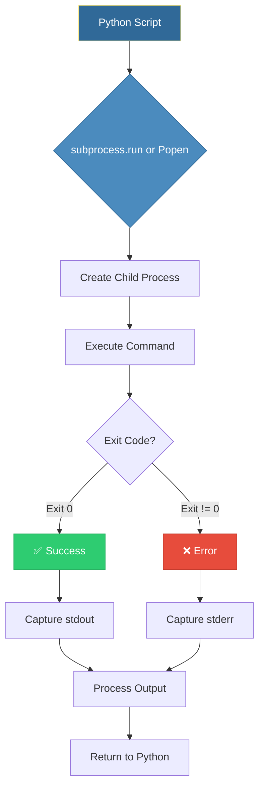

# 🐚 The Subprocess Module: Bridging Python and the Shell

> **"Python is the brain, but the Shell is the muscles. The subprocess module is the nervous system that connects the two, allowing your code to orchestrate everything from Docker to Terraform."**

> **⚠️ Missing Image**: *Python Subprocess Ecosystem* ('../assets/python_ecosystem.png')

## 📚 Overview

Modern DevOps is built on CLI tools. While Python has libraries for almost everything, you will inevitably need to call external binaries like `kubectl`, `git`, `ansible`, or `aws`. 

The `subprocess` module is the professional way to spawn new processes, connect to their input/output/error pipes, and obtain their return codes. This module takes you beyond simple `os.system()` calls to build robust, secure, and high-performance automation scripts that can handle complex command pipelines and real-time output streaming.

## 🎓 Learning Objectives

By the end of this module, you will:

- ✅ Master **Safe Execution** using the list-based argument pattern.
- ✅ Capture and Process **Stdout & Stderr** for API/CLI integration.
- ✅ Implement **Strict Error Handling** with `check=True` and `CalledProcessError`.
- ✅ Design **Asynchronous Pipelines** using `Popen` for real-time streaming.
- ✅ Prevent **Shell Injection Vulnerabilities** using industry-standard security.

---

## 🏗️ Subprocess Architecture

When you run a command via `subprocess`, Python creates a "Child Process" that executes independently.



---

## 🚀 Professional Command Patterns

### 1. The Standard Execution (`run`)
`subprocess.run()` is the recommended "one-shot" tool. It waits for the command to finish and returns a `CompletedProcess` object.

```python
import subprocess

# ✅ The POSIX-safe list pattern
result = subprocess.run(
    ["git", "status", "--short"],
    capture_output=True, # Captures output into memory
    text=True,           # Returns strings instead of bytes
    check=True           # Raises exception if command fails
)

print(f"Current Status: \n{result.stdout}")
```

### 2. Real-Time Streaming (`Popen`)
For long-running tasks (like a 10-minute `docker build`), you can't wait until the end to see the output. `Popen` allows you to stream lines as they happen.

```python
import subprocess

# 💡 Starting a background process
process = subprocess.Popen(
    ["ping", "-c", "10", "google.com"],
    stdout=subprocess.PIPE,
    stderr=subprocess.STDOUT, # Merge errors into health stream
    text=True
)

# Stream output line-by-line
for line in process.stdout:
    print(f"[LIVE LOG]: {line.strip()}")

process.wait() # Wait for completion
```

### 3. Communicating with External Tools
Sometimes you need to "pipe" data *into* a command (like sending a password to `sudo` or a manifest to `kubectl apply`).

```python
yaml_manifest = """
apiVersion: v1
kind: Namespace
metadata:
  name: dynamic-env
"""

# 💡 Passing stdin to a command
subprocess.run(
    ["kubectl", "apply", "-f", "-"],
    input=yaml_manifest,
    text=True
)
```

---

## 🛡️ Security Checkpoint: Preventing Shell Injection

**The Risk**: If you use `shell=True` and pass user input as a string, a malicious user can execute "Command Injection".

```python
# ❌ MORTAL DANGER
# If user_input is "; rm -rf /", the second command will run!
subprocess.run(f"echo {user_input}", shell=True)

# ✅ INDUSTRY STANDARD
# Python passes the list directly to the OS. Arguments are NEVER parsed as commands.
subprocess.run(["echo", user_input])
```

---

## 🏆 Real-World DevOps Story: The Terraform Wrapper

**The Scenario**: An internal "Self-Service Portal" allowed developers to click a button to provision an AWS VPC. Under the hood, a Python script called `terraform apply`.

**The Problem**: The first version used `os.system()`, which didn't capture errors. If Terraform failed (due to a limit or region outage), the Portal thought it succeeded, but the developer got nothing.

**The Solution**: The team refactored the Portal code to use `subprocess.run(..., check=True)`. They also parsed the `stderr` to extract the specific AWS error code.

**The Outcome**: Within a week, the number of "Ghost Provisioning" tickets dropped by 90%. The Portal could now precisely explain to the developer: "Failed because the VPC CIDR 10.0.0.0/16 already exists."

---

## ❓ Interview Preparation (Subprocess)

1. **Q: What is the difference between `subprocess.run` and `subprocess.Popen`?**
   - *A: `run` is synchronous (blocking) and waits for the command to finish. `Popen` is asynchronous (non-blocking), returning immediately while the command runs in the background. Use `Popen` for streaming logs or parallel processes.*

2. **Q: How do you handle a command that hangs indefinitely?**
   - *A: Use the `timeout` parameter in `run()`. If the command exceeds the limit, Python raises a `subprocess.TimeoutExpired` exception, allowing you to kill the process and alert the team.*

3. **Q: How do you capture an exit code from a one-shot command?**
   - *A: Access the `.returncode` attribute of the `CompletedProcess` object. In Unix/Linux, `0` always means success, and anything non-zero indicates an error.*

4. **Q: What does `text=True` (or `universal_newlines=True`) actually do?**
   - *A: By default, `subprocess` returns raw `bytes`. Setting this to `True` tells Python to decode the bytes into a `str` (String) using the system's default encoding (usually UTF-8).*

5. **Q: How do you run a command in a different directory without using `cd`?**
   - *A: Use the `cwd` (Current Working Directory) parameter: `subprocess.run(["ls"], cwd="/etc/nginx")`.*

---

## 📝 Knowledge Check

1. **Which method is recommended for simple, one-shot commands?**
   - [ ] a) `os.system()`
   - [ ] b) `subprocess.Popen()`
   - [x] c) `subprocess.run()`

2. **True or False: Using 'shell=True' is generally considered a security risk.**
   - [x] a) True
   - [ ] b) False

3. **How do you force your script to crash if the subprocess fails?**
   - [ ] a) `strict=True`
   - [ ] b) `abort=True`
   - [x] c) `check=True`

4. **Which attribute identifies the 'Zero' or 'Non-Zero' result of a command?**
   - [ ] a) `status`
   - [x] b) `returncode`
   - [ ] c) `exit_val`

5. **What is the result of 'capture_output=True'?**
   - [x] a) stdout and stderr are saved into variables inside the result object.
   - [ ] b) The command output is printed twice.
   - [ ] c) The output is saved to a file named 'output.log'.

---

## 🔗 Next Steps

Now that you can run shell commands, let's learn how to navigate the modern file system.

Proceed to: **[Pathlib Basics →](../Part-11-Pathlib-Basics/README.md)**
