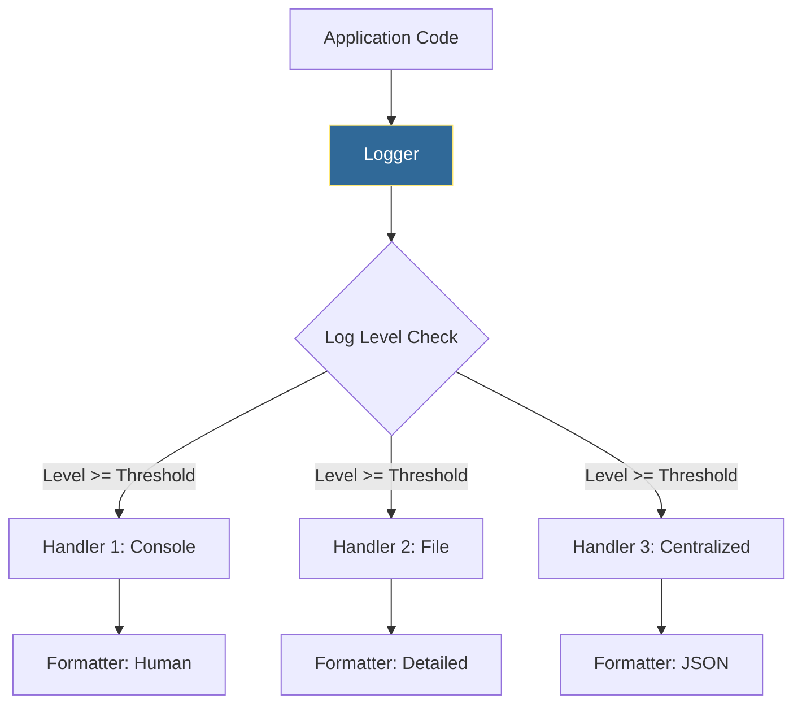

# 📄 Logging Basics: The Flight Recorder of Automation

> **"Proper logging separates amateur scripts from production-ready automation. In DevOps, good logs are the difference between a 5-minute fix and a 5-hour blind investigation."**

> **⚠️ Missing Image**: *Python Data Flow* ('../assets/python_data_flow.png')

## 📚 Overview

When your automation goes horizontal across 1,000 servers, you can't rely on `print()` statements. If a script fails at 3:00 AM in a headless container, there is no screen to look at. You need a persistent, structured record of exactly what happened, when, and why.

Python's `logging` module is a powerful, enterprise-grade engine that allows you to route messages to multiple destinations simultaneously—such as the console for debugging, a file for auditing, and a centralized log server (like Splunk or ELK) for incident response. This module teaches you how to implement **Structured Logging**, **Log Rotation**, and **Severity Hierarchies** to build scripts that are truly production-ready.

## 🎓 Learning Objectives

By the end of this module, you will:

- ✅ Master the **Severity Hierarchy** (Debug → Info → Warning → Error → Critical).
- ✅ Orchestrate **Multiple Handlers** (Logging to Console and File simultaneously).
- ✅ Implement **Rotating File Handlers** to prevent disk space exhaustion.
- ✅ Generate **Structured JSON Logs** for high-speed cloud aggregation.
- ✅ Apply **Contextual Logging** to trace requests across complex pipelines.

---

## 🏗️ The Logging Architecture

A professional logger acts as a "Router." It receives a message, checks its severity, and decides where to send it based on your configuration.



### The Severity Scale
Setting your log level is the most powerful way to control "Noise" in production.

| Level | Value | Role in DevOps |
| :--- | :--- | :--- |
| **DEBUG** | 10 | Verbose data for developer troubleshooting. |
| **INFO** | 20 | Normal operational events (e.g., "Deployment Success"). |
| **WARNING** | 30 | Something odd (e.g., "Disk at 85%", "API Retry 1/3"). |
| **ERROR** | 40 | A function failed (e.g., "Database connection refused"). |
| **CRITICAL**| 50 | Total system failure (e.g., "Disk Full", "Kernel Panic"). |

---

## 🚀 Professional Patterns for Engineers

### 1. Dual-Destination Logging (The DevOps Standard)
In production, you usually want simple logs in the console (for `kubectl logs`) and detailed timestamped logs in a persistent file.

```python
import logging

logger = logging.getLogger("deploy-bot")
logger.setLevel(logging.DEBUG) # Catch everything

# 1. Console Handler (Simple)
c_handler = logging.StreamHandler()
c_handler.setLevel(logging.INFO)
c_handler.setFormatter(logging.Formatter("%(levelname)s: %(message)s"))

# 2. File Handler (Detailed)
f_handler = logging.FileHandler("audit_trail.log")
f_handler.setLevel(logging.DEBUG)
f_handler.setFormatter(logging.Formatter("%(asctime)s - %(name)s - %(levelname)s - %(message)s"))

logger.addHandler(c_handler)
logger.addHandler(f_handler)
```

### 2. Safeguarding the Disk (Rotation)
A logging script can accidentally crash a server by filling up the disk. Never use a standard `FileHandler` for long-running apps. Use `RotatingFileHandler`.

```python
from logging.handlers import RotatingFileHandler

# 💡 Keep 5 backup logs of 10MB each. 
# When 'app.log' hits 10MB, it becomes 'app.log.1' and a new one is started.
handler = RotatingFileHandler("app.log", maxBytes=10*1024*1024, backupCount=5)
```

### 3. Capturing the Stack Trace
When an exception occurs, don't just log the error message. Log the **Traceback** so you know exactly which line failed.

```python
try:
    1 / 0
except ZeroDivisionError:
    # 💡 'exception' level automatically attaches the full traceback!
    logger.exception("A critical calculation failed during deployment")
```

---

## 🏆 Real-World DevOps Story: The Silent Cleanup Failure

**The Scenario**: A cleanup script was designed to delete temporary cloud snapshots every night. It ran via Cron for 6 months. One morning, the AWS bill arrived, and the company was charged $15,000 for snapshots that should have been deleted months ago.

**The Problem**: The script was using `print("Success")` and `print("Error")`. When the AWS API changed and the script started failing, the `print` messages were lost in the local server's void because no one was looking at the terminal.

**The Solution**: The team refactored the script to use the `logging` module with an **SMTP (Email) Handler** for Critical errors.

**The Outcome**: The next time the API changed, the SRE team received an urgent email within seconds of the failure. The problem was fixed immediately, preventing another $15,000 bill.

---

## ❓ Interview Preparation (Logging)

1. **Q: Why is `print()` forbidden in production automation?**
   - *A: `print()` lacks metadata (times, levels) and is difficult to redirect. Loggers allow you to toggle verbosity (`DEBUG` vs `INFO`) without re-deploying code and can route data to files or remote servers simultaneously.*

2. **Q: What happens if a child logger doesn't have a specific level set?**
   - *A: It inherits the level of its parent (and eventually the Root logger). This allows you to set `logging.INFO` globally while overriding a specific module to `DEBUG` for troubleshooting.*

3. **Q: How does `RotatingFileHandler` prevent 'Disk Full' errors?**
   - *A: It sets a hard limit on file size (`maxBytes`). Once reached, it renames the file and starts a new one, keeping only a fixed number of past logs (`backupCount`). This ensures your log folder never grows indefinitely.*

4. **Q: What is a "Logger Adapter" or 'Extra' data?**
   - *A: It's a way to inject common data (like a `request_id` or `env_name`) into every single log line automatically, making it easier to trace a single transaction through 100 different log entries.*

5. **Q: Why should you use `logger.exception()` instead of `logger.error(str(e))`?**
   - *A: `logger.exception()` includes the full stack trace (the history of function calls leading to the error). `logger.error(str(e))` only logs the error message, making it much harder to find the actual bug.*

---

## 📝 Knowledge Check

1. **Which log level has a numeric value of 20?**
   - [ ] a) DEBUG
   - [x] b) INFO
   - [ ] c) WARNING

2. **True or False: A single logger can have multiple handlers attached to it.**
   - [x] a) True
   - [ ] b) False

3. **What is the primary benefit of JSON logging in DevOps?**
   - [ ] a) It makes logs smaller.
   - [x] b) It makes logs machine-readable and searchable in tools like Splunk or Kibana.
   - [ ] c) It's more colorful.

4. **Which character code in a formatter shows the name of the function that called the logger?**
   - [ ] a) `%(name)s`
   - [x] b) `%(funcName)s`
   - [ ] c) `%(module)s`

5. **Why use `TimedRotatingFileHandler`?**
   - [x] a) To rotate logs at a specific time (like every Sunday at midnight) for easier log archiving.
   - [ ] b) To make the script run on a timer.
   - [ ] c) To measure how long tasks take.

---

## 🔗 Next Steps

Monitoring your script's health is done. Now let's learn how to isolate your script's dependencies to ensure it runs anywhere.

Proceed to: **[Virtual Environments →](../Part-15-Virtual-Environments/README.md)**
