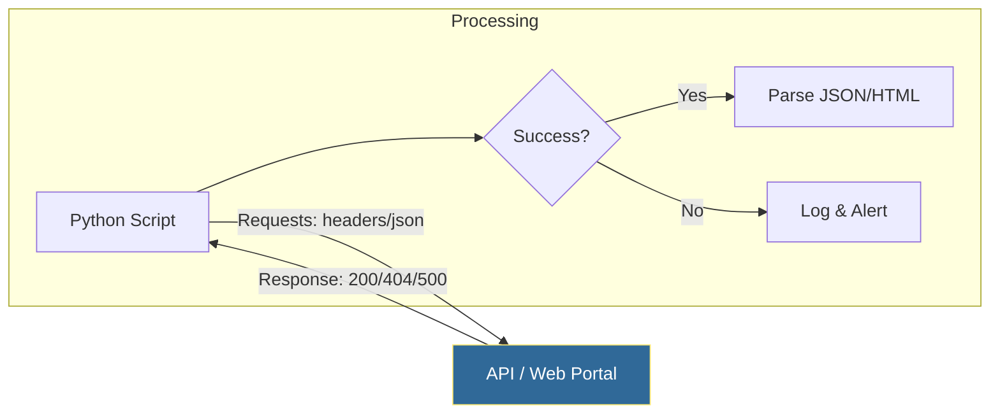

# 🌐 Working with the Web: APIs, Scraping, and Orchestration

> **"If a system is connected, it has an interface. Whether it's a sleek REST API or a messy HTML status page, Python is the universal key that unlocks and automates those interactions."**


## 📚 Overview

Modern DevOps is built on **APIs**. We don't just "talk" to servers; we program them via HTTP. Whether you are triggering a GitHub Action, checking a Cloudflare status page, or pushing telemetry to a monitoring dashboard, you are working with the Web.

This module moves you beyond the command line to the **Global Network**. You will master the `requests` library (the industry standard for HTTP) and learn the art of **Web Scraping** using `BeautifulSoup` for those legacy systems that don't have an API. By the end, you'll be able to build "Glue Code" that connects disparate cloud services into a single, automated workflow.

## 🎓 Learning Objectives

By the end of this module, you will:

- ✅ Master the **Requests Pattern** (GET, POST, PATCH, DELETE).
- ✅ Implement **Robust Error Handling** using `raise_for_status()` and time-outs.
- ✅ Orchestrate **API Authentication** (Headers, Bearer Tokens, and Basic Auth).
- ✅ Build **Web Scrapers** to extract data from non-API HTML status pages.
- ✅ Understand **JSON Serialization** for high-speed API data exchange.

---

## 🏗️ The Web Interaction Workflow

The internet is just a series of Requests and Responses. Python simplifies this into simple objects.



### The "Big Three" of Web Automation
1.  **REST APIs**: Structured, predictable data (JSON).
2.  **Web Scraping**: Unstructured text hidden in HTML tags.
3.  **Authentication**: The security gates (Tokens, API Keys).

---

## 🚀 Professional Patterns for Engineers

### 1. The Production-Safe Request
Never run a request without a **Timeout**. If a server hangs, your script will hang forever, potentially blocking your entire CI/CD pipeline.

```python
import requests

try:
    # 💡 Always set a timeout (in seconds)
    response = requests.get("https://api.github.com/zen", timeout=5)
    
    # 💡 Automatically raise an exception for 4xx or 5xx errors
    response.raise_for_status()
    
    print(f"Server says: {response.text}")
except requests.exceptions.RequestException as e:
    print(f"🚨 API Failure: {e}")
```

### 2. Scraping Legacy Portals (BeautifulSoup)
Sometimes you have to automate a tool that hasn't been updated since 2005 and has no API.

```python
from bs4 import BeautifulSoup
import requests

page = requests.get("https://status.legacy-system.com")
soup = BeautifulSoup(page.text, "html.parser")

# 💡 Extract the status of 'Server 01' from a table
status_cell = soup.find("td", string="Server 01").find_next_sibling("td")
print(f"Current Status: {status_cell.text}")
```

### 3. API Orchestration (Headers & Tokens)
Most cloud APIs require an Authorization header.

```python
headers = {
    "Authorization": "Bearer MySuperSecretToken",
    "Accept": "application/vnd.github.v3+json"
}

# 💡 Sending JSON data to a Slack Webhook or GitHub API
data = {"text": "Deployment complete! ✅"}
requests.post("https://api.github.com/repos/me/app/dispatches", headers=headers, json=data)
```

---

## 🛡️ Best Practices for Web Automation

| Rule | Action | Benefit |
| :--- | :--- | :--- |
| **Timeouts** | `timeout=5` | Prevents scripts from hanging indefinitely. |
| **Status Codes** | `raise_for_status()` | Ensures you don't process "Error" pages as valid data. |
| **Authentication**| Use Environment Variables | Prevents accidental token leaks in Git. |
| **Rate Limiting** | `time.sleep(1)` | Prevents your script from being banned by the server. |

---

## 🏆 Real-World DevOps Story: The Ghost in the Legacy Machine

**The Scenario**: A financial firm relied on a 15-year-old internal dashboard to track server health. It had no API, and the only way to know if a server failed was for a human to refresh the page every 30 minutes.

**The Discovery**: During a major outage on a Sunday morning, the dashboard showed red, but no one was at their desk to see it. The outage lasted 4 hours, costing the company $200k.

**The Solution**: A DevOps engineer wrote a 20-line Python script using `requests` and `BeautifulSoup`. The script "scraped" the dashboard every 60 seconds, looking for the word "CRITICAL" in a specific HTML table. If found, it sent an urgent page to the on-call engineer.

**The Outcome**: The next failure was detected in 60 seconds. The on-call engineer fixed it in 15 minutes. The cost of building the solution was $0 and 1 hour of coding time.

---

## ❓ Interview Preparation (Web)

1. **Q: What is the difference between `params` and `json` in a `requests.post()` call?**
   - *A: `params` adds data to the URL (e.g., `?id=123`). `json` sends data in the **Body** of the request as a structured JSON object. Most modern APIs expect data in the body.*

2. **Q: How do you handle a "429 Too Many Requests" error?**
   - *A: Use a 'Retry' strategy with 'Exponential Backoff.' Wait for a second, then try again, doubling the wait time each time until it succeeds or hits a limit.*

3. **Q: Why use `response.json()` instead of `json.loads(response.text)`?**
   - *A: `response.json()` is a convenient built-in method that automatically handles character encoding and is more readable.*

4. **Q: What are the risks of Web Scraping?**
   - *A: Brittleness. If the website changes its HTML structure even slightly (e.g., changing a `class` name), your scraper will break. Always prefer an official API if available.*

5. **Q: Explain 'idempotence' in HTTP methods.**
   - *A: An idempotent method (like `GET` or `PUT`) can be called multiple times with the same result. `POST` is NOT idempotent; calling it twice might create two identical records in a database.*

---

## 📝 Knowledge Check

1. **Which HTTP method is used to CREATE a new resource in an API?**
   - [ ] a) GET
   - [x] b) POST
   - [ ] c) DELETE

2. **True or False: `requests.get()` will throw an exception if the server returns a 404 error (automatically).**
   - [ ] a) True
   - [x] b) False (You must call `response.raise_for_status()`).

3. **In BeautifulSoup, which method finds ALL occurrences of an HTML tag?**
   - [ ] a) `find()`
   - [x] b) `find_all()`
   - [ ] c) `search()`

4. **What does a 'Bearer Token' typically signify?**
   - [ ] a) The server is loading.
   - [x] b) The request is authenticated and authorized.
   - [ ] c) The connection is encrypted.

5. **Which library is faster for parsing massive HTML files?**
   - [x] a) lxml
   - [ ] b) html.parser
   - [ ] c) regex

---

## 🔗 Next Steps

You've learned to talk to the web via code. Now, let's learn how to automate the **Browser** itself for tasks that simple HTTP requests can't handle.

Proceed to: **[Web Automation & Selenium →](../Part-19-Web-Automation/README.md)**
