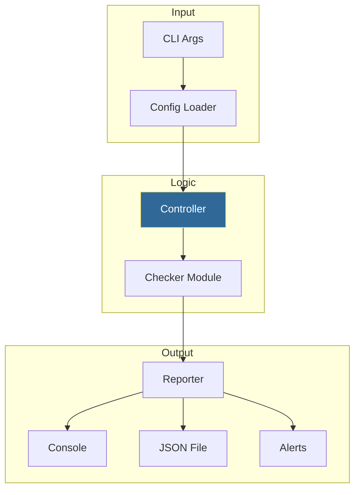

# 🚀 Your First Automation Script: The Multi-Server Health Monitor

> **"Theory becomes power only when it is applied. This capstone project combines every module you've studied—from Variables to Subprocesses—into a single, production-grade automation engine."**


## 📚 Overview

In the world of DevOps, a "Script" is more than just a list of commands. A **Production-Ready Tool** must be:
1.  **Configurable**: Uses external files (JSON/YAML) so you don't have to edit code to change servers.
2.  **Verbose**: Implements professional logging so you can troubleshoot failures later.
3.  **Resilient**: Handles network errors and timeouts without crashing.
4.  **Actionable**: Provides exit codes and reports that CI/CD pipelines can understand.

This capstone module guides you through building a **Global Server Health Monitor**. This tool will check pings, HTTP status codes, and TCP ports, aggregate the data, and generate a structured JSON report.

## 🎓 Learning Objectives

By the end of this module, you will:

- ✅ Orchestrate **Multi-Module Projects** (Separating Main, Config, and Logic).
- ✅ Implement **Complex CLI Argument Parsing** with `argparse`.
- ✅ Build a **Subprocess Wrapper** to perform cross-platform system checks.
- ✅ Master **Data Transformation** (From raw check results to a Summary Report).
- ✅ Understand **Exit Code Strategy** for pipeline integration.

---

## 🏗️ The Engineering Blueprint

A professional script is divided into layers. This prevents "Spaghetti Code" and makes it easy to test each part individually.



---

## 🚀 The Capstone Project: Server Health Monitor

We are building a tool that takes a list of servers and checks their "Vitals."

### 📂 Project Structure
```text
server-health-monitor/
├── .venv/                 # Isolated environment
├── config/
│   └── servers.json       # The 'Where' (Server list)
├── logs/
│   └── monitor.log        # The 'What happened' (Audit trail)
├── src/
│   ├── main.py            # The Entry Point
│   ├── checker.py         # The Muscles (Ping/HTTP logic)
│   └── reporter.py        # The Brain (Aggregation logic)
└── requirements.txt       # The Dependencies
```

### 🧠 Key Engineering Patterns inside the Code:

1.  **The `main()` function**: We wrap everything in a `main()` and use `if __name__ == "__main__":`. This is the standard for all professional Python tools.
2.  **Graceful Degeneracy**: If the `requests` library isn't installed, the script doesn't crash; it simply disables HTTP checks and logs a warning.
3.  **Cross-Platform Ping**: The script detects if it is running on Windows (`-n`) or Linux (`-c`) and adjusts its shell commands automatically.
4.  **Exit Codes**: 
    - `0`: Everything is Healthy.
    - `1`: Some servers are down.
    - `2`: Total failure.
    - *This allows Jenkins/GitHub Actions to stop the build if the environment is unhealthy.*

---

## 🏆 Real-World DevOps Story: The 3:00 AM Manual Check

**The Scenario**: An junior SRE used to wake up at 3:00 AM every Sunday to manually check if the 50 production database servers survived the weekly backup. He would open a terminal and ping them one by one.

**The Problem**: Human error. Sometimes he missed a server. Sometimes he didn't notice the latency was high. It took 45 minutes of manual work every week.

**The Solution**: He built a version of the **Health Monitor** script we are creating in this module. He added a simple Cron job to run it automatically.

**The Outcome**: Now, the script runs at 3:05 AM. It takes 12 seconds. If even one server is slow, he gets a single Slack notification. He hasn't manually pinged a server in 3 years.

---

## ❓ Interview Preparation (Capstone)

1. **Q: Why separate the 'Checker' logic from the 'Reporter' logic?**
   - *A: This is the **Single Responsibility Principle**. If you want to change how you check a server (e.g., add a port check), you only edit one file. If you want to change the report from JSON to Excel, you edit a different file. This makes the tool easier to maintain.*

2. **Q: How do you handle secrets (like API keys) in an automation script?**
   - *A: Use the pattern from Module 08! Never hardcode them. Load them from Environment Variables or a `.env` file using `os.getenv()` or `python-dotenv`.*

3. **Q: Why use external JSON for the server list instead of a list inside the Python code?**
   - *A: It allows non-developers (or other automation tools) to update the server list without touching the logic. It also allows you to use the same script for 'Dev', 'Staging', and 'Prod' just by swapping the config file.*

4. **Q: How can you make this script run in parallel for 1,000+ servers?**
   - *A: You would use Python's `threading` or `asyncio` modules. Instead of checking servers one-by-one, you can check 50 at a time, drastically reducing the execution time.*

---

## 📝 Next Steps: Transitioning to the Web

You have now mastered the basics of Python Automation. You can handle files, errors, time, packages, and custom logic. 

But modern DevOps also involves **Web Services**. The next three modules will teach you how to interact with the world via APIs and simple web servers.

Proceed to: **[Intro to Flask & Web Servers →](../Part-18-Intro-to-Flask-and-Web-Servers/README.md)**
