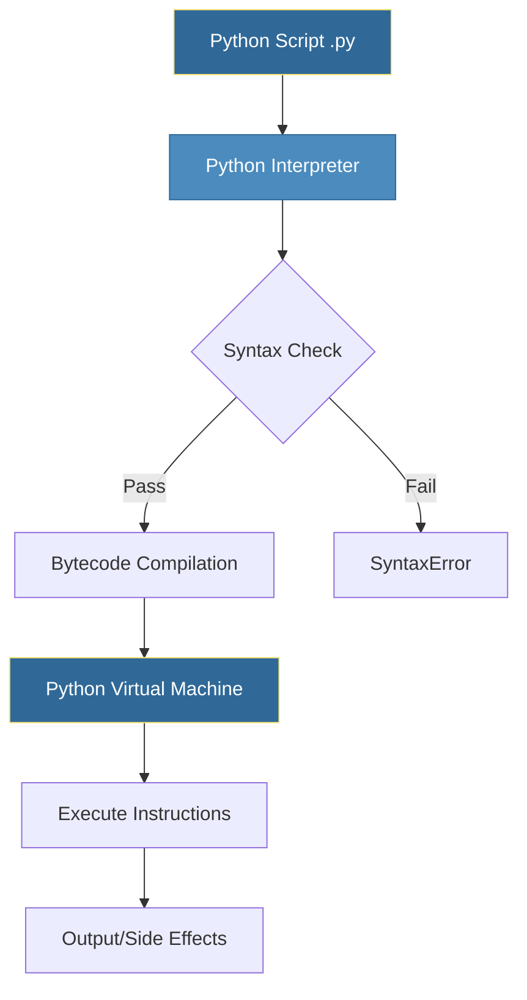
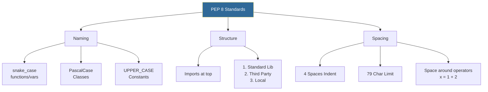

# Python Fundamentals
*The Foundation of DevOps Automation*
Python's clean syntax and readability make it the #1 language for automation. This module covers the essential building blocks every DevOps engineer needs.

---
## 🐍 Python at a Glance


---
## 🎯 Learning Objectives
After completing this module, you will be able to:
- Write syntactically correct Python code
- Work with variables and data types
- Implement control flow (conditionals and loops)
- Follow PEP 8 style conventions
- Execute Python scripts from the command line

---
## 📊 Python Execution Flow



---

## 📚 Core Concepts
### 1. Variables and Data Types
Python is **dynamically typed**, meaning you don't need to declare types. However, type hints (introduced in Python 3.5) are highly recommended for DevOps scripts to improve maintainability.

#### Basic Types
```python
# Integers & Floats (Scaling, Resources)
instance_count = 5            # int
cpu_request = 0.5             # float (0.5 vCPU)

# Strings (Configuration, Logs)
region = "us-east-1"          # str
error_msg = 'Connection Refused'

# Booleans (Flags)
is_debug = True               # bool
dry_run = False

# None (Placeholder)
db_connection = None          # NoneType
```

#### Collection Types (Crucial for DevOps)
```python
# Lists (Ordered, Mutable) - Good for server lists, steps
servers = ["web-01", "web-02", "db-01"]
servers.append("cache-01")

# Dictionaries (Key-Value, Mutable) - Good for configurations
server_config = {
    "hostname": "web-01",
    "ip": "10.0.0.5",
    "active": True
}

# Tuples (Ordered, Immutable) - Good for fixed data (credentials, coords)
db_creds = ("admin", "secure_password_123")
# db_creds[0] = "root"  # This would raise TypeError
```

### 2. String Operations for DevOps
String manipulation is 80% of scripting. Mastering these methods will save you hours of parsing logs and configs.

```python
# f-strings (The DevOps Gold Standard)
env = "production"
cluster = "k8s-useast"
namespace = f"{env}-{cluster}-v1"  # 'production-k8s-useast-v1'

# Path & File Handling
file_path = "/var/log/nginx/access.log"
print(file_path.startswith("/"))      # True (Check absolute path)
print(file_path.endswith(".log"))     # True (Check extensions)

# Log Cleaning
raw_log = "  [ERROR] Database timeout  \n"
clean_log = raw_log.strip()           # Removes leading/trailing whitespace

# Data Extraction
config_line = "timeout=30"
key, value = config_line.split("=")   # Splitting config lines

# List Joining (Creating Commands)
cmd_parts = ["docker", "run", "-d", "nginx"]
full_cmd = " ".join(cmd_parts)        # 'docker run -d nginx'
```

### 3. Control Flow
Control flow dictates the logic of your automation script.

#### Conditionals (`if/elif/else`)
```python
response_time_ms = 450

if response_time_ms < 200:
    status = "OK"
elif response_time_ms < 500:
    status = "DEGRADED"
else:
    status = "CRITICAL"
```

#### Loops (`for` & `while`)
```python
# Iterating over lists (Servers, Files)
packages = ["nginx", "postgresql", "redis"]
for pkg in packages:
    print(f"Installing {pkg}...")

# Iterating with index
for index, pkg in enumerate(packages):
    print(f"Step {index + 1}: Install {pkg}")

# Retry Logic (While Loop)
import time
retries = 0
while retries < 3:
    print("Connecting to DB...")
    # Simulate connection check here
    retries += 1
    time.sleep(1) # Wait 1s between retries
```

#### Flow Control keywords
*   **`break`**: Exit loop immediately (e.g., found the target file).
*   **`continue`**: Skip current iteration (e.g., skip offline servers).
*   **`pass`**: Do nothing (placeholder).


### 4. Operators
From calculating resources to checking permissions, operators are fundamental.

#### Arithmetic & Assignment
| Symbol | Operation | Use Case |
|:---:|---|---|
| `//` | Floor Division | `total_ram // server_size` (Instance count) |
| `%` | Modulus | `index % 2 == 0` (Rolling updates / Even-odd) |
| `**` | Exponentiation | `2 ** 10` (Calculating byte sizes: 1024) |
| `+=` | Add & Assign | `success_count += 1` |

#### Comparison & Logical
| Symbol | Description | Example |
|:---:|---|---|
| `==`, `!=` | Equality | `env == "prod"` |
| `in` | Membership | `"error" in log_line` (Very common!) |
| `is` | Identity | `config is None` (Checks memory object) |
| `and`, `or`, `not` | Logic | `is_master and not is_cordoned` |


---

## 🎨 PEP 8 Style Guide
Writing "Pythonic" code means following standards. This ensures your scripts are readable by any DevOps engineer.



### ❌ The Dirty Script vs ✅ The Pythonic Script

**Before (Messy):**
```python
import os, sys
def Calc(x,y):
 return x*y
MYVAR="test"
if x==True: print(MYVAR)
```

**After (Clean):**
```python
import os
import sys

# Constants at top
DEFAULT_ENV = "test"

def calculate_metrics(count, multiplier):
    """Calculates resource metrics."""
    return count * multiplier

# Explicit boolean check is better, but implicits (if x) work too
if is_ready:
    print(DEFAULT_ENV)
```

---
## 🛠️ Hands-On Exercises

### Exercise 1: The Resource Calculator
**Scenario**: You need to provision a Kubernetes cluster. Calculate the total resources needed based on node types.

```python
# Inputs
node_count = 5
node_cpu = 4
node_memory_gb = 16
overhead_percent = 0.10  # 10% system overhead

# TODO:
# 1. Calculate usable CPU/Memory per node (Total - Overhead)
# 2. Calculate total cluster capacity
# 3. Print a summary report using f-strings
```

<details>
<summary>💡 Solution</summary>

```python
node_count = 5
node_cpu = 4
node_memory_gb = 16
overhead_percent = 0.10

# Calculations
server_overhead_cpu = node_cpu * overhead_percent
server_overhead_mem = node_memory_gb * overhead_percent

usable_cpu_per_node = node_cpu - server_overhead_cpu
usable_mem_per_node = node_memory_gb - server_overhead_mem

total_cluster_cpu = usable_cpu_per_node * node_count
total_cluster_mem = usable_mem_per_node * node_count

# Report
print(f"--- Cluster Capacity Report ---")
print(f"Nodes: {node_count}")
print(f"Usable Per Node: {usable_cpu_per_node} vCPU / {usable_mem_per_node} GB RAM")
print(f"Total Cluster:   {total_cluster_cpu} vCPU / {total_cluster_mem} GB RAM")
```
</details>

### Exercise 2: Log Level Parser
**Scenario**: You have a raw log string. You need to identify its severity and format it for a dashboard.

```python
log_entry = "2024-01-20 10:00:05 [CRITICAL] Database connection failed "

# TODO:
# 1. Strip trailing spaces
# 2. Check if the log is related to "Database" (boolean)
# 3. Extract the clean timestamp (first 19 chars)
# 4. Print: "Alert! Database Issue at [Time]" if critical
```

<details>
<summary>💡 Solution</summary>

```python
log_entry = "2024-01-20 10:00:05 [CRITICAL] Database connection failed "
clean_log = log_entry.strip()

is_db_error = "Database" in clean_log
timestamp = clean_log[:19]  # Slicing

if "[CRITICAL]" in clean_log and is_db_error:
    print(f"Alert! Database Issue at {timestamp}")
else:
    print("Log normal.")
```
</details>

### Exercise 3: Environment Drift Detector
**Scenario**: Compare a list of currently running services against a list of required services.

```python
running_services = ["nginx", "docker", "ssh", "fail2ban", "obsolete_app"]
required_services = ["nginx", "docker", "ssh", "fail2ban", "monitoring_agent"]

# TODO:
# 1. Loop through required_services.
# 2. If a service is NOT in running_services, print "MISSING: <service>"
# 3. Loop through running_services.
# 4. If a service is NOT in required_services, print "EXTRA: <service>"
```

<details>
<summary>💡 Solution</summary>

```python
running_services = ["nginx", "docker", "ssh", "fail2ban", "obsolete_app"]
required_services = ["nginx", "docker", "ssh", "fail2ban", "monitoring_agent"]

print("--- Compliance Check ---")

# Check for missing
for req in required_services:
    if req not in running_services:
        print(f"MISSING: {req}")

# Check for unauthorized extras
for run in running_services:
    if run not in required_services:
        print(f"EXTRA: {run} (Consider removing)")
```
</details>

---

## 📖 Real-World Story: The Config Parser
**Scenario**: A team had 50+ servers with configuration scattered across bash scripts using different variable naming conventions (`serverName`, `SERVER_NAME`, `server-name`).

**Solution**: A Python script was created to:
1. Read all config files
2. Normalize variable names to `snake_case`
3. Output standardized JSON configs

**Outcome**: Configuration drift eliminated, making Ansible automation possible.

---

## ❓ Interview Questions

1. **What is the difference between `==` and `is` in Python?**
   > `==` compares values, while `is` compares object identity (memory location). Use `==` for value comparison and `is` for checking `None`.

2. **Explain Python's dynamic typing. Is it an advantage for DevOps?**
   > Variables don't have fixed types. Advantage: faster scripting. Disadvantage: runtime errors instead of compile-time.

3. **What is PEP 8 and why does it matter?**
   > Python Enhancement Proposal 8 is the style guide. Consistent style improves readability and maintainability.

4. **How do you check if a variable is None in Python?**
   > Use `if variable is None:` (not `== None`).

5. **What's the difference between `for` and `while` loops?**
   > `for` iterates over sequences, `while` continues based on a condition.

---

## 🧠 Quiz

1. What is the output of `type(5.0)`?
   - a) `<class 'int'>`
   - b) `<class 'float'>` ✅
   - c) `<class 'number'>`

2. Which is the correct way to create a multi-line string?
   - a) `"line1" + "line2"`
   - b) `"""line1\nline2"""` ✅
   - c) `'line1', 'line2'`

3. What does `5 // 2` return?
   - a) `2.5`
   - b) `2` ✅
   - c) `3`

4. Which naming convention is PEP 8 compliant for functions?
   - a) `calculateSum`
   - b) `CalculateSum`
   - c) `calculate_sum` ✅

5. What is the output of `"hello" * 3`?
   - a) `"hello hello hello"`
   - b) `"hellohellohello"` ✅
   - c) `Error`

---

**Next Step**: [Data Structures →](../02-Data-Structures/README.md)
