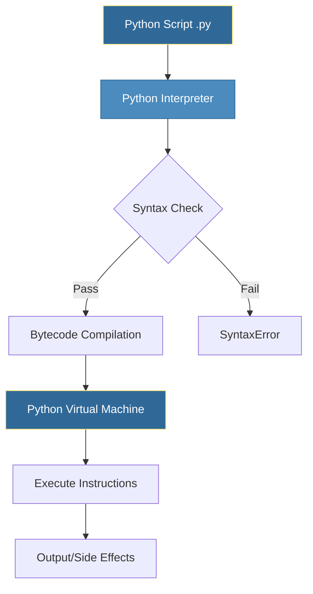
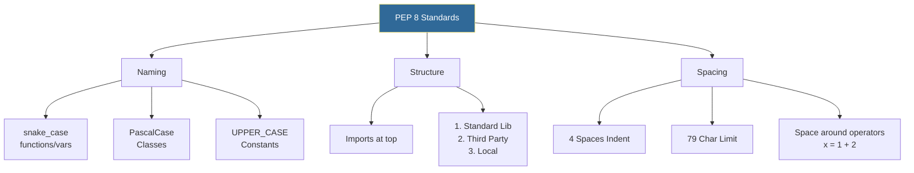

# Python Fundamentals
*The Foundation of DevOps Automation*
Python's clean syntax and readability make it the #1 language for automation. This module covers the essential building blocks every DevOps engineer needs.

---
## 🐍 Python at a Glance


---
## 🎯 Learning Objectives
After completing this module, you will be able to:
- Write syntactically correct Python code
- Work with variables and data types
- Implement control flow (conditionals and loops)
- Follow PEP 8 style conventions
- Execute Python scripts from the command line

---
## 📊 Python Execution Flow



---

## 📚 Core Concepts
### 1. Variables and Data Types
Python is **dynamically typed**, meaning you don't need to declare types. However, type hints (introduced in Python 3.5) are highly recommended for DevOps scripts to improve maintainability.
#### Basic Types
```python
# Integers & Floats (Scaling, Resources)
instance_count = 5            # int
cpu_request = 0.5             # float (0.5 vCPU)

# Strings (Configuration, Logs)
region = "us-east-1"          # str
error_msg = 'Connection Refused'

# Booleans (Flags)
is_debug = True               # bool
dry_run = False

# None (Placeholder)
db_connection = None          # NoneType
```
#### Collection Types (Crucial for DevOps)
```python
# Lists (Ordered, Mutable) - Good for server lists, steps
servers = ["web-01", "web-02", "db-01"]
servers.append("cache-01")

# Dictionaries (Key-Value, Mutable) - Good for configurations
server_config = {
    "hostname": "web-01",
    "ip": "10.0.0.5",
    "active": True
}

# Tuples (Ordered, Immutable) - Good for fixed data (credentials, coords)
db_creds = ("admin", "secure_password_123")
# db_creds[0] = "root"  # This would raise TypeError
```
### 2. String Operations for DevOps
String manipulation is 80% of scripting. Mastering these methods will save you hours of parsing logs and configs.
```python
# f-strings (The DevOps Gold Standard)
env = "production"
cluster = "k8s-useast"
namespace = f"{env}-{cluster}-v1"  # 'production-k8s-useast-v1'

# Path & File Handling
file_path = "/var/log/nginx/access.log"
print(file_path.startswith("/"))      # True (Check absolute path)
print(file_path.endswith(".log"))     # True (Check extensions)

# Log Cleaning
raw_log = "  [ERROR] Database timeout  \n"
clean_log = raw_log.strip()           # Removes leading/trailing whitespace

# Data Extraction
config_line = "timeout=30"
key, value = config_line.split("=")   # Splitting config lines

# List Joining (Creating Commands)
cmd_parts = ["docker", "run", "-d", "nginx"]
full_cmd = " ".join(cmd_parts)        # 'docker run -d nginx'
```
### 3. Control Flow
Control flow dictates the logic of your automation script.
#### Conditionals (`if/elif/else`)
```python
response_time_ms = 450

if response_time_ms < 200:
    status = "OK"
elif response_time_ms < 500:
    status = "DEGRADED"
else:
    status = "CRITICAL"
```
#### Loops (`for` & `while`)
```python
# Iterating over lists (Servers, Files)
packages = ["nginx", "postgresql", "redis"]
for pkg in packages:
    print(f"Installing {pkg}...")

# Iterating with index
for index, pkg in enumerate(packages):
    print(f"Step {index + 1}: Install {pkg}")

# Retry Logic (While Loop)
import time
retries = 0
while retries < 3:
    print("Connecting to DB...")
    # Simulate connection check here
    retries += 1
    time.sleep(1) # Wait 1s between retries
```

#### Flow Control keywords
*   **`break`**: Exit loop immediately (e.g., found the target file).
*   **`continue`**: Skip current iteration (e.g., skip offline servers).
*   **`pass`**: Do nothing (placeholder).
## Operators 
Are the decision-making tools in your scripts. Beyond simple math, they determine logic flow, validate configurations, and parse text.
#### 🧮 Arithmetic Operators
Used for resource calculations (validating CPU/RAM sizing).

| Symbol | Name | DevOps Example |
|:---:|---|---|
| `+`, `-` | Add/Sub | `disk_used + disk_new` |
| `*`, `/` | Mult/Div | `cpu_count * 0.8` (80% utilization buffer) |
| `//` | **Floor Division** | `total_ram // 4096` (How many 4GB instances fit?) |
| `%` | **Modulus** | `node_id % 3` (Distribute load across 3 AZs) |
| `**` | **Exponentiation** | `2 ** 30` (Calculate 1 Gigabyte in bytes) |
#### 🔄 Assignment Operators
Efficiently update variables.

| Symbol | Description | Example |
|:---:|---|---|
| `=` | Assign | `retries = 3` |
| `+=` | Increment | `failed_attempts += 1` |
| `-=` | Decrement | `quota_remaining -= request_size` |
#### ⚖️ Comparison Operators
The foundation of `if` statements. Returns `True` or `False`.

| Symbol | Description | Example |
|:---:|---|---|
| `==`, `!=` | Equality | `environment == "production"` |
| `>`, `<` | Greater/Less | `latency_ms > 500` (SLA breach) |
| `>=` | At least | `disk_free_percent >= 20` |
#### 🧠 Logical Operators
Combine multiple checks into complex rules.

| Operator | Logic | DevOps Use Case |
|:---:|---|---|
| `and` | Both true | `(is_master) and (not is_maintenance_mode)` |
| `or` | Either true | `(region == "us-east-1") or (region == "eu-west-1")` |
| `not` | Invert | `if not config_file.exists():` |
#### 🔍 Membership & Identity (Key for Python)
These are specific to Python and extremely powerful for parsing.
- **`in` / `not in`**: Checks if a value exists in a sequence (List, String, Tuple).
```python
    # Check logs
    if "ERROR" in log_line:
        alert_ops()

    # Check allowed values
    if region not in ["us-east-1", "us-west-2"]:
        raise ValueError("Invalid Region")
```

- **`is` / `is not`**: Checks object identity (memory location). **Always use this for `None`**.
```python
    # Correct
    if db_connection is None:
        connect()
    
    # Wrong (Can fail with custom objects)
    if db_connection == None:
        pass
```

---

## 🎨 PEP 8 Style Guide
Writing "Pythonic" code means following standards. This ensures your scripts are readable by any DevOps engineer.



### ❌ The Dirty Script vs ✅ The Pythonic Script

**Before (Messy):**
```python
import os, sys
def Calc(x,y):
 return x*y
MYVAR="test"
if x==True: print(MYVAR)
```

**After (Clean):**
```python
import os
import sys

# Constants at top
DEFAULT_ENV = "test"

def calculate_metrics(count, multiplier):
    """Calculates resource metrics."""
    return count * multiplier

# Explicit boolean check is better, but implicits (if x) work too
if is_ready:
    print(DEFAULT_ENV)
```

---
## 🛠️ Hands-On Challenges

Master Python fundamentals by solving these DevOps-centric challenges.

| Challenge | Description | Starter Code | Solution |
| :--- | :--- | :--- | :--- |
| **01. Resource Calculator** | Calculate K8s cluster capacity with overhead. | [Link](./challenges/challenge_01_resource_calculator.py) | [Link](./challenges/solutions/solution_01_resource_calculator.py) |
| **02. Log Level Parser** | Parse and extract data from raw server logs. | [Link](./challenges/challenge_02_log_parser.py) | [Link](./challenges/solutions/solution_02_log_parser.py) |
| **03. Drift Detector** | Identify missing or extra services in an environment. | [Link](./challenges/challenge_03_drift_detector.py) | [Link](./challenges/solutions/solution_03_drift_detector.py) |

> **Pro Tip**: Try to solve the challenges in your terminal first. You can run them using `python challenges/challenge_name.py`.

---
## 📖 Real-World Story: The Config Parser
**Scenario**: A team had 50+ servers with configuration scattered across bash scripts using different variable naming conventions (`serverName`, `SERVER_NAME`, `server-name`).

**Solution**: A Python script was created to:
1. Read all config files
2. Normalize variable names to `snake_case`
3. Output standardized JSON configs

**Outcome**: Configuration drift eliminated, making Ansible automation possible.

---
## ❓ Interview Questions 
1. **What is the difference between `==` and `is` in Python?**
   <details>
   <summary>💡 Solution</summary>
   `==` compares values, while `is` compares object identity (memory location). Use `==` for value comparison and `is` for checking `None`.
   </details>
2. **Explain Python's dynamic typing. Is it an advantage for DevOps?**
   <details>
   <summary>💡 Solution</summary>
   Variables don't have fixed types. Advantage: faster scripting. Disadvantage: runtime errors instead of compile-time.
   </details>
3. **What is PEP 8 and why does it matter?**
   <details>
   <summary>💡 Solution</summary>
   Python Enhancement Proposal 8 is the style guide. Consistent style improves readability and maintainability.
   </details>
4. **How do you check if a variable is None in Python?**
   <details>
   <summary>💡 Solution</summary>
   Use `if variable is None:` (not `== None`).
   </details>
5. **What's the difference between `for` and `while` loops?**
   <details>
   <summary>💡 Solution</summary>
   `for` iterates over sequences, `while` continues based on a condition.
   </details>
---
## 🧠 Quiz
1. What is the output of `type(5.0)`?
   - a) `<class 'int'>`
   - b) `<class 'float'>`
   - c) `<class 'number'>`
   <details>
   <summary>💡 Solution</summary>
   `5.0` is a float.
   </details>
2. Which is the correct way to create a multi-line string?
   - a) `"line1" + "line2"`
   - b) `"""line1\nline2"""`
   - c) `'line1', 'line2'`
   <details>
   <summary>💡 Solution</summary>
   `"""line1\nline2"""` is a multi-line string.
   </details>

3. What does `5 // 2` return?
   - a) `2.5`
   - b) `2`
   - c) `3`
   <details>
   <summary>💡 Solution</summary>
   `5 // 2` returns `2` (integer division).
   </details>
4. Which naming convention is PEP 8 compliant for functions?
   - a) `calculateSum`
   - b) `CalculateSum`
   - c) `calculate_sum`
   <details>
   <summary>💡 Solution</summary>
   `calculate_sum` is PEP 8 compliant.
   </details>

5. What is the output of `"hello" * 3`?
   - a) `"hello hello hello"`
   - b) `"hellohellohello"`
   - c) `Error`
   <details>
   <summary>💡 Solution</summary>
   `"hello" * 3` returns `"hellohellohello"`.
   </details>
---
**Next Step**: [Data Structures →](../02-Data-Structures/README.md)
