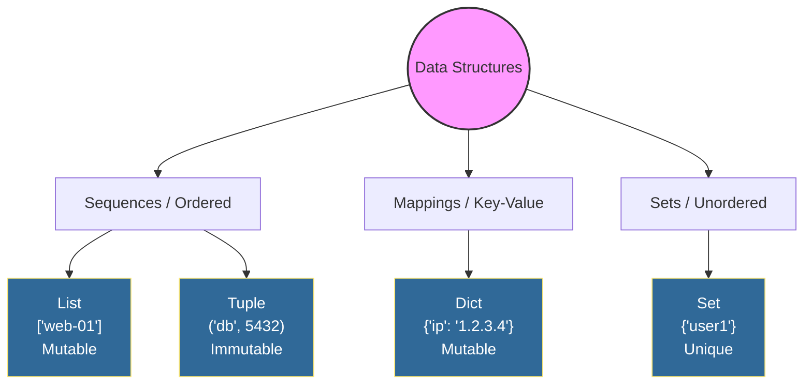
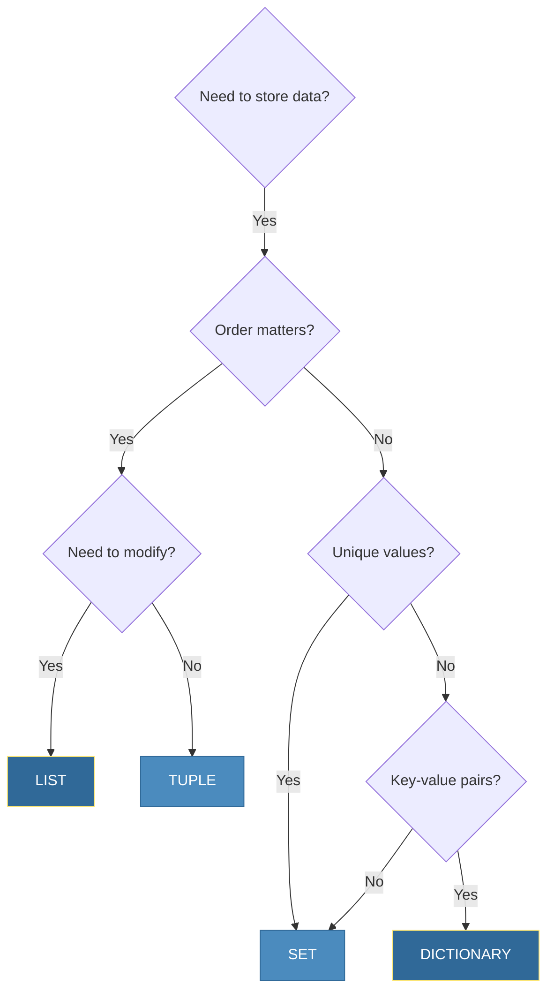
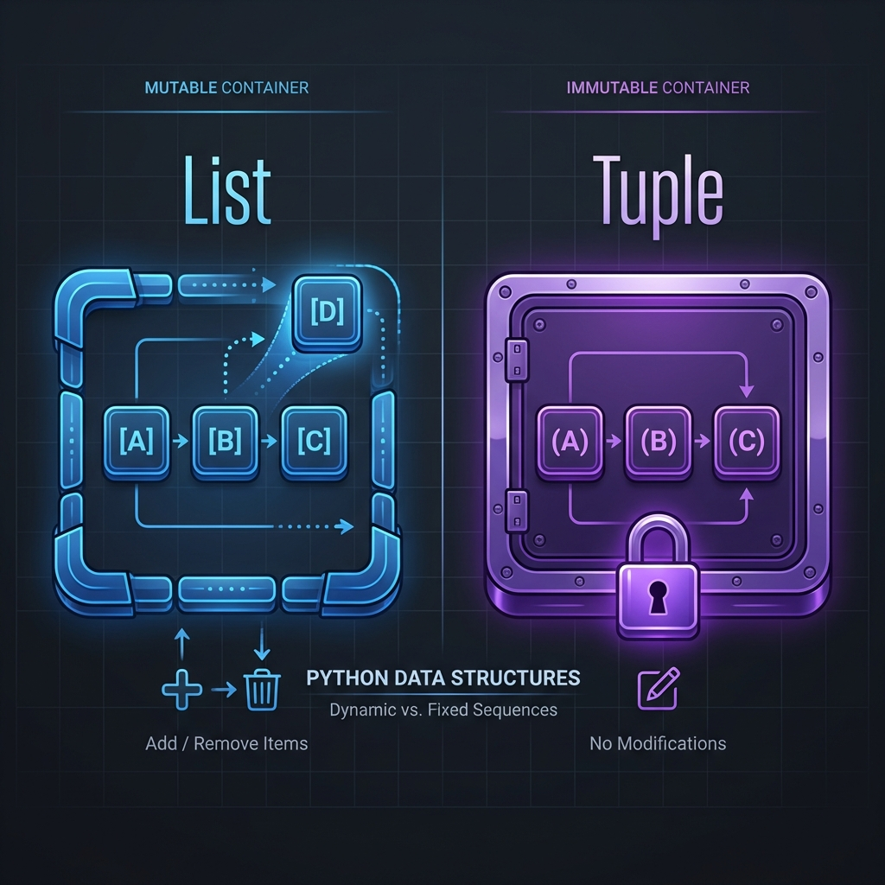
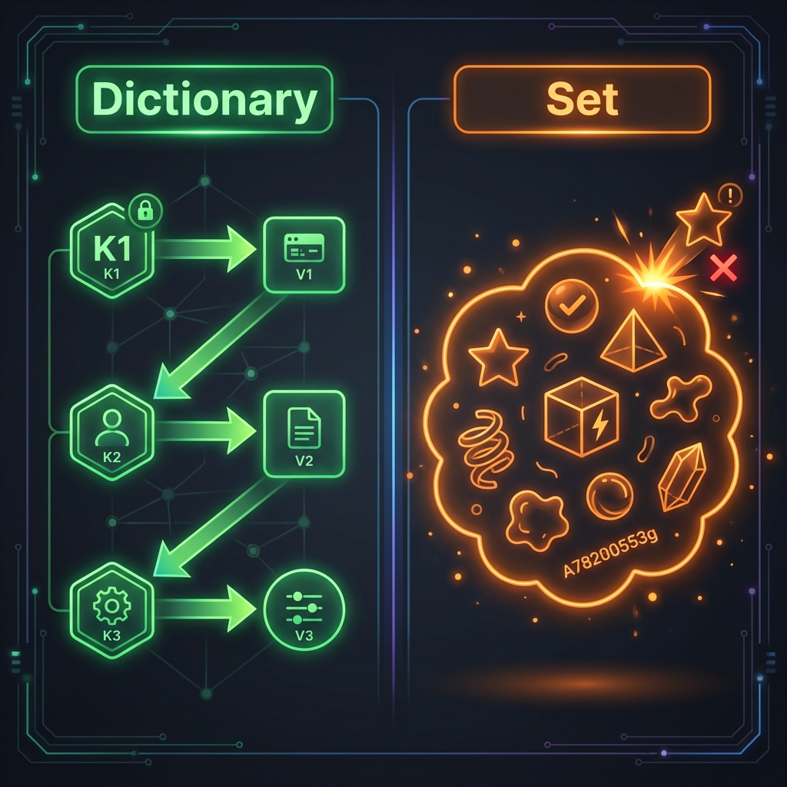
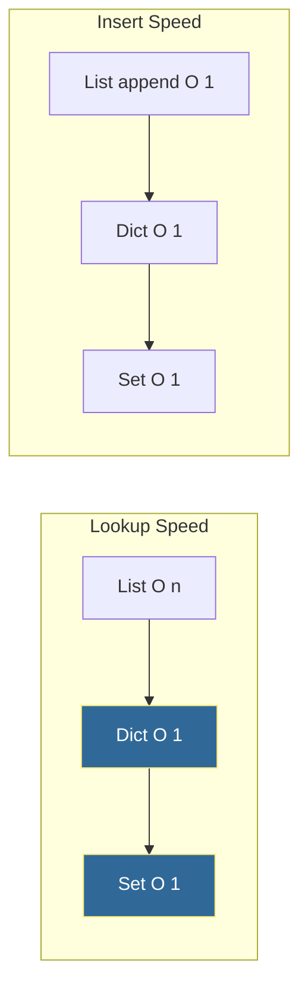

# Python Data Structures
*Organizing Data for Efficient DevOps Automation*
Choosing the right data structure is critical for automation scripts. The difference between a `list` and a `dict` can mean the difference between O(n) and O(1) lookups—crucial when processing thousands of log entries.

---
## 🧠 Visual Guide



---
## 🎯 Learning Objectives
- Master Python's built-in data structures
- Choose the optimal structure for each use case
- Perform common operations efficiently
- Apply data structures to DevOps scenarios
---
## 📊 Data Structure Decision Tree



---
## 📚 Core Data Structures

Data structures are the specialized formats for organizing, processing, and retrieving data. In Python, mastering Lists, Sets, Dictionaries, and Tuples is non-negotiable for writing efficient automation scripts.

### Visual Comparison


*Fig 1: Lists are mutable dynamic arrays, while Tuples are immutable fixed sequences.*


*Fig 2: Dictionaries map keys to values; Sets are unordered collections of unique elements.*

---

### 1. Lists (`list`)
**Definition & Syntax**:
Lists are ordered sequences that can hold a variety of object types. They are mutable, meaning you can modify them after creation.
```python
# Syntax: Square brackets []
inventory = ["web-01", "db-01", "cache-01"]
mixed_types = [1, "two", 3.0, [4, 5]]
```

**Key Characteristics**:
- **Mutability**: ✅ Mutable (Add, remove, change items)
- **Ordering**: ✅ Ordered (Insertion order is preserved)
- **Indexing**: ✅ Indexable (Access via `[0]`, `[-1]`)
- **Duplicates**: ✅ Allowed

**Common Methods**:
| Method | Description | Example |
| :--- | :--- | :--- |
| `.append(x)` | Adds an item to the end | `servers.append('web-02')` |
| `.extend(iter)` | Appends all items from iterable | `servers.extend(['db-02', 'db-03'])` |
| `.pop(i)` | Removes and returns item at index | `last = servers.pop()` |
| `.remove(x)` | Removes first occurrence of x | `servers.remove('web-01')` |
| `.sort()` | Sorts list in place | `servers.sort()` |

**Performance (Big O)**:
| Operation | Complexity | Note |
| :--- | :--- | :--- |
| Access `[i]` | O(1) | Instant access |
| Append | O(1) | Amortized constant time |
| Insert/Delete | O(n) | Requires shifting elements |
| Search `x in list` | O(n) | Linear scan |

**DevOps Use Case**:
*Storing ordered steps in a deployment pipeline or a list of servers to patch sequentially.*
```python
# DevOps Example: Rolling Restart
servers = ["app-01", "app-02", "app-03"]
for server in servers:
    print(f"Stopping {server}...")
    print(f"Patching {server}...")
    print(f"Starting {server}...")
```

---
### 2. Dictionaries (`dict`)
**Definition & Syntax**:
Dictionaries are key-value mappings that allow fast data retrieval based on keys. Keys must be immutable (str, int, tuple), while values can be anything.
```python
# Syntax: Curly braces {} with key:value pairs
server_config = {
    "hostname": "nginx-01",
    "ip": "192.168.1.10",
    "role": "load_balancer"
}
```

**Key Characteristics**:
- **Mutability**: ✅ Mutable
- **Ordering**: ✅ Ordered (Since Python 3.7+)
- **Indexing**: ❌ Not indexable by integer (Access via Key)
- **Duplicates**: ❌ Keys must be unique

**Common Methods**:
| Method | Description | Example |
| :--- | :--- | :--- |
| `.get(k, d)` | Returns value for key, or default | `cfg.get('port', 80)` |
| `.keys()` | Returns a view of keys | `list(cfg.keys())` |
| `.values()` | Returns a view of values | `list(cfg.values())` |
| `.items()` | Returns (key, value) pairs | `for k,v in cfg.items():` |
| `.update(other)` | Merges another dict | `cfg.update({'env': 'prod'})` |

**Performance (Big O)**:
| Operation | Complexity | Note |
| :--- | :--- | :--- |
| Access `d[k]` | O(1) | Average case (hashing) |
| Insert `d[k]=v` | O(1) | Average case |
| Delete `del d[k]` | O(1) | Average case |
| Search `k in d` | O(1) | Very fast lookup |

**DevOps Use Case**:
*Storing configuration maps, environment variables, or parsing JSON responses from APIs.*
```python
# DevOps Example: Environment Lookup
envs = {
    "dev": "10.0.0.5",
    "stage": "10.0.0.6",
    "prod": "10.0.0.7"
}
target_ip = envs.get("prod") # Instant O(1) lookup
```

---

### 3. Sets (`set`)
**Definition & Syntax**:
Sets are unordered collections of unique keys. They are essentially dictionaries with only keys and no values.
```python
# Syntax: Curly braces {} or set() constructor
active_users = {"root", "ubuntu", "ec2-user"}
# Note: {} creates a dict, set() creates an empty set
empty_set = set() 
```

**Key Characteristics**:
- **Mutability**: ✅ Mutable
- **Ordering**: ❌ Unordered (No guaranteed order)
- **Indexing**: ❌ Not indexable
- **Duplicates**: ❌ Not allowed (Automatically removed)

**Common Methods**:
| Method | Description | Example |
| :--- | :--- | :--- |
| `.add(element)` | Adds an element | `ips.add('1.2.3.4')` |
| `.remove(element)` | Removes element (Error if missing) | `ips.remove('1.2.3.4')` |
| `.discard(element)` | Removes element (No error if missing) | `ips.discard('1.2.3.4')` |
| `.union(other)` | Returns combined set | `s1 | s2` |
| `.intersection(other)` | Returns common elements | `s1 & s2` |

**Performance (Big O)**:
| Operation | Complexity | Note |
| :--- | :--- | :--- |
| Add | O(1) | Average case |
| Remove | O(1) | Average case |
| Search `x in s` | O(1) | massive speed advantage over lists |

**DevOps Use Case**:
*Filtering duplicate log entries or finding commonalities between two lists of resources (e.g., security group rules).*
```python
# DevOps Example: Security Group Audit
allowed_ips = {"10.0.0.1", "10.0.0.2"}
incoming_request = "10.0.0.3"

if incoming_request not in allowed_ips:
    print(f"BLOCK: {incoming_request}") # O(1) check
```

---
### 4. Tuples (`tuple`)
**Definition & Syntax**:
Tuples are ordered, **immutable** sequences. Once created, they cannot be changed. They are often used for fixed data that shouldn't be tampered with.
```python
# Syntax: Parentheses ()
db_connection = ("127.0.0.1", 5432)
single_item = ("value",) # Note the comma
```

**Key Characteristics**:
- **Mutability**: ❌ Immutable (Cannot change)
- **Ordering**: ✅ Ordered
- **Indexing**: ✅ Indexable
- **Duplicates**: ✅ Allowed

**Common Methods**:
| Method | Description | Example |
| :--- | :--- | :--- |
| `.count(x)` | Returns number of occurrences | `coords.count(0)` |
| `.index(x)` | Returns index of first occurrence | `coords.index(5432)` |
| *Unpacking* | Assigning to variables | `ip, port = db_connection` |

**Performance (Big O)**:
| Operation | Complexity | Note |
| :--- | :--- | :--- |
| Access `[i]` | O(1) | Same as lists |
| Iteration | O(n) | Slightly faster than lists due to optimizations |

**DevOps Use Case**:
*Returning multiple values from a function or creating dictionary keys that consist of multiple parts (e.g., (region, instance_id)).*
```python
# DevOps Example: Function Return
def get_status():
    return (200, "OK") # Returns a tuple

code, msg = get_status() # Unpacking
```

---
## 📈 Performance Comparison



| Operation       | List   | Dict   | Set    |
| --------------- | ------ | ------ | ------ |
| Lookup          | O(n)   | O(1) ✅ | O(1) ✅ |
| Insert at end   | O(1) ✅ | O(1) ✅ | O(1) ✅ |
| Insert at start | O(n)   | N/A    | N/A    |
| Delete by value | O(n)   | O(1) ✅ | O(1) ✅ |
| Memory          | Low    | High   | Medium |

---
## 🛠️ Hands-On Challenges
Master Python data structures by solving these DevOps-centric challenges.

| Challenge                    | Description                                                  | Starter Code                                        | Solution                                                     |
| :--------------------------- | :----------------------------------------------------------- | :-------------------------------------------------- | :----------------------------------------------------------- |
| **01. Inventory Management** | Build a server inventory system using lists and dicts.       | [Link](./challenges/challenge_01_inventory_mgmt.py) | [Link](./challenges/solutions/solution_01_inventory_mgmt.py) |
| **02. Log Deduplication**    | Deduplicate and analyze server logs using sets.              | [Link](./challenges/challenge_02_log_dedup.py)      | [Link](./challenges/solutions/solution_02_log_dedup.py)      |
| **03. Config Merger**        | Merge configuration dictionaries for different environments. | [Link](./challenges/challenge_03_config_merger.py)  | [Link](./challenges/solutions/solution_03_config_merger.py)  |

> **Pro Tip**: Efficiently choosing between a list, set, or dictionary can significantly optimize your DevOps automation scripts.

---
## 📖 Real-World Story: The 10x Speedup
**Scenario**: A log analysis script took 45 minutes to find duplicate error patterns across 10GB of logs.

**Problem**: The script used a `list` to store seen patterns and checked membership with `if pattern in seen_list`.

**Solution**: Changed `seen_list = []` to `seen_set = set()`.

**Outcome**: Runtime dropped from 45 minutes to 4 minutes—a 10x improvement from understanding data structures.

---
## ❓ Interview Questions

1. **When would you use a tuple instead of a list?**
   <details>
   <summary>Show Answer</summary>
   When data shouldn't change (immutability) or when using as dictionary keys.
   </details>

2. **How do you efficiently check if an element exists in a collection?**
   <details>
   <summary>Show Answer</summary>
   Use sets or dictionary keys for O(1) lookups instead of lists.
   </details>

3. **What's the difference between `dict.get(key)` and `dict[key]`?**
   <details>
   <summary>Show Answer</summary>
   `.get()` returns None (or default) if key missing; `[]` raises KeyError.
   </details>

4. **How do you merge two dictionaries?**
   <details>
   <summary>Show Answer</summary>
   Python 3.9+: `d1 | d2`. Earlier: `{**d1, **d2}` or `d1.update(d2)`.
   </details>

5. **Explain list comprehension vs generator expression.**
   <details>
   <summary>Show Answer</summary>
   List comprehension `[x for x in range(1000)]` creates list in memory. Generator `(x for x in range(1000))` yields items lazily.
   </details>

---
## 🧠 Quiz

1. Which data structure allows duplicate values?
   - a) Set
   - b) Dictionary keys
   - c) List 
   - d) Tuple
   <details>
   <summary>Show Answer</summary>
   List ✅
   </details>

2. How do you create an empty dictionary?
   - a) `dict[]`
   - b) `{}` 
   - c) `dict()`  (also correct)
   <details>
   <summary>Show Answer</summary>
   `{}` ✅
   </details>

3. What is the time complexity of `in` operator for a set?
   - a) O(n)
   - b) O(log n)
   - c) O(1) 
   - d) O(n log n)
   <details>
   <summary>Show Answer</summary>
   O(1) ✅
   </details>

4. Which can be a dictionary key?
   - a) List
   - b) Tuple 
   - c) Set
   - d) Dictionary
   <details>
   <summary>Show Answer</summary>
   Tuple ✅
   </details>

5. What does `servers[-1]` return?
   - a) First element
   - b) Last element
   - c) Error
   - d) None
   <details>
   <summary>Show Answer</summary>
   Last element ✅
   </details>

---

**Next Step**: [Functions and Modules →](../03-Functions-and-Modules/README.md)
