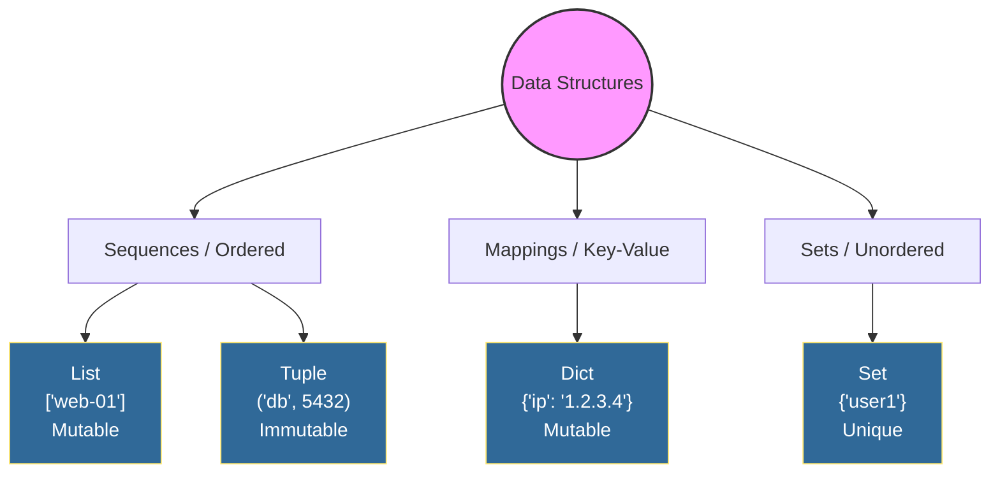
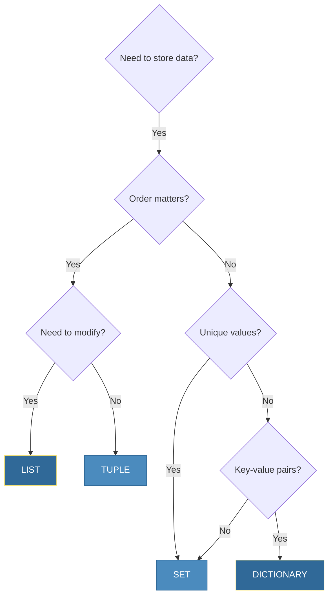
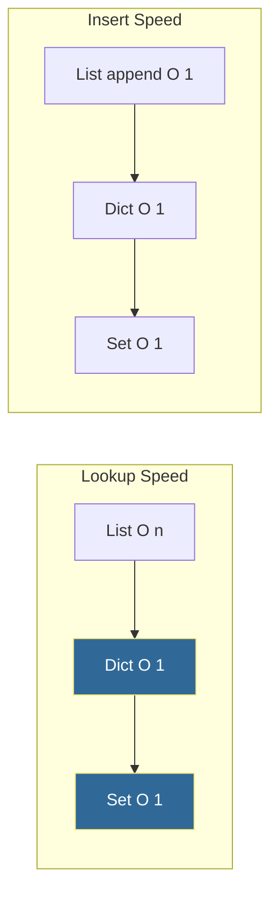

# Python Data Structures
*Organizing Data for Efficient DevOps Automation*

Choosing the right data structure is critical for automation scripts. The difference between a `list` and a `dict` can mean the difference between O(n) and O(1) lookups—crucial when processing thousands of log entries.

---
## 🧠 Visual Guide



---
## 🎯 Learning Objectives
- Master Python's built-in data structures
- Choose the optimal structure for each use case
- Perform common operations efficiently
- Apply data structures to DevOps scenarios
---
## 📊 Data Structure Decision Tree



---
## 📚 Core Data Structures

### 1. Lists - Ordered, Mutable Collections
**Use Case**: Server inventories, log entries, task queues
```python
# Creating lists
servers = ["web-01", "web-02", "api-01"]
ports = [80, 443, 8080]
mixed = ["server", 8080, True, {"env": "prod"}]

# Common operations
servers.append("db-01")          # Add to end
servers.insert(0, "lb-01")       # Insert at position
servers.remove("web-02")         # Remove by value
last = servers.pop()             # Remove and return last
servers.extend(["cache-01"])     # Add multiple items

# Slicing
first_two = servers[:2]          # First two items
last_two = servers[-2:]          # Last two items
reversed_list = servers[::-1]    # Reverse

# List comprehensions (DevOps favorite!)
healthy_servers = [s for s in servers if "web" in s]
uppercase_names = [s.upper() for s in servers]
```
### 2. Dictionaries - Key-Value Mappings
**Use Case**: Configuration, API responses, server metadata
```python
# Creating dictionaries
server_config = {
    "hostname": "web-prod-01",
    "ip": "10.0.1.50",
    "port": 443,
    "ssl": True,
    "tags": ["production", "web"]
}

# Accessing values
hostname = server_config["hostname"]
port = server_config.get("port", 80)  # With default

# Modifying
server_config["region"] = "us-east-1"  # Add new key
server_config.update({"cpu": 4, "memory": 16})  # Merge

# Iteration
for key, value in server_config.items():
    print(f"{key}: {value}")

# Dictionary comprehensions
env_vars = {"DB_HOST": "localhost", "DB_PORT": "5432"}
uppercase_keys = {k.lower(): v for k, v in env_vars.items()}
```
### 3. Sets - Unique, Unordered Collections
**Use Case**: Deduplication, membership testing, finding differences
```python
# Creating sets
active_servers = {"web-01", "web-02", "api-01"}
monitored_servers = {"web-01", "db-01", "api-01"}

# Set operations
common = active_servers & monitored_servers      # Intersection
all_servers = active_servers | monitored_servers # Union
unmonitored = active_servers - monitored_servers # Difference

# Membership testing (O(1) - very fast!)
if "web-01" in active_servers:
    print("Server is active")

# Deduplication
log_ips = ["10.0.0.1", "10.0.0.2", "10.0.0.1", "10.0.0.3"]
unique_ips = set(log_ips)  # {'10.0.0.1', '10.0.0.2', '10.0.0.3'}
```
### 4. Tuples - Ordered, Immutable Collections
**Use Case**: Fixed configurations, function returns, dictionary keys
```python
# Creating tuples
server_coords = (40.7128, -74.0060)  # Lat, Long
connection_info = ("db.example.com", 5432, "mydb")

# Unpacking
host, port, database = connection_info

# As dictionary keys (lists can't do this!)
server_versions = {
    ("web-01", "nginx"): "1.19.0",
    ("web-01", "python"): "3.9.0",
    ("api-01", "python"): "3.10.0"
}

# Named tuples for clarity
from collections import namedtuple
Server = namedtuple("Server", ["name", "ip", "port"])
web_server = Server("web-01", "10.0.1.50", 443)
print(web_server.name)  # "web-01"
```

---
## 📈 Performance Comparison



| Operation | List | Dict | Set |
|-----------|------|------|-----|
| Lookup | O(n) | O(1) ✅ | O(1) ✅ |
| Insert at end | O(1) ✅ | O(1) ✅ | O(1) ✅ |
| Insert at start | O(n) | N/A | N/A |
| Delete by value | O(n) | O(1) ✅ | O(1) ✅ |
| Memory | Low | High | Medium |

---
## 🛠️ Hands-On Exercises
### Exercise 1: Server Inventory Management
```python
# Create a server inventory system
inventory = []

# TODO: Implement these functions
def add_server(name, ip, role):
    """Add a server to inventory"""
    pass

def find_by_role(role):
    """Return all servers with given role"""
    pass

def remove_server(name):
    """Remove server by name"""
    pass

# Test
add_server("web-01", "10.0.1.50", "web")
add_server("api-01", "10.0.1.51", "api")
add_server("web-02", "10.0.1.52", "web")
print(find_by_role("web"))
```

<details>
<summary>💡 Solution</summary>

```python
inventory = []

def add_server(name, ip, role):
    inventory.append({
        "name": name,
        "ip": ip,
        "role": role
    })

def find_by_role(role):
    return [s for s in inventory if s["role"] == role]

def remove_server(name):
    global inventory
    inventory = [s for s in inventory if s["name"] != name]

# Test
add_server("web-01", "10.0.1.50", "web")
add_server("api-01", "10.0.1.51", "api")
add_server("web-02", "10.0.1.52", "web")
print(find_by_role("web"))
# [{'name': 'web-01', 'ip': '10.0.1.50', 'role': 'web'}, 
#  {'name': 'web-02', 'ip': '10.0.1.52', 'role': 'web'}]
```
</details>
### Exercise 2: Log Deduplication
```python
# Deduplicate and analyze these log entries
log_entries = [
    {"ip": "10.0.0.1", "method": "GET", "path": "/api/health"},
    {"ip": "10.0.0.2", "method": "POST", "path": "/api/data"},
    {"ip": "10.0.0.1", "method": "GET", "path": "/api/health"},
    {"ip": "10.0.0.3", "method": "GET", "path": "/api/users"},
    {"ip": "10.0.0.2", "method": "POST", "path": "/api/data"},
]

# TODO: Find unique IPs
# TODO: Count requests per IP
# TODO: Find which IPs made POST requests
```

<details>
<summary>💡 Solution</summary>

```python
log_entries = [
    {"ip": "10.0.0.1", "method": "GET", "path": "/api/health"},
    {"ip": "10.0.0.2", "method": "POST", "path": "/api/data"},
    {"ip": "10.0.0.1", "method": "GET", "path": "/api/health"},
    {"ip": "10.0.0.3", "method": "GET", "path": "/api/users"},
    {"ip": "10.0.0.2", "method": "POST", "path": "/api/data"},
]

# Unique IPs
unique_ips = set(entry["ip"] for entry in log_entries)
print(f"Unique IPs: {unique_ips}")

# Count per IP
from collections import Counter
ip_counts = Counter(entry["ip"] for entry in log_entries)
print(f"Requests per IP: {dict(ip_counts)}")

# POST requests
post_ips = {entry["ip"] for entry in log_entries if entry["method"] == "POST"}
print(f"IPs making POST: {post_ips}")
```
</details>
### Exercise 3: Configuration Merger
```python
# Merge these configuration dictionaries
default_config = {
    "timeout": 30,
    "retries": 3,
    "ssl": True,
    "port": 80
}

production_override = {
    "port": 443,
    "timeout": 60,
    "monitoring": True
}

# TODO: Create final_config with production values overriding defaults
# TODO: Find which keys were overridden
# TODO: Find which keys are new in production
```

<details>
<summary>💡 Solution</summary>

```python
default_config = {
    "timeout": 30,
    "retries": 3,
    "ssl": True,
    "port": 80
}

production_override = {
    "port": 443,
    "timeout": 60,
    "monitoring": True
}

# Merge (Python 3.9+)
final_config = default_config | production_override
# Or for older Python: final_config = {**default_config, **production_override}

# Keys overridden
overridden = set(default_config.keys()) & set(production_override.keys())
print(f"Overridden keys: {overridden}")

# New keys
new_keys = set(production_override.keys()) - set(default_config.keys())
print(f"New keys: {new_keys}")

print(f"Final config: {final_config}")
```
</details>

---
## 📖 Real-World Story: The 10x Speedup
**Scenario**: A log analysis script took 45 minutes to find duplicate error patterns across 10GB of logs.

**Problem**: The script used a `list` to store seen patterns and checked membership with `if pattern in seen_list`.

**Solution**: Changed `seen_list = []` to `seen_set = set()`.

**Outcome**: Runtime dropped from 45 minutes to 4 minutes—a 10x improvement from understanding data structures.

---
## ❓ Interview Questions

1. **When would you use a tuple instead of a list?**
   > When data shouldn't change (immutability) or when using as dictionary keys.

2. **How do you efficiently check if an element exists in a collection?**
   > Use sets or dictionary keys for O(1) lookups instead of lists.

3. **What's the difference between `dict.get(key)` and `dict[key]`?**
   > `.get()` returns None (or default) if key missing; `[]` raises KeyError.

4. **How do you merge two dictionaries?**
   > Python 3.9+: `d1 | d2`. Earlier: `{**d1, **d2}` or `d1.update(d2)`.

5. **Explain list comprehension vs generator expression.**
   > List comprehension `[x for x in range(1000)]` creates list in memory. Generator `(x for x in range(1000))` yields items lazily.

---
## 🧠 Quiz

1. Which data structure allows duplicate values?
   - a) Set
   - b) Dictionary keys
   - c) List ✅

2. How do you create an empty dictionary?
   - a) `dict[]`
   - b) `{}` ✅
   - c) `dict()`  (also correct)

3. What is the time complexity of `in` operator for a set?
   - a) O(n)
   - b) O(log n)
   - c) O(1) ✅

4. Which can be a dictionary key?
   - a) List
   - b) Tuple ✅
   - c) Set

5. What does `servers[-1]` return?
   - a) First element
   - b) Last element ✅
   - c) Error

---

**Next Step**: [Functions and Modules →](../03-Functions-and-Modules/README.md)
